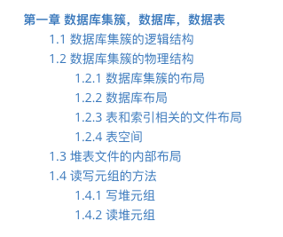
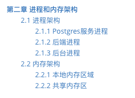
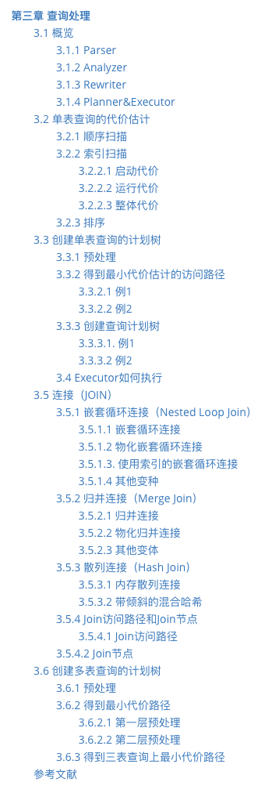
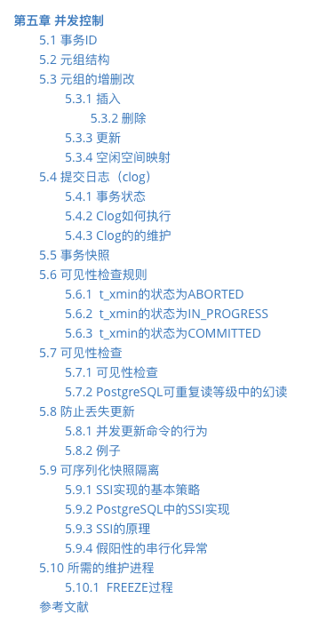
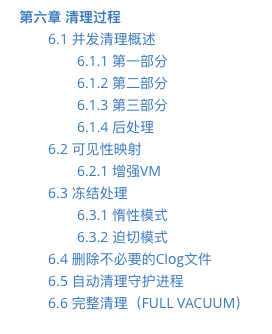
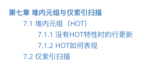
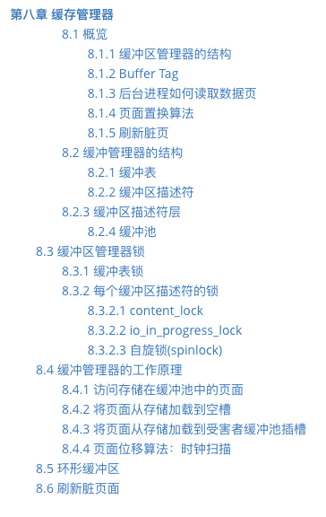
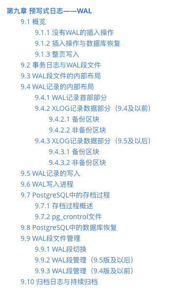
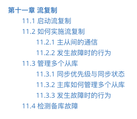

#  目录

## 第一章 数据库集簇，数据库，数据表

## 第二章 进程与内存体系结构

## 第三章 查询处理

## 第四章 外部数据源包装与并行查询

## 第五章 并发控制

## 第六章 清理过程

## 第七章 HOT与仅索引扫描

## 第八章 缓冲管理器

## 第九章 预写式日志（WAL）

## 第十章 基础备份与时间点恢复（PITR）

## 第十一章 流复制

