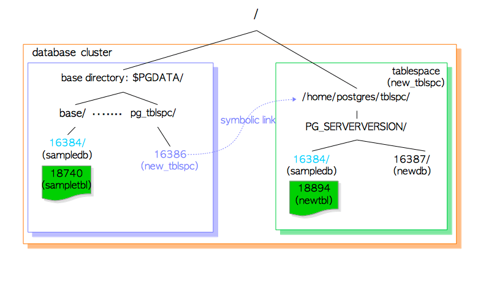
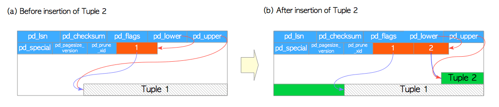

# 第一章 数据库集簇，数据库，数据表

[TOC]

第一章和第二章简单介绍了一些PostgreSQL的基础知识，有助于读者理解后续章节的内容。本章包括以下几个主题：

* **数据库集簇（database cluster）**的逻辑结构
* 数据库集簇的物理结构
* **堆表（heap table）**文件的内部布局
* 从表中读写数据的方式

如果你已经熟悉这些内容，可以跳过本章。


## 1.1 数据库集簇的逻辑结构

**数据库集簇（database cluster）**是一组**数据库（database）** 的集合，由一个PostgreSQL服务器管理。第一次听到这个定义也许会令人疑惑，PostgreSQL中的术语“数据库集簇”，**并非** 意味着“一组数据库服务器”。 一个PostgreSQL服务器只会在单机上运行并管理单个数据库集簇。

图1.1展示了一个数据库集簇的逻辑结构。 **数据库（database）**是**数据库对象（database objects）**的集合。 在关系型数据库理论中，数据库对象是用于存储或引用数据的数据结构。 （堆）表是一个典型的例子，还有更多种对象，例如索引，序列，视图，函数等。 在PostgreSQL中数据库本身也是数据库对象，并在逻辑上彼此分离。 所有其他的数据库对象（例如表，索引等）归属于各自相应的数据库。

**图1.1 数据库集簇的逻辑结构**


在PostgreSQL内部，所有的数据库对象都通过相应的**对象标识符（Object Identifiers, OID）**进行管理，这些标识符是无符号的4字节整型。数据库对象与相应OID之间的关系存储在相应的[**系统目录**](https://www.postgresql.org/docs/current/static/catalogs.html)中，依具体的对象类型而异。 例如数据库和堆表对象的OID分别存储在`pg_database`和`pg_class`中，因此当你希望找出OID时，可以执行以下查询：

```sql
sampledb=# SELECT datname, oid FROM pg_database WHERE datname = 'sampledb';
 datname  |  oid  
----------+-------
 sampledb | 16384
(1 row)

sampledb=# SELECT relname, oid FROM pg_class WHERE relname = 'sampletbl';
  relname  |  oid  
-----------+-------
 sampletbl | 18740 
(1 row)
```


## 1.2 数据库集簇的物理结构

数据库集簇在本质上就是一个文件目录，名曰**基础目录（base directory）**，包含着一系列子目录与文件。 执行 [`initdb`](https://www.postgresql.org/docs/current/static/app-initdb.html) 命令会在指定目录下创建基础目录从而初始化一个新的数据库集簇。 通常会将基础目录的路径配置到环境变量`PGDATA`中，但这并不是必须的。

图1.2 展示了一个PostgreSQL数据库集簇的例子。 `base`子目录中的每一个子目录都对应一个数据库，数据库中每个表和索引都会在相应子目录下存储为（至少）一个文件；还有几个包含特定数据的子目录，以及配置文件。 虽然PostgreSQL支持**表空间（Tablespace）**，但该术语的含义与其他RDBMS不同。 PostgreSQL中的表空间对应一个包含基础目录之外数据的目录。

**图1.2 数据库集簇示例**


后续小节将描述数据库集簇的布局，数据库的布局，表和索引对应的文件布局，以及PostgreSQL中表空间的布局。

### 1.2.1 数据库集簇的布局

[官方文档](https://www.postgresql.org/docs/current/static/storage-file-layout.html)中描述了数据库集簇的布局。 表1.1中列出了主要的文件与子目录：

**表 1.1 基本目录下的数据库文件和子目录的布局（参考官方文档）**

| 文件                   | 描述                                                  |
| ---------------------- | ----------------------------------------------------- |
| `PG_VERSION`           | 包含PostgreSQL主版本号                                |
| `pg_hba.conf`          | 控制PosgreSQL客户端认证                               |
| `pg_ident.conf`        | 控制PostgreSQL用户名映射                              |
| `postgresql.conf`      | 配置参数                                              |
| `postgresql.auto.conf` | 存储使用`ALTER SYSTEM`修改的配置参数（9.4或更新版本） |
| `postmaster.opts`      | 记录服务器上次启动的命令行选项                        |


| 子目录                              | 描述                                                         |
| --------------------------------- | ------------------------------------------------------------ |
| `base/`                           | 每个数据库对应的子目录存储于此                                  |
| `global/`                         | 数据库集簇范畴的表（例如`pg_database`），以及`pg_control`文件。 |
| `pg_commit_ts/`                   | 事务提交的时间戳数据（9.5及更新版本）。 |
| `pg_clog/ (9.6-)` | 事务提交状态数据（9.6及更老版本），在版本10中被重命名为`pg_xact`。CLOG将在[5.4节](ch5.md)中描述 |
| `pg_dynshmem/`                    | 动态共享内存子系统中使用的文件（9.4或更新版本）。 |
| `pg_logical/`                     | 逻辑解码的状态数据（9.4或更新版本）。          |
| `pg_multixact/`                   | 多事务状态数据                                       |
| `pg_notify/`                      | `LISTEN`/`NOTIFY`状态数据                     |
| `pg_repslot/`                     | 复制槽数据（9.4或更新版本）。           |
| `pg_serial/`                      | 已提交的可串行化事务相关信息（9.1或更新版本） |
| `pg_snapshots/`                   | 导出快照（9.2或更新版本）。 PostgreSQL函数`pg_export_snapshot`在此子目录中创建快照信息文件。 |
| `pg_stat/`                        | 统计子系统的永久文件                        |
| `pg_stat_tmp/`                    | 统计子系统的临时文件                            |
| `pg_subtrans/`                    | 子事务状态数据                                   |
| `pg_tblspc/`                      | 指向表空间的符号链接                             |
| `pg_twophase/`                    | 两阶段事务（prepared transactions）的状态文件 |
| `pg_wal/ (10+)` | WAL（ Write Ahead Logging）段文件（10或更新版本），从`pg_xlog`重命名而来。 |
| `pg_xact/ (10+)` | 事务提交状态数据，（10或更新版本），从`pg_clog`重命名而来。CLOG将在[5.4节](ch5.md)中描述。 |
| pg_xlog/ (9.6-) | **WAL（Write Ahead Logging）**段文件（9.6及更老版本），它在版本10中被重命名为`pg_wal`。 |

### 1.2.2 数据库布局

一个数据库与`base`子目录下的一个子目录对应；且该子目录的名称与相应数据库的OID相同。 例如当数据库`sampledb`的OID为16384时，它对应的子目录名称即为16384。

```bash
$ cd $PGDATA
$ ls -ld base/16384
drwx------  213 postgres postgres  7242  8 26 16:33 16384
```

### 1.2.3 表与索引相关文件的布局

每个小于1GB的表或索引都在相应的数据库目录中存储为单个文件。在数据库内部，表和索引作为数据库对象是通过OID来管理的，而这些数据文件则由变量`relfilenode`管理。 表和索引的`relfilenode`值通常与其OID一致，但也有例外，下面将详细展开。

让我们看一看表`sampletbl`的`oid`和`relfilenode`：

```sql
sampledb=# SELECT relname, oid, relfilenode FROM pg_class WHERE relname = 'sampletbl';
  relname  |  oid  | relfilenode
-----------+-------+-------------
 sampletbl | 18740 |       18740 
(1 row)
```

从上面的结果可以看出`oid`和`relfilenode`值相等。还可以看到表`sampletbl`的数据文件路径是`base/16384/18740`。

```bash
$ cd $PGDATA
$ ls -la base/16384/18740
-rw------- 1 postgres postgres 8192 Apr 21 10:21 base/16384/18740
```

表和索引的`relfilenode`值会被一些命令（例如`TRUNCATE`，`REINDEX`，`CLUSTER`）所改变。 例如对表 `sampletbl`执行`TRUNCATE`，PostgreSQL会为表分配一个新的`relfilenode`（18812），删除旧的数据文件（18740），并创建一个新的数据文件（18812）。

```sql
sampledb=# TRUNCATE sampletbl;
TRUNCATE TABLE

sampledb=# SELECT relname, oid, relfilenode FROM pg_class WHERE relname = 'sampletbl';
  relname  |  oid  | relfilenode
-----------+-------+-------------
 sampletbl | 18740 |       18812 
(1 row)
```

>  在9.0或更高版本中，内建函数`pg_relation_filepath`能够根据OID或名称返回关系对应的文件路径，非常实用。
>
>  ```sql
>  sampledb=# SELECT pg_relation_filepath('sampletbl');
>  pg_relation_filepath 
>  ----------------------
>  base/16384/18812
>  (1 row)
>  ```

当表和索引的文件大小超过1GB时，PostgreSQL会创建并使用一个名为`relfilenode.1`的新文件。如果新文件也填满了，则会创建下一个名为`relfilenode.2`的新文件，依此类推。

> 译者注：数据库系统中的**表（Table）**与关系代数中的**关系（Relation）**关系紧密但又不尽相同。在PostgreSQL中，表，索引，TOAST表都归类为关系。

```sql
$ cd $PGDATA
$ ls -la -h base/16384/19427*
-rw------- 1 postgres postgres 1.0G  Apr  21 11:16 data/base/16384/19427
-rw------- 1 postgres postgres  45M  Apr  21 11:20 data/base/16384/19427.1
...
```

> 在构建PostgreSQL时，可以使用配置选项`--with-segsize`更改表和索引的最大文件大小。

仔细观察数据库子目录就会发现，每个表都有两个与之相关联的文件，后缀分别为`_fsm`和`_vm`。这些实际上是**空闲空间映射（free space map）**和**可见性映射（visibility map）** 文件，分别存储了表文件每个页面上的空闲空间信息与可见性信息（更多细节见[第5.3.4节](ch5.md)和[第6.2节](ch6.md)）。索引没有可见性映射文件，只有空闲空间映射文件。

一个具体的示例如下所示：

```bash
$ cd $PGDATA
$ ls -la base/16384/18751*
-rw------- 1 postgres postgres  8192 Apr 21 10:21 base/16384/18751
-rw------- 1 postgres postgres 24576 Apr 21 10:18 base/16384/18751_fsm
-rw------- 1 postgres postgres  8192 Apr 21 10:18 base/16384/18751_vm
```

在数据库系统内部，这些文件（主体数据文件，空闲空间映射文件，可见性映射文件等）也被称为相应关系的**分支（fork）**；空闲空间映射是表/索引数据文件的第一个分支（分支编号为1），可见性映射表是数据文件的第二个分支（分支编号为2），数据文件的分支编号为0。

> 译者注：每个 **关系（relation）** 可能会有四种分支，分支编号分别为0，1，2，3，0号分支`main`为关系数据文件本体，1号分支`fsm`保存了`main`分支中空闲空间的信息，2号分支`vm`保存了`main`分支中可见性的信息，3号分支`init`是很少见的特殊分支，通常用于不被日志记录（unlogged）的表与索引。
>
> 每个分支都会被存储为磁盘上的一到多个文件：PostgreSQL会将过大的分支文件切分为若干个段，以免文件的尺寸超过某些特定文件系统允许的大小，也便于一些归档工具进行并发复制，默认的段大小为1GB。


### 1.2.4 表空间

PostgreSQL中的**表空间（Tablespace）**是基础目录之外的附加数据区域。 在8.0版本中引入了该功能。

图1.3展示了表空间的内部布局，以及表空间与主数据区域的关系。

**图 1.3 数据库集簇的表空间**



执行[`CREATE TABLESPACE`](https://www.postgresql.org/docs/current/static/sql-createtablespace.html)语句会在指定的目录下创建表空间。而在该目录下还会创建版本特定的子目录（例如`PG_9.4_201409291`）。版本特定的命名方式为：

```
PG_主版本号_目录版本号
```

举个例子，如果在`/home/postgres/tblspc`中创建一个表空间`new_tblspc`，其oid为16386，则会在表空间下创建一个名如`PG_9.4_201409291`的子目录。

```bash
$ ls -l /home/postgres/tblspc/
total 4
drwx------ 2 postgres postgres 4096 Apr 21 10:08 PG_9.4_201409291
```

表空间目录通过`pg_tblspc`子目录中的符号链接寻址，链接名称与表空间的OID值相同。

```
$ ls -l $PGDATA/pg_tblspc/
total 0
lrwxrwxrwx 1 postgres postgres 21 Apr 21 10:08 16386 -> /home/postgres/tblspc
```

如果在该表空间下创建新的数据库（OID为16387），则会在版本特定的子目录下创建相应目录。

```bash
$ ls -l /home/postgres/tblspc/PG_9.4_201409291/
total 4
drwx------ 2 postgres postgres 4096 Apr 21 10:10 16387
```

如果在该表空间内创建一个新表，但新表所属的数据库却创建在基础目录下，那么PG会首先在版本特定的子目录下创建名称与现有数据库OID相同的新目录，然后将新表文件放置在刚创建的目录下。

```sql
sampledb=# CREATE TABLE newtbl (.....) TABLESPACE new_tblspc;

sampledb=# SELECT pg_relation_filepath('newtbl');
             pg_relation_filepath             
----------------------------------------------
 pg_tblspc/16386/PG_9.4_201409291/16384/18894
```


## 1.3 堆表文件的内部布局

在数据文件（堆表，索引，也包括空闲空间映射和可见性映射）内部，它被划分为固定长度的**页（pages）**，或曰 **区块（blocks）**，大小默认为8192字节（8KB）。 每个文件中的页从0开始按顺序编号，这些数字称为**区块号（block numbers）**。 如果文件已填满，PostgreSQL通过在文件末尾追加一个新的空页来增长文件。

页面内部的布局取决于数据文件的类型。本节会描述表的页面布局，因为理解接下来的几章需要这些知识。


**图 1.4. 堆表文件的页面布局**


表的页面包含了三种类型的数据：

1. **堆元组（heap tuples）** —— 堆元组就是数据记录本身。它们从页面底部开始依序堆叠。[第5.2节](ch5.md)与[第9章](ch9.md)会描述元组的内部结构，这一知识对于理解PostgreSQL并发控制与WAL机制是必须的。

2. **行指针（line pointer）** —— 每个行指针占4个字节，保存着指向堆元组的指针。它们也被称为**项目指针（item pointer）**。行指针简单地组织为一个数组，扮演了元组索引的角色。每个索引项从1开始依次编号，称为**偏移号（offset number）**。当向页面中添加新元组时，一个相应的新行指针也会被放入数组中，并指向新添加的元组。

3. **首部数据（header data）**  —— 页面的起始位置分配了由结构`PageHeaderData`定义的首部数据。它的大小为24个字节，包含关于页面的元数据。该结构的主要成员变量为：

   + `pd_lsn` —— 本页面最近一次变更所写入XLOG记录对应的LSN。它是一个8字节无符号整数，与WAL机制相关，[第9章](ch9.md)将详细展开。
   + `pd_checksum` —— 本页面的校验和值。（注意只有在9.3或更高版本才有此变量，早期版中该字段用于存储页面的时间线标识）
   + `pd_lower`，`pd_upper` —— `pd_lower`指向行指针的末尾，`pd_upper`指向最新堆元组的起始位置。
   + `pd_special` —— 在索引页中会用到该字段。在堆表页中它指向页尾。（在索引页中它指向特殊空间的起始位置，特殊空间是仅由索引使用的特殊数据区域，包含特定的数据，具体内容依索引的类型而定，如B树，GiST，GiN等。

   ```c
   /* @src/include/storage/bufpage.h */
   
   /*
    * 磁盘页面布局
    *
    * 对任何页面都适用的通用空间管理信息
    *
    *		pd_lsn		- 本页面最近变更对应xlog记录的标识。
    *		pd_checksum - 页面校验和
    *		pd_flags	- 标记位
    *		pd_lower	- 空闲空间开始位置
    *		pd_upper	- 空闲空间结束位置
    *		pd_special	- 特殊空间开始位置
    *		pd_pagesize_version - 页面的大小，以及页面布局的版本号
    *		pd_prune_xid - 本页面中可以修剪的最老的元组中的XID.
    *
    * 缓冲管理器使用LSN来强制实施WAL的基本规则："WAL需先于数据写入"。直到xlog刷盘位置超过
    * 本页面的LSN之前，不允许将缓冲区的脏页刷入磁盘。
    *
    * pd_checksum 存储着页面的校验和，如果本页面配置了校验。0是一个合法的校验和值。如果页面
    * 没有使用校验和，我们就不会设置这个字段的值；通常这意味着该字段值为0，但如果数据库是从早于
    * 9.3版本从 pg_upgrade升级而来，也可能会出现非零的值。因为那时候这块地方用于存储页面最后
    * 更新时的时间线标识。 注意，并没有标识告诉你页面的标识符到底是有效还是无效的，也没有与之关
    * 联的标记为。这是特意设计成这样的，从而避免了需要依赖页面的具体内容来决定是否校验页面本身。
    *
    * pd_prune_xid是一个提示字段，用于帮助确认剪枝是否有用。目前对于索引页没用。
    *
    * 页面版本编号与页面尺寸被打包成了单个uint16字段，这是有历史原因的：在PostgreSQL7.3之前
    * 并没有页面版本编号这个概念，这样做能让我们假装7.3之前的版本的页面版本编号为0。我们约束页面
    * 的尺寸必须为256的倍数，留下低8位用于页面版本编号。
    *
    * 最小的可行页面大小可能是64字节，能放下页的首部，空闲空间，以及一个最小的元组。当然在实践中
    * 肯定要大得多(默认为8192字节)，所以页面大小必需是256的倍数并不是一个重要限制。而在另一端，
    * 我们最大只能支持32KB的页面，因为 lp_off/lp_len字段都是15bit。
    */
   typedef struct PageHeaderData
   {
   	PageXLogRecPtr 	pd_lsn;			/* 最近应用至本页面XLog记录的LSN */
   	uint16			pd_checksum;	/* 校验和 */
   	uint16		  	pd_flags;		/* 标记位，详情见下 */
   	LocationIndex 	pd_lower;		/* 空闲空间起始位置 */
   	LocationIndex 	pd_upper;		/* 空闲空间终止位置 */
   	LocationIndex 	pd_special;		/* 特殊用途空间的开始位置 */
   	uint16		  	pd_pagesize_version;
   	TransactionId 	pd_prune_xid; 	/* 最老的可修剪XID, 如果没有设置为0 */
   	ItemIdData		pd_linp[FLEXIBLE_ARRAY_MEMBER]; /* 行指针的数组 */
   } PageHeaderData;
   
   
   /* 缓冲区页中的项目指针(item pointer)，也被称为行指针(line pointer)。
    *
    * 在某些情况下，项目指针处于 “使用中”的状态，但在本页中没有任何相关联的存储区域。
    * 按照惯例，lp_len == 0 表示该行指针没有关联存储。独立于其lp_flags的状态. 
    */
   typedef struct ItemIdData
   {
   	unsigned	lp_off:15,		/* 元组偏移量 (相对页面起始处) */
   				lp_flags:2,		/* 行指针的状态，见下 */
   				lp_len:15;		/* 元组的长度，以字节计 */
   } ItemIdData;
   
   /* lp_flags有下列可能的状态，LP_UNUSED的行指针可以立即重用，而其他状态的不行。 */
   #define LP_UNUSED		0		/* unused (lp_len必需始终为0) */
   #define LP_NORMAL		1		/* used (lp_len必需始终>0) */
   #define LP_REDIRECT		2		/* HOT 重定向 (lp_len必需为0) */
   #define LP_DEAD			3		/* 死元组，有没有对应的存储尚未可知 */
   
   ```

行指针的末尾与最新元组起始位置之间的空余空间称为**空闲空间（free space）**或**空洞（hole）**。

为了识别表中的元组，数据库内部会使用**元组标识符（tuple identifier, TID）**。TID由一对值组成：元组所属页面的**区块号**，及指向元组的行指针的**偏移号**。TID的一种典型用途是索引，更多细节参见[第1.4.2节](ch1.md)。

> 结构体`PageHeaderData`定义于[`src/include/storage/bufpage.h`](https://github.com/postgres/postgres/blob/master/src/include/storage/bufpage.h)中。

此外，大小超过约2KB（8KB的四分之一）的堆元组会使用一种称为 **TOAST（The Oversized-Attribute Storage Technique，超大属性存储技术）** 的方法来存储与管理。详情请参阅[PostgreSQL文档](https://www.postgresql.org/docs/current/static/storage-toast.html)。


## 1.4 读写元组的方式

本章的最后将描述读取与写入堆元组的方式。

### 1.4.1 写入堆元组

让我们假设有一个表，仅由一个页面组成，且该页面只包含一个堆元组。 此页面的`pd_lower`指向第一个行指针，而该行指针和`pd_upper`都指向第一个堆元组。 如图1.5(a)所示。

当第二个元组被插入时，它会被放在第一个元组之后。第二个行指针被插入到第一个行指针的后面，并指向第二个元组。 `pd_lower`更改为指向第二个行指针，`pd_upper`更改为指向第二个堆元组，如图1.5(b)。 页面内的首部数据（例如`pd_lsn`，`pg_checksum`，`pg_flag`）也会被改写为适当的值，细节在[第5.3节](ch5.md)和[第9章](ch9.md)中描述。

**图1.5 堆元组的写入**



### 1.4.2 读取堆元组

这里简述两种典型的访问方式：顺序扫描与B树索引扫描：

* **顺序扫描** —— 通过扫描每一页中的行指针，依序读取所有页面中的所有元组，如图1.6(a)。
* **B树索引扫描** —— 索引文件包含着索引元组，索引元组由一个键值对组成，键为被索引的列值，值为目标堆元组的TID。进行索引查询时，首先使用键进行查找，如果找到了对应的索引元组，PostgreSQL就会根据相应值中的TID来读取对应的堆元组 （使用B树索引找到索引元组的方法请参考相关资料，这一部分属于数据库系统的通用知识，限于篇幅这里不再详细展开）。例如在图1.6(b)中，所获索引元组中TID的值为（区块号 = 7，偏移号 = 2）， 这意味着目标堆元组是表中第7页的第2个元组，因而PostgreSQL可以直接读取所需的堆元组，而避免对页面做不必要的扫描。

**图 1.6 顺序扫描和索引扫描**


> PostgreSQL还支持**TID扫描**，**位图扫描（[Bitmap-Scan](https://wiki.postgresql.org/wiki/Bitmap_Indexes)）**和**仅索引扫描（Index-Only-Scan）**。
>
> TID扫描是一种通过使用所需元组的TID直接访问元组的方法。 例如要在表中找到第0个页面中的第1个元组，可以执行以下查询：
>
> ```sql
> sampledb=# SELECT ctid, data FROM sampletbl WHERE ctid = '(0,1)';
>  ctid  |   data    
> -------+-----------
>  (0,1) | AAAAAAAAA
> (1 row)
> 
> sampledb=# EXPLAIN SELECT ctid, data FROM sampletbl WHERE ctid = '(0,1)';
>                         QUERY PLAN
> ----------------------------------------------------------
>  Tid Scan on sampletbl  (cost=0.00..1.11 rows=1 width=38)
>    TID Cond: (ctid = '(0,1)'::tid)
> ```
>
> 仅索引扫描将在[第7章](ch7.md)中详细介绍。

