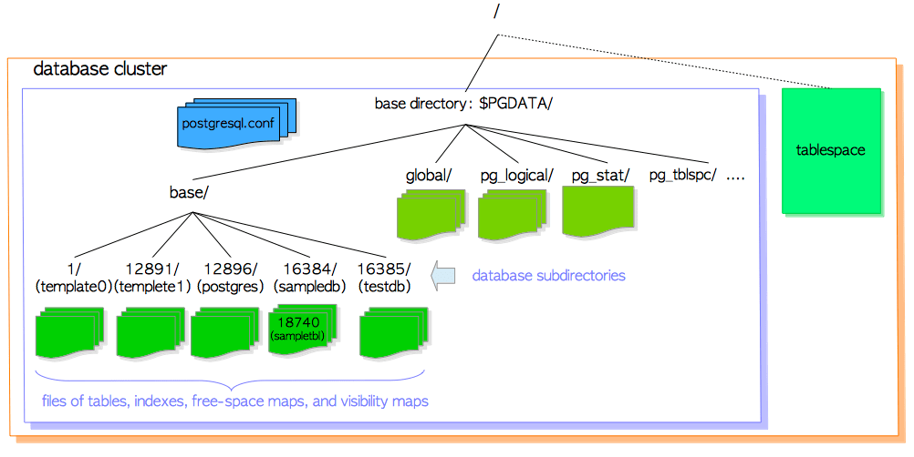

# 第一章 数据库集簇，数据库，数据表

[TOC]

本章和下一章总结了PostgreSQL的基本知识，以帮助阅读后续章节。 本章描述了以下主题：

* 数据库集簇的逻辑结构
* 数据库集簇的物理结构
* 堆表文件的内部布局
* 将数据写入和读取到表的方法

如果你已经熟悉这些内容，可以跳过本章。

## 1.1 数据库集簇的逻辑结构

**数据库集簇（database cluster）**是PostgreSQL服务器管理的数据库集合。 如果你是第一次听到这个定义，你可能会对此感到疑惑，但PostgreSQL中的术语“数据库集簇”并**不**意味着“一组数据库服务器”。 PostgreSQL服务器在单台主机上运行，并管理单个数据库集簇。

​	图1.1显示了数据库集簇的逻辑结构。 数据库是数据库对象的集合。 在关系型数据库理论中，数据库对象是用于存储或引用数据的数据结构。 （堆）表是一个典型的例子，还有更多像索引，序列，视图，函数等。 在PostgreSQL中，数据库本身也是数据库对象，并且在逻辑上彼此分离。 所有其他数据库对象（例如，表，索引等）属于它们相对应的数据库。

**图1.1 数据库集簇的逻辑结构**


​	PostgreSQL中的所有数据库对象都由相应的**对象标识符（Object Identifiers, OID）**进行内部管理，这些标识符是无符号的4字节整型。 数据库对象与相应OID之间的关系存储在相应的[**系统目录**](https://www.postgresql.org/docs/current/static/catalogs.html)中，具体取决于对象的类型。 例如，数据库和堆表的OID分别存储在`pg_database`和`pg_class`中，因此你可以执行以下查询来查找想知道的OID：

```sql
sampledb=# SELECT datname, oid FROM pg_database WHERE datname = 'sampledb';
 datname  |  oid  
----------+-------
 sampledb | 16384
(1 row)

sampledb=# SELECT relname, oid FROM pg_class WHERE relname = 'sampletbl';
  relname  |  oid  
-----------+-------
 sampletbl | 18740 
(1 row)
```


## 1.2 数据库集簇的物理结构

​	数据库集簇从根本上来说是一个称为**基本目录（base directory）**的目录，它包含一些子目录和许多文件。 执行`initdb`实用程序会初始化一个新的数据库集簇，并在指定目录下创建基本目录。 虽然不是必须的，但基本目录的路径通常被设置到环境变量`PGDATA`中。

​	图1.2展示了一个PostgreSQL中数据库集簇的例子。 数据库是*base*子目录下的子目录，每个表和索引（至少）在其所属数据库的子目录下都会存储（至少）一个文件。 还有几个包含特定数据和配置文件的子目录。 虽然PostgreSQL支持表空间，但该术语的含义与其他RDBMS不同。 PostgreSQL中的表空间是一个包含基本目录外的数据的目录。

**图1.2 数据库集簇示例**



在下面的小节中将描述数据库集簇的布局，数据库，与表和索引关联的文件，以及PostgreSQL中的表空间。

### 1.2.1 数据库集簇的布局

数据库集簇的布局已在[官方文档](https://www.postgresql.org/docs/current/static/storage-file-layout.html)中描述。 表1.1中列出了文档一部分中的主要文件和子目录：

**表 1.1： 数据库文件布局和base目录下的子目录（参考官方文档）**

| 文件                              | 描述                                                         |
| --------------------------------- | ------------------------------------------------------------ |
| PG_VERSION                        | 包含PostgreSQL主版本号的文件                                 |
| pg_hba.conf                       | 控制PosgreSQL客户端身份验证的文件                            |
| pg_ident.conf                     | 用于控制PostgreSQL用户名映射的文件                           |
| postgresql.conf                   | 用于设置配置参数的文件                                       |
| postgresql.auto.conf              | 用于存储在ALTER SYSTEM（版本9.4或更高版本）中设置的配置参数的文件 |
| postmaster.opts                   | 记录服务器上次启动的命令行选项的文件                         |


| 子目录                              | 描述                                                         |
| --------------------------------- | ------------------------------------------------------------ |
| base/                             | 包含每个数据库子目录                                         |
| global/                           | 包含群集范围的表，例如pg_database和pg_control。              |
| pg_commit_ts/                     | 包含事务提交时间戳数据的子目录。 9.5或更高版本。             |
| pg_clog/ (9.6前) | 包含事务提交状态数据的子目录。它在版本10中重命名为pg_xact。<br />CLOG将在5.4节中描述 |
| pg_dynshmem/                      | 包含动态共享内存子系统使用的文件的子目录。版本9.4或更高版本。 |
| pg_logical/                       | 包含逻辑解码的状态数据。版本9.4或更高版本。                  |
| pg_multixact/                     | 包含多事务状态数据                                           |
| pg_notify/                        | 包含`LISTEN`/`NOTIFY`状态数据的子目录                     |
| pg_repslot/                       | 包含复制槽数据的子目录。版本9.4或更高版本。                  |
| pg_serial/                        | 包含有关已提交的可序列化事务的信息（版本9.1或更高版本）      |
| pg_snapshots/                     | 包含导出快照的子目录（版本9.2或更高版本）。 PostgreSQL的函数`pg_export_snapshot`在此子目录中创建快照信息文件。 |
| pg_stat/                          | 包含统计子系统的永久文件。                                   |
| pg_stat_tmp/                      | 包含统计子系统临时文件的子目录                               |
| pg_subtrans/                      | 包含子事务状态数据的子目录                                   |
| pg_tblspc/                        | 包含指向表空间的符号链接的子目录                             |
| pg_twophase/                      | 包含准备好的事务的状态文件                                   |
| pg_wal/ (10以后) | （版本10或更高版本）包含WAL（写入前向记录）段文件的子目录。<br />它在版本10中从pg_xlog重命名。 |
| pg_xact/ (10以后) | 版本10或更高版本）包含事务提交状态数据的子目录。它在版本10中从pg_clog重命名。CLOG将在5.4节中描述。 |
| pg_xlog/ (9.6前) | 版本9.6或更早版本）包含WAL（预写日志记录）段文件的子目录。<br />它在版本10中重命名为pg_wal。 |

### 1.2.2 数据库布局

​	数据库是*base*子目录下的子目录; 并且数据库目录的名称与数据库的OID相同。 例如，当数据库*sampledb*的OID为16384时，其子目录名称为16384。

```bash
$ cd $PGDATA
$ ls -ld base/16384
drwx------  213 postgres postgres  7242  8 26 16:33 16384
```

### 1.2.3 表、索引相关文件的布局

​	在数据库目录中，每个小于1GB的表或索引都存储为单个文件。表和索引作为数据库对象，在数据库内部是通过OID来管理的，而这些数据文件由变量 *relfilenode* 管理。 表和索引的 *relfilenode* 值通常（但不总是）与相应的OID匹配，细节如下所述。

让我们看一下表`sampletbl`的OID和 *relfilenode*：

```sql
sampledb=# SELECT relname, oid, relfilenode FROM pg_class WHERE relname = 'sampletbl';
  relname  |  oid  | relfilenode
-----------+-------+-------------
 sampletbl | 18740 |       18740 
(1 row)
```

​	从上面的结果可以看到oid和relfilenode值都相等。还可以看到表`sampletbl`的数据文件路径是`base/16384/18740`。

```bash
$ cd $PGDATA
$ ls -la base/16384/18740
-rw------- 1 postgres postgres 8192 Apr 21 10:21 base/16384/18740
```

​	通过发出一些命令（例如，`TRUNCATE`，`REINDEX`，`CLUSTER`）来改变表和索引的 *relfilenode* 值。 例如，如果我们`TRUNCATE`表`sampletbl`，PostgreSQL会为表分配一个新的 *relfilenode*（18812），删除旧的数据文件（18740），并创建一个新的（18812）。

```
sampledb=# TRUNCATE sampletbl;
TRUNCATE TABLE

sampledb=# SELECT relname, oid, relfilenode FROM pg_class WHERE relname = 'sampletbl';
  relname  |  oid  | relfilenode
-----------+-------+-------------
 sampletbl | 18740 |       18812 
(1 row)
```

>  ​	在9.0或更高版本中，内置函数`pg_relation_filepath`非常有用，因为此函数返回具有指定OID或名称的关系的文件路径名。
>
> ```sql
> sampledb=# SELECT pg_relation_filepath('sampletbl');
>  pg_relation_filepath 
> ----------------------
>  base/16384/18812
> (1 row)
> ```

​	当表和索引的文件大小超过1GB时，PostgreSQL会创建一个名为 *relfilenode.1* 的新文件并使用它。如果新文件已填满，则将创建名为*relfilenode.2*的下一个新文件，依此类推。

```sql
$ cd $PGDATA
$ ls -la -h base/16384/19427*
-rw------- 1 postgres postgres 1.0G  Apr  21 11:16 data/base/16384/19427
-rw------- 1 postgres postgres  45M  Apr  21 11:20 data/base/16384/19427.1
...
```

> 在构建PostgreSQL时，可以使用配置选项`--with-segsize`更改表和索引的最大文件大小。
>

​	仔细查看数据库子目录，您会发现每个表都有两个相关联的文件，后缀分别为`_fsm`和`_vm`。这些被称为自由空间映射和可见性映射，分别存储表文件中每个页面上的可用空间容量和可见性的信息（参见第5.3.4节和第6.2节中的更多细节）。索引只有自己的可用空间映射，没有可见性映射。

具体示例如下所示：

```bash
$ cd $PGDATA
$ ls -la base/16384/18751*
-rw------- 1 postgres postgres  8192 Apr 21 10:21 base/16384/18751
-rw------- 1 postgres postgres 24576 Apr 21 10:18 base/16384/18751_fsm
-rw------- 1 postgres postgres  8192 Apr 21 10:18 base/16384/18751_vm
```

​	它们也可以在内部被称为每种关系的**分支（fork）**；可用空间映射是表/索引数据文件的第一个分支（分支编号为1），可见性映射表是数据文件的第二个分支（分支编号为2）。数据文件的分支编号为0。

### 1.2.4 表空间

PostgreSQL中的**表空间（Tablespace）**是基本目录之外的附加数据区域。 此功能在8.0版中实现。

图1.3显示了表空间的内部布局，以及与主数据区域的关系。

**图 1.3 数据库集簇的表空间**


​	在执行[`CREATE TABLESPACE`](https://www.postgresql.org/docs/current/static/sql-createtablespace.html)语句时，表空间会在你所指定的目录下被创建。而在该目录下，又会创建特定于版本的子目录（例如，`PG_9.4_201409291`）。版本特 定的命名方法如下所示。

```
PG_'主版本号'_'目录版本号'
```

​	例如，如果在`/home/postgres/tblspc`中创建一个表空间`new_tblspc`，其oid为16386，则会在表空间下创建一个子目录，例如`PG_9.4_201409291`。

```bash
$ ls -l /home/postgres/tblspc/
total 4
drwx------ 2 postgres postgres 4096 Apr 21 10:08 PG_9.4_201409291
```

​	表空间目录由`pg_tblspc`子目录中的符号链接寻址，链接名称与表空间的OID值相同。

```
$ ls -l $PGDATA/pg_tblspc/
total 0
lrwxrwxrwx 1 postgres postgres 21 Apr 21 10:08 16386 -> /home/postgres/tblspc
```

​	如果在表空间下创建新数据库（OID为16387），则会在特定于版本的子目录下创建其目录。

```bash
$ ls -l /home/postgres/tblspc/PG_9.4_201409291/
total 4
drwx------ 2 postgres postgres 4096 Apr 21 10:10 16387
```

​	如果创建属于在基本目录下创建的数据库的新表，首先，在特定于版本的子目录下创建名称与现有数据库OID相同的新目录，然后放置新表文件在创建的目录下。

```sql
sampledb=# CREATE TABLE newtbl (.....) TABLESPACE new_tblspc;

sampledb=# SELECT pg_relation_filepath('newtbl');
             pg_relation_filepath             
----------------------------------------------
 pg_tblspc/16386/PG_9.4_201409291/16384/18894
```


## 1.3 堆表文件的内部布局

​	在数据文件（堆表和索引，以及可用空间映射和可见性映射）内部，它被划分为固定长度的**页（pages）**（或**区块（blocks）**），默认为8192字节（8 KB）。 每个文件中的那些页面从0开始按顺序编号，这些数字称为**区块号（block numbers）**。 如果文件已填满，PostgreSQL会在文件末尾添加一个新的空页以增长文件大小。

​	页面的内部布局取决于数据文件类型。 在本节中将描述表的布局，后续的章节将需要这些知识。

**图 1.4. 堆表文件的页面布局**


表中的页包含如下所述的三种数据：

1. **堆元组（heap tuples）** —— 堆元组就是数据记录本身。它们从页面底部按顺序堆叠。元组的内部结构在第5.2节和第9章中描述，因为需要知道PostgreSQL中的并发控制（CC）和WAL。

2. **行指针（line pointer）** ）—— 行指针长4个字节，并保存指向每个堆元组的指针。它也被称为**项目指针（item pointer）**。

   行指针组成了一个简单的数组，它扮演元组索引的角色。每个索引从1开始按顺序编号，并称为**偏移号（offset number）**。当向页中添加新元组时，新的行指针也会被插入数组，并指向新添加的元组。

3. **首部数据（header data）**  —— 由结构`PageHeaderData`定义的首部数据分配在页的开头处。它长24个字节，包含有关页面的一般信息。该结构的主要变量如下所述。

   + `pd_lsn` —— 此变量存储由此页面的最后一次更改写入的XLOG记录的LSN。它是一个8字节无符号整数，与WAL（预写日志记录）机制相关。细节在第9章中描述。
   + `pd_checksum` —— 此变量存储此页面的校验和值。 （请注意，版本9.3或更高版本支持此变量；在早期版本中，此部分用于存储页面的时间线标识。）
   + `pd_lower`，`pd_upper` —— `pd_lower`指向行指针的末尾，`pd_upper`指向最新堆元组的开头。
   + `pd_special` —— 此变量用于索引。在表格中的页面中，它指向页面的末尾。 （在索引中的页面中，它指向特殊空间的开头，它是仅由索引保存的数据区域，并根据索引类型的类型包含特定数据，如B-tree，GiST，GiN等）

   ```c
   /* @src/include/storage/bufpage.h */
   
   /*
    * disk page organization
    *
    * space management information generic to any page
    *
    *		pd_lsn		- identifies xlog record for last change to this page.
    *		pd_checksum - page checksum, if set.
    *		pd_flags	- flag bits.
    *		pd_lower	- offset to start of free space.
    *		pd_upper	- offset to end of free space.
    *		pd_special	- offset to start of special space.
    *		pd_pagesize_version - size in bytes and page layout version number.
    *		pd_prune_xid - oldest XID among potentially prunable tuples on page.
    *
    * The LSN is used by the buffer manager to enforce the basic rule of WAL:
    * "thou shalt write xlog before data".  A dirty buffer cannot be dumped
    * to disk until xlog has been flushed at least as far as the page's LSN.
    *
    * pd_checksum stores the page checksum, if it has been set for this page;
    * zero is a valid value for a checksum. If a checksum is not in use then
    * we leave the field unset. This will typically mean the field is zero
    * though non-zero values may also be present if databases have been
    * pg_upgraded from releases prior to 9.3, when the same byte offset was
    * used to store the current timelineid when the page was last updated.
    * Note that there is no indication on a page as to whether the checksum
    * is valid or not, a deliberate design choice which avoids the problem
    * of relying on the page contents to decide whether to verify it. Hence
    * there are no flag bits relating to checksums.
    *
    * pd_prune_xid is a hint field that helps determine whether pruning will be
    * useful.  It is currently unused in index pages.
    *
    * The page version number and page size are packed together into a single
    * uint16 field.  This is for historical reasons: before PostgreSQL 7.3,
    * there was no concept of a page version number, and doing it this way
    * lets us pretend that pre-7.3 databases have page version number zero.
    * We constrain page sizes to be multiples of 256, leaving the low eight
    * bits available for a version number.
    *
    * Minimum possible page size is perhaps 64B to fit page header, opaque space
    * and a minimal tuple; of course, in reality you want it much bigger, so
    * the constraint on pagesize mod 256 is not an important restriction.
    * On the high end, we can only support pages up to 32KB because lp_off/lp_len
    * are 15 bits.
    */
   typedef struct PageHeaderData
   {
   	/* XXX LSN is member of *any* block, not only page-organized ones */
   	PageXLogRecPtr pd_lsn;		/* LSN: next byte after last byte of xlog
   								 * record for last change to this page */
   	uint16		pd_checksum;	/* 校验和 */
   	uint16		pd_flags;		/* 标记位，详情见下 */
   	LocationIndex pd_lower;		/* offset to start of free space */
   	LocationIndex pd_upper;		/* offset to end of free space */
   	LocationIndex pd_special;	/* offset to start of special space */
   	uint16		pd_pagesize_version;
   	TransactionId pd_prune_xid; /* oldest prunable XID, or zero if none */
   	ItemIdData	pd_linp[FLEXIBLE_ARRAY_MEMBER]; /* line pointer array */
   } PageHeaderData;
   
   typedef struct PageHeaderData
   {
     /* XXX LSN is member of *any* block, not only page-organized ones */
     XLogRecPtr    pd_lsn;      /* LSN: next byte after last byte of xlog
                                 * record for last change to this page */
     uint16        pd_checksum; /* 校验和 */
     uint16        pd_flags;    /* 标记位 */
     LocationIndex pd_lower;    /* 空闲空间的开始位置(偏移量) */
     LocationIndex pd_upper;    /* offset to end of free space */
     LocationIndex pd_special;  /* offset to start of special space */
     uint16        pd_pagesize_version;
     TransactionId pd_prune_xid;/* oldest prunable XID, or zero if none */
     ItemIdData    pd_linp[1];  /* beginning of line pointer array */
   } PageHeaderData;
   
   typedef PageHeaderData *PageHeader;
   
   typedef uint64 XLogRecPtr;
   ```

   行指针末尾和最新元组开头之间的空白空间称为空闲空间或空洞。

		为了识别表中的元组，内部使用元组标识符（TID）。 TID包括一对值：包含元组的页面的块编号，以及指向元组的行指针的偏移编号。其用法的典型示例是索引。请参见第1.4.2节中的更多细节。

> 结构`PageHeaderData`定义于[src/include/storage/bufpage.h](https://github.com/postgres/postgres/blob/master/src/include/storage/bufpage.h)中。

​	此外，超过约2KB（8KB的四分之一）大小的堆元组会使用一种称为 **TOAST（The Oversized-Attribute Storage Technique，超大属性存储技术）** 的方法来存储与管理。详情参阅[PostgreSQL文档](https://www.postgresql.org/docs/current/static/storage-toast.html)。


## 1.4 读写元组的方法

本章的最后将描述读取及写入堆元组的方法。

### 1.4.1 写入堆元组

​	假设一个表由一个页面组成，该页面只包含一个堆元组。 此页面的`pd_lower`指向第一行指针，行指针和`pd_upper`都指向第一个堆元组。 见图1.5(a)。

​	插入第二个元组时，将其放在第一个元组之后。 第二个行指针被插入到第一个行指针的后面，并指向第二个元组。 `pd_lower`更改为指向第二个行指针，`pd_upper`更改为第二个堆元组。 见图1.5(b)。 该页面内的其他首部数据（例如`pd_lsn`，`pg_checksum`，`pg_flag`）也被重写为适当的值; 更多细节在第5.3节和第9章中描述。

**图 1.5 堆元组的写入**


### 1.4.2 读堆元组

这里概述两种典型的访问方法，顺序扫描和B树索引扫描：

* **顺序扫描** —— 按顺序读取所有页面中的所有元组，通过扫描每一页中的行指针实现。如图1.6(a)。
* **B树索引扫描** —— 索引文件包含索引元组，每个索引元组由索引键，和指向目标堆元组的TID组成。 如果找到了正在查找的键的索引元组，PostgreSQL将使用获取的TID值读取所需的堆元组。 （这里没有解释在B树索引中找到索引元组的方法的描述，因为它很常见，这儿空间有限，请参考相关资料）例如，在图1.6(b)中，TID 获得的索引元组的值是`(block = 7，Offset = 2)`。 这意味着目标堆元组是表中第7页的第2个元组，因此PostgreSQL可以读取所需的堆元组，而不会在页面中进行不必要的扫描。

**图 1.6 顺序扫描和索引扫描**


> PostgreSQL还支持TID扫描，位图扫描（[Bitmap-Scan](https://wiki.postgresql.org/wiki/Bitmap_Indexes)）和仅索引扫描（Index-Only-Scan）。
>
> TID-Scan是一种通过使用所需元组的TID直接访问元组的方法。 例如，要在表中找到第0个页面中的第一个元组，执行以下查询：
>
> ```
> sampledb=# SELECT ctid, data FROM sampletbl WHERE ctid = '(0,1)';
>  ctid  |   data    
> -------+-----------
>  (0,1) | AAAAAAAAA
> (1 row)
> ```
>
> 仅索引扫描将在第7章中详细介绍。

