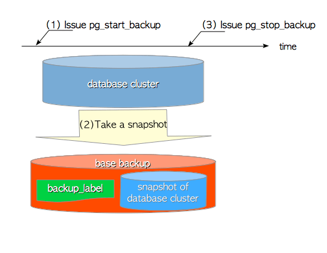
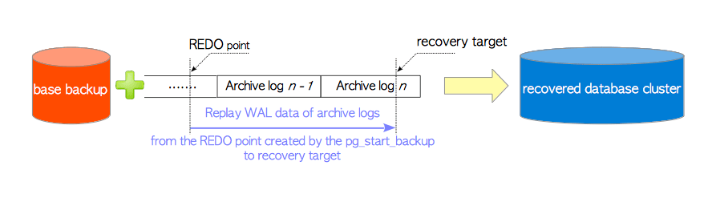
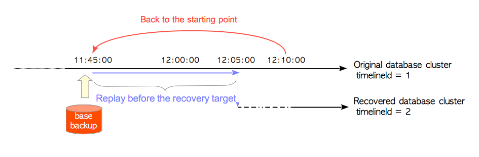
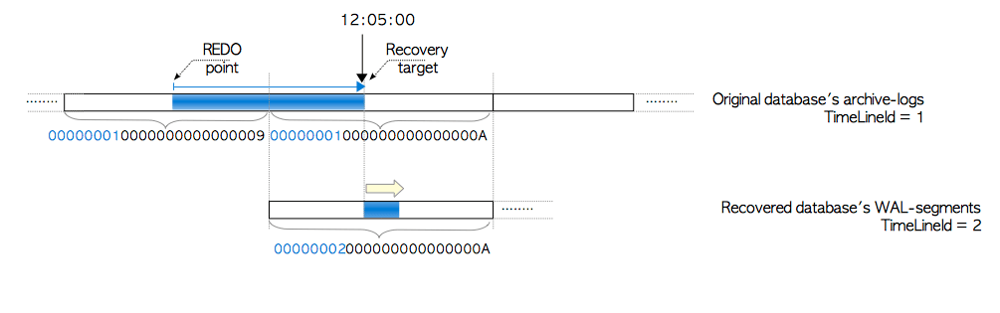
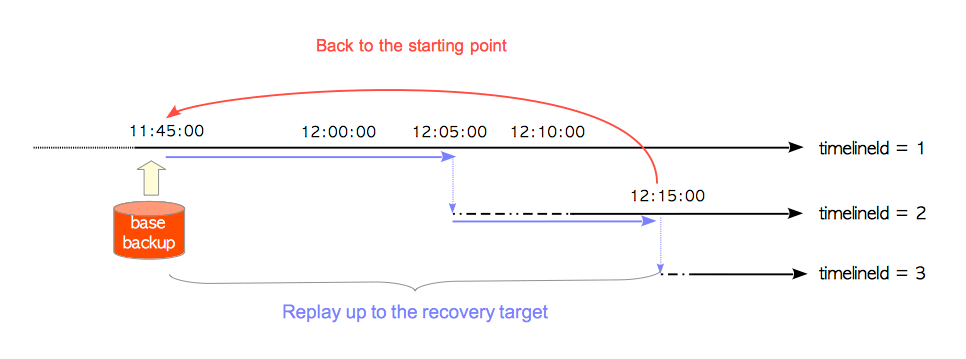

# 第十章 基础备份与时间点恢复

[TOC]

​	在线数据库备份大致可分为两类：逻辑备份和物理备份。它们有着各自的优点和缺点。尽管各有优劣，但逻辑备份有一个缺点：执行需要花费太多时间。特别是对于大型数据库而言，需要花费很长时间进行备份，而从备份数据中恢复数据库可能需要更多的时间。相反的是，物理备份可以在相对较短的时间内备份和恢复大型数据库，因此在实际系统中，它是一个非常重要而实用的功能。

​	在PostgreSQL中，自8.0版本开始提供在线的全量物理备份，而运行中的整个数据库集簇（即物理备份数据）的快照称为**基本备份（base backup）**。

​	PostgreSQL还在8.0版中引入了**时间点恢复（Point-In-Time Recovery, PITR）**。这一功能可以将数据库恢复至任意时间点，这是通过使用一个*基础备份* 和由[持续归档](ch9.md)生成的*归档日志*来实现的。例如，即使你犯了一个严重的错误（例如`TRUNCATE`所有的表），此功能使您可以将数据库恢复至错误发生之前的时刻。

本章描述了以下主题：

* 什么是基础备份
* PITR的工作原理
* 时间线ID是什么
* 时间线历史文件是什么

> 在7.4或更早版本中，PostgreSQL仅支持逻辑备份（全量逻辑备份、部分逻辑备份，数据导出）。


## 10.1 基础备份

首先，使用低级命令进行基本备份的标准过程如下所示：

1. 发出`pg_start_backup`命令

2. 使用你想用的归档命令获取数据库群集的快照
3. 发出`pg_stop_backup`命令

这个简单的过程对于DBA来说很容易使用，因为它不需要特殊工具，只需要常用工具（如复制命令或类似的归档工具）来创建基本备份。此外，在此过程中，不需要获取表上的锁，而所有用户都可以在不受备份操作影响的情况下发起查询。相对于其他开源关系型数据库，这是一个巨大的优势。

更简单的方式是使用[`pg_basebackup`](https://www.postgresql.org/docs/current/static/app-pgbasebackup.html)实用程序来做基础备份，不过其实它在内部也是使用这些低级命令来工作的。

**图10.1 制作基础备份**




由于这些命令对显然是理解PITR的关键点之一，我们将在以下小节中探讨它们。

>
> `pg_start_backup`和`pg_stop_backup`命令定义在：[src/backend/access/transam/xlogfuncs.c](https://github.com/postgres/postgres/blob/master/src/backend/access/transam/xlogfuncs.c)。


### 10.1.1 pg_start_backup

`pg_start_backup`会为制作基础备份而做准备。如[第9.8节](ch9.md)所述，恢复过程从重做点开始，因此`pg_start_backup`必须执行存档，以便在制作基础备份的开始时刻显式创建一个重做点。此外，这次存档的存档位置必需保存在不同于`pg_control`的其他文件中，因为在备份期间可能会进行多次常规存盘。因此`pg_start_backup`执行下列四个操作：

1. 强制进入**整页写入**模式。
2. 切换到当前的WAL段文件（8.4或更高版本）。
3. 执行存档。
4. 创建`backup_label`文件 —— 该文件创建于基本目录顶层中，包含有关该基本备份本身的关键信息，例如存档的存档位置。

第三和第四个操作是该命令的核心。第一和第二个操作是为了更可靠地恢复数据库集簇。

备份标签`backup_label`文件包含以下六个项目（11或更新版本为七个项目）：

* **存档位置（CHECKPOINT LOCATION）** —— 该命令所创建存档的LSN位置。
* **WAL开始位置（START WAL LOCATION）** —— 这不是给PITR用的，而是为[第11章](ch11.md)描述的流复制准备的。它被命名为“START WAL LOCATION”，因为复制模式下的备用服务器在初始启动时只读取一次该值。
* **备份方法（BACKUP METHOD）** —— 这是用于进行此基本备份的方法。 （`pg_start_backup`或`pg_basebackup`。）
* **备份来源（BACKUP FROM）** —— 说明此备份是从主库还是备库拉取。
* **开始时间（START TIME）**——  这是执行pg_start_backup时的时间戳。
* **备份标签（LABEL）** —— 这是pg_start_backup中指定的标签。
* **开始时间线（START TIMELINE）** —— 这是备份开始的时间线。这是为了进行正常性检查，在版本11中被引入。


> #### 备份标签
>
> 一个9.6版本中备份标签的实际例子如下所示：
>
> ```bash
> postgres> cat /usr/local/pgsql/data/backup_label
> START WAL LOCATION: 0/9000028 (file 000000010000000000000009)
> CHECKPOINT LOCATION: 0/9000060
> BACKUP METHOD: pg_start_backup
> BACKUP FROM: master
> START TIME: 2018-7-9 11:45:19 GMT
> LABEL: Weekly Backup
> ```

​	可以想象，当使用此基础备份恢复数据库时，PostgreSQL从`backup_label`文件中取出存档位置`CHECKPOINT LOCATION`，然后从归档日志中的合适位置读取存档记录，然后从存档记录中获取重做点的位置，最后从重做点开始进行恢复过程（下一节将介绍细节）。

### 10.1.2 pg_stop_backup

`pg_stop_backup`执行以下五个操作以完成备份。

1. 重置为**非整页写入**，如果该配置是由`pg_start_backup`强制改变的。
2. 写入一条备份结束的XLOG记录。
3. 切换WAL段文件。
4. 创建一个备份历史记录文件 —— 此文件包含`backup_label`文件的内容，以及已执行`pg_stop_backup`的时间戳。
5. 删除`backup_label`文件 —— 从基础备份恢复需要`backup_label`文件，不过一旦被复制，原始的数据库集簇中就不需要它了。

> 备份历史文件的命名方法如下所示：
>
> ```
> {WAL segment}.{offset value at the time the base backup was started}.backup
> ```


## 10.2 时间点恢复（PITR）的工作原理

​	图10.2展示了PITR的基本概念。 PITR模式下的PostgreSQL会在基础备份上重放归档日志中的WAL数据，从`pg_start_backup`创建的重做点开始，恢复至你想要的位置为止。在PostgreSQL中，要被恢复到的位置，被称为**恢复目标（recovery target）**。

**图10.2 PITR的基本概念**



​	PITR是这样工作的。假设你在GMT时间`2018-07-16 12:05:00`搞出了个错误。那你应该删掉当前的数据库集簇，并使用之前制作的基础备份恢复一个新的出来。然后，创建一个`recovery.conf`文件，并在其中将参数`recovery_target_time`参数配置为你犯错误的时间点（在本例中，也就是12:05 GMT）。`recovery.conf`文件如下所示：

```ini
# Place archive logs under /mnt/server/archivedir directory.
restore_command = 'cp /mnt/server/archivedir/%f %p'
recovery_target_time = "2018-7-16 12:05 GMT"
```

​	当PostgreSQL启动的时候，如果数据库集簇中存在`recovery.conf`和`backup_label`文件，它就会进入恢复模式。

PITR过程几乎与[第九章](ch9.md)中描述的常规恢复过程一模一样，唯一的区别只有以下两点：

1. 从哪里读取WAL段/归档日志？
   * 正常恢复模式 —— 来自基础目录下的`pg_xlog`子目录（10或更新版本，`pg_wal`子目录）。
   * PITR模式 —— 来自配置参数`archive_command`中设置的归档目录。
2. 从哪里读取存档位置？
   * 正常恢复模式 —— 来自`pg_control`文件。
   * PITR模式 —— 来自`backup_label`文件。

PITR流程概述如下：

1. 为了找到重做点，PostgreSQL使用内部函数`read_backup_label`从`backup_label`文件中读取`CHECKPOINT LOCATION`的值。

2. PostgreSQL从`recovery.conf`中读取一些参数值；在此示例中为`restore_command`和`recovery_target_time`。

3. PostgreSQL开始从重做点重放WAL数据，重做点的位置可以简单地从`CHECKPOINT LOCATION`的值中获得。 PostgreSQL执行参数`restore_command`中配置的命令，将归档日志从归档区域拷贝到临时区域，并从中读取WAL数据。（复制到临时区域中的日志文件会在使用后删除）

   在本例中，PostgreSQL从重做点读取并重放WAL数据，直到时间戳`2018-7-16 12:05:00`为止，因为参数`recovery_target_time`被设置为该时间戳。如果`recovery.conf`中没有配置恢复目标，则PostgreSQL将重放至归档日志的末尾。

4. 当恢复过程完成时，会在`pg_xlog`子目录（10或更高版本为`pg_wal`子目录）中创建时间线历史文件，例如`00000002.history`；如果启用了日志归档功能，则还会在归档目录中创建相同的命名文件。以下各节介绍了此文件的内容和作用。

提交和中止操作的记录包含每个操作完成时的时间戳（两个操作的XLOG数据部分分别在`xl_xact_commit`和`xl_xact_abort`中定义）。因此，如果将目标时间设置为参数`recovery_target_time`，PostgreSQL可以选择是否继续恢复，只要它重放提交或中止操作的XLOG记录。当重放每个动作的XLOG记录时，PostgreSQL会比较目标时间和记录中写入的每个时间戳；如果时间戳超过目标时间，PITR过程将完成。

```c
typedef struct xl_xact_commit
{
        TimestampTz	xact_time;              /* 提交时间 */
        uint32          xinfo;              /* 信息标记位 */
        int            	nrels;              /* RelFileNodes的数量 */
        int            	nsubxacts;          /* 子事务XIDs的数量 */
        int            	nmsgs;              /* 共享失效消息的数量 */
        Oid            	dbId;               /* MyDatabaseId, 数据库Oid */
        Oid            	tsId;               /* MyDatabaseTableSpace, 表空间Oid */
        /* 在提交时需要丢弃的RelFileNode(s)数组 */
        RelFileNode     xnodes[1];          /* 变长数组 */
        /* 紧接着已提交的子事务XIDs数组 */
        /* 紧接着共享失效消息的数组 */
} xl_xact_commit;
```

```c
typedef struct xl_xact_abort
{
        TimestampTz     xact_time;          /* 中止时间 */
        int            	nrels;              /* RelFileNodes的数量 */
        int             nsubxacts;          /* 子事务XIDs的数量 */
        /* 在中止时需要丢弃的RelFileNode(s)数组 */
        RelFileNode     xnodes[1];          /* 变长数组 */
        /* 紧接着已提交的子事务XIDs数组 */
} xl_xact_abort;
```

> 函数`read_backup_label`定义于[src/backend/access/transam/xlog.c](https://github.com/postgres/postgres/blob/master/src/backend/access/transam/xlog.c)中。
> 结构`xl_xact_commit`和`xl_xact_abort`定义于[src/backend/access/transam/xlog.c](https://github.com/postgres/postgres/blob/master/src/backend/access/transam/xlog.c)。


> ####  为什么可以用通用工具做基础备份？
>
> ​	恢复过程是使数据库集簇达成一致状态的过程，尽管数据库集簇可能是不一致的。PITR是基于恢复过程的，即使基础备份是一堆不一致的文件，它也可以恢复数据库集簇。因此我们可以在没有文件系统快照功能，或其他特殊工具的情况下，使用通用归档工具做基础备份。


## 10.3 时间线与时间线历史文件

​	PostgreSQL中的时间线用于区分原始数据库集簇和恢复生成的数据库集簇，它是PITR的核心概念。在本节中，描述了与时间线相关的两件事：**时间线标识（TimelineID）**，以及**时间线历史文件（Timeline History Files）**。

### 10.3.1 时间线标识（TimelineID）

​	每个时间线都有一个相应的**时间线标识**，一个四字节的无符号整型，从1开始计数。

​	每个数据库集簇都会被指定一个时间线标识。由`initdb`实用程序创建的原始数据库集簇，其时间线标识为1。每当数据库集簇恢复时，时间线标识都会增加1。例如在前一节的例子中，从原始集簇中恢复得到的集簇，其时间线标识为2。

​	图10.3从时间线标识的角度展示了PITR过程。首先，我们删除当前的数据库集簇，并替换为过去的基础备份，以便返回到恢复的起始点，这一步在图中用红色曲线箭头标识。接下来，我们启动PostgreSQL服务器，它通过跟踪初始时间线（时间线标识`1`），从`pg_start_backup`创建的重做点开始，重放存档日志中的WAL数据，直到恢复目标达成，这一步在图中用蓝色直线箭头标识。接下来，恢复得到的数据库集簇将被分配一个新的时间线标识`2`，而PostgreSQL将运行在新的时间线上。

**图10.3 原始数据库集簇和恢复数据库集簇之间时间线标识的关系**




​	正如[第九章](ch9.md)中简要提到的，WAL段文件名的前8位数字，等于创建这些段的数据库集簇的时间线标识。当时间线标识发生变化时，WAL段文件名也会相应改变。

​	让我们从WAL段文件的角度重新审视恢复过程。假设我们使用两个归档日志文件来恢复数据库：

***00000001***0000000000000009，以及 ***00000001***000000000000000A。新恢复得到的数据库集簇被分配了时间线标识`2`，而PostgreSQL就会从 ***00000002***000000000000000A 开始创建WAL段。如图10.4所示。

**图10.4 原始数据库集簇和恢复数据库集簇之间WAL段文件的关系**




### 10.3.2 时间线历史文件

​	当PITR过程完成时，会在归档目录和`pg_xlog`子目录（10或更高版本为`pg_wal`子目录）下创建名称为`00000002.history`的时间线历史文件。该文件记录了当前时间线是从哪条时间线分叉出来的，以及分叉的时间。

​	该文件的命名规则如下所示：

```
“8位数字的新时间线标识”.history
```

时间线历史文件至少包含一行，每行由以下三项组成：

* 时间线标识 —— 归档日志曾用于恢复过的时间线。
* LSN —— 发生WAL段切换的LSN位置。
* 原因 —— 时间线发生变化的原因，供人类读取的解释。

具体示例如下所示：

```bash
postgres> cat /home/postgres/archivelogs/00000002.history
1	  0/A000198	before 2018-7-9 12:05:00.861324+00
```

含义如下：

> ​	数据库集簇（时间线标识为2）基于时间线标识为1的基础备份，并在`2018-7-9 12:05:00.861324+00`之前，通过重放存档日志，恢复至`0/A000198`的位置。

​	通过这种方式，每个时间线历史文件都会告诉我们每个恢复所得的数据库集簇的完整历史。而且它也在PITR过程本身中使用。下一节将描述细节。

> 时间线历史文件的格式在9.3版本中发生变化。9.3前后的格式如下所示，但相对简略。
>
> 9.3及后续版本：
>
> ```
> timelineId	LSN	"reason"
> ```
>
> 9.2及先前版本
>
> ```
> timelineId	WAL_segment	"reason"
> ```


## 10.4 时间点恢复与时间线历史文件

​	时间线历史文件在第二个和后续PITR过程中起着重要作用。通过尝试第二次恢复，我们将探索如何使用它。

​	同样，假设您在`12:15:00`又犯了一个错误，错误发生在时间线ID为2的数据库集簇上。在这种情况下为了恢复数据库集簇，你需要创建一个如下所示的`recovery.conf`文件：

```ini
restore_command = 'cp /mnt/server/archivedir/%f %p'
recovery_target_time = "2018-7-16 12:15:00 GMT"
recovery_target_timeline = 2
```

​	参数`recovery_target_time`被设置为您犯下新错误的时间，而`recovery_target_timeline`被设置为`2`，以便沿着这条时间线恢复。

重启PostgreSQL服务器并进入PITR模式，数据库会沿着时间线标识2进行恢复。如图10.5所示。

**图10.5 沿着时间线2将数据库恢复至12:15的状态**



1. PostgreSQL从`backup_label`文件中读取`CHECKPOINT LOCATION`的值。

2. 从`recovery.conf`中读取一些参数值；在此示例中为`restore_command`，`recovery_target_time`和`recovery_target_timeline`。

3. PostgreSQL读取时间线历史文件`00000002.history`，该文件对应参数`recovery_target_timeline`的值。

4. PostgreSQL通过以下步骤重放WAL数据：

   1. 对于从重做点到LSN`0/A000198`（该值写在`00000002.history`文件中）之间的WAL数据，PostgreSQL会（从合适的归档日志中）读取并重放时间线标识=1的WAL数据。
   2. 对于从LSN`0/A000198`，到时间戳`2018-7-9 12:15:00`之间的WAL数据，PostgreSQL会（从合适的归档日志中）读取并重放时间线标识=2的WAL数据。

5. 当恢复过程完成时，当前的时间线标识将步进至3，并在`pg_xlog`子目录（10及后续版本为`pg_wal`子目录）和归档目录中创建名为`00000003.history`的新时间线历史文件。

   ```bash
   postgres> cat /home/postgres/archivelogs/00000003.history
   1         0/A000198     before 2018-7-9 12:05:00.861324+00
   
   2         0/B000078     before 2018-7-9 12:15:00.927133+00
   ```

当你进行过超过一次的PITR时，应明确设置时间线标识，以便使用合适的时间线历史文件。

因此，时间线历史文件不仅仅是数据库集簇的历史日志，还是PITR过程的恢复指令文档。