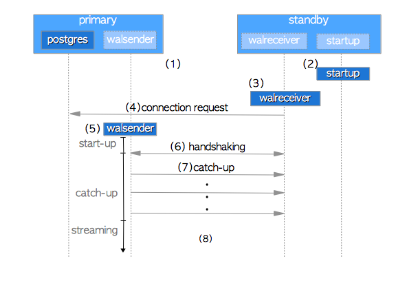
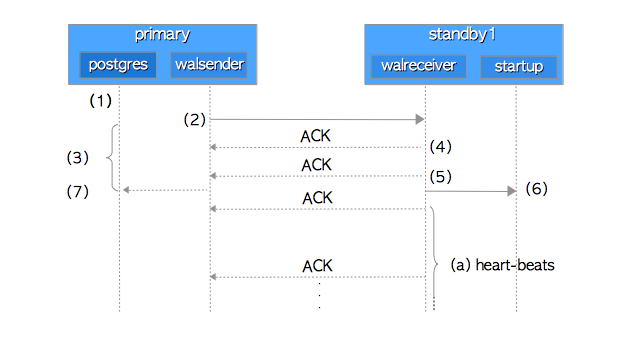
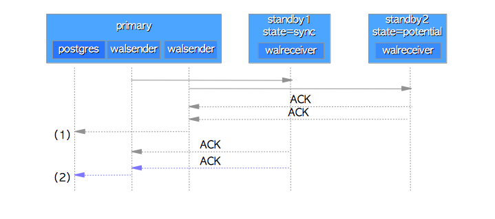
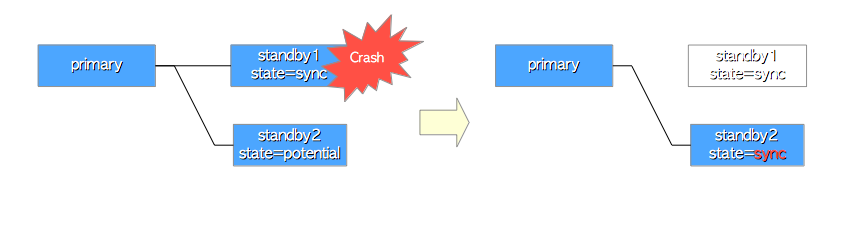

# 第十一章 流复制

[TOC]

​	同步流复制在9.1版中实现。它是所谓的单主——多从属类型复制，并且这两个术语—— 主和从通常在PostgreSQL中分别称为主和备。

​	此本机复制功能基于日志传送（一种通用复制技术），其中主服务器继续发送WAL数据，然后，每个备用服务器立即重播接收的数据。

本章介绍以下主题，重点介绍流复制的工作原理：

* 流式复制如何启动
* 如何在主服务器和备用服务器之间传输数据
* 主服务器如何管理多个备用服务器
* 主服务器如何检测备用服务器的故障

> 尽管第一个复制功能（仅用于异步复制）已在9.0版中实现，但它已替换为9.1中的同步复制的新实现（当前正在使用）。
>


## 11.1 启动流复制

​	在流复制中，三种进程协同工作。主服务器上的**walsender**进程将WAL数据发送到备用服务器;然后，备用服务器上的**walreceiver**和**startup**进程接收并重放这些数据。 walsender和walreceiver使用单个TCP连接进行通信。

​	在本节中，我们将探讨流复制的启动顺序，以了解这些进程如何启动以及如何建立它们之间的连接。图11.1显示了流复制的启动顺序图：

**图11.1  SR启动顺序**


1. 启动主服务器和备用服务器。
2. 备用服务器启动启动过程。
3. 备用服务器启动walreceiver进程。
4. walreceiver向主服务器发送连接请求。如果主服务器未运行，则walreceiver会定期发送这些请求。
5. 当主服务器收到连接请求时，它启动walsender进程并在walsender和walreceiver之间建立TCP连接。
6. walreceiver发送备用数据库集群的最新LSN。一般而言，这一阶段被称为信息技术领域的握手。
7. 如果备用的最新LSN小于主要的最新LSN（备用的LSN <主要的LSN），则walsender将WAL数据从前LSN发送到后一个LSN。这样的WAL数据由存储在主要的pg_xlog子目录（版本10或更高版本，pg_wal子目录）中的WAL段提供。然后，备用服务器重放接收的WAL数据。在这个阶段，备用数据库赶上主数据库，因此它被称为追赶。
8. 流复制开始起作用。

每个walsender进程都保持适合连接的walreceiver或任何应用程序的工作阶段的状态（请注意，它不是连接到walsender的walreceiver或应用程序的状态。）以下是它的可能状态：
* start-up - 从启动walsender到握手结束。见图。 11.1（5） - （6）。
* catch-up - 在追赶阶段。见图11.1（7）。
* streaming - 虽然流复制正在运行。见图11.1（8）。
* backup - 在为pg_basebackup实用程序等备份工具发送整个数据库集群的文件期间。

系统视图`pg_stat_replication`显示所有正在运行的walsenders的状态。一个例子如下所示：

```bash
testdb=# SELECT application_name,state FROM pg_stat_replication;
 application_name |   state
------------------+-----------
 standby1         | streaming
 standby2         | streaming
 pg_basebackup    | backup
(3 rows)
```

如上面的结果所示，两个walsender正在运行以发送连接的备用服务器的WAL数据，另一个正在运行以发送pg_basebackup实用程序的数据库集群的所有文件。

>  ### 如果备用服务器在停止状态下长时间后重新启动会发生什么？
>
> 在9.3版或更早版本中，如果备用服务器所需的主要WAL段已经被回收，则备用数据库无法赶上主服务器。此问题没有可靠的解决方案，但只是为配置参数wal_keep_segments设置较大的值以减少发生的可能性。这是一个权宜之计的解决方案。
>
> 在9.4或更高版本中，可以使用复制槽来防止此问题。复制槽是一项扩展WAL数据发送灵活性的功能，主要用于逻辑复制，也提供了解决此问题的方法 - 包含pg_xlog下的未发送数据的WAL段文件（如果版本10或更高版本，则包含pg_wal） ）通过暂停回收过程可以保留在复制槽中。有关详细信息，请参阅官方文档
>


## 11.2 如何实施流复制

​	流复制有两个方面：日志传送和数据库同步。日志传送显然是其中一个方面，因为流复制基于它 - 主服务器会在写入它们时将WAL数据发送到连接的备用服务器。同步复制需要数据库同步 - 主服务器与每个多备用服务器通信以同步其数据库集群。

​	为了准确理解流复制的工作原理，我们应该探索一个主服务器如何管理多个备用服务器。为了使其相当简单，本节描述了特殊情况（即单主单待机系统），而下一节将描述一般情况（单主多机架系统）。

### 11.2.1 主从间的通信

​	假设备用服务器处于同步复制模式，但配置参数hot-standby已禁用且`wal_level`为'archive'。主服务器的主要参数如下所示：

```bash
synchronous_standby_names = 'standby1'
hot_standby = off
wal_level = archive
```

另外，在编写9.5节中提到的WAL数据的三个触发器中，我们关注这里的事务提交。

假设主服务器上的一个后端进程在自动提交模式下发出一个简单的INSERT语句。后端启动事务，发出INSERT语句，然后立即提交事务。让我们进一步探讨如何完成此提交操作。请参见图11.2中的以下序列图：

**图11.2  流复制的通信序列图**



1. 后端进程通过执行函数XLogInsert（）和XLogFlush（）将WAL数据写入并刷新到WAL段文件。
2. walsender进程将写入WAL段的WAL数据发送到walreceiver进程。
3. 在发送WAL数据之后，后端进程继续等待来自备用服务器的ACK响应。更确切地说，后端进程通过执行内部函数SyncRepWaitForLSN（）来获取锁存器，并等待它被释放。
4. 备用服务器上的walreceiver使用write（）系统调用将接收到的WAL数据写入备用数据库的WAL段，并向walsender返回ACK响应。
5. walreceiver使用系统调用（例如fsync（））将WAL数据刷新到WAL段，向walsender返回另一个ACK响应，并通知启动过程有关WAL数据的更新。
6. 启动过程重放WAL数据，该数据已写入WAL段。
7. walsender在收到来自walreceiver的ACK响应后释放后端进程的锁存器，然后，后端进程的提交或中止动作将完成。 latch-release的时序取决于参数synchronous_commit。它是'on'（默认），当接收到步骤（5）的ACK时，锁存器被释放，而当接收到步骤（4）的ACK时，它是'remote_write'。

> 如果配置参数wal_level是'hot_standby'或'logical'，则PostgreSQL会根据提交或中止操作的记录写入有关热备用功能的WAL记录。 （在这个例子中，PostgreSQL不写那条记录，因为它是'archive'。）
>


每个ACK响应通知主服务器备用服务器的内部信息。它包含以下四个项目：

* 已写入最新WAL数据的LSN位置。
* 刷新最新WAL数据的LSN位置。
* LSN位置，在启动过程中重放最新的WAL数据。
* 发送此响应的时间戳。

Walreceiver不仅在写入和刷新WAL数据时返回ACK响应，而且还定期作为备用服务器的心跳返回ACK响应。因此，主服务器始终掌握所有连接的备用服务器的状态。

通过发出如下所示的查询，可以显示所连接的备用服务器的LSN相关信息。

```bash
testdb=# SELECT application_name AS host,
        write_location AS write_LSN, flush_location AS flush_LSN, 
        replay_location AS replay_LSN FROM pg_stat_replication;

   host   | write_lsn | flush_lsn | replay_lsn 
----------+-----------+-----------+------------
 standby1 | 0/5000280 | 0/5000280 | 0/5000280
 standby2 | 0/5000280 | 0/5000280 | 0/5000280
(2 rows)
```

> 心跳的间隔设置为参数`wal_receiver_status_interval`，默认为10秒。


### 11.2.2 发生故障时的行为

​	在本小节中，将介绍主服务器在同步备用服务器发生故障时的行为方式，以及如何处理该情况。

​	即使同步备用服务器发生故障并且不再能够返回ACK响应，主服务器也会继续等待响应。因此，正在运行的事务无法提交，并且无法启动后续查询处理。换句话说，所有主服务器操作实际上都已停止。 （流复制不支持通过超时自动恢复到异步模式的功能。）

​	有两种方法可以避免这种情况。其中之一是使用多个备用服务器来提高系统可用性，另一个是通过手动执行以下步骤从同步模式切换到异步模式。

（1）将参数`synchronous_standby_names`的值设置为空字符串。
- ```bash
  synchronous_standby_names = ''
  ```

（2）使用`reload`选项执行`pg_ctl`命令。
- ```bash
  postgres> pg_ctl -D $PGDATA reload
  ```

上述过程不会影响连接的客户端。主服务器继续事务处理以及客户端之间的所有会话以及相应的后端进程。


## 11.3 管理多个从库

​	在本节中，描述了流复制与多个备用服务器一起工作的方式。

### 11.3.1 同步优先级与同步状态

​	主服务器将`sync_priority`和`sync_state`提供给所有托管备用服务器，并根据各自的值处理每个备用服务器。 （主服务器即使只管理一个备用服务器也会提供这些值;在上一节中没有提到过这一点。）

`sync_priority`表示备用服务器在同步模式下的优先级，是固定值。较小的值表示较高的优先级，而0表示“在异步模式下”的特殊值。备用服务器的优先级按主要配置参数`synchronous_standby_names`中列出的顺序给出。例如，在以下配置中，standby1和standby2的优先级分别为1和2。

```bash
synchronous_standby_names = 'standby1, standby2'
```

（此参数未列出的备用服务器处于异步模式，优先级为0。）

sync_state是备用服务器的状态。它根据所有备用服务器的运行状态和个别优先级而变化。以下是可能的状态：

Sync是所有工作备用数据库（异步服务器除外）中具有最高优先级的同步备用服务器的状态。

可能是所有工作备用数据库（异步服务器除外）中的第二个或更低优先级的备用同步备用服务器的状态。如果同步备用数据库发生故障，它将被替换为潜在备用数据库中的最高优先级备用数据库。

异步是异步备用服务器的状态，此状态是固定的。主服务器以与潜在备用数据库相同的方式处理异步备用数据库，除了它们的`sync_state`永远不会是`sync`或`potential`。

可以通过发出以下查询来显示备用服务器的优先级和状态：

```
testdb=# SELECT application_name AS host, 
         sync_priority, sync_state FROM pg_stat_replication;
   host   | sync_priority | sync_state
----------+---------------+------------
 standby1 |             1 | sync
 standby2 |             2 | potential
(2 rows)
```

> 最近有几个开发人员试图实现“多个同步 - 备用”。详情请见此处。

### 11.3.2 主库如何管理多个从库

​	主库仅等待来自同步备用服务器的ACK响应。换句话说，主服务器仅确认同步备用数据库的写入和刷新WAL数据。因此，流复制可确保只有同步备用数据库与主数据库处于一致和同步状态。

​	图11.3显示了潜在备用数据库的ACK响应早于主备用数据库的ACK响应的情况。在那里，主服务器不完成当前事务的提交操作，并继续等待主要的ACK响应。然后，当收到主要响应时，后端进程释放锁存器并完成当前事务处理。

**图11.3 管理多个从库**



> standby1和standby2的sync_state分别是`sync`和`potential。
>
> （1）尽管从潜在备用服务器接收到ACK响应，但主要后端进程继续等待来自同步备用服务器的ACK响应。 （2）主要的后端进程释放锁存器，完成当前的事务处理。

在相反的情况下（即，主要的ACK响应早于潜在的响应返回），主服务器立即完成当前事务的提交操作，而不确保潜在的备用数据库是否写入和刷新WAL数据。


### 11.3.3 发生故障时的行为

​	再次，查看备用服务器发生故障时主服务器的行为方式。

​	当潜在或异步备用服务器发生故障时，主服务器会终止连接到故障备用服务器的walsender进程并继续进行所有处理。换句话说，主服务器的事务处理不会受到任何类型的备用服务器故障的影响。

​	当同步备用服务器发生故障时，主服务器将终止连接到故障备用数据库的walsender进程，并将具有最高优先级潜在备用数据库的同步备用数据库替换。见图11.4。与上述故障相反，主服务器上的查询处理将从故障点暂停到替换同步备用数据库。 （因此，备用服务器的故障检测是提高复制系统可用性的一项非常重要的功能。故障检测将在下一节中介绍。）

**图11.4 更换同步备用服务器**



在任何情况下，如果一个或多个备用服务器应在syncrhonous模式下运行，则主服务器始终只保留一个同步备用服务器，并且同步备用服务器始终与主服务器保持一致且同步的状态。


## 11.4 检测备库故障

流复制使用两种常见的故障检测程序，根本不需要任何特殊硬件。

1. 故障检测备用服务器进程

   当检测到walsender和walreceiver之间的连接断开时，主服务器立即确定备用服务器或walreceiver进程有故障。当低级网络函数由于未能写入或读取walreceiver的套接字接口而返回错误时，主服务器也会立即确定其失败。

2. 硬件和网络的故障检测

   如果`walreceiver`在参数`wal_sender_timeout`（默认为60秒）设置的时间内没有返回任何内容，则主服务器会确定备用服务器出现故障。与上述故障相反，即使备用服务器不再能够通过某些故障发送任何响应（例如备用服务器），也需要一定的时间 —— 最大值为`wal_sender_timeout`秒 ——  来确认主服务器上的备用数据库死亡。硬件故障，网络故障等）。

根据故障类型，通常可以在故障发生后立即检测到，而有时故障发生与检测之间可能存在时间差。特别是，如果在同步备用服务器中发生后一种类型的故障，则主服务器上的所有事务处理将被停止，直到检测到备用故障，即使多个潜在的备用服务器可能已经工作。

> 在9.2或更早版本中，参数`wal_sender_timeout`被称为`replication_timeout`。