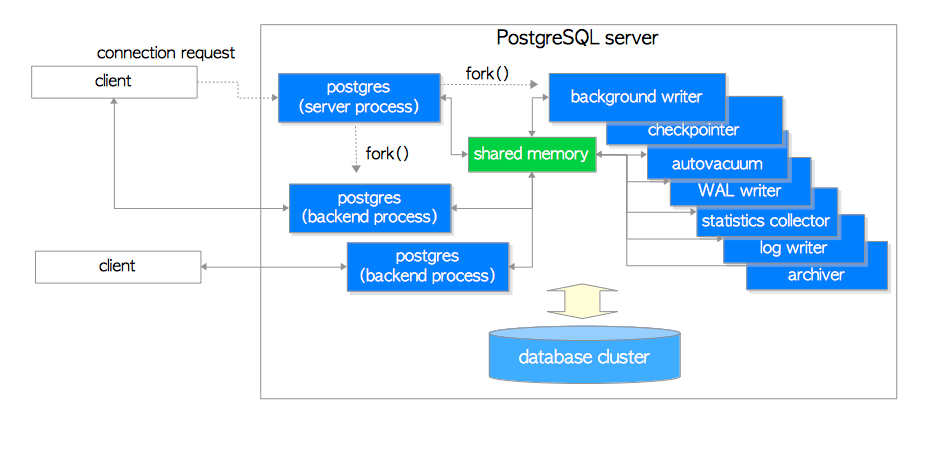

# 第二章 进程和内存架构

[TOC]

​	本章总结了PostgreSQL中进程与内存的体系结构，以便于理解后续章节的内容。 如果你已经熟悉这些内容，可以直接跳过本章。

## 2.1 进程架构

​	PostgreSQL是一个客户端/服务器风格的关系型数据库管理系统，使用多进程架构，在单台主机上运行。

​	我们通常所谓的“PostgreSQL服务器”其实是由一系列共同管理一个数据库集簇、多个协同工作的进程组成的集合，它包含下列进程：

* **postgres服务器进程（Postgres Server Process）**是所有与数据库集簇管理有关进程的父进程。
* 每个**后端进程（Backend Process）**处理由连接的客户端发出的所有查询和语句。

* 各种**后台进程（Background Process）**执行用于数据库管理的各种功能（例如，`VACUUM`和`CHECKPOINT`进程）的过程。

* 各种**复制相关（Replication Associated Process）**的进程会进行流复制，细节在第11章中介绍。
* **后台工作进程（Background Worker Process）** 从9.3版本开始支持，它可以执行用户实现的任何处理。这里不详述，请参阅[官方文档](https://www.postgresql.org/docs/current/static/bgworker.html)。

在以下小节中，将描述前三种进程的详细信息。

**图2.1 PostgreSQL的进程架构示例**



> ​	本图展示了PostgreSQL服务器包含的进程：postgres服务器进程，两个后端进程，七个后台进程，以及两个客户端进程。 也展示了数据库集簇，共享内存，和两个客户端。
>

### 2.1.1 Postgres服务器进程

​	如上所述，postgres服务器进程是PostgreSQL服务器中所有进程的父进程。 在早期版本中，它被称为`postmaster`。

​	通过使用`start`选项执行`pg_ctl`实用程序，启动postgres服务器进程。 然后它在内存中分配共享内存区域，启动各种后台进程，在必要时启动复制相关进程和后台工作进程，并等待来自客户端的连接请求。 每当从客户端接收连接请求时，它都会启动后端进程 （然后，启动的后端进程处理由连接的客户端发出的所有查询。）

​	postgres服务器进程监听一个网络端口，默认端口为5432。虽然可以在同一主机上运行多个PostgreSQL服务器，但应将每个服务器设置为监听不同的端口号，例如5432，5433等

### 2.1.2 后端进程

​	后端进程（也称为postgres）由postgres服务器进程启动，并处理由一个连接的客户端发出的所有查询。它通过单个TCP连接与客户端通信，并在客户端断开连接时终止。

​	由于只允许操作一个数据库，因此必须在连接到PostgreSQL服务器时指定要显式使用的数据库。

​	PostgreSQL允许多个客户端同时连接；配置参数`max_connections`控制最大客户端数（默认为100）。

​	如果许多客户端（如WEB应用）经常重复与PostgreSQL服务器的连接和断开连接，则会增加建立连接和创建后端进程的成本，因为PostgreSQL尚未实现原生的连接池功能。这种情况对数据库服务器的性能有负面影响。为了处理这种情况，通常使用池化中间件（[pgbouncer](https://pgbouncer.github.io)或[pgpool-II](http://www.pgpool.net/mediawiki/index.php/Main_Page)）。

### 2.1.3 后台进程

​	表2.1显示了后台进程列表。 与postgres服务器和后端进程相比，简单解释每种功能是不现实的，因为这些功能依赖于各个特定的特性与PostgreSQL的内部机理。 因此在本章中仅做简要介绍。 细节将在以下章节中描述。

**表 2.1 后台进程**

| process                    | description                                                  | reference |
| -------------------------- | ------------------------------------------------------------ | --------- |
| background writer          | 本进程负责将共享缓冲池中的脏页逐渐刷入持久化存储中（例如，HDD，SSD）（在9.1及更早版本中，它还负责存档过程） | 8.6       |
| checkpointer               | 在9.2及后续版本中，该进程负责执行存档过程。                  | 8.6, 9.7  |
| autovacuum launcher        | 周期性地启动自动清理工作进程（更准确地说，它向Postgres服务器请求创建自动清理工作进程） | 6.5       |
| WAL writer                 | 本进程周期性地将WAL缓冲区中的WAL数据刷写入持久存储中。       | 9.9       |
| statistics collector       | 本进程负责收集统计信息，例如`pg_stat_activity`，`pg_stat_database` |           |
| logging collector (logger) | 本进程负责将错误消息写入日志文件                             |           |
| archiver                   | 本进程负责将日志归档。                                       | 9.10      |

>  ​	这里显示了PostgreSQL服务器的实际过程。 在以下示例中，一个postgres服务器进程（pid为9687），两个后端进程（pid为9697和9717）以及表2.1中列出的几个后台进程正在运行。 另见图2.1。
>
> ```
> postgres> pstree -p 9687
> -+= 00001 root /sbin/launchd
>  \-+- 09687 postgres /usr/local/pgsql/bin/postgres -D /usr/local/pgsql/data
>    |--= 09688 postgres postgres: logger process     
>    |--= 09690 postgres postgres: checkpointer process     
>    |--= 09691 postgres postgres: writer process     
>    |--= 09692 postgres postgres: wal writer process     
>    |--= 09693 postgres postgres: autovacuum launcher process     
>    |--= 09694 postgres postgres: archiver process     
>    |--= 09695 postgres postgres: stats collector process     
>    |--= 09697 postgres postgres: postgres sampledb 192.168.1.100(54924) idle  
>    \--= 09717 postgres postgres: postgres sampledb 192.168.1.100(54964) idle in transaction  
> ```


## 2.2 内存架构

PostgreSQL中的内存架构可分为两大类：

+ 本地内存区域 —— 由每个后端进程分配供自己使用。
+ 共享内存区域 —— 由PostgreSQL服务器的所有进程使用。

在以下小节中，简要说明了这些内容。

**图2.2 PostgreSQL的内存架构**


### 2.2.1 本地内存区域

​	每个后端进程都会分配一块本地内存区域，用于处理查询。每个区域分为几个子区域 —— 其大小是固定的或可变的。 表2.2列出了主要的子区域。 详细信息将在后续章节中介绍。

**表 2.2: 本地内存区**

| 子区域                 | 描述                                                         | 引用                                                       |
| ---------------------- | ------------------------------------------------------------ | ---------------------------------------------------------- |
| `work_mem`             | 执行器在操作`ORDER BY`和`DISTINCT`时使用该区域对元组做排序，以及通过归并连接和散列连接操作来连接表。 | [Chapter 3](http://www.interdb.jp/pg/pgsql03.html)         |
| `maintenance_work_mem` | 某些类型的维护操作使用该区域（例如，`VACUUM`，`REINDEX`）。  | [Section 6.1](http://www.interdb.jp/pg/pgsql06.html#_6.1.) |
| `temp_buffers`         | 执行器使用此区域存储临时表。                                 |                                                            |

### 2.2.2 共享内存区

​	PostgreSQL服务器启动时会分配共享内存区域。 该区域也分为几个固定大小的子区域。 表2.3列出了主要的子区域。 详细信息将在后续章节中介绍。

**表 2.3: 共享内存区**

| 子区域               | 描述                                                         | 引用                                                       |
| -------------------- | ------------------------------------------------------------ | ---------------------------------------------------------- |
| `shared buffer pool` | PostgreSQL将表和索引中的页面从持久存储加载到此处，并直接操作它们。 | [Chapter 8](http://www.interdb.jp/pg/pgsql08.html)         |
| `WAL buffer`         | 为确保服务器故障不会丢失任何数据，PostgreSQL支持WAL机制。 WAL数据（也称为XLOG记录）是PostgreSQL中的事务日志; 在写入持久存储之前，WAL缓冲区是WAL数据的缓冲区。 | [Chapter 9](http://www.interdb.jp/pg/pgsql09.html)         |
| `commit log`         | 提交日志（CLOG）保持并发控制（CC）机制的所有事务（例如，in_progress，已提交，已中止）的状态。 | [Section 5.4](http://www.interdb.jp/pg/pgsql05.html#_5.4.) |


除了这些，PostgreSQL还分配了下列几个区域：

* 访问控制机制的子区域。（例如，信号量，轻量级锁，共享和排他锁等）
* 各种后台进程的子区域，例如checkpointer和autovacuum。
* 用于事务处理的子区域，例如**保存点（save-point）**和**两阶段提交（2PC）**。