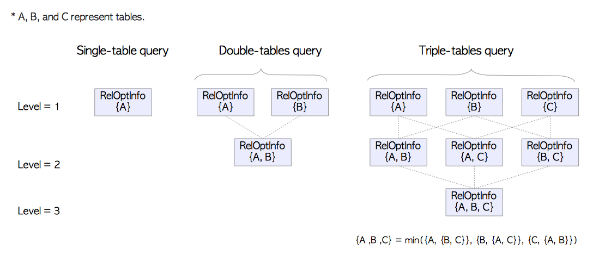

# 第三章 查询处理

[TOC]

​	如同PostgreSQL的官方文档说明的，PostgreSQL支持SQL2011的大部分特性；因此查询处理是PostgreSQL最复杂的子系统，并且PostgreSQL的查询处理相当高效。本章概述了查询处理的过程，特别关注了查询优化的部分。

本章包括下面三个部分：

+ 第一部分：3.1节

		本节概述了PostgreSQL的查询处理。

+ 第二部分：3.2~3.4节

		这一部分描述了在单表上获得最优执行计划的步骤。在3.2和3.3节分别解释了代价估计和计划树创建的过程。第3.4节，简要描述了执行器的操作。

+ 第三部分：3.5~3.6节

  本节描述了在多表查询上获得最优计划的步骤。3.5节介绍了三种连接算法：**嵌套循环连接（Nested Loop Join）**，**归并连接（Merge Join）** ，**散列连接（Hash Join）**。3.6节解释了在多表上创建计划树的过程。

PostgreSQL支持三种技术上很有趣且很实用的功能：即**外部数据包装（Foreign Data Wrapper, FDW）**，**并行查询**，以及11版本即将支持的JIT编译。前两者将在第4章中描述，JIT编译超出范围本书的范围，详见[官方文档](https://www.postgresql.org/docs/11/static/jit-reason.html)。


## 3.1 概览

​	在PostgreSQL中，尽管在9.6版本后，基于多个Background Worker进程，有了并行查询；但是基本还是每个连接对应的一个Backend进程，这个Backend进程包括五个部分，如下：

1. **解析器（Parser）**

   解析器基于SQL语句文本生成语法解析树（ParseTree） 。

2. **分析器（Analyzer）**

   分析器对语法解析树进行语义分析，生成查询树（QueryTree）。

3. **重写器（Rewriter）**

   重写器基于[规则](https://www.postgresql.org/docs/current/static/rules.html)系统中存在的规则，对查询树进程重写

4. **计划器（Planner）**

   计划器基于查询树，生成执行最高效的计划树（PlanTree）；

5. **执行器（Executor）**

   执行器按照计划树中的顺序，访问表和索引，执行相应查询；


**图3.1 查询处理**


在本节中，概述了这些子系统。由于计划器和执行器很复杂，后面的章节会对这些函数的细节进行阐述。

> PostgreSQL的查询处理在[官方文档](http://www.postgresql.org/docs/current/static/overview.html)中有详细的描述

### 3.1.1 解析器（Parser）

解析器基于SQL语句文本，产生了一个后续子系统可以理解的语法解析树。下面展示一个忽略细节的例子。

考虑下面这个查询。

```sql
testdb=# SELECT id, data FROM tbl_a WHERE id < 300 ORDER BY data;
```

语法解析树的根节点是一个`parsenodes.h`中定义的 `SelectStmt`类型。图3.2（b）展示了图3.2（a）对应的的语法解析树。

```c
typedef struct SelectStmt
{
        NodeTag         type;

        /*
         * These fields are used only in "leaf" SelectStmts.
         */
        List       *distinctClause;     /* NULL, list of DISTINCT ON exprs, or
                                         * lcons(NIL,NIL) for all (SELECT DISTINCT) */
        IntoClause *intoClause;         /* target for SELECT INTO */
        List       *targetList;         /* the target list (of ResTarget) */
        List       *fromClause;         /* the FROM clause */
        Node       *whereClause;        /* WHERE qualification */
        List       *groupClause;        /* GROUP BY clauses */
        Node       *havingClause;       /* HAVING conditional-expression */
        List       *windowClause;       /* WINDOW window_name AS (...), ... */

        /*
         * In a "leaf" node representing a VALUES list, the above fields are all
         * null, and instead this field is set.  Note that the elements of the
         * sublists are just expressions, without ResTarget decoration. Also note
         * that a list element can be DEFAULT (represented as a SetToDefault
         * node), regardless of the context of the VALUES list. It's up to parse
         * analysis to reject that where not valid.
         */
        List       *valuesLists;        /* untransformed list of expression lists */

        /*
         * These fields are used in both "leaf" SelectStmts and upper-level
         * SelectStmts.
         */
        List       *sortClause;         /* sort clause (a list of SortBy's) */
        Node       *limitOffset;        /* # of result tuples to skip */
        Node       *limitCount;         /* # of result tuples to return */
        List       *lockingClause;      /* FOR UPDATE (list of LockingClause's) */
        WithClause *withClause;         /* WITH clause */

        /*
         * These fields are used only in upper-level SelectStmts.
         */
        SetOperation op;                /* type of set op */
        bool            all;            /* ALL specified? */
        struct SelectStmt *larg;        /* left child */
        struct SelectStmt *rarg;        /* right child */
        /* Eventually add fields for CORRESPONDING spec here */
} SelectStmt;
```

**图. 3.2. 语法解析树的例子**


`SELECT`查询的元素和语法解析树的元素是相符的。比如，(1)是目标列表的一个元素，并且它是表的'id'列，(4)是一个`WHERE`语句，等等。

​	由于parser生成语法解析树的时候，只是检查语法，只有不符合语法的时候才会返回错误。

​	parser不检查任何查询的语义。比如，即使查询中有一个不存在的表名，parser也不会返回错误。语义检查是analyzer做的；

### 3.1.2 分析器（Analyzer）

Analyzer基于parser产出的语法解析树，进行语义分析，生成一颗查询树；

```c
/*
 * Query -
 *	  Parse analysis turns all statements into a Query tree
 *	  for further processing by the rewriter and planner.
 *
 *	  Utility statements (i.e. non-optimizable statements) have the
 *	  utilityStmt field set, and the Query itself is mostly dummy.
 *	  DECLARE CURSOR is a special case: it is represented like a SELECT,
 *	  but the original DeclareCursorStmt is stored in utilityStmt.
 *
 *	  Planning converts a Query tree into a Plan tree headed by a PlannedStmt
 *	  node --- the Query structure is not used by the executor.
 */
typedef struct Query
{
	NodeTag		type;
	CmdType		commandType;		/* select|insert|update|delete|utility */
	QuerySource 	querySource;		/* where did I come from? */
	uint32		queryId;		/* query identifier (can be set by plugins) */

	bool		canSetTag;		/* do I set the command result tag? */
	Node	   	*utilityStmt;		/* non-null if this is DECLARE CURSOR or a non-optimizable statement */
	int		resultRelation; 	/* rtable index of target relation for INSERT/UPDATE/DELETE; 0 for SELECT */
	bool		hasAggs;		/* has aggregates in tlist or havingQual */
	bool		hasWindowFuncs; 	/* has window functions in tlist */
	bool		hasSubLinks;		/* has subquery SubLink */
	bool		hasDistinctOn;		/* distinctClause is from DISTINCT ON */
	bool		hasRecursive;		/* WITH RECURSIVE was specified */
	bool		hasModifyingCTE;	/* has INSERT/UPDATE/DELETE in WITH */
	bool		hasForUpdate;		/* FOR [KEY] UPDATE/SHARE was specified */
	bool		hasRowSecurity; 	/* row security applied? */
	List	   	*cteList;		/* WITH list (of CommonTableExpr's) */
	List	   	*rtable;		/* list of range table entries */
	FromExpr   	*jointree;		/* table join tree (FROM and WHERE clauses) */
	List	   	*targetList;		/* target list (of TargetEntry) */
	List	   	*withCheckOptions;	/* a list of WithCheckOption's */
	OnConflictExpr 	*onConflict; 		/* ON CONFLICT DO [NOTHING | UPDATE] */
	List	   	*returningList;		/* return-values list (of TargetEntry) */
	List	   	*groupClause;		/* a list of SortGroupClause's */
	List	   	*groupingSets;		/* a list of GroupingSet's if present */
	Node	   	*havingQual;		/* qualifications applied to groups */
	List	   	*windowClause;		/* a list of WindowClause's */
	List	   	*distinctClause; 	/* a list of SortGroupClause's */
	List	   	*sortClause;		/* a list of SortGroupClause's */
	Node	   	*limitOffset;		/* # of result tuples to skip (int8 expr) */
	Node	   	*limitCount;		/* # of result tuples to return (int8 expr) */
	List	   	*rowMarks;		/* a list of RowMarkClause's */
	Node	   	*setOperations;		/* set-operation tree if this is top level of a UNION/INTERSECT/EXCEPT query */
	List	   	*constraintDeps; 	/* a list of pg_constraint OIDs that the query
 depends on to be semantically valid */
} Query;
```

​	查询树的根是`parsenode.h`中定义的一个`Query`结构，这个结构包含了相应查询的元数据，比如命令的类型（SELECT/INSERT等），和一些叶子节点；每个叶子由一个列表或者树构成，包含了相应子句的数据。

**图. 3.3 查询树的例子**


简要描述下上述查询树：

+ targetlist就是查询的结果列的列表。在这个例子中，这个列表包含两个列：id和data。如果输入为`*`，那么Analyzer会将其明确替换为所有的列。
+ RangeTable是该查询用到的关系表。在这个例子中，这个RangeTable维护了表'tbl_a'的信息，比如表的oid和表的名字。
+ jointree保存了FROM和WHERE子句的信息
+ sortClauze是SortGroupClause的列表

QueryTree的细节在[官方文档](http://www.postgresql.org/docs/current/static/querytree.html)中有描述。

### 3.1.3 重写器（Rewriter）

​	重写器是[规则系统](https://www.postgresql.org/docs/current/static/rules.html)的实现机制，必要的话，会根据存在`pg_rules`中的规则，转换查询树。规则系统本身就是一个很有趣的系统，但是本章中略去了关于规则系统和重写器的描述，否则的话内容太长了。

> 视图
>
> 视图在PostgreSQL中是基于规则系统实现的。当使用[`CREATE VIEW`](https://www.postgresql.org/docs/current/static/sql-createview.html)创建一个视图，就会在系统表中创建相应的规则。
>
> 假设已经定义了下面的视图，并在`pg_rule`中存了相应规则；
>
> ```sql
> sampledb=# CREATE VIEW employees_list 
> sampledb-#      AS SELECT e.id, e.name, d.name AS department 
> sampledb-#            FROM employees AS e, departments AS d WHERE e.department_id = d.id;
> ```
>
> 当发起了一个包含这个视图的查询，parser创建了一个如图. 3.4(a)的语法解析树。
>
> ```sql
> sampledb=# SELECT * FROM employees_list;
> ```
>
> 在这个阶段，rewriter会基于`pg_rules`存的视图规则，将rangetable节点重写成一个子查询的语法解析树；
>
> **图3.4 重写阶段的一个例子**
>
> 
>
> 由于PostgreSQL基于这种机制实现了视图，因此在9.2版本之前，视图不能更新。但是，从9.3版本后，视图可以更新；尽管如此，更新视图有很多限制，具体细节参考[官方文档](https://www.postgresql.org/docs/current/static/sql-createview.html#SQL-CREATEVIEW-UPDATABLE-VIEWS)。

### 3.1.4 计划器与执行器

**计划器（Planner）**从**重写器（Rewriter）**获取一个查询树，然后生成一个能被**执行器（Executor）**高效执行的（查询）计划树。	

​	在PostgreSQL中，计划器是完全基于代价估计的；它不支持基于规则和基于**提示（hint）**的查询优化。计划器是RDBMS中最复杂的部分，因此，本章的后续章节会对计划树做一个概述。

> pg_hint_plan
>
> PostgreSQL不支持SQL中的提示，并且永远不会支持。如果你想在查询中使用hints，考虑使用`pg_hint_plan`扩展，详细内容参考[官方站点](http://pghintplan.osdn.jp/pg_hint_plan.html)。

​	和其他RDBMS类似，PostgreSQL中的[`EXPLAIN`](https://www.postgresql.org/docs/current/static/sql-explain.html)命令，展示了自己的计划树。如下例所示：

```sql
testdb=# EXPLAIN SELECT * FROM tbl_a WHERE id < 300 ORDER BY data;
                          QUERY PLAN                           
---------------------------------------------------------------
 Sort  (cost=182.34..183.09 rows=300 width=8)
   Sort Key: data
   ->  Seq Scan on tbl_a  (cost=0.00..170.00 rows=300 width=8)
         Filter: (id < 300)
(4 rows)
```

这个`EXPLAIN`结果相应的计划树，如图3.5。

**图3.5 一个简单的计划树以及其与EXPLAIN命令的关系**


​	每个计划树包括多个计划节点（plan node），就是*PlannedStmt*结构中的plantree列表，其在定[`plannodes.h`](https://github.com/postgres/postgres/blob/master/src/include/nodes/plannodes.h中)中，在3.3.3节（3.5.4.2节）阐述相关细节。

​	每个计划节点包含所有执行器需要的执行信息，在单表查询中，执行器就可以从下往上执行这个计划树。

​	比如，在图3.5中的计划树就是一个Sort节点和SeqScan节点的列表；因此，执行器首先会基于SeqScan方式扫描表，然后对得到的结果进行排序。

​	执行器通过第8章阐述的缓存管理器（BufferManager），来访问数据库集簇的表和索引。当处理一个查询时，执行器使用预先分配好的内存空间，比如*temp_buffers*和*work_mem*，必要的话还会创建临时文件。

​	另外，当访问元组的时候，PostgreSQL基于并发控制机制来维护运行中事务的一致性和隔离性。关于并发控制机制参考第5章。

**图3.6 执行器，缓冲管理器，临时文件之间的关系**


## 3.2 单表查询的代价估计

​	PostgreSQL是基于代价的查询优化。代价是一个无法准确定义的值，并且没有一个绝对的性能指示方法，但是可以比较操作之间的相对性能差异。

​	代价是通过*costsize.c*中的函数来估计的。所有的执行器执行的操作都有相应的代价函数。比如顺序扫描和索引扫描分别通过`cost_seqscan()` 和 `cost_index()`做代价估计。

​	在PostgreSQL中，有三种代价：**启动代价（start_up）** ， **运行代价（run）**和**总代价（total）**。**总代价**是**启动代价**和**运行代价**的和；因此，只有启动代价和运行代价是单独估计的。

1. **启动代价（start_up）**：在取到第一个元组之前的代价，比如索引扫描节点的**启动代价**就是读取目标表的索引页，取到第一个元组的代价
2. **运行代价（run）**： 获取全部的元组的代价
3. **总代价（total）**：前两者的和

EXPLAIN命令展示了每个操作的启动代价和总代价，下面有个简单的例子：

```sql
testdb=# EXPLAIN SELECT * FROM tbl;
                       QUERY PLAN                        
---------------------------------------------------------
 Seq Scan on tbl  (cost=0.00..145.00 rows=10000 width=8)
(1 row)
```

​	在第4行中，这个命令展示了顺序扫描的信息。在代价部分，有两个值：0.00和145.00。这个例子中，启动代价和总代价分别是0.00和145.00。

​	本节中，我们将探究顺序扫描，索引扫描和排序操作如何做代价估计的细节。

​	在接下来的叙述中，我们使用如下说明的特定的表和索引：

```sql
testdb=# CREATE TABLE tbl (id int PRIMARY KEY, data int);
testdb=# CREATE INDEX tbl_data_idx ON tbl (data);
testdb=# INSERT INTO tbl SELECT generate_series(1,10000),generate_series(1,10000);
testdb=# ANALYZE;
testdb=# \d tbl
      Table "public.tbl"
 Column |  Type   | Modifiers 
--------+---------+-----------
 id     | integer | not null
 data   | integer | 
Indexes:
    "tbl_pkey" PRIMARY KEY, btree (id)
    "tbl_data_idx" btree (data)
```

### 3.2.1 顺序扫描

通过`cost_seqscan()`函数，估计顺序扫描的代价。在这个部分，我们探究下面的查询如何估计顺序扫描的代价。

```sql
testdb=# SELECT * FROM tbl WHERE id < 8000;
```

在顺序扫描中，启动代价代价等于0，而运行代价基于如下公式定义：
$$
\begin{align}
  \verb|‘run cost’| 
  &= \verb|‘cpu run cost’| + \verb|‘disk run cost’| \\
  &= (\verb|cpu_tuple_cost| + \verb|cpu_operator_cost|) \times N_{tuple} + \verb|seq_page_cost| \times N_{page},
\end{align}
$$
其中`seq_page_cost`，`cpu_tuple_cost`和`cpu_operator_cost`在*postgresql.conf*配置，默认值分别是1.0，0.01和0.0025。$N_{tuple}$ 和$N_{page}$ 分别是表的所有元组和所有页，并且这些数字能够通过下面的查询获得:

```sql
testdb=# SELECT relpages, reltuples FROM pg_class WHERE relname = 'tbl';
 relpages | reltuples 
----------+-----------
       45 |     10000
(1 row)
```

$$
\begin{equation}
N_{tuple}=10000
 \tag{1}
\end{equation}
$$

$$
\begin{equation}
N_{page}=45
 \tag{2}
\end{equation}
$$

因此：
$$
\begin{align}
 \verb|‘run cost’| 
 	    &= (0.01 + 0.0025) \times 10000 + 1.0 \times 45 = 170.0.
\end{align}
$$


最终：$total = 0.0 + 170.0 = 170.0$

下面是上面查询的EXPLAIN命令的结果，我们验证一下：

```sql
testdb=# EXPLAIN SELECT * FROM tbl WHERE id < 8000;
                       QUERY PLAN                       
--------------------------------------------------------
 Seq Scan on tbl  (cost=0.00..170.00 rows=8000 width=8)
   Filter: (id < 8000)
(2 rows)
```

在第4行中，我们发现启动代价和总代价分别是0.00和170.0，并且它估计通过全表扫描会得到8000行（元组）。

在第5行，展示了一个顺序扫描的过滤器'Filter:(id < 8000)'。更精确的是，它称为是一个*表级过滤器谓词*。注意这种类型的过滤器用在读取所有元组的时候，它不会减少表物理页的扫描范围。

> ​	为了理解运行代价估计，PostgreSQL假设所有的物理页都是从存储介质中拿到的；意味着，PostgreSQL不考虑扫描的page是不是会从shard buffer中取得。

### 3.2.2 索引扫描

​	尽管PostgreSQL支持很多索引方法，比如Btree，GiST，BIN和BRIN，但是索引扫描的代价估计都是使用公共的代价函数：`cost_index()`。

​	在这一节中，我们基于下面的查询，探究索引扫描的代价估计：

```sql
testdb=# SELECT id, data FROM tbl WHERE data < 240;
```

​	在估计这个代价之前，下面显示了$N_{index,page}$和$N_{index,tuple}$的数量：

```sql
testdb=# SELECT relpages, reltuples FROM pg_class WHERE relname = 'tbl_data_idx';
 relpages | reltuples 
----------+-----------
       30 |     10000
(1 row)
```

$$
\begin{equation}
N_{index,tuple} = 10000
 \tag{3}
\end{equation}
$$

$$
\begin{equation}
N_{index,page} = 30
 \tag{4}
\end{equation}
$$

#### 3.2.2.1 启动代价

索引扫描的启动代价就是读取索引页，访问目标表的第一个元组的代价，基于下面的公式定义：
$$
\begin{align}
\verb|‘start-up cost’| = \{\mathrm{ceil}(\log_2 (N_{index,tuple}))
		 + (H_{index} + 1) \times 50\} \times \verb|cpu_operator_cost|,
\end{align}
$$
其中$H_{index}$是索引树的高度。

在这个情况下，按照公式(3)，$N_{index,tuple}$是10000；$H_{index}$是1；*cpu_operator_cost*是0.0025（默认值）。因此
$$
\begin{align}
 \verb|‘start-up cost’| = \{\mathrm{ceil}(\log_2(10000)) + (1 + 1) \times 50\} \times 0.0025 = 0.285. \tag{5}
\end{align}
$$
#### 3.2.2.2 运行代价

索引扫描的运行代价是表和索引的CPU代价与IO代价之和。
$$
\begin{align}
 \verb|‘run cost’| &= (\verb|‘index cpu cost’| + \verb|‘table cpu cost’|) 
 	    	  + (\verb|‘index IO cost’| + \verb|‘table IO cost’|).
\end{align}
$$

> 如果使用的是第7章中描述的仅索引扫描，则不会估计表的CPU代价与表的IO代价。

前三个代价（如，index cpu cost，table cpu cost和index IO cost）如下所示：

$$
\begin{align}
 \verb|index_cpu_cost| &= \verb|Selectivity| \times N_{index,tuple} \times (\verb|cpu_index_tuple_cost| + \verb|qual_op_cost|) \\
 \verb|table_cpu_cost| &= \verb|Selectivity| \times N_{tuple}  \times \verb|cpu_tuple_cost| \\
 \verb|index_io_cost|   &= \mathrm{ceil}(\verb| Selectivity | \times N_{index,page}) \times \verb|random_page_cost|\\
 \verb|table_io_cost| &=  \verb|max_io_cost| +  \verb|indexCorerelation|^2 \times ( \verb|min_io_cost|-  \verb|max_io_cost|)
\end{align}
$$
以上的*cpu_index_tuple_cost*和*random_page_cost*在postgresql.conf配置（默认分别是0.005和4.0）；粗略来讲，*qual_op_cost*就是index比较计算的代价，这里就不多展开了，默认值是0.0025。*Selectivity*是通过where子句得出的索引查找范围的比；是一个**[0.1]**的浮点数，如下所述；比如，$Selectivity \times N_{tuple}$ 就是需要读的表元组数量，$Selectivity \times N_{index,tuple}$就是需要读的索引元组数量等等。

> ##### 选择率（Selectivity）
>
> ​	查询谓词的选择率是通过柱状图和**众数（Most Common Value, MCV）**估计的，这些信息都存储于 *pg_stats* 中。这里基于特例，阐述一下选择率计算，细节可以参考[官方文档](https://www.postgresql.org/docs/10/static/row-estimation-examples.html)。
>
> 表中每列的MCV存储在*pg_stats*视图的 *most_common_vals* 和 *most_common_freqs* 对中
>
> + *most_common_vals*：该列上的MCV列表
> + *most_common_freqs*：MCV列表相应的频率列表
>
> 下面是一个简单的例子。表*countries*有两个列：一个存储国家名的*country*列和一个存储该国所属洲的*continent*列；
>
> ```sql
> testdb=# \d countries
>    Table "public.countries"
>   Column   | Type | Modifiers 
> -----------+------+-----------
>  country   | text | 
>  continent | text | 
> Indexes:
>     "continent_idx" btree (continent)
> 
> testdb=# SELECT continent, count(*) AS "number of countries", 
> testdb-#     (count(*)/(SELECT count(*) FROM countries)::real) AS "number of countries / all countries"
> testdb-#       FROM countries GROUP BY continent ORDER BY "number of countries" DESC;
>    continent   | number of countries | number of countries / all countries 
> ---------------+---------------------+-------------------------------------
>  Africa        |                  53 |                   0.274611398963731
>  Europe        |                  47 |                   0.243523316062176
>  Asia          |                  44 |                   0.227979274611399
>  North America |                  23 |                   0.119170984455959
>  Oceania       |                  14 |                  0.0725388601036269
>  South America |                  12 |                  0.0621761658031088
> (6 rows)
> ```
>
> 考虑下面的带有WHERE条件`continent = 'Asia'`的查询：
>
> ```sql
> testdb=# SELECT * FROM countries WHERE continent = 'Asia';
> ```
>
> 这时候，planner使用continent列的MCV来估计索引扫描的代价，列的*most_common_vals* and *most_common_freqs* 如下所示：
>
> ```sql
> Expanded display is on.
> testdb=# SELECT most_common_vals, most_common_freqs FROM pg_stats 
> testdb-#                  WHERE tablename = 'countries' AND attname='continent';
> -[ RECORD 1 ]-----+-------------------------------------------------------------
> most_common_vals  | {Africa,Europe,Asia,"North America",Oceania,"South America"}
> most_common_freqs | {0.274611,0.243523,0.227979,0.119171,0.0725389,0.0621762}
> ```
>
> 和*most_common_vals* ： *Asia*值是对应的*most_common_freqs*是0.227979。因此，0.227979就是选择率的估计。
>
> 如果MCV不可用，就会使用目标列的*histogram_bounds*来估计代价。
>
> + **histogram_bounds**是一系列值，这些值将列划分为数量大致相同的若干组。
>
> 如下一个特定的例子。这是表'tbl'中data列上的*histogram_bounds*值；
>
> ```sql
> testdb=# SELECT histogram_bounds FROM pg_stats WHERE tablename = 'tbl' AND attname = 'data';
>         			     	      histogram_bounds
> ---------------------------------------------------------------------------------------------------
>  {1,100,200,300,400,500,600,700,800,900,1000,1100,1200,1300,1400,1500,1600,1700,1800,1900,2000,2100,
> 2200,2300,2400,2500,2600,2700,2800,2900,3000,3100,3200,3300,3400,3500,3600,3700,3800,3900,4000,4100,
> 4200,4300,4400,4500,4600,4700,4800,4900,5000,5100,5200,5300,5400,5500,5600,5700,5800,5900,6000,6100,
> 6200,6300,6400,6500,6600,6700,6800,6900,7000,7100,7200,7300,7400,7500,7600,7700,7800,7900,8000,8100,
> 8200,8300,8400,8500,8600,8700,8800,8900,9000,9100,9200,9300,9400,9500,9600,9700,9800,9900,10000}
> (1 row)
> ```
>
> 默认地，histogram_bounds划分为100个桶。图 3.7阐明了本例中的桶和相应的histogram_bounds。桶从0开始，每个桶保存了相同数量（大致相同）的元组。histogram_bounds的值就是相应桶的边界。比如，histogram_bounds的第0个值是1，意思是这是*bucket_0*中的最小值。第1个值是100，意思是bucket_1中的最小值是100，等等。
>
> 图3.7 桶和**histogram_bounds**
>
> 
>
> 接下来，本节例子中的选择率计算如下所示。查询有WHERE子句`data < 240`，并且值240在第二个bucket中。在这个例子中，可以利用*线性插值法*，得出选择性；因此，查询中data列的选择性使用下面的公式计算：
> $$
> Selectivity = \frac{2+(240-hb[2])/(hb[3]-hb[2])}{100}=\frac{2+(240-200)/(300-200)}{100}=\frac{2+40/100}{100}=0.024    \ (6)
> $$
>

因此，根据(1),(3),(4)和(6)，有
$$
'index\ cpu\ cost' = 0.024\times 10000 \times (0.005+0.0025)=1.8 \ (7) \\
'table\ cpu\ cost' = 0.024 \times 10000 \times 0.01 = 2.4 \ (8) \\
'index\ IO\ cost' = ceil(0.024 \times 30) \times 4.0 = 4.0 \ (9)
$$
基于以下公式，得$'table\ IO\ cost '$定义：
$$
'table\ IO\ cost' = max\_IO\_cost + indexCorerelation^2 \times (min\_IO\_cost-max\_IO\_cost)
$$
$max\_IO\_cost$是最差的IO代价，即，随机扫描所有数据页的代价；这个代价定义如下公式：
$$
max\_IO\_cost = N_{page}\times random\_page\_cost
$$
在本例中，由（2），$N_{page}=45$，得
$$
max\_IO\_cost = 45\times 4.0 = 180.0 \ (10)
$$
$min\_IO\_cost$是最优的IO代价，即，顺序扫描选定的数据页；这个代价定义如下公式：
$$
min\_IO\_cost = 1\times random\_page\_cost + (ceil(Selectivity\times N_{page})-1)\times seq\_page\_cost
$$
这个例子中，
$$
min\_IO\_cost \ = 1\times 4.0 + (ceil(0.024\times 45)-1)\times 1.0 \ (11)
$$
下文详细介绍$indexCorrelation$，在这个例子中，
$$
indexCorrelation = 1.0 \ (12)
$$
由（10），（11）和（12），得
$$
’table\ IO\ cost‘ = 180.0+1.0^2\times (5.0-180.0)=5.0 \ (13)
$$
综上，由（7），（8），（9）和（13）得
$$
’run\ cost‘ = (1.8+2.4)+(4.0+5.0)=13.2 \ (14)
$$

> ##### 索引相关性（index correlation）
>
> 索引相关性是列值在物理上的顺序和逻辑上的顺序的统计相关性（引自官方文档）。范围从-1到+1。为了帮助理解索引扫描和索引相关性的关系，请看如下示例。
>
> 表*tbl_corr*有5个列：两个列式文本类型，三个列是整数类型。这三个整数列保存从1到12的数字。物理上，表*tbl_corr*包含三个页，每个页有4个元组。每个数字列有一个名如*index_col_asc*的索引。
>
> ```sql
> testdb=# \d tbl_corr
>     Table "public.tbl_corr"
>   Column  |  Type   | Modifiers 
> ----------+---------+-----------
>  col      | text    | 
>  col_asc  | integer | 
>  col_desc | integer | 
>  col_rand | integer | 
>  data     | text    |
> Indexes:
>     "tbl_corr_asc_idx" btree (col_asc)
>     "tbl_corr_desc_idx" btree (col_desc)
>     "tbl_corr_rand_idx" btree (col_rand)
> ```
>
> ```sql
> testdb=# SELECT col,col_asc,col_desc,col_rand 
> testdb-#                         FROM tbl_corr;
>    col    | col_asc | col_desc | col_rand 
> ----------+---------+----------+----------
>  Tuple_1  |       1 |       12 |        3
>  Tuple_2  |       2 |       11 |        8
>  Tuple_3  |       3 |       10 |        5
>  Tuple_4  |       4 |        9 |        9
>  Tuple_5  |       5 |        8 |        7
>  Tuple_6  |       6 |        7 |        2
>  Tuple_7  |       7 |        6 |       10
>  Tuple_8  |       8 |        5 |       11
>  Tuple_9  |       9 |        4 |        4
>  Tuple_10 |      10 |        3 |        1
>  Tuple_11 |      11 |        2 |       12
>  Tuple_12 |      12 |        1 |        6
> (12 rows)
> ```
>
> 这些列的索引相关性如下：
>
> ```sql
> testdb=# SELECT tablename,attname, correlation FROM pg_stats WHERE tablename = 'tbl_corr';
>  tablename | attname  | correlation 
> -----------+----------+-------------
>  tbl_corr  | col_asc  |           1
>  tbl_corr  | col_desc |          -1
>  tbl_corr  | col_rand |    0.125874
> (3 rows)
> ```
>
> 当执行下面的查询时，由于所有的目标元组只在第一个页中，PostgreSQL只会读取第一个页中，如图. 3.8(a)。
>
> ```sql
> testdb=# SELECT * FROM tbl_corr WHERE col_asc BETWEEN 2 AND 4;
> ```
>
> 另一方面，当执行下面的查询，PostgreSQL需要读所有的页，如图3.8(b)。
>
> ```sql
> testdb=# SELECT * FROM tbl_corr WHERE col_asc BETWEEN 2 AND 4;
> ```
>
> 如此可知，索引相关性是一种统计上的相关性，反映了在索引扫描代价估计中，由于索引顺序和物理元组顺序扭曲程度，这会影响的随机访问的性能。
>
> **图. 3.8 索引相关性**
>
> 

#### 3.2.2.3 整体代价

由（3）和（14），得
$$
\begin{align}
 \verb|‘total cost’| = 0.285 + 13.2 = 13.485. \tag{15}
\end{align}
$$
上述SELECT查询的EXPLAIN结果如下所示，我们确认一下：

```sql
testdb=# EXPLAIN SELECT id, data FROM tbl WHERE data < 240;
                                QUERY PLAN                                 
---------------------------------------------------------------------------
 Index Scan using tbl_data_idx on tbl  (cost=0.29..13.49 rows=240 width=8)
   Index Cond: (data < 240)
(2 rows)
```

在第4行，我们发现启动代价总代价分别是0.29和13.49，并且估计有240行（元组）被扫描。

在第5行，指出了一个索引条件`Index Cond:(data < 240)`。准确的说，这个条件是*访问谓词*，表示索引扫描的开始和结束条件。

> 根据[这篇文章](https://use-the-index-luke.com/sql/explain-plan/postgresql/filter-predicates)，PostgreSQL的EXPLAIN命令不区分**访问谓词（access predicate）**和**索引过滤谓词（index filter predicate）**。因此，如果分析EXPLAIN的输出，除了注意索引条件，也要注意估计的行数。

> ##### seq_page_cost和random_page_cost
>
> [seq_page_cost](https://www.postgresql.org/docs/10/static/runtime-config-query.html#GUC-SEQ-PAGE-COST)和[random_page_cost](https://www.postgresql.org/docs/10/static/runtime-config-query.html#GUC-RANDOM-PAGE-COST)的默认值分别是1.0和4.0。这意味着PostgreSQL假设随机扫描是顺序扫描的4倍；很明显PostgreSQL的默认值是基于HDD设置的。
>
> 另一方面，近年来SSD得到了广泛地使用，`random_page_cost`的默认值相对有点大。如果在SSD上使用`random_page_cost`的默认值，计划器会选择低效的的计划。因此，当使用SSD，最好将`random_page_cost`设置为1.0。
>
> [这篇文章](https://amplitude.engineering/how-a-single-postgresql-config-change-improved-slow-query-performance-by-50x-85593b8991b0)阐述了`random_page_cost`使用默认设置时的问题。

### 3.2.3 排序

排序路径是在排序操作中使用的，比如ORDER BY，归并连接的预处理操作等其他函数。排序的代价估计使用`cost_sort()`函数。

在排序操作中，如果能在`work_mem`中放下所有元组，那么就是用快速排序算法。否则，创建一个临时文件，使用外部归并排序。

排序路径的启动代价就是对目标表的排序代价，因此代价就是$O(N_{sort}\times log_2(N_{sort})$，这里$N_{sort}$就是需要排序的元组数。排序路径的运行代价就是读取已经排好序的元组的代价，因此代价就是$O(N_{sort})$。

在本小节中，我们探究如下查询的排序代价估计。假设这个查询只使用work_mem，不使用临时文件。

```sql
testdb=# SELECT id, data FROM tbl WHERE data < 240 ORDER BY id;
```

这个例子中，启动代价基于如下公式定义：
$$
‘start-up\  cost’ = C+comparison\_cost\times N_{sort} \times log_2(N_{sort})，
$$
这里$C$就是上一次扫描的总代价，即，索引扫描的代价；由（15）得，等于13.485；$N_{sort}=240$；*comparison_cost*定义为$2\times cpu\_operator\_cost$。因此，
$$
‘start-up\ cost’ = 13.485+(2\times 0.0025)\times240.0\times log_2(240.0)=22.973
$$
运行代价是内存中读取排好序的元组的代价，即：
$$
‘run\ cost’=cpu\_operator\_cost\times N_{sort} = 0.0025\times 240 = 0.6
$$
综上：
$$
'total\ cost'=22.973+0.6=23.573
$$
以上SELECT查询的EXPLAIN命令结果如下，确认一下：

```sql
testdb=# EXPLAIN SELECT id, data FROM tbl WHERE data < 240 ORDER BY id;
                                   QUERY PLAN                                    
---------------------------------------------------------------------------------
 Sort  (cost=22.97..23.57 rows=240 width=8)
   Sort Key: id
   ->  Index Scan using tbl_data_idx on tbl  (cost=0.29..13.49 rows=240 width=8)
         Index Cond: (data < 240)
(4 rows)
```

在第4行，我们发现启动代价和运行代价分别是22.97和23.57。


## 3.3 创建单表查询的计划树

​	由于计划器特别复杂，本节描述最简单的情况，即，单表上的查询计划树的创建。更复杂的查询，换句话说就是多表上的查询计划树的创建在3.6节中阐述。

PostgreSQL中的计划器有三个步骤，如下所示：

1. 进行预处理
2. 在所有可能的访问路径中，找出最小代价的路径
3. 基于最小代价的路径，创建查询计划树

一个访问路径是处理代价估计的一部分；比如，顺序扫描，索引扫描，排序以及多种连接操作都有其相应的路径。访问路径只在计划器创建查询计划树的时候使用。最基本的访问路径数据结构就是relation.h中定义的*Path*。它就相当于是顺序扫描。所有访问路径都是基于这个结构实现。后文会详细介绍其中的细节。

```sql
typedef struct PathKey
{
        NodeTag         type;

        EquivalenceClass *pk_eclass;    /* the value that is ordered */
        Oid             pk_opfamily;    /* btree opfamily defining the ordering */
        int             pk_strategy;    /* sort direction (ASC or DESC) */
        bool            pk_nulls_first; /* do NULLs come before normal values? */
} PathKey;

typedef struct Path
{
	NodeTag		type;
	NodeTag		pathtype;	/* tag identifying scan/join method */
	RelOptInfo	*parent;	/* the relation this path can build */
	PathTarget 	*pathtarget;	/* list of Vars/Exprs, cost, width */
	ParamPathInfo   *param_info;	/* parameterization info, or NULL if none */
	bool		parallel_aware; /* engage parallel-aware logic? */
	bool		parallel_safe;	/* OK to use as part of parallel plan? */
	int		parallel_workers;/* desired # of workers; 0 = not parallel */
	/* estimated size/costs for path (see costsize.c for more info) */
	double		rows;		/* estimated number of result tuples */
	Cost		startup_cost;	/* cost expended before fetching any tuples */
	Cost		total_cost;	/* total cost (assuming all tuples fetched) */
	List	   	*pathkeys;	/* sort ordering of path's output */
	/* pathkeys is a List of PathKey nodes; see above */
} Path;
```

planner为了处理以上的步骤，内部创建一个PlannerInfo结构，维护查询树，查询中的关系表的相关信息，以及访问路径等等。

```c
typedef struct PlannerInfo
{
	NodeTag		type;
	Query	   	*parse;			/* the Query being planned */
	PlannerGlobal 	*glob;			/* global info for current planner run */
	Index		query_level;		/* 1 at the outermost Query */
	struct PlannerInfo *parent_root;	/* NULL at outermost Query */

	/*
	 * plan_params contains the expressions that this query level needs to
	 * make available to a lower query level that is currently being planned.
	 * outer_params contains the paramIds of PARAM_EXEC Params that outer
	 * query levels will make available to this query level.
	 */
	List		*plan_params;	/* list of PlannerParamItems, see below */
	Bitmapset  	*outer_params;

	/*
	 * simple_rel_array holds pointers to "base rels" and "other rels" (see
	 * comments for RelOptInfo for more info).  It is indexed by rangetable
	 * index (so entry 0 is always wasted).  Entries can be NULL when an RTE
	 * does not correspond to a base relation, such as a join RTE or an
	 * unreferenced view RTE; or if the RelOptInfo hasn't been made yet.
	 */
	struct RelOptInfo **simple_rel_array;	/* All 1-rel RelOptInfos */
	int		simple_rel_array_size;	/* allocated size of array */

	/*
	 * simple_rte_array is the same length as simple_rel_array and holds
	 * pointers to the associated rangetable entries.  This lets us avoid
	 * rt_fetch(), which can be a bit slow once large inheritance sets have
	 * been expanded.
	 */
	RangeTblEntry **simple_rte_array;	/* rangetable as an array */

	/*
	 * all_baserels is a Relids set of all base relids (but not "other"
	 * relids) in the query; that is, the Relids identifier of the final join
	 * we need to form.  This is computed in make_one_rel, just before we
	 * start making Paths.
	 */
	Relids		all_baserels;

	/*
	 * nullable_baserels is a Relids set of base relids that are nullable by
	 * some outer join in the jointree; these are rels that are potentially
	 * nullable below the WHERE clause, SELECT targetlist, etc.  This is
	 * computed in deconstruct_jointree.
	 */
	Relids		nullable_baserels;

	/*
	 * join_rel_list is a list of all join-relation RelOptInfos we have
	 * considered in this planning run.  For small problems we just scan the
	 * list to do lookups, but when there are many join relations we build a
	 * hash table for faster lookups.  The hash table is present and valid
	 * when join_rel_hash is not NULL.  Note that we still maintain the list
	 * even when using the hash table for lookups; this simplifies life for
	 * GEQO.
	 */
	List		*join_rel_list;	/* list of join-relation RelOptInfos */
	struct HTAB 	*join_rel_hash; /* optional hashtable for join relations */

	/*
	 * When doing a dynamic-programming-style join search, join_rel_level[k]
	 * is a list of all join-relation RelOptInfos of level k, and
	 * join_cur_level is the current level.  New join-relation RelOptInfos are
	 * automatically added to the join_rel_level[join_cur_level] list.
	 * join_rel_level is NULL if not in use.
	 */
	List	**join_rel_level;	/* lists of join-relation RelOptInfos */
	int	join_cur_level; 	/* index of list being extended */
	List	*init_plans;		/* init SubPlans for query */
	List	*cte_plan_ids;		/* per-CTE-item list of subplan IDs */
	List	*multiexpr_params;	/* List of Lists of Params for MULTIEXPR subquery outputs */
	List	*eq_classes;		/* list of active EquivalenceClasses */
	List	*canon_pathkeys; 	/* list of "canonical" PathKeys */
	List	*left_join_clauses;	/* list of RestrictInfos for
					 * mergejoinable outer join clauses w/nonnullable var on left */
	List	*right_join_clauses;	/* list of RestrictInfos for
					 * mergejoinable outer join clauses w/nonnullable var on right */
	List	*full_join_clauses;	/* list of RestrictInfos for mergejoinable full join clauses */
	List	*join_info_list; 	/* list of SpecialJoinInfos */
	List	*append_rel_list;	/* list of AppendRelInfos */
	List	*rowMarks;		/* list of PlanRowMarks */
	List	*placeholder_list;	/* list of PlaceHolderInfos */
	List	*fkey_list;		/* list of ForeignKeyOptInfos */
	List	*query_pathkeys; 	/* desired pathkeys for query_planner() */
	List	*group_pathkeys; 	/* groupClause pathkeys, if any */
	List	*window_pathkeys;	/* pathkeys of bottom window, if any */
	List	*distinct_pathkeys;	/* distinctClause pathkeys, if any */
	List	*sort_pathkeys;		/* sortClause pathkeys, if any */
	List	*initial_rels;		/* RelOptInfos we are now trying to join */

	/* Use fetch_upper_rel() to get any particular upper rel */
	List	*upper_rels[UPPERREL_FINAL + 1]; /* upper-rel RelOptInfos */

	/* Result tlists chosen by grouping_planner for upper-stage processing */
	struct PathTarget *upper_targets[UPPERREL_FINAL + 1];

	/*
	 * grouping_planner passes back its final processed targetlist here, for
	 * use in relabeling the topmost tlist of the finished Plan.
	 */
	List    *processed_tlist;

	/* Fields filled during create_plan() for use in setrefs.c */
	AttrNumber *grouping_map;	/* for GroupingFunc fixup */
	List	   *minmax_aggs;	/* List of MinMaxAggInfos */
	MemoryContext planner_cxt;	/* context holding PlannerInfo */
	double	   total_table_pages;	/* # of pages in all tables of query */
	double	   tuple_fraction; 	/* tuple_fraction passed to query_planner */
	double	   limit_tuples;	/* limit_tuples passed to query_planner */
	bool	   hasInheritedTarget;	/* true if parse->resultRelation is an inheritance child rel */
	bool	   hasJoinRTEs;		/* true if any RTEs are RTE_JOIN kind */
	bool	   hasLateralRTEs; 	/* true if any RTEs are marked LATERAL */
	bool	   hasDeletedRTEs; 	/* true if any RTE was deleted from jointree */
	bool	   hasHavingQual;	/* true if havingQual was non-null */
	bool	   hasPseudoConstantQuals; /* true if any RestrictInfo has pseudoconstant = true */
	bool	   hasRecursion;	/* true if planning a recursive WITH item */

	/* These fields are used only when hasRecursion is true: */
	int	   wt_param_id;	        /* PARAM_EXEC ID for the work table */
	struct Path *non_recursive_path;/* a path for non-recursive term */

	/* These fields are workspace for createplan.c */
	Relids	   curOuterRels;	/* outer rels above current node */
	List	   *curOuterParams; 	/* not-yet-assigned NestLoopParams */

	/* optional private data for join_search_hook, e.g., GEQO */
	void	   *join_search_private;
} PlannerInfo;
```

本节中，使用特定的例子描述如何从查询树中，创建计划树。

### 3.3.1 预处理

在创建一个计划树之前，计划器对`PlannerInfo`中的查询树进行一些预处理。

尽管预处理有很多步，本小节中，我们只讨论和单表查询处理相关的主要步骤。其他的预处理操作在3.6节中描述。

1. 目标列表（target list）和limit子句等的简单化；

   比如，通过`clauses.c`中的`eval_const_expressions()`，将`2+2`重写为`4`。

2. 布尔操作的标准化

   比如，`NOT(NOT a)`重写为`a`

3. 离散逻辑`AND/OR`的扁平化

   SQL标准中的AND/OR是二元操作符；但是，在PostgreSQL内部，它们是多元操作符，并且在计划器中，总是假设所有的嵌套AND/OR应该扁平化。举个特殊的例子。考虑一个布尔表达式`(id = 1) OR (id = 2) OR (id = 3)`，如图3.9(a) 展示了使用二元表达式的查询树，并通过使用三元表达式将这个查询树扁平化，如图3.9(b)。

   **图3.9. 扁平布尔表达式的例子**

   

### 3.3.2 得到最小代价估计的访问路径

计划器对所有可能的访问路径，进行代价估计，然后选择代价最小的那个。具体来说，计划器执行下面几个步骤：

```c
typedef enum RelOptKind
{
	RELOPT_BASEREL,
	RELOPT_JOINREL,
	RELOPT_OTHER_MEMBER_REL,
	RELOPT_UPPER_REL,
	RELOPT_DEADREL
} RelOptKind;

typedef struct RelOptInfo
{
	NodeTag		type;
	RelOptKind	reloptkind;

	/* all relations included in this RelOptInfo */
	Relids		relids;			/* set of base relids (rangetable indexes) */

	/* size estimates generated by planner */
	double		rows;			/* estimated number of result tuples */

	/* per-relation planner control flags */
	bool		consider_startup;	/* keep cheap-startup-cost paths? */
	bool		consider_param_startup; /* ditto, for parameterized paths? */
	bool		consider_parallel;	/* consider parallel paths? */

	/* default result targetlist for Paths scanning this relation */
	struct PathTarget *reltarget;		/* list of Vars/Exprs, cost, width */

	/* materialization information */
	List	   *pathlist;			/* Path structures */
	List	   *ppilist;			/* ParamPathInfos used in pathlist */
	List	   *partial_pathlist;		/* partial Paths */
	struct Path *cheapest_startup_path;
	struct Path *cheapest_total_path;
	struct Path *cheapest_unique_path;
	List	   *cheapest_parameterized_paths;

	/* parameterization information needed for both base rels and join rels */
	/* (see also lateral_vars and lateral_referencers) */
	Relids		direct_lateral_relids;	/* rels directly laterally referenced */
	Relids		lateral_relids; 	/* minimum parameterization of rel */

	/* information about a base rel (not set for join rels!) */
	Index		relid;
	Oid		reltablespace;		/* containing tablespace */
	RTEKind		rtekind;		/* RELATION, SUBQUERY, or FUNCTION */
	AttrNumber	min_attr;		/* smallest attrno of rel (often <0) */
	AttrNumber	max_attr;		/* largest attrno of rel */
	Relids	   	*attr_needed;		/* array indexed [min_attr .. max_attr] */
	int32	   	*attr_widths;	   	/* array indexed [min_attr .. max_attr] */
	List	   	*lateral_vars;	   	/* LATERAL Vars and PHVs referenced by rel */
	Relids		lateral_referencers;	/* rels that reference me laterally */
	List	   	*indexlist;		/* list of IndexOptInfo */
	BlockNumber 	pages;			/* size estimates derived from pg_class */
	double		tuples;
	double		allvisfrac;
	PlannerInfo 	*subroot;		/* if subquery */
	List	   	*subplan_params; 	/* if subquery */
	int		rel_parallel_workers;	/* wanted number of parallel workers */

	/* Information about foreign tables and foreign joins */
	Oid		serverid;		/* identifies server for the table or join */
	Oid		userid;			/* identifies user to check access as */
	bool		useridiscurrent;	/* join is only valid for current user */
	/* use "struct FdwRoutine" to avoid including fdwapi.h here */
	struct FdwRoutine *fdwroutine;
	void	   	*fdw_private;

	/* used by various scans and joins: */
	List	   	*baserestrictinfo;	/* RestrictInfo structures (if base rel) */
	QualCost	baserestrictcost;	/* cost of evaluating the above */
	List	   	*joininfo;		/* RestrictInfo structures for join clauses involving this rel */
	bool		has_eclass_joins;	/* T means joininfo is incomplete */
} RelOptInfo;
```

1. 创建一个RelOptInfo结构，存储访问路径和相应的代价。

   通过make_one_rel()创建一个RelOptInfo结构体，放在PlannerInfo结构体的*simple_rel_array*中；如图3.10，在初始过程中，RelOptInfo维护了*baserestrictinfo*，如果存在相应索引，还有*indexlist*信息。baserestrictinfo就是查询的WHERE子句，indexlist存储目标表的相关索引。
   ```c
   typedef enum RelOptKind
   {
     RELOPT_BASEREL,
     RELOPT_JOINREL,
     RELOPT_OTHER_MEMBER_REL,
     RELOPT_UPPER_REL,
     RELOPT_DEADREL
   } RelOptKind;
   ```

typedef struct RelOptInfo
{
  NodeTag   type;
  RelOptKind  reloptkind;

  /* all relations included in this RelOptInfo */
  Relids    relids;     /* set of base relids (rangetable indexes) */

  /* size estimates generated by planner */
  double    rows;     /* estimated number of result tuples */

  /* per-relation planner control flags */
  bool    consider_startup; /* keep cheap-startup-cost paths? */
  bool    consider_param_startup; /* ditto, for parameterized paths? */
  bool    consider_parallel;  /* consider parallel paths? */

  /* default result targetlist for Paths scanning this relation */
  struct PathTarget *reltarget;   /* list of Vars/Exprs, cost, width */

  /* materialization information */
  List     *pathlist;     /* Path structures */
  List     *ppilist;      /* ParamPathInfos used in pathlist */
  List     *partial_pathlist;   /* partial Paths */
  struct Path *cheapest_startup_path;
  struct Path *cheapest_total_path;
  struct Path *cheapest_unique_path;
  List     *cheapest_parameterized_paths;

  /* parameterization information needed for both base rels and join rels */
  /* (see also lateral_vars and lateral_referencers) */
  Relids    direct_lateral_relids;  /* rels directly laterally referenced */
  Relids    lateral_relids;   /* minimum parameterization of rel */

  /* information about a base rel (not set for join rels!) */
  Index   relid;
  Oid   reltablespace;    /* containing tablespace */
  RTEKind   rtekind;    /* RELATION, SUBQUERY, or FUNCTION */
  AttrNumber  min_attr;   /* smallest attrno of rel (often <0) */
  AttrNumber  max_attr;   /* largest attrno of rel */
  Relids      *attr_needed;   /* array indexed [min_attr .. max_attr] */
  int32     *attr_widths;     /* array indexed [min_attr .. max_attr] */
  List      *lateral_vars;      /* LATERAL Vars and PHVs referenced by rel */
  Relids    lateral_referencers;  /* rels that reference me laterally */
  List      *indexlist;   /* list of IndexOptInfo */
  BlockNumber   pages;      /* size estimates derived from pg_class */
  double    tuples;
  double    allvisfrac;
  PlannerInfo   *subroot;   /* if subquery */
  List      *subplan_params;  /* if subquery */
  int   rel_parallel_workers; /* wanted number of parallel workers */

  /* Information about foreign tables and foreign joins */
  Oid   serverid;   /* identifies server for the table or join */
  Oid   userid;     /* identifies user to check access as */
  bool    useridiscurrent;  /* join is only valid for current user */
  /* use "struct FdwRoutine" to avoid including fdwapi.h here */
  struct FdwRoutine *fdwroutine;
  void      *fdw_private;

  /* used by various scans and joins: */
  List      *baserestrictinfo;  /* RestrictInfo structures (if base rel) */
  QualCost  baserestrictcost; /* cost of evaluating the above */
  List      *joininfo;    /* RestrictInfo structures for join clauses involving this rel */
  bool    has_eclass_joins; /* T means joininfo is incomplete */
} RelOptInfo;
```

2. 估计所有可能访问路径的代价，在RelOptInfo中添加访问路径。

   这一处理过程的细节如下：

   1.  创建一个路径，估计这个路径的顺序扫描的代价并写入到路径中，将该路径添加到RelOptInfo->pathlist中。
   2. 如果目标表存在相关的索引，创建一个索引访问路径。估计所有的索引扫描的代价并写入到路径中。然后将索引访问路径添加到pathlist中。
   3. 如何可以做位图扫描，创建一个位图扫描访问路径。估计所有的位图扫描的代价并写入到路径中。然后，将位图扫描路径添加到pathlist中。

3. 从RelOptInfo->pathlist中，找到最小代价的访问路径。

4. 需要的话，估计LIMIT, ORDER BY 和 ARREGISFDD操作的代价。

为了更加清晰的理解计划器的工作，下面有两个特别的例子。

#### 3.3.2.1 例1

首先我们考察一个不带索引的简单单表查询；这个查询包含WHERE 和 ORDER BY子句。

​```sql
testdb=# \d tbl_1
     Table "public.tbl_1"
 Column |  Type   | Modifiers 
--------+---------+-----------
 id     | integer | 
 data   | integer | 

testdb=# SELECT * FROM tbl_1 WHERE id < 300 ORDER BY data;
```

图3.10和3.11中，描述了本例中计划器的处理。

**图3.10 例1中如何得到最小代价路径**


1. 创建一个RelOptInfo结构，将其存在`PlannerInfo->simple_rel_array`中。

2. 在`RelOptInfo->baserestrictinfo`中，添加一个WHERE子句。

   通过initsplan.c中定义的`distribute_restrictinfo_to_rels()`，将`id<300`这个WHERE子句添加到`baserestrictinfo`中。另外，由于目标表没有相关索引，`RelOptInfo->indexlist`是NULL。

3. 为了排序需要，通过planner.c中的standard_qp_callback()函数，在PlannerInfo->sor_pathkeys中添加一个pathkey。

   *Pathkey*代表路径的排序键。本例中，因为*order by*的列是data，将data列添加到sort_pathkeys中，做为pathkey；

4. 创建一个path结构，并通过*cost_seqscan*函数估计顺序扫描的代价并写入到path中。然后，利用pathnode.c定义的`add_path()`函数，将这个path添加到RelOptInfo中。

   如上所述，Path包含`cost_seqscan`函数估计的启动代价和总代价，等等。

   在本例中，目标表上没有索引，计划器只估计了顺序扫描的代价；因此，最小代价自然而然确定了。

   **图3.11 如何得到例1中最小代价（接上图3.10）**

   

5. 创建一个处理ORDER BY子句的新RelOptInfo结构

   注意新的RelOptInfo没有`baserestrictinfo`，这个结构是WHERE子句的信息。

6. 创建一个排序路径，并添加到新的RelOptInfo中；然后，将`SortPath->subpath`指向顺序扫描路径。

   ```c
   typedef struct SortPath
   {
   	Path	path;
   	Path	*subpath;		/* path representing input source */
   } SortPath;
   ```

   SortPath结构包括两个path结构：path和subpath；path存储sort操作符本身的信息，subpath存储最小代价路径。注意顺序扫描的path->parent的指向，其中在baserestrictinfo中存储WHERE子句信息的老RelOptInfo。因此，下一步，即创建计划树中，尽管新的RelOptInfo没有baserestrictinfo， planner可以创建一个包含WHERE条件作为Filter的顺序扫描节点；

   基于这里获得的最小代价访问路径，生成一个查询计划树。在3.3.3节中描述了相关细节。

#### 3.3.2.2 例2

下面探究一个包含两个索引的单表查询；这个查询包括两个WHERE子句。

```sql
testdb=# \d tbl_2
     Table "public.tbl_2"
 Column |  Type   | Modifiers 
--------+---------+-----------
 id     | integer | not null
 data   | integer | 
Indexes:
    "tbl_2_pkey" PRIMARY KEY, btree (id)
    "tbl_2_data_idx" btree (data)

testdb=# SELECT * FROM tbl_2 WHERE id < 240;
```

图3.12到3.14描述了这些例子中的计划器处理。

**图. 3.12. 例2中得到最小代价的路径**


**图. 3.13. 例2中得到最小代价的路径（接图. 3.12）**


**图. 3.14. 例2中得到最小代价路径（接图. 3.13）**


1. 创建一个RelOptInfo结构体

2. 在baserestrictinfo中，添加一个WHERE子句；并将目标表的索引添加到indexlist中。

   在本例中，在baserestrictinfo中，添加一个WHERE子句'id <240'，在RelOptInfo->indexlist中添加两个索引，*tbl_2_pkey*和*tbl_2_data_idx*；

3. 创建一个Path结构，估计该路径的顺序扫描的代价并添加到RelOptInfo-pathlist中。

4. 创建一个IndexPath，估计索引扫描的代价，并使用add_path()函数，将IndexPath添加到RelOptInfo->pathlist中。

   ```sql
   typedef struct IndexPath
   {
   	Path		path;
   	IndexOptInfo 	*indexinfo;
   	List	   	*indexclauses;
   	List	   	*indexquals;
   	List	   	*indexqualcols;
   	List	   	*indexorderbys;
   	List	   	*indexorderbycols;
   	ScanDirection 	indexscandir;
   	Cost		indextotalcost;
   	Selectivity 	indexselectivity;
   } IndexPath;

   /*
    * IndexOptInfo
    *		Per-index information for planning/optimization
    *
    *		indexkeys[], indexcollations[], opfamily[], and opcintype[]
    *		each have ncolumns entries.
    *
    *		sortopfamily[], reverse_sort[], and nulls_first[] likewise have
    *		ncolumns entries, if the index is ordered; but if it is unordered,
    *		those pointers are NULL.
    *
    *		Zeroes in the indexkeys[] array indicate index columns that are
    *		expressions; there is one element in indexprs for each such column.
    *
    *		For an ordered index, reverse_sort[] and nulls_first[] describe the
    *		sort ordering of a forward indexscan; we can also consider a backward
    *		indexscan, which will generate the reverse ordering.
    *
    *		The indexprs and indpred expressions have been run through
    *		prepqual.c and eval_const_expressions() for ease of matching to
    *		WHERE clauses. indpred is in implicit-AND form.
    *
    *		indextlist is a TargetEntry list representing the index columns.
    *		It provides an equivalent base-relation Var for each simple column,
    *		and links to the matching indexprs element for each expression column.
    *
    *		While most of these fields are filled when the IndexOptInfo is created
    *		(by plancat.c), indrestrictinfo and predOK are set later, in
    *		check_index_predicates().
    */
   typedef struct IndexOptInfo
   {
   	NodeTag		type;
   	Oid		indexoid;		/* OID of the index relation */
   	Oid		reltablespace;		/* tablespace of index (not table) */
   	RelOptInfo 	*rel;			/* back-link to index's table */

   	/* index-size statistics (from pg_class and elsewhere) */
   	BlockNumber     pages;			/* number of disk pages in index */
   	double		tuples;			/* number of index tuples in index */
   	int		tree_height;		/* index tree height, or -1 if unknown */

   	/* index descriptor information */
   	int		ncolumns;		/* number of columns in index */
   	int		*indexkeys;		/* column numbers of index's keys, or 0 */
   	Oid		*indexcollations;	/* OIDs of collations of index columns */
   	Oid		*opfamily;		/* OIDs of operator families for columns */
   	Oid		*opcintype;		/* OIDs of opclass declared input data types */
   	Oid		*sortopfamily;		/* OIDs of btree opfamilies, if orderable */
   	bool	   	*reverse_sort;		/* is sort order descending? */
   	bool	   	*nulls_first;		/* do NULLs come first in the sort order? */
   	bool	   	*canreturn;		/* which index cols can be returned in an index-only scan? */
   	Oid		relam;			/* OID of the access method (in pg_am) */

   	List	   	*indexprs;		/* expressions for non-simple index columns */
   	List	   	*indpred;		/* predicate if a partial index, else NIL */

   	List	   	*indextlist;		/* targetlist representing index columns */

   	List	   	*indrestrictinfo;	/* parent relation's baserestrictinfo list,
   						 * less any conditions implied by the index's
   						 * predicate (unless it's a target rel, see
   						 * comments in check_index_predicates()) */

   	bool		predOK;			/* true if index predicate matches query */
   	bool		unique;			/* true if a unique index */
   	bool		immediate;		/* is uniqueness enforced immediately? */
   	bool		hypothetical;		/* true if index doesn't really exist */

   	/* Remaining fields are copied from the index AM's API struct: */
   	bool		amcanorderbyop;     	/* does AM support order by operator result? */
   	bool		amoptionalkey;		/* can query omit key for the first column? */
   	bool		amsearcharray;		/* can AM handle ScalarArrayOpExpr quals? */
   	bool		amsearchnulls;		/* can AM search for NULL/NOT NULL entries? */
   	bool		amhasgettuple;		/* does AM have amgettuple interface? */
   	bool		amhasgetbitmap; 	/* does AM have amgetbitmap interface? */
   	/* Rather than include amapi.h here, we declare amcostestimate like this */
   	void		(*amcostestimate) ();	/* AM's cost estimator */
   } IndexOptInfo;
   ```

   在本例中，有两个索引，tbl_2_pkey和tbl_2_data_index，这些索引是按顺序处理的。tbl_2_pkey首先处理。创建一个tbl_2_pkey的IndexPath，并估计启动代价和总代价。在这个例子中，tbl_2_pkey是id列相应的索引，并且WHERE包含这个id列；因此，WHERE子句存储在IndexPath的indexclauses中。

5. 创建另一个IndexPath，估计索引扫描的代价，将IndexPath添加到RelOptInfo->pathlist中。

   下一步，创建一个*tbl_2_data_idx*的IndexPath，估计这个IndexPath的代价，并加入到pathlist中。本例中，*tbl_2_data_idx*没有相关的WHERE子句；因此indexclauses是NULL。

   > 注意，add_path()函数不总是会添加一个路径。该操作过于复杂，这里就省去了细节。详细细节可以参考add_path()函数的注释。

6. 创建一个RelOptInfo结构

7. 将最小代价的路径，添加到新的RelOptInfo的pathlist中。

   本例中，indexpath的最小代价路径是使用*tbl_2_pkey*；因此，将该路径添加到新的RelOptInfo中。

### 3.3.3 创建查询计划树

在最后一步中，planner基于最小代价的路径，生成一个计划树。 

计划树的根是定义在plannodes.h中的PlannedStmt结构，包含19个字段，如下是4个代表性字段：

+ **commandType**存储操作的类型，比如SELECT，UPDATE和INSERT。
+ **rtable**存储RangeTblEntry。
+ **relationOids**存储 查询相关表的oid。
+ **plantree**存储包含计划节点的计划树，每个计划节点对应一个特定操作，比如顺序扫描，排序和索引扫描。

```c
/* ----------------
 *		PlannedStmt node
 *
 * The output of the planner is a Plan tree headed by a PlannedStmt node.
 * PlannedStmt holds the "one time" information needed by the executor.
 * ----------------
 */
typedef struct PlannedStmt
{
	NodeTag		type;
	CmdType		commandType;		/* select|insert|update|delete */
	uint32		queryId;		/* query identifier (copied from Query) */
	bool		hasReturning;		/* is it insert|update|delete RETURNING? */
	bool		hasModifyingCTE;	/* has insert|update|delete in WITH? */
	bool		canSetTag;		/* do I set the command result tag? */
	bool		transientPlan;		/* redo plan when TransactionXmin changes? */
	bool		dependsOnRole;		/* is plan specific to current role? */
	bool		parallelModeNeeded;	/* parallel mode required to execute? */
	struct Plan 	*planTree;		/* tree of Plan nodes */
	List	   	*rtable;		/* list of RangeTblEntry nodes */
	/* rtable indexes of target relations for INSERT/UPDATE/DELETE */
	List	   	*resultRelations;       /* integer list of RT indexes, or NIL */
	Node	   	*utilityStmt;		/* non-null if this is DECLARE CURSOR */
	List	   	*subplans;		/* Plan trees for SubPlan expressions */
	Bitmapset  	*rewindPlanIDs;		/* indices of subplans that require REWIND */
	List	   	*rowMarks;		/* a list of PlanRowMark's */
	List	   	*relationOids;		/* OIDs of relations the plan depends on */
	List	   	*invalItems;		/* other dependencies, as PlanInvalItems */
	int		nParamExec;		/* number of PARAM_EXEC Params used */
} PlannedStmt;
```

 如上所述，计划树包含多种计划节点。PlanNode是基本的节点，其他节点都包含PlanNode。比如顺序扫描SeqScanNode，包含一个PlanNode和一个整形变量‘*scanrelid*’。PlanNode包含14个字段。下面是7个代表性字段：

+ startup_cost和total_cost是该节点对应操作的估计代价。
+ rows是计划器估计的需要扫描的行数。
+ targetlist保存包含在这个查询树中的目标项列表。
+ qual存储判断条件的列表。
+ lefttree和righttree是用来添加子节点的节点。

```c
/* ----------------
 *		Plan node
 *
 * All plan nodes "derive" from the Plan structure by having the
 * Plan structure as the first field.  This ensures that everything works
 * when nodes are cast to Plan's.  (node pointers are frequently cast to Plan*
 * when passed around generically in the executor)
 *
 * We never actually instantiate any Plan nodes; this is just the common
 * abstract superclass for all Plan-type nodes.
 * ----------------
 */
typedef struct Plan
{
	NodeTag		type;
	/*
	 * estimated execution costs for plan (see costsize.c for more info)
	 */
	Cost		startup_cost;	/* cost expended before fetching any tuples */
	Cost		total_cost;	/* total cost (assuming all tuples fetched) */

	/*
	 * planner's estimate of result size of this plan step
	 */
	double		plan_rows;	/* number of rows plan is expected to emit */
	int		plan_width;	/* average row width in bytes */

	/*
	 * information needed for parallel query
	 */
	bool		parallel_aware; /* engage parallel-aware logic? */

	/*
	 * Common structural data for all Plan types.
	 */
	int		plan_node_id;	/* unique across entire final plan tree */
	List	   	*targetlist;	/* target list to be computed at this node */
	List	   	*qual;		/* implicitly-ANDed qual conditions */
	struct Plan 	*lefttree;	/* input plan tree(s) */
	struct Plan 	*righttree;
	List	   	*initPlan;	/* Init Plan nodes (un-correlated expr subselects) */
	/*
	 * Information for management of parameter-change-driven rescanning
	 *
	 * extParam includes the paramIDs of all external PARAM_EXEC params
	 * affecting this plan node or its children.  setParam params from the
	 * node's initPlans are not included, but their extParams are.
	 *
	 * allParam includes all the extParam paramIDs, plus the IDs of local
	 * params that affect the node (i.e., the setParams of its initplans).
	 * These are _all_ the PARAM_EXEC params that affect this node.
	 */
	Bitmapset	*extParam;
	Bitmapset  	*allParam;
} Plan;
```

```c
/*
 * ==========
 * Scan nodes
 * ==========
 */
typedef unsigned int Index;

typedef struct Scan
{
	Plan		plan;
	Index		scanrelid;		/* relid is index into the range table */
} Scan;

/* ----------------
 *		sequential scan node
 * ----------------
 */
typedef Scan SeqScan;
```

下文阐述了，基于前小节的例子的最小代价路径，生成的两个计划树。

#### 3.3.3.1. 例1

第一个例子是3.3.2.1节的例子的计划树。图.3.11中展示的最小代价路径是排序路径和顺序扫描路径的结合；根节点是排序路径，子路径是顺序扫描路径。尽管忽略了细节的解释，但是很容易理解如何从最小代价路径中简单地生成计划树。本例中，将SortNode添加到PlannedStmt结构中，并将SeqScanNode添加到SortNode的左子树中，如图.3.15(a)。

```c
typedef struct Sort
{
	Plan		plan;
	int		numCols;		/* number of sort-key columns */
	AttrNumber 	*sortColIdx;		/* their indexes in the target list */
	Oid		*sortOperators;		/* OIDs of operators to sort them by */
	Oid		*collations;		/* OIDs of collations */
	bool	   	*nullsFirst;		/* NULLS FIRST/LAST directions */
} Sort;
```

**图3.15. 计划树的例子**


在SortNode中，左子树指向SeqScanNode。在SeqScanNode中，qual保存WHERE子句：'id<300'。

#### 3.3.3.2 例2

第二个例子是3.3.2.2节的例子的计划树。图.3.14中展示的最小代价路径是索引扫描路径；因此，计划树只有IndexScanNode自己组成，如图3.15(b)。

```c
/* ----------------
 *		index scan node
 *
 * indexqualorig is an implicitly-ANDed list of index qual expressions, each
 * in the same form it appeared in the query WHERE condition.  Each should
 * be of the form (indexkey OP comparisonval) or (comparisonval OP indexkey).
 * The indexkey is a Var or expression referencing column(s) of the index's
 * base table.  The comparisonval might be any expression, but it won't use
 * any columns of the base table.  The expressions are ordered by index
 * column position (but items referencing the same index column can appear
 * in any order).  indexqualorig is used at runtime only if we have to recheck
 * a lossy indexqual.
 *
 * indexqual has the same form, but the expressions have been commuted if
 * necessary to put the indexkeys on the left, and the indexkeys are replaced
 * by Var nodes identifying the index columns (their varno is INDEX_VAR and
 * their varattno is the index column number).
 *
 * indexorderbyorig is similarly the original form of any ORDER BY expressions
 * that are being implemented by the index, while indexorderby is modified to
 * have index column Vars on the left-hand side.  Here, multiple expressions
 * must appear in exactly the ORDER BY order, and this is not necessarily the
 * index column order.  Only the expressions are provided, not the auxiliary
 * sort-order information from the ORDER BY SortGroupClauses; it's assumed
 * that the sort ordering is fully determinable from the top-level operators.
 * indexorderbyorig is used at runtime to recheck the ordering, if the index
 * cannot calculate an accurate ordering.  It is also needed for EXPLAIN.
 *
 * indexorderbyops is a list of the OIDs of the operators used to sort the
 * ORDER BY expressions.  This is used together with indexorderbyorig to
 * recheck ordering at run time.  (Note that indexorderby, indexorderbyorig,
 * and indexorderbyops are used for amcanorderbyop cases, not amcanorder.)
 *
 * indexorderdir specifies the scan ordering, for indexscans on amcanorder
 * indexes (for other indexes it should be "don't care").
 * ----------------
 */
typedef struct Scan
{
        Plan        plan;
        Index       scanrelid;          /* relid is index into the range table */
} Scan;

typedef struct IndexScan
{
	Scan	   scan;
	Oid	   indexid;		/* OID of index to scan */
	List	   *indexqual;		/* list of index quals (usually OpExprs) */
	List	   *indexqualorig;	/* the same in original form */
	List	   *indexorderby;	/* list of index ORDER BY exprs */
	List	   *indexorderbyorig;	/* the same in original form */
	List	   *indexorderbyops;	/* OIDs of sort ops for ORDER BY exprs */
	ScanDirection indexorderdir;	/* forward or backward or don't care */
} IndexScan;
```

在这个例子中，WHERE子句'id<240'是一个访问谓词；因此，其存储在IndexScanNode的indexqual中。


## 3.4 执行器如何工作

​	在单表查询中，执行器从下至上执行计划节点，并调用相应节点的处理函数。

​	每个计划节点有执行相应操作的函数，这些函数在src/backend/executor目录中。比如，执行顺序扫描的的函数（SeqScan）在[nodeSeqscan.c](https://github.com/postgres/postgres/blob/master/src/backend/executor/nodeIndexscan.c)中；执行索引扫描的函数（IndexScanNode）定义在[nodeIndexScan.c](https://github.com/postgres/postgres/blob/master/src/backend/executor/nodeIndexscan.c)中；SortNode节点的排序函数定义在[nodeSort.c](https://github.com/postgres/postgres/blob/master/src/backend/executor/nodeSort.c)中等等。

​	当然，理解执行器的最好方式就是阅读EXPLAIN命令的输出，因为PostgreSQL的EXPLAIN命令几乎就表示一棵计划树。下文基于3.3.3节的例1对此作出解释。

```c
testdb=# EXPLAIN SELECT * FROM tbl_1 WHERE id < 300 ORDER BY data;
                          QUERY PLAN                           
---------------------------------------------------------------
 Sort  (cost=182.34..183.09 rows=300 width=8)
   Sort Key: data
   ->  Seq Scan on tbl_1  (cost=0.00..170.00 rows=300 width=8)
         Filter: (id < 300)
(4 rows)
```

我们从下往上查看EXPLAIN的结果，探究执行器是如何执行的：

**第六行**: 首先，Executor执行[nodeSeqscan.c](https://github.com/postgres/postgres/blob/master/src/backend/executor/nodeSeqscan.c)中定义的顺序扫描操作。

**第四行**：接下来，Executor使用[nodeSort.c](https://github.com/postgres/postgres/blob/master/src/backend/executor/nodeSort.c)中定义的函数，对顺序扫描的结果进行排序。

> ### 临时文件
>
> 执行器使用内存中分配的`work_mem`和`temp_buffers`，但是如果某查询的处理中内存不够，就会使用临时文件。
>
> 使用`Analyze`选项，`EXPLAIN`会真正执行这个查询并展示实际的行数，实际执行时间和实际内存使用。如下例所示：
>
> ```c
> testdb=# EXPLAIN ANALYZE SELECT id, data FROM tbl_25m ORDER BY id;
>                                                         QUERY PLAN                                                        
> --------------------------------------------------------------------------------------------------------------------------
>  Sort  (cost=3944070.01..3945895.01 rows=730000 width=4104) (actual time=885.648..1033.746 rows=730000 loops=1)
>    Sort Key: id
>    Sort Method: external sort  Disk: 10000kB
>    ->  Seq Scan on tbl_25m  (cost=0.00..10531.00 rows=730000 width=4104) (actual time=0.024..102.548 rows=730000 loops=1)
>  Planning time: 1.548 ms
>  Execution time: 1109.571 ms
> (6 rows)
> ```
>
> 在第6行，EXPLAIN命令显示了执行器使用了10000KB的临时文件。
>
> 临时文件临时创建在base/pg_tmp子目录中，遵循如下命名规则
>
> ```bash
> {"pgsql_tmp"} + {创建本文件的Postgres进程PID} . {从0开始的序列号}
> ```
>
> 比如，临时文件`pgsql_tmp8903.5`是pid为`8903`的postgres进程创建的第6个临时文件


## 3.5 连接（JOIN）

​	PostgreSQL 中支持三种Join算法：：**嵌套循环连接（Nested Loop Join）**，**归并连接（Merge Join）** ，**散列连接（Hash Join）**。在PostgreSQL中有一些变体。

​	下面，我们假设读者对这三个算法的基本行为有了解。如果你对这些概念不熟悉，查阅[[1](https://www.amazon.com/dp/0073523321), [2](https://www.amazon.com/dp/0321523067)]。但是，由于没有太多关于支持数据倾斜的hybrid hash join介绍，这里对该算法细节详细描述。

​	注意，这三种算法支持PostgreSQL中所有的连接操作，不仅仅是`INNER JOIN`，也有`LEFT/RIGHT OUTER JOIN`，`FULL OUTER JOIN`等；但是为了简化描述，本章只关注`NATURAL INNER JOIN`。

### 3.5.1 嵌套循环连接（Nested Loop Join）

**嵌套循环连接**是最基础的连接，可以在任何条件下使用。PostgreSQL中支持原生的还有5中变种。

#### 3.5.1.1 嵌套循环连接

嵌套循环连接无需任何启动代价，因此：
$$
'start-up\ cost' = 0
$$
运行时代价与内外表大小的乘积成比例；即，runcost是$O(N_{outer}\times N_{inner})$，这里$N_{outer}$和$N_{inner}$分别是外表和内表的元组数。runcost更准确的定义如下：
$$
‘run\ cost’=(cpu\_operator_cost+cpu\_tuple\_cost)\times N_{outer}\times N_{inner} + C_{inner}\times N_{outer}+C_{outer}
$$
这里$C_{outer}$和$C_{inner}$分别是内表和外表的顺序扫描的代价；

**图3.16 嵌套循环连接**


总是会估计嵌套循环连接的代价，但是因为经常用到下面描述的高效变体，所以这个join操作符很少用到。

#### 3.5.1.2 物化嵌套循环连接

​	在上面描述的嵌套循环连接中，对于外表的每个元组，都需要扫描内表的所有元组。由于每个外表的元组都需要扫描整个内表，这个处理代价太高，PostgreSQL支持**物化嵌套循环连接（materialized nested loop join）** ，可以减少完整扫描内表的代价。

在运行嵌套循环连接之前，执行使用*temporary tuple storage*组件进行一次扫描，将内表的元组加载到work_mem或者临时文件中。*temporary tuple storage*比buffer manager处理内部表元组更加高效，特别是，所有的元组都能装载到`work_mem`中时。

图 3.17展示了物化嵌套循环连接的处理过程。扫描物化元组在内部称为**rescan**。

**图3.17 物化嵌套循环连接**


> ##### 临时元组存储
>
> PostgreSQL内部提供了临时元组存储的模块，可以用在物化表，创建hybrid hash join的batch等处理中。这个模块的函数在tuplestore.c中，这些函数从work_mem或者临时文件中，读取或写入一串元组。是否用到work_mem或者临时文件取决于出处的元组大小。

基于以下的例子，我们探究一下执行器如何处理计划树中的materialized nested loop join，以及如何估计这个操作的代价。

```sql
testdb=# EXPLAIN SELECT * FROM tbl_a AS a, tbl_b AS b WHERE a.id = b.id;
                              QUERY PLAN                               
-----------------------------------------------------------------------
 Nested Loop  (cost=0.00..750230.50 rows=5000 width=16)
   Join Filter: (a.id = b.id)
   ->  Seq Scan on tbl_a a  (cost=0.00..145.00 rows=10000 width=8)
   ->  Materialize  (cost=0.00..98.00 rows=5000 width=8)
         ->  Seq Scan on tbl_b b  (cost=0.00..73.00 rows=5000 width=8)
(5 rows)
```

首先，展示了执行器的操作符。执行器对上描述的计划树的处理如下：

Line 7：执行器通过顺序扫描将内部表tbl_b进行物化

Line 4：执行器执行了嵌套循环连接操作；外表是`tbl_a`，内表是物化的`tbl_b`

下面，估计‘Materialize’（Line 7）和‘Nested Loop’（Line 4）的代价。假设物化的内部表元组都在work_mem中。

**Materialize**:

没有启动代价；因此，
$$
'start-up\ cost' = 0
$$
运行代价如下定义：
$$
‘run\ cost’ = 2\times cpu\_operator_cost\times N_{inner};
$$
得
$$
'run\ cost'=2\times 0.0025\times 5000=25.0
$$
另外，
$$
'total\ cost' = ('start-up\ cost'+'total\ cost\ of\ seq\ scan')+'run\ cost'
$$
因此，
$$
'total\ cost' = (0.0+73.0)+25.0=98.0
$$
**(Materialized) Nested Loop**:

没有启动代价；因此
$$
'start-up\ cost'=0
$$
在估计运行代价之前，先考虑一下rescan的代价。代价定义为如下公式：
$$
'rescan\ cost'=cpu\_operator\_cost \times N_{inner}
$$
这个例子中，
$$
'rescan\ cost' = (0.0025)\times 5000=12.5
$$
运行时代价定义如下公式
$$
'run\ cost'=(cpu\_operator\_cost+cpu\_tuple\_cost)\times N_{inner}\times N_{outer} \\
+ 'recan\ cost'\times (N_{outer}-1)+C^{total}_{outer,seqscan}+C^{total}_{materialize}，
$$
这里 $C^{total}_{outer,seqscan}$代表外部表的全部扫描代价，$C^{total}_{materialize}$代表物化代价；因此
$$
'run\ cost' = (
0.0025
+
0.01
)
×
5000
×
10000
+
12.5
×
(
10000
−
1
)
+
145.0
+
98.0
=
750230.5.
$$

#### 3.5.1.3. 使用索引的嵌套循环连接

如果内表上有索引并且index能够找到满足外表每个元组join条件的元组，计划器考虑直接使用这个索引来直接查询内部表元组而不用顺序扫描。这个变体叫做**索引嵌套循环连接（indexed nested loop join）**，如图3.18。尽管叫索引"嵌套循环连接"，这个算法可以只扫描一次外部表；因此，可以高效执行join操作。

**图.3.18 索引嵌套循环连接**


一个关于索引嵌套循环连接的例子如下。

```sql
testdb=# EXPLAIN SELECT * FROM tbl_c AS c, tbl_b AS b WHERE c.id = b.id;
                                   QUERY PLAN                                   
--------------------------------------------------------------------------------
 Nested Loop  (cost=0.29..1935.50 rows=5000 width=16)
   ->  Seq Scan on tbl_b b (cost=0.00..73.00 rows=5000 width=8)
   ->  Index Scan using tbl_c_pkey on tbl_c c  (cost=0.29..0.36 rows=1 width=8)
         Index Cond: (id = b.id)
(4 rows)
```

​	在第6行中，展示了访问内表中元组的代价。即，查找内表中满足第七行条件的。

​	在第7行的索引条件（`id=b.id`）中，‘b.id’是连接条件中的外表属性的值。当外表按照顺序扫描取到一个元组是，就按照第6行的索引扫描路径，查找内表中的连接元组。换句话说，将外表元组的值传入索引扫描中，内表按照索引扫描找到满足join条件的元组。这种索引路径称为**参数化（索引）路径（parameterized (index) path）**，细节见PostgreSQ源码optimizer/README。

这个嵌套循环连接的启动代价等于第6行索引扫描的代价；因此有
$$
‘start-up \ cost’ = 0.285
$$
索引嵌套循环扫描的整体代价定义如下等式：
$$
‘total\ cost’=(cpu\_tuple\_cost)+C^{total}_{inner,parameterized}\times N_{outer}+C^{run}_{outer,seqscan}，
$$
这里$C^{total}_{inner,parameterized}$是参数化内表索引扫描的整体代价，

这里，
$$
'total\ cost'=(0.01+0.3625)\times 5000 + 73.0 = 1935.5
$$
并且运行代价等于
$$
'run\ cost' = 1935.5-0.285=1935.215
$$
如上所示，索引嵌套扫描的整体低价是$O( N_{outer})$。

#### 3.5.1.4 其他变种

如果外表有一个和join条件相关的索引，外表同样可以利用索引扫描，而不是顺序扫描。特别地，如果index相关的属性能够用在where子句中，作为访问谓词，外表的查找范围会缩小；因此，嵌套循环连接的代价会显著减少。

PostgreSQL执行是三种嵌套循环连接的变体，如图. 3.19。

**图3.19.  外部表带索引扫描的嵌套循环连接的三个变体**


这些连接的EXPLAIN命令结果如下。

1. 带有外表索引扫描的嵌套循环连接

   ```sql
   testdb=# SET enable_hashjoin TO off;
   SET
   testdb=# SET enable_mergejoin TO off;
   SET
   testdb=# EXPLAIN SELECT * FROM tbl_c AS c, tbl_b AS b WHERE c.id = b.id AND c.id = 500;
                                      QUERY PLAN                                   
   --------------------------------------------------------------------------------
    Nested Loop  (cost=0.29..93.81 rows=1 width=16)
      ->  Index Scan using tbl_c_pkey on tbl_c c  (cost=0.29..8.30 rows=1 width=8)
            Index Cond: (id = 500)
      ->  Seq Scan on tbl_b b  (cost=0.00..85.50 rows=1 width=8)
            Filter: (id = 500)
   (5 rows)
   ```

2. 带有外表索引扫描的物化嵌套循环连接

   ```sql
   testdb=# SET enable_hashjoin TO off;
   SET
   testdb=# SET enable_mergejoin TO off;
   SET
   testdb=# EXPLAIN SELECT * FROM tbl_c AS c, tbl_b AS b WHERE c.id = b.id AND c.id < 40 AND b.id < 10;
                                      QUERY PLAN                                    
   ---------------------------------------------------------------------------------
    Nested Loop  (cost=0.29..99.76 rows=1 width=16)
      Join Filter: (c.id = b.id)
      ->  Index Scan using tbl_c_pkey on tbl_c c  (cost=0.29..8.97 rows=39 width=8)
            Index Cond: (id < 40)
      ->  Materialize  (cost=0.00..85.55 rows=9 width=8)
            ->  Seq Scan on tbl_b b  (cost=0.00..85.50 rows=9 width=8)
                  Filter: (id < 10)
   (7 rows)
   ```

3. 带有外表索引扫描的索引嵌套循环连接

   ```sql
   testdb=# SET enable_hashjoin TO off;
   SET
   testdb=# SET enable_mergejoin TO off;
   SET
   testdb=# EXPLAIN SELECT * FROM tbl_a AS a, tbl_d AS d WHERE a.id = d.id AND a.id <  40;
                                      QUERY PLAN                                    
   ---------------------------------------------------------------------------------
    Nested Loop  (cost=0.57..173.06 rows=20 width=16)
      ->  Index Scan using tbl_a_pkey on tbl_a a  (cost=0.29..8.97 rows=39 width=8)
            Index Cond: (id < 40)
      ->  Index Scan using tbl_d_pkey on tbl_d d  (cost=0.28..4.20 rows=1 width=8)
            Index Cond: (id = a.id)
   (5 rows)
   ```

### 3.5.2 归并连接（Merge Join）

与嵌套循环连接不同，归并连接只能用于自然连接和等值连接。

合并连接的开销由`initial_cost_mergejoin()`和`final_cost_mergejoin()`函数估算。

由于确切的成本估算很复杂，因此省略它并且仅显示合并连接算法的运行时顺序。 合并连接的启动成本是内表和外表的排序成本之和; 因此，启动成本是
$$
O(N_{outer} \log_2(N_{outer}) + N_{inner} \log_2(N_{inner}))
$$
这里$N_{outer}$和$N_{inner}$是分别是外表和内表的元组数，运行代价是$O(N_{outer}+N_{inner})$。

和嵌套循环连接类似，merge join在PostgreSQL中有4个变体。

#### 3.5.2.1 归并连接

图3.20显示了归并连接的概念图。

**图3.20. 合并连接**


如果所有元组都可以存储在内存中，那么排序操作将能够在内存中进行; 否则，使用临时文件。

EXPLAIN命令的归并连接结果的具体示例如下所示。

```sql
testdb=# EXPLAIN SELECT * FROM tbl_a AS a, tbl_b AS b WHERE a.id = b.id AND b.id < 1000;
                               QUERY PLAN
-------------------------------------------------------------------------
 Merge Join  (cost=944.71..984.71 rows=1000 width=16)
   Merge Cond: (a.id = b.id)
   ->  Sort  (cost=809.39..834.39 rows=10000 width=8)
         Sort Key: a.id
         ->  Seq Scan on tbl_a a  (cost=0.00..145.00 rows=10000 width=8)
   ->  Sort  (cost=135.33..137.83 rows=1000 width=8)
         Sort Key: b.id
         ->  Seq Scan on tbl_b b  (cost=0.00..85.50 rows=1000 width=8)
               Filter: (id < 1000)
(9 rows)
```

第9行：excutor使用顺序扫描（第11行）对内部表tbl_b进行排序。
第6行：excutor使用顺序扫描（第8行）对外表tbl_a进行排序。
第4行：excutor执行归并连接操作; 外部表是已排序的tbl_a，内部表是已排序的tbl_b。

#### 3.5.2.2 物化归并连接

与嵌套循环连接中的相同，归并连接还支持物化归并连接（Materialized Merge Join），将内部表物化，以使内部表扫描更有效。

**图3.21 物化合并连接**


图中显示了物化归并连接的结果的示例。 很容易发现上面的归并连接结果的差异是第9行：'Materialise'。

```
testdb=# EXPLAIN SELECT * FROM tbl_a AS a, tbl_b AS b WHERE a.id = b.id;
                                    QUERY PLAN                                     
-----------------------------------------------------------------------------------
 Merge Join  (cost=10466.08..10578.58 rows=5000 width=2064)
   Merge Cond: (a.id = b.id)
   ->  Sort  (cost=6708.39..6733.39 rows=10000 width=1032)
         Sort Key: a.id
         ->  Seq Scan on tbl_a a  (cost=0.00..1529.00 rows=10000 width=1032)
   ->  Materialize  (cost=3757.69..3782.69 rows=5000 width=1032)
         ->  Sort  (cost=3757.69..3770.19 rows=5000 width=1032)
               Sort Key: b.id
               ->  Seq Scan on tbl_b b  (cost=0.00..1193.00 rows=5000 width=1032)
(9 rows)
```

第10行：excutor使用顺序扫描（第12行）对内部表tbl_b进行排序。
第9行：excutor实现了排序的tbl_b的结果。
第6行：excutor使用顺序扫描（第8行）对外表tbl_a进行排序。
第4行：excutor执行归并连接操作; 外部表是已排序的tbl_a，而内部表是已实现的已排序的tbl_b。

#### 3.5.2.3 其他变体

与嵌套循环连接类似，PostgreSQL中的归并连接也有带有外部表的索引扫描的变体。

**图3.22 合并的三个变体与外部索引扫描连接**


这些连接'EXPLAIN的结果显示如下。

1. 合并外部索引扫描的连接

   ```
   testdb=# SET enable_hashjoin TO off;
   SET
   testdb=# SET enable_nestloop TO off;
   SET
   testdb=# EXPLAIN SELECT * FROM tbl_c AS c, tbl_b AS b WHERE c.id = b.id AND b.id < 1000;
                                         QUERY PLAN                                      
   --------------------------------------------------------------------------------------
    Merge Join  (cost=135.61..322.11 rows=1000 width=16)
      Merge Cond: (c.id = b.id)
      ->  Index Scan using tbl_c_pkey on tbl_c c  (cost=0.29..318.29 rows=10000 width=8)
      ->  Sort  (cost=135.33..137.83 rows=1000 width=8)
            Sort Key: b.id
            ->  Seq Scan on tbl_b b  (cost=0.00..85.50 rows=1000 width=8)
                  Filter: (id < 1000)
   (7 rows)
   ```

2. 物化合并连接与外部索引扫描

   ```
   testdb=# SET enable_hashjoin TO off;
   SET
   testdb=# SET enable_nestloop TO off;
   SET
   testdb=# EXPLAIN SELECT * FROM tbl_c AS c, tbl_b AS b WHERE c.id = b.id AND b.id < 4500;
                                         QUERY PLAN                                      
   --------------------------------------------------------------------------------------
    Merge Join  (cost=421.84..672.09 rows=4500 width=16)
      Merge Cond: (c.id = b.id)
      ->  Index Scan using tbl_c_pkey on tbl_c c  (cost=0.29..318.29 rows=10000 width=8)
      ->  Materialize  (cost=421.55..444.05 rows=4500 width=8)
            ->  Sort  (cost=421.55..432.80 rows=4500 width=8)
                  Sort Key: b.id
                  ->  Seq Scan on tbl_b b  (cost=0.00..85.50 rows=4500 width=8)
                        Filter: (id < 4500)
   (8 rows)
   ```

3. 索引归并连接与外部索引扫描

   ```
   testdb=# SET enable_hashjoin TO off;
   SET
   testdb=# SET enable_nestloop TO off;
   SET
   testdb=# EXPLAIN SELECT * FROM tbl_c AS c, tbl_d AS d WHERE c.id = d.id AND d.id < 1000;
                                         QUERY PLAN                                      
   --------------------------------------------------------------------------------------
    Merge Join  (cost=0.57..226.07 rows=1000 width=16)
      Merge Cond: (c.id = d.id)
      ->  Index Scan using tbl_c_pkey on tbl_c c  (cost=0.29..318.29 rows=10000 width=8)
      ->  Index Scan using tbl_d_pkey on tbl_d d  (cost=0.28..41.78 rows=1000 width=8)
            Index Cond: (id < 1000)
   (5 rows)
   ```

### 3.5.3 散列连接（Hash Join）

​	与归并连接类似，散列连接（Hash Join）只能用于自然连接和等值连接。

​	PostgreSQL中的散列连接的行为有所不同，具体取决于表的大小。 如果目标表足够小（更确切地说，内部表的大小是work_mem的25％或更小），那么它将是一个简单的两阶段的内存中散列连接（in-memory hash join）; 否则，将会使用带有倾斜方法的混合散列连接（hybrid hash join）。

​	在本小节中，描述了PostgreSQL中两个散列连接的执行。

​	省略了对成本估算的讨论，因为它很复杂。如果在搜索和插入哈希表时没有冲突， 粗略地说，启动和运行成本是$O(N_{outer} + N_{inner})$。

#### 3.5.3.1 内存散列连接

​	在该子部分中，描述了内存中的散列连接。

​	这个内存中的散列连接在work_mem上处理，散列表区域在PostgreSQL中称为**batch**。 **batch**有多个散列槽，内部称为**buckets**，桶的数量由nodeHash.c中定义的ExecChooseHashTableSize（）函数确定。 桶的数量总是$2^n$，这里n是整数。

​	内存中的散列连接有两个阶段：构建（build）阶段和探测（probe）阶段。 在构建阶段，内部表的所有元组都插入到batch中; 在探测阶段，将外表的每个元组与batch中的内元组进行比较，如果满足连接条件，则将其连接起来。

这里示出了一个具体示例，以清楚地理解该操作。 假设使用散列连接执行下面显示的查询。

```
testdb=# SELECT * FROM tbl_outer AS outer, tbl_inner AS inner WHERE inner.attr1 = outer.attr2;
```

在下文中，示出了散列连接的操作。 参见图 3.23和3.24。

**图3.23 内存中散列连接中的构建阶段**


1. 在work_mem上创建一个batch。

   在这个例子中，batch有八个bucket; 也就是说，桶的数量是2到3次方。

2. 将内表的第一个元组插入batch的相应bucket中。

   详情如下：

   1. 计算连接条件中涉及的第一个元组属性的哈希键。

      在此示例中，使用内置哈希函数计算第一个元组的属性“attr1”的哈希键，因为WHERE子句是“inner.attr1 = outer.attr2”。

   2. 将第一个元组插入相应的bucket中。

      假设第一元组的哈希键是二进制表示法的'0x000 ... 001'; 也就是说，最后三位是'001'。 在这种情况下，将该元组插入到密钥为“001”的桶中。

   在本文档中，构建batch的此类插入操作由此运算符表示：⊕

3. 插入内表的剩余元组。

**图3.24. 内存Hash连接的probe阶段**


1. 探测外表的第一个元组。

   详情如下：

   1. 计算第一个元组属性的哈希键，该属性涉及外表的连接条件。

      在这个例子中，假设第一个元组的属性'attr2'的哈希键是'0x000 ... 100';也就是说，最后三位是'100'。

   2. 如果满足连接条件，则将外部表的第一个元组与batch中的内部元组进行比较，并连接元组。

      因为第一个元组的散列键的最后三位是'100'，excutor检索属于其键为'100'的bucket的元组，并比较由连接条件指定的表的各个属性的两个值（由WHERE子句定义）。

      如果满足连接条件，则将连接外表的第一个元组和内表的相应元组;否则，excutor不做任何事情。

      在此示例中，密钥为“100”的bucket具有Tuple_C。如果Tuple_C的attr1等于第一个元组的attr2（Tuple_W），则Tuple_C和Tuple_W将被连接并保存到内存或临时文件中。

      在本文档中，此运算符表示此类操作以探测批处理：⊗

2. 探测外表的剩余元组。

#### 3.5.3.2 带倾斜的混合哈希

当内部表的元组无法存储在work_mem中的一个批处理中时，PostgreSQL使用具有偏移算法的混合散列连接，该算法是基于混合散列连接的变体。

首先，描述混合散列连接的基本概念。在第一个构建和探测阶段，PostgreSQL准备多个批次。batch的数量与bucket的数量相同，由ExecChooseHashTableSize（）函数确定;它总是$ 2 ^ m $，其中m是整数。在此阶段，只在work_mem中分配一个batch，而其他batch则作为临时文件创建;并且属于这些batch的元组，将写入相应的文件并使用临时元组存储功能进行保存。

图3.25说明了如何将元组存储在四个（$ 2 ^ 2 $）batch中。在这种情况下，哪个batch存储每个元组由元组的散列键的最后5位的前两位确定，因为buckets和batchs的大小分别是$ 2 ^ 3 $和$ 2 ^ 2 $。 Batch_0存储散列键的最后5位在'00000'和'00111'之间的元组，Batch_1存储散列键的最后5位在'01000'和'01111'之间的元组，依此类推。

**图. 3.25 多路混合Hash连接**


在混合散列连接中，构建和探测阶段的执行次数与batch数相同，因为内部表和外部表存储在相同数量的batch中。在构建和探测阶段的第一轮中，不仅创建了每个批处理，而且还处理了内部表和外部表的第一组batch。另一方面，第二轮和后续轮的处理需要向从临时文件写入和重新加载，因此这些是昂贵的过程。因此，PostgreSQL还准备了一个名为skew的特殊batch，以便在第一轮中更有效地处理许多元组。

这个skew batch存储将与外表元组连接的内表元组，这些外表元组的连接条件中的属性的MCV值相对较大。然而，因为这种解释不容易理解，所以将使用具体示例来解释。

假设有两个表：customers和purchase_history。客户表由两个属性组成：name和address； purchase_history表由两个属性组成：customer_name和buying_item。客户表有10,000行，purchase_history表有1,000,000行。前10％的客户购买了所有商品的70％。

在这些假设下，让我们考虑当执行下面的查询时，带skew batch的混合散列连接如何在第一轮中执行。

```
testdb=# SELECT * FROM customers AS c, purchase_history AS h WHERE c.name = h.customer_name;
```

如果客户的表是内部表，并且purchase_history是外部表，则使用purchase_history表的MCV值将前10％的客户存储在倾斜批次中。 请注意，引用外部表的MCV值是为了将内部表元组插入到skew batch中。 在第一轮的探测阶段，外表（purchase_history）的70％元组将与skew batch中存储的元组连接。 这样，外表分布越不均匀，就可以在第一轮中处理外表的许多元组。

在下文中，示出了带有skew batch的混合散列连接的工作。 参见图3.26至3.29。

**图3.26. 混合散列的构建阶段的第一轮**


1. 在work_mem上创建batch和skew batch。

2. 创建用于存储内部表元组的临时batch文件。

   在此示例中，创建了三个batch文件，因为内部表将被四个batch分割。

3. 对内表的第一个元组执行构建操作。

   细节描述如下：

   1. 如果应将第一个元组插入skew batch中，请执行此操作; 否则，继续2。

      在上面解释的示例中，如果第一个元组是前10％的客户之一，则将其插入到skew batch中。

   2. 计算第一个元组的哈希键，然后插入相应的batch。

4. 对内表的剩余元组执行构建操作。

**图3.27 混合散列的探测阶段的第一轮**


1. 创建用于存储外部表元组的临时batch文件。

2. 如果第一个元组的MCV值很大，则使用skew batch执行探测操作; 否则，进入7。

   在上面解释的示例中，如果第一个元组是前10％客户的购买数据，则将其与skew batch中的元组进行比较。

1. 执行第一个元组的探测操作。

   根据第一个元组的哈希键值，执行以下过程：

   如果第一个元组属于Batch_0，则执行探测操作。

   否则，插入相应的batch。

2. 从外表的其余元组执行探测操作。 请注意，在该示例中，外表的70％的元组已由第一轮中的skew处理。

**图3.28. 构建和探测阶段的第二轮**


1. 删除skew batch 并清除Batch_0以准备第二轮。
2. 从batch文件'batch_1_in'执行构建操作。
3. 对存储在batch文件'batch_1_out'中的元组执行探测操作。

**图3.29 构建和探测阶段的第三轮以及后面几轮**


1. 使用batch文件'batch_2_in'和'batch_2_out'执行构建和探测操作。
2. 使用batch文件'batch_3_in'和'batch_3_out'执行构建和探测操作。

### 3.5.4连接访问路径和连接节点

#### 3.5.4.1 连接访问路径

嵌套循环连接的访问路径是JoinPath结构，其他连接访问路径，比如MergePath和HashPath基于它实现。

以下展示了所有连接访问路径，但没有解释。

**图3.30 Join访问路径**


#### 3.5.4.2 连接节点

本小节显示了三个没有解释的连接节点： NestedLoopNode，MergeJoinNode 和 HashJoinNode。 它们基于 JoinNode实现。

```c
/* ----------------
 *		Join node
 *
 * jointype:	rule for joining tuples from left and right subtrees
 * joinqual:	qual conditions that came from JOIN/ON or JOIN/USING
 *				(plan.qual contains conditions that came from WHERE)
 *
 * When jointype is INNER, joinqual and plan.qual are semantically
 * interchangeable.  For OUTER jointypes, the two are *not* interchangeable;
 * only joinqual is used to determine whether a match has been found for
 * the purpose of deciding whether to generate null-extended tuples.
 * (But plan.qual is still applied before actually returning a tuple.)
 * For an outer join, only joinquals are allowed to be used as the merge
 * or hash condition of a merge or hash join.
 * ----------------
 */
typedef struct Join
{
	Plan		plan;
	JoinType	jointype;
	List	   	*joinqual;	/* JOIN quals (in addition to plan.qual) */
} Join;
/* ----------------
 *		nest loop join node
 *
 * The nestParams list identifies any executor Params that must be passed
 * into execution of the inner subplan carrying values from the current row
 * of the outer subplan.  Currently we restrict these values to be simple
 * Vars, but perhaps someday that'd be worth relaxing.  (Note: during plan
 * creation, the paramval can actually be a PlaceHolderVar expression; but it
 * must be a Var with varno OUTER_VAR by the time it gets to the executor.)
 * ----------------
 */
typedef struct NestLoop
{
	Join	   join;
	List	   *nestParams;		/* list of NestLoopParam nodes */
} NestLoop;

typedef struct NestLoopParam
{
	NodeTag	   type;
	int	   paramno;		/* number of the PARAM_EXEC Param to set */
	Var	   *paramval;		/* outer-relation Var to assign to Param */
} NestLoopParam;
/* ----------------
 *		merge join node
 *
 * The expected ordering of each mergeable column is described by a btree
 * opfamily OID, a collation OID, a direction (BTLessStrategyNumber or
 * BTGreaterStrategyNumber) and a nulls-first flag.  Note that the two sides
 * of each mergeclause may be of different datatypes, but they are ordered the
 * same way according to the common opfamily and collation.  The operator in
 * each mergeclause must be an equality operator of the indicated opfamily.
 * ----------------
 */
typedef struct MergeJoin
{
	Join	 join;
	List	 *mergeclauses;		/* mergeclauses as expression trees */
	/* these are arrays, but have the same length as the mergeclauses list: */
	Oid	 *mergeFamilies;	/* per-clause OIDs of btree opfamilies */
	Oid	 *mergeCollations;	/* per-clause OIDs of collations */
	int	 *mergeStrategies;	/* per-clause ordering (ASC or DESC) */
	bool	 *mergeNullsFirst;	/* per-clause nulls ordering */
} MergeJoin;
/* ----------------
 *		hash join node
 * ----------------
 */
typedef struct HashJoin
{
	Join	join;
	List	*hashclauses;
} HashJoin;
```


## 3.6 创建多表查询的计划树

在本节中，将解释创建多表查询的计划树的过程。

### 3.6.1 预处理

`planner.c`中定义的`subquery_planner()`函数执行预处理。第3.3.1节已经描述了单表查询的预处理。在该子部分中，将描述多表查询的预处理；然而，虽然有很多，但只描述了一些部分。

1. 规划和转换CTE

   如果存在WITH列表，则planner通过`SS_process_ctes()`函数处理每个WITH查询。

2. 上拉子查询

   如果FROM子句具有子查询并且它没有`GROUP BY`，`HAVING`，`ORDER BY`，`LIMIT`和`DISTINCT`子句，并且它也不使用INTERSECT或EXCEPT，则planner将通过`pull_up_subqueries()`函数转换为连接形式。

   例如，下面显示的包含FROM子句中的子查询的查询可以转换为自然连接查询。不用说，这种转换是在查询树中完成的。

   ```sql
   testdb=# SELECT * FROM tbl_a AS a, (SELECT * FROM tbl_b) as b WHERE a.id = b.id;
   	 	       	     ↓
   testdb=# SELECT * FROM tbl_a AS a, tbl_b as b WHERE a.id = b.id;
   ```

1. 将Outer Join转换为Inner Join

   如果可能，planner将Outer Join查询转换为Inner Join查询。

### 3.6.2 得到最小代价路径

​	为了获得最佳计划树，planner必须考虑所有索引的组合和连接方法的可能性。 这是一个非常昂贵的过程，如果表的数量超过一定水平，由于组合爆炸，这将是不可行的。 幸运的是，如果表的数量小于12，那么planner可以通过应用动态规划来获得最佳计划。 否则，计划器使用遗传算法。如下

> #### 基因查询优化器
>
> 当执行连接多个表的查询时，将需要大量时间来优化查询计划。 为了解决这种情况，PostgreSQL实现了一个有趣的功能：基因查询优化器。 这是一种在合理时间内确定合理计划的近似算法。 因此，在查询优化阶段，如果连接表的数量高于参数geqo_threshold指定的阈值（默认值为12），PostgreSQL将使用遗传算法生成查询计划。

通过动态规划确定最佳计划树可以通过以下步骤解释：

- 第一层

  获得每张表最便宜的路径; 最便宜的路径存储在相应的RelOptInfo中。

- 第二层

  获取从所有表中选择两个的每个组合的最便宜路径。

  例如，如果有两个表A和B，则获得表A和B中最便宜的连接路径，这是最终答案。

  在下文中，两个表的RelOptInfo由{A，B}表示。

  如果有三个表，则为{A，B}，{A，C}和{B，C}中的每一个获取最便宜的路径。

- 第三层之后

  继续进行相同的处理，直到层级等于表数量。

  这样，在每个级别获得最便宜的部分问题路径，并用于获得上层的计算结果。 这使得有效地计算最便宜的计划树成为可能。

**图3.31 如何使用动态规划获得最便宜的访问路径**



在下文中，描述了planner如何获得以下查询的最便宜的计划的过程。

```sql
testdb=# \d tbl_a
     Table "public.tbl_a"
 Column |  Type   | Modifiers 
--------+---------+-----------
 id     | integer | not null
 data   | integer | 
Indexes:
    "tbl_a_pkey" PRIMARY KEY, btree (id)

testdb=# \d tbl_b
     Table "public.tbl_b"
 Column |  Type   | Modifiers 
--------+---------+-----------
 id     | integer | 
 data   | integer | 

testdb=# SELECT * FROM tbl_a AS a, tbl_b AS b WHERE a.id = b.id AND b.data < 400;
```

#### 3.6.2.1 第一层预处理

​	在第一层中，planner创建RelOptInfo结构并估计查询中每个关系的最便宜成本。 在那里，RelOptInfo结构被添加到此查询的PlannerInfo的simple_rel_arrey中。

**图3.32 在Level 1中处理后的PlannerInfo和RelOptInfo**


​	tbl_a的RelOptInfo有三个访问路径，它们被添加到RelOptInfo的路径列表中，它们链接到三个最便宜的成本路径，即最便宜的启动（成本）路径，最便宜的总（成本）路径， 和最便宜的参数化（成本）路径。 由于最便宜的启动和总成本路径是显而易见的，因此将描述最便宜的参数化索引扫描路径的成本。

​	如3.5.1.3节所述，planner考虑使用索引嵌套循环连接的参数化路径（并且很少使用外部索引扫描进行索引归并连接）。 最便宜的参数化成本是估计的参数化路径的最便宜的成本。

​	tbl_b的RelOptInfo仅具有顺序扫描访问路径，因为tbl_b没有相关索引。

#### 3.6.2.2 第二层预处理

​	在第二层中，创建RelOptInfo结构并将其添加到PlannerInfo的join_rel_list。 然后，估计所有可能的连接路径的成本，并且选择其总成本最便宜的最佳访问路径。 RelOptInfo将最佳访问路径存储为最便宜的总成本路径。 参见图3.33。

**图3.33 在Level 2中处理后的PlannerInfo和RelOptInfo**


​	表3.1显示了此示例中的连接访问路径的所有组合。 该示例的查询是等值连接类型; 因此，估计了三种连接算法。 为方便起见，引入了一些访问路径的符号：

- `SeqScanPath（table）`表示表的顺序扫描路径。
- `Materialized-> SeqScanPath（table）`表示表的物化顺序扫描路径。
- `IndexScanPath（table，attribute）`表示按表的属性的索引扫描路径。
- `ParameterizedIndexScanPath（table，attribute1，attribute2）`表示表的attribute1的参数化索引路径，并由外表的attribute2参数化。

**表 3.1 此示例中的所有连接访问路径组合**

|                  | 外表路径                | 内表路径                                        |                                                     |
| ---------------- | ----------------------- | ----------------------------------------------- | --------------------------------------------------- |
| Nested Loop Join |                         |                                                 |                                                     |
| 1                | SeqScanPath(tbl_a)      | SeqScanPath(tbl_b)                              |                                                     |
| 2                | SeqScanPath(tbl_a)      | Materialized->SeqScanPath(tbl_b)                | Materialized nested loop join                       |
| 3                | IndexScanPath(tbl_a,id) | SeqScanPath(tbl_b)                              | Nested loop join with outer index scan              |
| 4                | IndexScanPath(tbl_a,id) | Materialized->SeqScanPath(tbl_b)                | Materialized nested loop join with outer index scan |
| 5                | SeqScanPath(tbl_b)      | SeqScanPath(tbl_a)                              |                                                     |
| 6                | SeqScanPath(tbl_b)      | Materialized->SeqScanPath(tbl_a)                | Materialized nested loop join                       |
| 7                | SeqScanPath(tbl_b)      | ParametalizedIndexScanPath(tbl_a, id, tbl_b.id) | Indexed nested loop join                            |
| Merge Join       |                         |                                                 |                                                     |
| 1                | SeqScanPath(tbl_a)      | SeqScanPath(tbl_b)                              |                                                     |
| 2                | IndexScanPath(tbl_a,id) | SeqScanPath(tbl_b)                              | Merge join with outer index scan                    |
| 3                | SeqScanPath(tbl_b)      | SeqScanPath(tbl_a)                              |                                                     |
| Hash Join        |                         |                                                 |                                                     |
| 1                | SeqScanPath(tbl_a)      | SeqScanPath(tbl_b)                              |                                                     |
| 2                | SeqScanPath(tbl_b)      | SeqScanPath(tbl_a)                              |                                                     |

​	例如，在嵌套循环连接中，估计了七个连接路径。 第一个表示外部和内部路径分别是tbl_a和tbl_b的顺序扫描路径; 第二个表示外部路径是tbl_a的顺序扫描路径，内部路径是tbl_b的物化顺序扫描路径; 等等。

​	planner最终从估计的连接路径中选择最便宜的访问路径，并且将最便宜的路径添加到RelOptInfo {tbl_a，tbl_b}的路径列表中，参见图3.33。

在此示例中，如下面EXPLAIN的结果所示，planner选择内部和外部表为tbl_b和tbl_c的散列连接。

```
testdb=# EXPLAIN  SELECT * FROM tbl_b AS b, tbl_c AS c WHERE c.id = b.id AND b.data < 400;
                              QUERY PLAN                              
----------------------------------------------------------------------
 Hash Join  (cost=90.50..277.00 rows=400 width=16)
   Hash Cond: (c.id = b.id)
   ->  Seq Scan on tbl_c c  (cost=0.00..145.00 rows=10000 width=8)
   ->  Hash  (cost=85.50..85.50 rows=400 width=8)
         ->  Seq Scan on tbl_b b  (cost=0.00..85.50 rows=400 width=8)
               Filter: (data < 400)
(6 rows)
```

### 3.6.3 得到三表查询上最小代价路径

获取涉及三个表的查询的最小开销路径如下：

```sql
testdb=# \d tbl_a
     Table "public.tbl_a"
 Column |  Type   | Modifiers 
--------+---------+-----------
 id     | integer | 
 data   | integer | 

testdb=# \d tbl_b
     Table "public.tbl_b"
 Column |  Type   | Modifiers 
--------+---------+-----------
 id     | integer | 
 data   | integer | 

testdb=# \d tbl_c
     Table "public.tbl_c"
 Column |  Type   | Modifiers 
--------+---------+-----------
 id     | integer | not null
 data   | integer | 
Indexes:
    "tbl_c_pkey" PRIMARY KEY, btree (id)

testdb=# SELECT * FROM tbl_a AS a, tbl_b AS b, tbl_c AS c 
testdb-#                WHERE a.id = b.id AND b.id = c.id AND a.data < 40;
```

- 第一层：

  计划器估计所有表中开销最小的路径，并将此信息存储在相应的RelOptInfos：`{tbl_a}`, `{tbl_b}`和`{tbl_c}`中。

- 第二层：

  计划器选择三对表的所有组合并估计每种组合最便宜的路径;然后，规划器将信息存储在相应的RelOptInfos：{tbl_a，tbl_b}，{tbl_b，tbl_c}和{tbl_a，tbl_c}中。

- 第三层：

  计划器最终使用已经获得的RelOptInfos获得最便宜的路径。更确切地说，planner考虑RelOptInfos的三种组合：`{tbl_a,{tbl_b,tbl_c}}`，`{tbl_b,{tbl_a,tbl_c}}`和`{tbl_c,{tbl_a,tbl_b}}`，因为`{tbl_a,tbl_b,tbl_c}`是如下所示：
  $$
  \begin{align}
  \{\verb|tbl_a|,\verb|tbl_b|,\verb|tbl_c|\} = min (\{\verb|tbl_a|,\{\verb|tbl_b|,\verb|tbl_c|\}\}, \{\verb|tbl_b|,\{\verb|tbl_a|,\verb|tbl_c|\}\}, \{\verb|tbl_c|,\{\verb|tbl_a|,\verb|tbl_b|\}\}).
  \end{align}
  $$
  

  然后，计划器估算其中所有可能的连接路径的成本。

  ​	在`RelOptInfo{tbl_c,{tbl_a，tbl_b}}`中，planner估计`tbl_c`和`{tbl_a,tbl_b}`最便宜路径的所有组合，它是内部和外部表分别为tbl_a和tbl_b的散列连接。这个例子。估计的连接路径将包含三种连接路径及其变体，如前一小节所示，即嵌套循环连接及其变体，归并连接及其变体以及散列连接。

  ​	计划器以相同的方式处理`RelOptInfos {tbl_a,{tbl_b,tbl_c}}`和`{tbl_b，{tbl_a,tbl_c}}`，并最终从所有估计的路径中选择开销最小的访问路径。

  ​	此查询的EXPLAIN命令的结果如下所示：

  

		最外层的连接是索引的嵌套循环连接（第5行）; 内部参数化索引扫描显示在第13行中，外部关系是散列连接的结果，其内表和外表分别为`tbl_b`和`tbl_a`（第7-12行）。 因此，执行程序首先执行`tbl_a`和`tbl_b`的散列连接，然后执行索引嵌套循环连接。

## 参考文献

- [1] Abraham Silberschatz, Henry F. Korth, and S. Sudarshan, "[Database System Concepts](https://www.amazon.com/dp/0073523321)", McGraw-Hill Education, ISBN-13: 978-0073523323
- [2] Thomas M. Connolly, and Carolyn E. Begg, "[Database Systems](https://www.amazon.com/dp/0321523067)", Pearson, ISBN-13: 978-0321523068