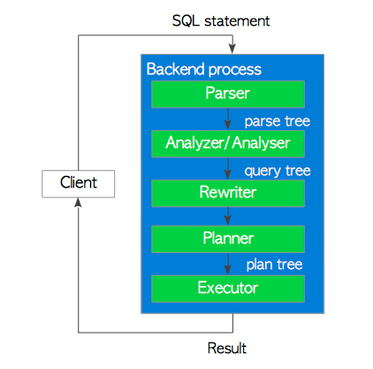
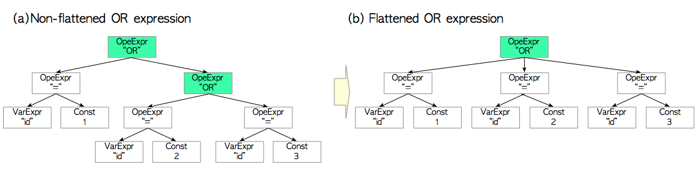

# 第三章 查询处理

[TOC]

查询处理是PostgreSQL中最为复杂的子系统。如PostgreSQL[官方文档](https://www.postgresql.org/docs/current/static/features.html)所述，PostgreSQL支持SQL2011标准中的大多数特性，查询处理子系统能够高效地处理这些SQL。本章概述了查询处理的流程，特别关注了查询优化的部分。

本章包括下列三个部分：

+ 第一部分：3.1节

   这一节会简单介绍PostgreSQL中查询处理的流程。

+ 第二部分：3.2~3.4节

   这一部分会描述获取单表查询上最优执行计划的步骤。3.2节讨论代价估计的过程，3.3节描述创建计划树的过程，3.4节将简要介绍执行器的工作过程。

+ 第三部分：3.5~3.6节

  这一部分会描述获取多表查询上最优执行计划的步骤。3.5节介绍了三种连接算法：**嵌套循环连接（Nested Loop Join）**，**归并连接（Merge Join）** ，**散列连接（Hash Join）**。3.6节将介绍为多表查询创建计划树的过程。

PostgreSQL支持三种技术上很有趣，而且也很实用的功能：[**外部数据包装（Foreign Data Wrapper, FDW）**](https://www.postgresql.org/docs/current/static/fdwhandler.html)，[**并行查询**](https://www.postgresql.org/docs/current/static/parallel-query.html)，以及版本11即将支持的[JIT编译](https://www.postgresql.org/docs/11/static/jit-reason.html)。前两者将在[第4章](ch4.md)中描述，JIT编译超出范围本书的范围，详见[官方文档](https://www.postgresql.org/docs/11/static/jit-reason.html)。


## 3.1 概览

尽管PostgreSQL在9.6版本后有了基于多个后台工作进程的并行查询，但大体上来讲，还是每个连接对应一个后端进程。后端进程由五个子系统组成，如下所示：

1. **解析器（Parser）**

   解析器根据SQL语句生成一颗**语法解析树（parse tree）** 。

2. **分析器（Analyzer）**

   分析器对语法解析树进行语义分析，生成一颗**查询树（query tree）**。

3. **重写器（Rewriter）**

   重写器按照[规则系统](https://www.postgresql.org/docs/current/static/rules.html)中存在的规则，对查询树进行改写。

4. **计划器（Planner）**

   计划器基于查询树，生成一颗执行效率最高的**计划树（plan tree）**。

5. **执行器（Executor）**

   执行器按照计划树中的顺序访问表和索引，执行相应查询。

**图3.1 查询处理**




本节将概述这些子系统。计划器和执行器很复杂，后面的章节会对这些函数的细节进行描述。

> PostgreSQL的查询处理在[官方文档](http://www.postgresql.org/docs/current/static/overview.html)中有详细的描述

### 3.1.1 解析器（Parser）

解析器基于SQL语句的文本，生成一颗后续子系统可以理解的语法解析树。下面是一个具体的例子。

考虑以下查询：

```sql
testdb=# SELECT id, data FROM tbl_a WHERE id < 300 ORDER BY data;
```

语法解析树的根节点是一个定义在[`parsenodes.h`](https://github.com/postgres/postgres/blob/master/src/include/nodes/parsenodes.h)中的`SelectStmt`数据结构。图3.2(a)展示了一个查询，而图3.2(b)则是该查询对应的语法解析树。

```c
typedef struct SelectStmt
{
        NodeTag         type;

        /* 这些字段只会在SelectStmts“叶节点”中使用 */
        List       *distinctClause;     /* NULL, DISTINCT ON表达式列表, 或
                                       对所有的(SELECT DISTINCT)为lcons(NIL,NIL) */
        IntoClause *intoClause;         /* SELECT INTO 的目标 */
        List       *targetList;         /* 结果目标列表 (ResTarget) */
        List       *fromClause;         /* FROM 子句 */
        Node       *whereClause;        /* WHERE 限定条件 */
        List       *groupClause;        /* GROUP BY 子句 */
        Node       *havingClause;       /* HAVING 条件表达式 */
        List       *windowClause;       /* WINDOW window_name AS (...), ... */

        /*  在一个表示值列表的叶节点中，上面的字段全都为空，而这个字段会被设置。
         * 注意这个子列表中的元素仅仅是表达式，没有ResTarget的修饰，还需要注意列表元素可能为
         * DEFAULT (表示一个 SetToDefault 节点)，而无论值列表的上下文。 
         * 由分析阶段决定否合法并拒绝。      */
        List       *valuesLists;        /* 未转换的表达式列表 */

        /* 这些字段会同时在SelectStmts叶节点与SelectStmts上层节点中使用 */
        List       *sortClause;         /* 排序子句 (排序依据的列表) */
        Node       *limitOffset;        /* 需要跳过的元组数目 */
        Node       *limitCount;         /* 需要返回的元组数目 */
        List       *lockingClause;      /* FOR UPDATE (锁子句的列表) */
        WithClause *withClause;         /* WITH 子句 */

        /* 这些字段只会在上层的 SelectStmts 中出现 */
        SetOperation op;                /* set 操作的类型 */
        bool            all;            /* 是否指明了 ALL 选项? */
        struct SelectStmt *larg;        /* 左子节点 */
        struct SelectStmt *rarg;        /* 右子节点 */
} SelectStmt;
```

**图3.2. 语法解析树的例子**


`SELECT`查询中的元素和语法解析树中的元素有着对应关系。比如，(1)是目标列表中的一个元素，与目标表的`'id'`列相对应，(4)是一个`WHERE`子句，诸如此类。

当解析器生成语法分析树时只会检查语法，只有当查询中出现语法错误时才会返回错误。解析器并不会检查输入查询的语义，举个例子，如果查询中包含一个不存在的表名，解析器并不会报错，语义检查由分析器负责。


### 3.1.2 分析器（Analyzer）

分析器对解析器产出的**语法解析树（parse tree）**进行语义分析，并产出一颗**查询树（query tree）**。

查询树的根节点是[`parsenode.h`](https://github.com/postgres/postgres/blob/master/src/include/nodes/parsenodes.h)中定义的`Query`数据结构，这个结构包含着对应查询的元数据，比如命令的类型（`SELECT/INSERT`等），还包括了一些叶子节点，叶子节点由列表或树组成，包含了特定子句相应的数据。

```c
/*
 * Query -
 *	  解析与分析过程会将所有的语句转换为一颗查询树，供重写器与计划器用于进一步的处理。
 *    功能语句（即不可优化的语句）会设置utilityStmt字段，而Query结构本身基本上是空的。
 *	  DECLARE CURSOR 是一个特例：它的形式与SELECT类似，但原始的DeclareCursorStmt会
 *    被放在 utilityStmt 字段中。
 *    计划过程会将查询树转换为一颗计划树，计划树的根节点是一个PlannedStmt结构
 *    执行器不会用到查询树结构
 */
typedef struct Query
{
	NodeTag		type;
	CmdType		commandType;		/* select|insert|update|delete|utility */
	QuerySource querySource;		/* 我来自哪里? */
	uint32		queryId;		    /* 查询标识符 (可由插件配置) */

	bool		canSetTag;		    /* 我设置了命令结果标签吗? */
	Node	   	*utilityStmt;		/* 如果这是一条DECLARE CURSOR或不可优化的语句 */
	int		resultRelation; 	    /* 对增删改语句而言是目标关系的索引; SELECT为0 */
	bool		hasAggs;		    /* 是否在目标列表或having表达式中指定了聚合函数 */
	bool		hasWindowFuncs; 	/* tlist是否包含窗口函数 */
	bool		hasSubLinks;		/* 是否包含子查询SubLink */
	bool		hasDistinctOn;		/* 是否包含来自DISTINCT ON的distinct子句 */
	bool		hasRecursive;		/* 是否制定了WITH RECURSIVE */
	bool		hasModifyingCTE;	/* 是否在WITH子句中包含了INSERT/UPDATE/DELETE */
	bool		hasForUpdate;		/* 是否指定了FOR [KEY] UPDATE/SHARE*/
	bool		hasRowSecurity; 	/* 是否应用了行安全策略 */
	List	   	*cteList;		    /* CTE列表 */
	List	   	*rtable;		    /* 范围表项目列表 */
	FromExpr   	*jointree;		    /* 表连接树 (FROM 与 WHERE 子句) */
	List	   	*targetList;		/* 目标列表 (TargetEntry的列表) */
	List	   	*withCheckOptions;	/* WithCheckOption的列表 */
	OnConflictExpr 	*onConflict; 	/* ON CONFLICT DO [NOTHING | UPDATE] */
	List	   	*returningList;		/* 返回值列表(TargetEntry的列表) */
	List	   	*groupClause;		/* SortGroupClause的列表 */
	List	   	*groupingSets;		/* 如果有，GroupingSet的列表 */
	Node	   	*havingQual;		/* 分组的Having条件列表 */
	List	   	*windowClause;		/* 窗口子句列表 */
	List	   	*distinctClause; 	/* SortGroupClause列表 */
	List	   	*sortClause;		/* SortGroupClause列表 */
	Node	   	*limitOffset;		/* Offset跳过元组数目 (int8 表达式) */
	Node	   	*limitCount;		/* Limit返回元组数目 (int8 表达式) */
	List	   	*rowMarks;          /* RowMarkClause列表 */
	Node	   	*setOperations;		/* 如果是UNION/INTERSECT/EXCEPT的顶层查询，
	                                   则为集合操作列表 */
	List	   	*constraintDeps; 	/* 确认查询语义是否合法时，所依赖约束对象的OID列表 */
} Query;
```

**图3.3 查询树一例**


简要介绍一下上图中的查询树：

+ `targetlist` 是查询结果中**列（Column）**的列表。在本例中该列表包含两列：`id` 和`data`。如果在输入的查询树中使用了`*`（星号），那么分析器会将其显式替换为所有具体的列。
+ 范围表`rtable`是该查询所用到关系的列表。本例中该变量包含了表`tbl_a`的信息，如该表的表名与`oid`。
+ 连接树`jointree`存储着`FROM`和`WHERE`子句的相关信息。
+ 排序子句`sortClause`是`SortGroupClause`结构体的列表。

[官方文档](http://www.postgresql.org/docs/current/static/querytree.html)描述了查询树的细节。

### 3.1.3 重写器（Rewriter）

PostgreSQL的[规则系统](https://www.postgresql.org/docs/current/static/rules.html)正是基于重写器实现的；当需要时，重写器会根据存储在`pg_rules`中的规则对查询树进行转换。规则系统本身也是一个很有趣的系统，不过本章略去了关于规则系统和重写器的描述，以免内容过于冗长。

> #### 视图
>
> 在PostgreSQL中，[视图](https://www.postgresql.org/docs/current/static/rules-views.html)是基于规则系统实现的。当使用[`CREATE VIEW`](https://www.postgresql.org/docs/current/static/sql-createview.html)命令定义一个视图时，PostgreSQL就会创建相应的规则，并存储到系统目录中。
>
> 假设下面的视图已经被定义，而`pg_rule`中也存储了相应的规则。
>
> ```sql
> sampledb=# CREATE VIEW employees_list 
> sampledb-#   AS SELECT e.id, e.name, d.name AS department 
> sampledb-#      FROM employees AS e, departments AS d WHERE e.department_id = d.id;
> ```
>
> 当执行一个包含该视图的查询，解析器会创建一颗如图3.4(a)所示的语法解析树。
>
> ```sql
> sampledb=# SELECT * FROM employees_list;
> ```
>
> 在该阶段，重写器会基于`pg_rules`中存储的视图规则将`rangetable`节点重写为一颗查询子树，与子查询相对应。
>
> **图3.4 重写阶段一例**
>
> 
>
> 因为PostgreSQL使用这种机制实现视图，直到9.2版本，视图都是不能更新的。虽然9.3版本后可以对视图进行更新，但对视图的更新仍然存在很多限制，具体细节请参考[官方文档](https://www.postgresql.org/docs/current/static/sql-createview.html#SQL-CREATEVIEW-UPDATABLE-VIEWS)。

### 3.1.4 计划器与执行器

计划器从重写器获取一颗**查询树（query tree）**，基于查询树生成一颗能被执行器高效执行的（查询）**计划树（plan tree）**。	

在PostgreSQL中，计划器是完全**基于代价估计（cost-based）**的；它不支持基于规则的优化与**提示（hint）**。计划器是RDBMS中最为复杂的部分，因此本章的后续内容会对计划器做一个概述。

> #### `pg_hint_plan`
>
> PostgreSQL不支持SQL中的**提示（hint）**，并且永远也不会去支持。如果你想在查询中使用提示，可以考虑使用`pg_hint_plan`扩展，细节请参考[官方站点](http://pghintplan.osdn.jp/pg_hint_plan.html)。

与其他RDBMS类似，PostgreSQL中的[`EXPLAIN`](https://www.postgresql.org/docs/current/static/sql-explain.html)命令会显示命令的计划树。下面给出了一个具体的例子。

```sql
testdb=# EXPLAIN SELECT * FROM tbl_a WHERE id < 300 ORDER BY data;
                          QUERY PLAN                           
---------------------------------------------------------------
 Sort  (cost=182.34..183.09 rows=300 width=8)
   Sort Key: data
   ->  Seq Scan on tbl_a  (cost=0.00..170.00 rows=300 width=8)
         Filter: (id < 300)
(4 rows)
```

图3.5展示了结果相应的计划树。

**图3.5 一个简单的计划树以及其与EXPLAIN命令的关系**


计划树由许多称为**计划节点（plan node）**的元素组成，这些节点挂在`PlannedStmt`结构对应的计划树上。这些元素的定义在[`plannodes.h`](https://github.com/postgres/postgres/blob/master/src/include/nodes/plannodes.h中)中，第3.3.3节与第3.5.4.2会解释相关细节。

每个计划节点都包含着执行器进行处理所必需的信息，在单表查询的场景中，执行器会按照从终端节点往根节点的顺序依次处理这些节点。

比如图3.5中的计划树就是一个列表，包含一个排序节点和一个顺序扫描节点；因而执行器会首先对表`tbl_a`执行顺序扫描，并对获取的结果进行排序。

执行器会通过[第8章](ch8.md)将介绍的缓冲区管理器来访问数据库集簇的表和索引。当处理一个查询时，执行器会使用预先分配的内存空间，比如`temp_buffers`和`work_mem`，必要时还会创建临时文件。

**图3.6 执行器，缓冲管理器，临时文件之间的关系**


除此之外，当访问元组的时候，PostgreSQL还会使用并发控制机制来维护运行中事务的一致性和隔离性。[第五章](ch5.md)介绍了并发控制机制。

## 3.2 单表查询的代价估计

PostgreSQL的查询优化是基于**代价（Cost）**的。代价是一个无量纲的值，它并不是一种绝对的性能指标，但可以作为比较各种操作代价时的相对性能指标。

[`costsize.c`](https://github.com/postgres/postgres/blob/master/src/backend/optimizer/path/costsize.c)中的函数用于估算各种操作的代价。所有被执行器执行的操作都有着相应的代价函数。例如，函数`cost_seqscan()` 和 `cost_index()`分别用于估算顺序扫描和索引扫描的代价。

在PostgreSQL中有三种代价：**启动（start-up）** ， **运行（run）**和**总和（total）**。**总代价**是**启动代价**和**运行代价**的和；因此只有启动代价和运行代价是单独估计的。

1. **启动代价（start-up）**：在读取到第一条元组前花费的代价，比如索引扫描节点的**启动代价**就是读取目标表的索引页，取到第一个元组的代价
2. **运行代价（run）**： 获取全部元组的代价
3. **总代价（total）**：前两者之和

[`EXPLAIN`](https://www.postgresql.org/docs/current/static/sql-explain.html)命令显示了每个操作的启动代价和总代价，下面是一个简单的例子：

```sql
testdb=# EXPLAIN SELECT * FROM tbl;
                       QUERY PLAN                        
---------------------------------------------------------
 Seq Scan on tbl  (cost=0.00..145.00 rows=10000 width=8)
(1 row)
```

在第4行显示了顺序扫描的相关信息。代价部分包含了两个值：0.00和145.00。在本例中，启动代价和总代价分别为0.00和145.00。

在本节中，我们将详细介绍顺序扫描，索引扫描和排序操作的代价是如何估算的。

在接下来的内容中，我们使用下面这个表及其索引作为例子。

```sql
testdb=# CREATE TABLE tbl (id int PRIMARY KEY, data int);
testdb=# CREATE INDEX tbl_data_idx ON tbl (data);
testdb=# INSERT INTO tbl SELECT generate_series(1,10000),generate_series(1,10000);
testdb=# ANALYZE;
testdb=# \d tbl
      Table "public.tbl"
 Column |  Type   | Modifiers 
--------+---------+-----------
 id     | integer | not null
 data   | integer | 
Indexes:
    "tbl_pkey" PRIMARY KEY, btree (id)
    "tbl_data_idx" btree (data)
```

### 3.2.1 顺序扫描

顺序扫描的代价是通过函数`cost_seqscan()`估计的。本节将研究顺序扫描代价是如何估计的，以下面的查询为例：

```sql
testdb=# SELECT * FROM tbl WHERE id < 8000;
```

在顺序扫描中，启动代价等于0，而运行代价由以下公式定义：
$$
\begin{align}
  \verb|run_cost| 
  &= \verb|cpu_run_cost| + \verb|disk_run_cost | \\
  &= (\verb|cpu_tuple_cost| + \verb|cpu_operator_cost|) × N_{\verb|tuple|} + \verb|seq_page_cost| × N_{\verb|page|},
\end{align}
$$
其中[`seq_page_cost`](https://www.postgresql.org/docs/current/static/runtime-config-query.html#GUC-SEQ-PAGE-COST)，[`cpu_tuple_cost`](https://www.postgresql.org/docs/current/static/runtime-config-query.html#GUC-CPU-TUPLE-COST)和[`cpu_operator_cost`](https://www.postgresql.org/docs/current/static/runtime-config-query.html#GUC-CPU-OPERATOR-COST)是在*postgresql.conf* 中配置的参数，默认值分别为1.0，0.01和0.0025。$N_{\verb|tuple|}$ 和$N_{\verb|page|}$ 分别是表中的元组总数与页面总数，这两个值可以使用以下查询获取。

```sql
testdb=# SELECT relpages, reltuples FROM pg_class WHERE relname = 'tbl';
 relpages | reltuples 
----------+-----------
       45 |     10000
(1 row)
```

$$
\begin{equation}\tag{1}
	N_{\verb|tuple|}=10000
\end{equation}
$$

$$
\begin{equation}\tag{2}
	N_{\verb|page|}=45
\end{equation}
$$

因此：
$$
\begin{align}
 \verb|run_cost| 
 	    &= (0.01 + 0.0025) × 10000 + 1.0 × 45 = 170.0.
\end{align}
$$

最终：
$$
\verb|total_cost| = 0.0 + 170.0 = 170.0
$$


作为验证，下面是该查询的`EXPLAIN`结果：

```sql
testdb=# EXPLAIN SELECT * FROM tbl WHERE id < 8000;
                       QUERY PLAN                       
--------------------------------------------------------
 Seq Scan on tbl  (cost=0.00..170.00 rows=8000 width=8)
   Filter: (id < 8000)
(2 rows)
```

在第4行中可以看到，启动代价和总代价分别是0.00和170.0，且预计全表扫描返回行数为8000条（元组）。

在第5行显示了一个顺序扫描的过滤器`Filter:(id < 8000)`。更精确地说，它是一个**表级过滤谓词（table level filter predicate）**。注意这种类型的过滤器只会在读取所有元组的时候使用，它并不会减少需要扫描的表页面数量。

> 从优化运行代价的角度来看，PostgreSQL假设所有的物理页都是从存储介质中获取的；即，PostgreSQL不会考虑扫 描的页面是否来自共享缓冲区。

### 3.2.2 索引扫描

尽管PostgreSQL支持很多[索引方法](https://www.postgresql.org/docs/current/static/indexes-types.html)，比如B树，[GiST](https://www.postgresql.org/docs/current/static/gist.html)，[GIN](https://www.postgresql.org/docs/current/static/gin.html)和[BRIN](https://www.postgresql.org/docs/current/static/brin.html)，不过索引扫描的代价估计都使用一个共用的代价函数：`cost_index()`。

本节将研究索引扫描的代价是如何估计的，以下列查询为例。

```sql
testdb=# SELECT id, data FROM tbl WHERE data < 240;
```

在估计该查询的代价之前，下面的查询能获取$N_{\verb|index|,\verb|page|}$和$N_{\verb|index|,\verb|tuple|}$的值：

```sql
testdb=# SELECT relpages, reltuples FROM pg_class WHERE relname = 'tbl_data_idx';
 relpages | reltuples 
----------+-----------
       30 |     10000
(1 row)
```

$$
\begin{equation}\tag{3}
	N_{\verb|index|,\verb|tuple|} = 10000
\end{equation}
$$

$$
\begin{equation}\tag{4}
	N_{\verb|index|,\verb|page|} = 30
\end{equation}
$$

#### 3.2.2.1 启动代价

索引扫描的启动代价就是读取索引页以访问目标表的第一条元组的代价，由下面的公式定义：
$$
\begin{equation}
\verb| start-up_cost| = \{\mathrm{ceil}(\log_2 (N_{\verb|index|,\verb|tuple|}))
		 + (H_{\verb|index|} + 1) × 50\} × \verb|cpu_operator_cost|
\end{equation}
$$
其中$H_{\verb|index|}$是索引树的高度。

在本例中，套用公式(3)，$N_{\verb|index,tuple|}$是10000；$H_{\verb|index|}$是1；$\verb|cpu_operator_cost|$是0.0025（默认值）。因此
$$
\begin{equation}\tag{5}
 \verb|start-up_cost| = \{\mathrm{ceil}(\log_2(10000)) + (1 + 1) × 50\} × 0.0025 = 0.285
\end{equation}
$$
#### 3.2.2.2 运行代价

索引扫描的运行代价是表和索引的CPU代价与IO代价之和。
$$
\begin{align}
 \verb|run_cost| &= (\verb|index_cpu_cost| + \verb|table_cpu_cost|) 
 	    	  + (\verb|index_io_cost| + \verb|table_io_cost|).
\end{align}
$$

> 如果使用[仅索引扫描](https://www.postgresql.org/docs/10/static/indexes-index-only-scans.html)，则不会估计`table_cpu_cost`与`table_io_cost`，仅索引扫描将在[第七章](ch7.md)中介绍。

前三个代价（即`index_cpu_cost`，`table_cpu_cost`和`index_io_cost`）如下所示：

$$
\begin{align}
 \verb|index_cpu_cost| &= \verb|Selectivity| × N_{\verb|index|,\verb|tuple|} × (\verb|cpu_index_tuple_cost| + \verb|qual_op_cost|) \\
 \verb|table_cpu_cost| &= \verb|Selectivity| × N_{\verb|tuple|}× \verb|cpu_tuple_cost| \\
 \verb|index_io_cost|   &= \mathrm{ceil}(\verb|Selectivity| × N_{\verb|index|,\verb|page|}) ×\verb|random_page_cost|
\end{align}
$$


以上公式中的[`cpu_index_tuple_cost`](https://www.postgresql.org/docs/current/static/runtime-config-query.html#GUC-CPU-INDEX-TUPLE-COST)和[`random_page_cost`](https://www.postgresql.org/docs/current/static/runtime-config-query.html#GUC-RANDOM-PAGE-COST)在*postgresql.conf*中配置（默认值分别为0.005和4.0）。$\verb|qual_op_cost|$粗略来说就是索引求值的代价，默认值是0.0025，这里不再展开。**选择率（Selectivity）**是一个0到1之间的浮点数，代表查询指定的`WHERE`子句在索引中搜索范围的比例。举个例子，$(\verb|Selectivity| × N_{\verb|tuple|})$就是需要读取的表元组数量，$(\verb|Selectivity| × N_{\verb|index|,\verb|tuple|})$就是需要读取的索引元组数量，诸如此类。

> #### 选择率（Selectivity）
>
> 查询谓词的选择率是通过**直方图界值（histogram_bounds）**与**高频值（Most Common Value, MCV）**估计的，这些信息都存储在系统目录`pg_statistics`中，并可通过`pg_stats`视图查询。这里通过一个具体的例子来简要介绍选择率的计算方法，细节可以参考[官方文档](https://www.postgresql.org/docs/10/static/row-estimation-examples.html)。
>
> 表中每一列的高频值都在`pg_stats`视图的`most_common_vals`和`most_common_freqs`中成对存储。
>
> + **高频值（most_common_vals）**：该列上最常出现的取值列表
> + **高频值频率（most_common_freqs）**：高频值相应出现频率的列表
>
> 下面是一个简单的例子。表`countries`有两列：一列`country`存储国家名，一列`continent`存储该国所属大洲。
>
> ```sql
> testdb=# \d countries
>    Table "public.countries"
>   Column   | Type | Modifiers 
> -----------+------+-----------
>  country   | text | 
>  continent | text | 
> Indexes:
>     "continent_idx" btree (continent)
> 
> testdb=# SELECT continent, count(*) AS "number of countries", 
> testdb-#     (count(*)/(SELECT count(*) FROM countries)::real) AS "number of countries / all countries"
> testdb-#       FROM countries GROUP BY continent ORDER BY "number of countries" DESC;
>    continent   | number of countries | number of countries / all countries 
> ---------------+---------------------+-------------------------------------
>  Africa        |                  53 |                   0.274611398963731
>  Europe        |                  47 |                   0.243523316062176
>  Asia          |                  44 |                   0.227979274611399
>  North America |                  23 |                   0.119170984455959
>  Oceania       |                  14 |                  0.0725388601036269
>  South America |                  12 |                  0.0621761658031088
> (6 rows)
> ```
>
> 考虑下面的查询，该查询带有`WHERE`条件`continent = 'Asia'`。
>
> ```sql
> testdb=# SELECT * FROM countries WHERE continent = 'Asia';
> ```
>
> 这时候，计划器使用`continent`列上的高频值来估计索引扫描的代价，列上的`most_common_vals`与 `most_common_freqs`如下所示：
>
> ```sql
> testdb=# \x
> Expanded display is on.
> testdb=# SELECT most_common_vals, most_common_freqs FROM pg_stats 
> testdb-#                  WHERE tablename = 'countries' AND attname='continent';
> -[ RECORD 1 ]-----+-----------------------------------------------------------
> most_common_vals  | {Africa,Europe,Asia,"North America",Oceania,"South America"}
> most_common_freqs | {0.274611,0.243523,0.227979,0.119171,0.0725389,0.0621762}
> ```
>
> 与`most_common_vals`中`Asia`值对应的`most_common_freqs`为0.227979。因此0.227979会在估算中被用作选择率。
>
> 如果高频值不可用，就会使用目标列上的直方图界值来估计代价。
>
> + **直方图值（histogram_bounds）**是一系列值，这些值将列上的取值划分为数量大致相同的若干个组。
>
> 下面是一个具体的例子。这是表`tbl`中`data`列上的直方图界值；
>
> ```sql
> testdb=# SELECT histogram_bounds FROM pg_stats WHERE tablename = 'tbl' AND attname = 'data';
>         			     	      histogram_bounds
> ------------------------------------------------------------------------------
>  {1,100,200,300,400,500,600,700,800,900,1000,1100,1200,1300,1400,1500,1600,1700,1800,1900,2000,2100,
> 2200,2300,2400,2500,2600,2700,2800,2900,3000,3100,3200,3300,3400,3500,3600,3700,3800,3900,4000,4100,
> 4200,4300,4400,4500,4600,4700,4800,4900,5000,5100,5200,5300,5400,5500,5600,5700,5800,5900,6000,6100,
> 6200,6300,6400,6500,6600,6700,6800,6900,7000,7100,7200,7300,7400,7500,7600,7700,7800,7900,8000,8100,
> 8200,8300,8400,8500,8600,8700,8800,8900,9000,9100,9200,9300,9400,9500,9600,9700,9800,9900,10000}
> (1 row)
> ```
>
> 默认情况下，直方图界值会将列上的取值划分入100个桶。图3.7展示了这些桶及其对应的直方图界值。桶从0开始编号，每个桶保存了（大致）相同数量的元组。直方图界值就是相应桶的边界。比如，直方图界值的第0个值是1，意即这是`bucket_0`中的最小值。第1个值是100，意即`bucket_1`中的最小值是100，等等。
>
> **图3.7 桶和直方图界值**
>
> 
>
> 然后本节例子中选择率计算如下所示。假设查询带有`WHERE`子句`data < 240`，而值240落在第二个桶中。在本例中可以通过线性插值推算出相应的选择率。因此查询中`data`列的选择率可以套用下面的公式计算：
> $$
> \verb|Selectivity| = \frac{2+(240-hb[2])/(hb[3]-hb[2])}{100}=\frac{2+(240-200)/(300-200)}{100}=\frac{2+40/100}{100}=0.024    \ (6)
> $$
>

因此，根据公式(1)，(3)，(4)和(6)，有
$$
\begin{equation}\tag{7}
	\verb|index_cpu_cost| = 0.024× 10000 × (0.005+0.0025)=1.8
\end{equation}
$$
$$
\begin{equation}\tag{8}
\verb|table_cpu_cost| = 0.024 × 10000 × 0.01 = 2.4
\end{equation}
$$

$$
\begin{equation}\tag{9}
\verb|index_io_cost| = \mathrm{ceil}(0.024 × 30) × 4.0 = 4.0
\end{equation}
$$


$\verb|table_io_cost|$ 由下面的公式定义：
$$
\begin{equation}
\verb|table_io_cost| = \verb|max_io_cost| + \verb|indexCorerelation|^2 × (\verb|min_io_cost|-\verb|max_io_cost|)
\end{equation}
$$

$\verb|max_io_cost_io_cost|$ 是最差情况下的I/O代价，即，随机扫描所有数据页的代价；这个代价由以下公式定义：
$$
\begin{equation}
\verb|max_io_cost| = N_{\verb|page|} × \verb|random_page_cost|
\end{equation}
$$

在本例中，由(2)，$N_{\verb|page|}=45$，得
$$
\begin{equation}\tag{10}
\verb|max_io_cost| = 45 × 4.0 = 180.0
\end{equation}
$$

$\verb|min_io_cost|$是最优情况下的I/O代价，即，顺序扫描选定的数据页；这个代价由以下公式定义：
$$
\begin{equation}
\verb|min_io_cost| = 1 × \verb|random_page_cost| + (\mathrm{ceil}(\verb|Selectivity| × N_{\verb|page|})-1) × \verb|seq_page_cost|
\end{equation}
$$
在本例中，
$$
\begin{equation} \tag{11}
\verb|min_io_cost| \ = 1 × 4.0 + (\mathrm{ceil}(0.024 × 45)-1) × 1.0
\end{equation}
$$

下文详细介绍$\verb|indexCorrelation|$，在本例中，
$$
\begin{equation} \tag{12}
	\verb|indexCorrelation| = 1.0
\end{equation}
$$

由(10)，(11)和(12)，得
$$
\begin{equation} \tag{13}
\verb|table_io_cost| = 180.0+1.0^2 × (5.0-180.0)=5.0
\end{equation}
$$

综上，由(7)，(8)，(9)和(13)得
$$
\begin{equation}\tag{14}
\verb|run_cost| = (1.8+2.4)+(4.0+5.0)=13.2
\end{equation}
$$

> ##### 索引相关性（index correlation）
>
> 索引相关性是列值在物理上的顺序和逻辑上的顺序的统计相关性（引自官方文档）。索引相关性的取值范围从$-1$到$+1$。下面的例子有助于理解索引扫描和索引相关性的关系。
>
> 表`tbl_corr`有5个列：两个列为文本类型，三个列为整数类型。这三个整数列保存着从1到12的数字。在物理上表`tbl_corr`包含三个页，每页有4条元组。每个数字列有一个名如`index_col_asc`的索引。
>
> ```sql
> testdb=# \d tbl_corr
>     Table "public.tbl_corr"
>   Column  |  Type   | Modifiers 
> ----------+---------+-----------
>  col      | text    | 
>  col_asc  | integer | 
>  col_desc | integer | 
>  col_rand | integer | 
>  data     | text    |
> Indexes:
>     "tbl_corr_asc_idx" btree (col_asc)
>     "tbl_corr_desc_idx" btree (col_desc)
>     "tbl_corr_rand_idx" btree (col_rand)
> ```
>
> ```sql
> testdb=# SELECT col,col_asc,col_desc,col_rand 
> testdb-#                         FROM tbl_corr;
>    col    | col_asc | col_desc | col_rand 
> ----------+---------+----------+----------
>  Tuple_1  |       1 |       12 |        3
>  Tuple_2  |       2 |       11 |        8
>  Tuple_3  |       3 |       10 |        5
>  Tuple_4  |       4 |        9 |        9
>  Tuple_5  |       5 |        8 |        7
>  Tuple_6  |       6 |        7 |        2
>  Tuple_7  |       7 |        6 |       10
>  Tuple_8  |       8 |        5 |       11
>  Tuple_9  |       9 |        4 |        4
>  Tuple_10 |      10 |        3 |        1
>  Tuple_11 |      11 |        2 |       12
>  Tuple_12 |      12 |        1 |        6
> (12 rows)
> ```
>
> 这些列的索引相关性如下：
>
> ```sql
> testdb=# SELECT tablename,attname, correlation FROM pg_stats WHERE tablename = 'tbl_corr';
>  tablename | attname  | correlation 
> -----------+----------+-------------
>  tbl_corr  | col_asc  |           1
>  tbl_corr  | col_desc |          -1
>  tbl_corr  | col_rand |    0.125874
> (3 rows)
> ```
>
> 当执行下列查询时，由于所有的目标元组都在第一页中，PostgreSQL只会读取第一页，如图3.8(a)所示。
>
> ```sql
> testdb=# SELECT * FROM tbl_corr WHERE col_asc BETWEEN 2 AND 4;
> ```
>
> 而执行下列查询时则不然，PostgreSQL需要读所有的页，如图3.8(b)所示。
>
> ```sql
> testdb=# SELECT * FROM tbl_corr WHERE col_rand BETWEEN 2 AND 4;
> ```
>
> 如此可知，索引相关性是一种统计上的相关性。在索引扫描代价估计中，索引相关性体现了索引顺序和物理元组顺序扭曲程度给随机访问性能造成的影响大小。
>
> **图3.8 索引相关性**
>
> 

#### 3.2.2.3 整体代价

由(3)和(14)可得
$$
\begin{equation}\tag{15}
	\verb|total_cost| = 0.285 + 13.2 = 13.485
\end{equation}
$$

作为确认，上述`SELECT`查询的`EXPLAIN`结果如下所示：

```sql
testdb=# EXPLAIN SELECT id, data FROM tbl WHERE data < 240;
                                QUERY PLAN                                 
---------------------------------------------------------------------------
 Index Scan using tbl_data_idx on tbl  (cost=0.29..13.49 rows=240 width=8)
   Index Cond: (data < 240)
(2 rows)
```

在第4行可以看到启动代价和总代价分别是0.29和13.49，预估有240条元组被扫描。

在第5行显示了一个索引条件`Index Cond:(data < 240)`。更准确地说，这个条件叫做**访问谓词（access predicate）**，它表达了索引扫描的开始条件与结束条件。

> 根据[这篇文章](https://use-the-index-luke.com/sql/explain-plan/postgresql/filter-predicates)，PostgreSQL中的`EXPLAIN`命令不会区分**访问谓词（access predicate）**和**索引过滤谓词（index filter predicate）**。因此当分析`EXPLAIN`的输出时，即使看到了“IndexCond”，也应当注意一下预估返回行数。

> ##### `seq_page_cost`和`random_page_cost`
>
> [`seq_page_cost`](https://www.postgresql.org/docs/10/static/runtime-config-query.html#GUC-SEQ-PAGE-COST)和[`random_page_cost`](https://www.postgresql.org/docs/10/static/runtime-config-query.html#GUC-RANDOM-PAGE-COST)的默认值分别为1.0和4.0。这意味着PostgreSQL假设随机扫描比顺序扫描慢4倍；显然，PostgreSQL的默认值是基于HDD（普通硬盘）设置的。
>
> 另一方面，近年来SSD得到了广泛的应用，`random_page_cost`的默认值就显得太大了。使用SSD时如果仍然采用`random_page_cost`的默认值，则计划器有可能会选择低效的计划。因此当使用SSD时最好将`random_page_cost`的值设为1.0。
>
> [这篇文章](https://amplitude.engineering/how-a-single-postgresql-config-change-improved-slow-query-performance-by-50x-85593b8991b0)报告了使用`random_page_cost`默认值导致的问题。

### 3.2.3 排序

**排序路径（sort path）** 会在排序操作中被使用。排序操作包括`ORDER BY`，归并连接的预处理操作，以及其他函数。函数`cost_sort()`用于估计排序操作的代价。

如果能在工作内存中放下所有元组，那么排序操作会选用快速排序算法。否则的话则会创建临时文件，使用文件归并排序算法。

排序路径的启动代价就是对目标表的排序代价，因此代价就是$O(N_{\verb|sort|}× \log_2(N_{\verb|sort|})$，这里$N_{\verb|sort|}$就是待排序的元组数。排序路径的运行代价就是读取已经排好序的元组的代价，因而代价就是$O(N_{sort})$。

本节将研究以下查询排序代价的估计过程。假设该查询只使用工作内存，不使用临时文件。

```sql
testdb=# SELECT id, data FROM tbl WHERE data < 240 ORDER BY id;
```

在本例中，启动代价由以下公式定义：
$$
\begin{equation}
\verb|start-up_cost| = \verb|C|+ \verb|comparison_cost| × N_{\verb|sort|} × \log_2(N_{\verb|sort|})
\end{equation}
$$

这里$C$就是上一次扫描的总代价，即上次索引扫描的总代价；由(15)可得C等于13.485；$N_{\verb|sort|}=240$；$\verb|comparison_cost|$ 定义为$2 × \verb|cpu_operator_cost|$。因此有

$$
\begin{equation}
\verb|start-up_cost| = 13.485+(2×0.0025)×240.0×\log_2(240.0)=22.973
\end{equation}
$$

运行代价是在内存中读取排好序的元组的代价，即：
$$
\begin{equation}
\verb|run_cost| = \verb|cpu_operator_cost| × N_{\verb|sort|} = 0.0025 × 240 = 0.6
\end{equation}
$$
综上：
$$
\begin{equation}
\verb|total_cost|=22.973+0.6=23.573
\end{equation}
$$
作为确认，以上`SELECT`查询的`EXPLAIN`命令结果如下：

```sql
testdb=# EXPLAIN SELECT id, data FROM tbl WHERE data < 240 ORDER BY id;
                                   QUERY PLAN                                    
---------------------------------------------------------------------------------
 Sort  (cost=22.97..23.57 rows=240 width=8)
   Sort Key: id
   ->  Index Scan using tbl_data_idx on tbl  (cost=0.29..13.49 rows=240 width=8)
         Index Cond: (data < 240)
(4 rows)
```

在第4行可以看到启动代价和运行代价分别为22.97和23.57。


## 3.3 创建单表查询的计划树

计划器非常复杂，故本节仅描述最简单的情况，即单表查询的计划树创建过程。更复杂的查询，换而言之即多表查询，其计划树创建过程将在第3.6节中阐述。

PostgreSQL中的计划器会执行三个处理步骤：

1. 执行预处理
2. 在所有可能的访问路径中，找出代价最小的访问路径
3. 按照代价最小的路径，创建计划树

**访问路径（access path）**是估算代价时的处理单元；比如，顺序扫描，索引扫描，排序以及各种连接操作都有其对应的**路径**。访问路径只在计划器创建查询计划树的时候使用。最基本的访问路径数据结构就是[`relation.h`](https://github.com/postgres/postgres/blob/master/src/include/nodes/relation.h)中定义的`Path`结构体。它就相当于是顺序扫描。所有其他的访问路径都基于该结构，下面会介绍细节。

计划器为了处理上述步骤，会在内部创建一个`PlannerInfo`数据结构。在该数据结构中包含着查询树，查询所涉及关系信息，访问路径等等。

```c
typedef struct PathKey {
    NodeTag type;
    EquivalenceClass *pk_eclass; /* 值是否有序 */
    Oid pk_opfamily;             /* 用于定义顺序的B树操作符族 */
    int pk_strategy;             /* 排序方向(ASC or DESC) */
    bool pk_nulls_first;         /* NULL是否排序在常规值之前？ */
} PathKey;

typedef struct Path {
    NodeTag type;
    NodeTag pathtype;          /* 标识 scan/join 方法的标签 */
    RelOptInfo *parent;        /* 路径所基于的关系 */
    PathTarget *pathtarget;    /* Vars/Exprs的列表, 代价, 宽度 */
    ParamPathInfo *param_info; /* 参数化信息, 如果没有则为NULL */
    bool parallel_aware;       /* 涉及到并行相关的逻辑？ */
    bool parallel_safe;        /* 是否能作为并行执行计划的一部分? */
    int parallel_workers;      /* 期待的并行工作进程数量； 0表示没有并行 */

    /* 估计路径的尺寸或代价 (更多详情参考costsize.c) */
    double rows;       /* 预估结果元组数目 */
    Cost startup_cost; /* 获取任何元组前需要花费的代价 */
    Cost total_cost;   /* 总代价 (假设获取所有元组所需代价) */
    List *pathkeys;    /* 路径输出的排序顺序 */
    /* pathkeys 是PathKey节点的列表，PathKey定义见上面 */
} Path;

typedef struct PlannerInfo {
    NodeTag type;
    Query *parse;                    /* 被计划的查询 */
    PlannerGlobal *glob;             /* 当前计划器运行时的全局信息 */
    Index query_level;               /* 最外层查询为1 */
    struct PlannerInfo *parent_root; /* 最外层查询为NULL */

    /* plan_params包含着当前计划中的查询层次需要对低层查询暴露的表达式。
     * outer_params包含着PARAM_EXEC参数中的paramId列表，这些参数是外
     * 部查询层次对当前查询层次所暴露的。*/
    List *plan_params; /* PlannerParamItems的列表, 见下 */
    Bitmapset *outer_params;

    /* simple_rel_array 持有着指向“基础关系”与“其他关系”的指针 (详情参考
     * RelOptInfo的注释)。它由rangetable index所索引（因此第0项总是废值）。
     * 当RTE并不与基础关系相对应，譬如连接的RTE，或未引用的视图RTE，或该
     * RelOptInfo还没有产生时，里面的项目可能为NULL。*/
    struct RelOptInfo **simple_rel_array; /* 所有单个关系的RelOptInfos */
    int simple_rel_array_size;            /* 数组分配的大小 */

    /* simple_rte_array 与simple_rel_array 长度相同，且持有指向关联范围表项的指针。
     * 这使得我们能避免执行rt_fetch(), 当需要展开很大的继承集时会很慢。 */
    RangeTblEntry **simple_rte_array; /* rangetable的数组 */

    /* all_baserels是所有查询所涉及基本关系的关系ID列表（但不含“其他关系”的ID）
     * 也就是说，最终连接时，所需构建的关系标识符。该字段是由make_one_rel计算的。
     * 计算发生于计算Paths之前。*/
    Relids all_baserels;

    /* nullable_baserels 是在进行外连接的jointree中那些可空的基础关系的ID集合。
     * 这些关系可能在WHERE子句，SELECT目标列表或其他地方产生空值。该字段由函数
     * deconstruct_jointree负责计算。*/
    Relids nullable_baserels;

    /* join_rel_list是一个列表，在计划过程中连接关系的RelOptInfos都放在这里。
     * 对于比较小的问题，我们只是简单的扫过这个列表来完成查找。但当连接很多关系时，
     * 我们会使用散列表来加速查询。散列表当且仅当join_rel_hash不为空时存在且
     * 有效。注意即使用散列表查找时，我们依然会维护列表，这会简化GEQO的相关问题。*/
    List *join_rel_list;        /* 连接关系的RelOptInfos */
    struct HTAB *join_rel_hash; /* 连接关系的散列表，可选 */

    /* 当使用动态规划进行连接搜索时，join_rel_level[k]是第k层的连接关系RelOptInfos列表。
     * 新的连接关系RelOptInfos会自动添加到join_rel_level[join_cur_level]中，
     * 而join_cur_level为当前层级。如果没用到动态规划，join_rel_level则为空。*/
    List **join_rel_level;    /* 连接关系RelOptInfo的列表 */
    int join_cur_level;       /* 待追加列表的序号 */
    List *init_plans;         /* 查询的初始SubPlans */
    List *cte_plan_ids;       /* 子计划的ID列表，每个CTE对应一个 */
    List *multiexpr_params;   /* MULTIEXPR子查询输出用到的双层嵌套参数列表 */
    List *eq_classes;         /* 活跃的EquivalenceClasses列表 */
    List *canon_pathkeys;     /* "标准" PathKeys 的列表 */
    List *left_join_clauses;  /* RestrictInfos列表，用于左连接子句 */
    List *right_join_clauses; /* RestrictInfos列表，用于右连接子句 */
    List *full_join_clauses;  /* RestrictInfos列表，用于完全连接子句 */
    List *join_info_list;     /* SpecialJoinInfos 的列表 */
    List *append_rel_list;    /* AppendRelInfos 的列表 */
    List *rowMarks;           /* PlanRowMarks 的列表 */
    List *placeholder_list;   /* PlaceHolderInfos 的列表 */
    List *fkey_list;          /* ForeignKeyOptInfos 的列表 */
    List *query_pathkeys;     /* query_planner()期望的pathkeys */
    List *group_pathkeys;     /* groupClause的pathkeys, 如果有的话 */
    List *window_pathkeys;    /* 底部窗口的pathkeys, 如果有的话 */
    List *distinct_pathkeys;  /* distinctClause的pathkeys, 如果有的话 */
    List *sort_pathkeys;      /* sortClause的pathkeys, 如果有的话 */
    List *initial_rels;       /* 我们现在正在尝试连接的RelOptInfos */

    /* 使用fetch_upper_rel()来获取任意特定的上层关系 */
    List *upper_rels[UPPERREL_FINAL + 1]; /* upper-rel RelOptInfos */

    /* grouping_planner针对上层处理过程选择的目标列表 */
    struct PathTarget *upper_targets[UPPERREL_FINAL + 1];

    /* grouping_planner会将最终处理过后的targetlist回传至此。在最终计划最顶层的目标列表中会用到 */
    List *processed_tlist;

    /* create_plan()期间填充的字段，定义于setrefs.c */
    AttrNumber *grouping_map;    /* 针对GroupingFunc的修补 */
    List *minmax_aggs;           /* MinMaxAggInfos列表 */
    MemoryContext planner_cxt;   /* 持有PlannerInfo的上下文 */
    double total_table_pages;    /* 查询涉及到所有表的页面总数 */
    double tuple_fraction;       /* 传递给查询计划器的tuple_fraction */
    double limit_tuples;         /* 传递给查询计划器的limit_tuples */
    bool hasInheritedTarget;     /* 若parse->resultRelation为继承的子关系则为真 */
    bool hasJoinRTEs;            /* 如果任意RTEs为RTE_JOIN类别则为真 */
    bool hasLateralRTEs;         /* 如果任意RTEs被标记为LATERAL则为真 */
    bool hasDeletedRTEs;         /* 如果任意RTEs从连接树中被删除则为真 */
    bool hasHavingQual;          /* 如果havingQual非空则为真 */
    bool hasPseudoConstantQuals; /* 如果任意RestrictInfo包含
    								pseudoconstant = true则为真 */
    bool hasRecursion;           /* 如果计划中包含递归WITH项则为真 */

    /* 当hasRecursion为真时，会使用以下字段： */
    int wt_param_id;                 /* 工作表上PARAM_EXEC的ID */
    struct Path *non_recursive_path; /* 非递归项的路径 */

    /* 这些字段是createplan.c的工作变量 */
    Relids curOuterRels;  /* 当前节点外部的关系 */
    List *curOuterParams; /* 尚未赋值的NestLoopParams */

    /* 可选的join_search_hook私有数据, 例如, GEQO */
    void *join_search_private;
} PlannerInfo;
```

本节会通过一个具体的例子，来描述如何基于查询树创建计划树。

### 3.3.1 预处理

在创建计划树之前，计划器对先`PlannerInfo`中的查询树进行一些预处理。

预处理有很多步骤，本节只讨论和单表查询处理相关的主要步骤。其他预处理操作将在3.6节中描述。

1. 简化**目标列表（target list）**，`LIMIT`子句等；

   例如，表达式`2+2`会被重写为`4`，这是由[`clauses.c`](https://github.com/postgres/postgres/blob/master/src/backend/optimizer/util/clauses.c)中`eval_const_expressions()`函数负责的。

2. 布尔表达式的规范化

   例如，`NOT(NOT a)`会被重写为`a`

3. 压平与/或表达式

   SQL标准中的AND/OR是二元操作符；但在PostgreSQL内部它们是多元操作符。而计划器总是会假设所有的嵌套AND/OR都应当被压平。

   这里有一个具体的例子。考虑这样一个布尔表达式`(id = 1) OR (id = 2) OR (id = 3)`，图3.9(a) 展示了使用二元表达式时的查询树，预处理会将这些二元算子简化压平为一个三元算子，如图3.9(b)所示。

   **图3.9. 压平布尔表达式的例子**

   

### 3.3.2 找出代价最小的访问路径

计划器对所有可能的访问路径进行代价估计，然后选择代价最小的那个。具体来说，计划器会执行以下几个步骤：

1. 创建一个`RelOptInfo`数据结构，存储访问路径及其代价。

   `RelOptInfo`结构体是通过`make_one_rel()`函数创建的，并存储于`PlannerInfo`结构体的`simple_rel_array`字段中，如图3.10所示。在初始状态时`RelOptInfo`持有着`baserestrictinfo`变量，如果存在相应索引，还会持有`indexlist`变量。`baserestrictinfo`存储着查询的`WHERE子`句，而`indexlist`存储着目标表上相关的索引。

   ```c
   typedef enum RelOptKind
   {
   	RELOPT_BASEREL,
   	RELOPT_JOINREL,
   	RELOPT_OTHER_MEMBER_REL,
   	RELOPT_UPPER_REL,
   	RELOPT_DEADREL
   } RelOptKind;
   
   typedef struct RelOptInfo
   {
   	NodeTag		type;
   	RelOptKind	reloptkind;
   
   	/* 本RelOptInfo包含的所有关系 */
   	Relids		relids;			/* 基本关系的ID集合 (范围表索引) */
   
   	/* 由计划器生成的预估尺寸 */
   	double		rows;			/* 预估结果元组数目 */
   
   	/* 计划器标记位，每个关系一份 */
   	bool		consider_startup;	    /* 保留启动代价最低的路径？ */
   	bool		consider_param_startup; /* 同上, 针对参数化路径？ */
   	bool		consider_parallel;	    /* 考虑并行路径？ */
   
   	/* 扫描当前关系的默认结果目标列表 */
   	struct PathTarget *reltarget;		/* Vars/Exprs, 代价, 宽度的列表 */
   
   	/* 物化相关信息 */
   	List	   *pathlist;			    /* Path 结构体列表 */
   	List	   *ppilist;			    /* pathlist中使用的ParamPathInfos */
   	List	   *partial_pathlist;		/* 部分路径 */
   	struct Path *cheapest_startup_path;
   	struct Path *cheapest_total_path;
   	struct Path *cheapest_unique_path;
   	List	    *cheapest_parameterized_paths;
   
   	/* 基础关系与连接关系都需要的 参数化信息 */
   	/* (参见 lateral_vars 与 lateral_referencers) */
   	Relids		direct_lateral_relids;	/* 直接以LATERAL方式引用的关系 */
   	Relids		lateral_relids; 	    
   
   	/* 关于基础关系的信息 (连接关系不会设置这些字段！) */
   	Index		relid;
   	Oid		    reltablespace;	    /* 表空间 */
   	RTEKind		rtekind;		    /* RELATION, SUBQUERY, 或 FUNCTION */
   	AttrNumber	min_attr;		    /* 关系属性的最小值 (通常<0) */
   	AttrNumber	max_attr;		    /* 关系属性的最大值 */
   	Relids	   	*attr_needed;		/* 被索引的数组 [min_attr .. max_attr] */
   	int32	   	*attr_widths;	   	/* 被索引的数组 [min_attr .. max_attr] */
   	List	   	*lateral_vars;	   	/* 关系所引用的LATERAL Vars 与 PHVs */
   	Relids		lateral_referencers;/* 侧面引用本表的关系 */
   	List	   	*indexlist;		    /* IndexOptInfo列表 */
   	BlockNumber pages;			    /* 来自pg_class的页面数估计值 */
   	double		tuples;
   	double		allvisfrac;
   	PlannerInfo *subroot;		    /* 如有子查询 */
   	List	   	*subplan_params; 	/* 如有子查询 */
   	int		    rel_parallel_workers;	/* 期望的并行工作进程数量 */
   
   	/* 有关外部表与外部表连接的相关信息 */
   	Oid			serverid;		/* 外部表与外部表连接相应的服务器ID */
   	Oid			userid;			/* 用于检查访问权限的用户标识 */
   	bool		useridiscurrent;/* 当前用户是否能合法进行JOIN */
   	struct FdwRoutine *fdwroutine;
   	void	   	*fdw_private;
   
   	/* 被各种扫描与连接所使用 */
   	List	   	*baserestrictinfo;	/* RestrictInfo结构体列表 (如果存在基础关系) */
   	QualCost	baserestrictcost;	/* 求值上述限制条件的代价 */
   	List	   	*joininfo;		    /* RestrictInfo 结构体列表，涉及到本表的连接会用到 */
   	bool		has_eclass_joins;	/* T 意味着joininfo不完整 */
   } RelOptInfo;
   ```

2. 估计所有可能访问路径的代价，并将访问路径添加至`RelOptInfo`结构中。

   这一处理过程的细节如下：

   1.  创建一条路径，估计该路径中顺序扫描的代价，并将其写入路径中。将该路径添加到`RelOptInfo`结构的`pathlist`变量中。
   2. 如果目标表上存在相关的索引，则为每个索引创建相应的索引访问路径。估计所有索引扫描的代价，并将代价写入相应路径中。然后将索引访问路径添加到`pathlist`变量中。
   3. 如果可以进行[位图扫描](https://wiki.postgresql.org/wiki/Bitmap_Indexes)，则创建一条位图扫描访问路径。估计所有的位图扫描的代价，并将代价写入到路径中。然后将位图扫描路径添加到`pathlist`变量中。

3. 从`RelOptInfo`的`pathlist`中，找出代价最小的访问路径。

4. 如有必要，估计`LIMIT`，`ORDER BY`和`AGGREGATE`操作的代价。

为了更加清晰的理解计划器的执行过程，下面给出了两个具体的例子。

#### 3.3.2.1 例1

首先来研究一个不带索引的简单单表查询；该查询同时包含`WHERE`和`ORDER BY`子句。

```sql
testdb=# \d tbl_1
     Table "public.tbl_1"
 Column |  Type   | Modifiers 
--------+---------+-----------
 id     | integer | 
 data   | integer | 

testdb=# SELECT * FROM tbl_1 WHERE id < 300 ORDER BY data;
```

图3.10和图3.11展示了本例中计划器的处理过程。

**图3.10 如何得到例1中代价最小的路径**


1. 创建一个`RelOptInfo`结构，将其保存在`PlannerInfo`结构的`simple_rel_array`字段中。

2. 在`RelOptInfo`结构的`baserestrictinfo`字段中，添加一条`WHERE`子句。

   `WHERE`子句`id<300`会经由[`initsplan.c`](https://github.com/postgres/postgres/blob/master/src/backend/optimizer/plan/initsplan.c)中定义的`distribute_restrictinfo_to_rels()`函数，添加至列表变量`baserestrictinfo`中。另外由于目标表上没有相关索引，`RelOptInfo`的`indexlist`字段为空。

3. 为了满足排序要求，[`planner.c`](https://github.com/postgres/postgres/blob/master/src/backend/optimizer/plan/planner.c)中的`standard_qp_callback()`函数会在`PlannerInfo`的`sor_pathkeys`字段中添加一个`pathkey`。

   `Pathkey`是表示路径排序顺序的数据结构。本例因为查询包含一条`ORDER BY`子句，且该子句中的列为`data`，故`data`会被包装为`pathkey`，放入列表变量`sort_pathkeys`中。

4. 创建一个`Path`结构，并使用`cost_seqscan`函数估计顺序扫描的代价，并将代价写入`Path`中。然后使用[`pathnode.c`](https://github.com/postgres/postgres/blob/master/src/backend/optimizer/util/pathnode.c)中定义的`add_path()`函数，将该路径添加至`RelOptInfo`中。

   如之前所提到过的，`Path`中同时包含启动代价和总代价，都是由`cost_seqscan`函数所估计的。

在本例中，因为目标表上没有索引，计划器只估计了顺序扫描的代价，因此最小代价是自动确定的。

**图3.11 如何得到例1中代价最小的路径（接图3.10）**


5. 创建一个新的`RelOptInfo`结构，用于处理`ORDER BY`子句。

   注意新的`RelOptInfo`没有`baserestrictinfo`字段，该信息已经被`WHERE`子句所持有。

6. 创建一个排序路径，并添加到新的`RelOptInfo`中；然后让`SortPath`的`subpath`字段指向顺序扫描的路径。

    ```c
    typedef struct SortPath
    {
        Path	path;
        Path	*subpath;		/* 代表输入来源的子路径 */
    } SortPath;
    ```
    `SortPath`结构包含两个`Path`结构：`path`与`subpath`；`path`中存储了排序算子本身的相关信息，而`subpath`则指向之前得到的代价最小的路径。

    注意顺序扫描路径中`parent`字段，该字段指向之前的`RelOptInfo`结构体（也就是在`baserestrictinfo`中存储着`WHERE`子句的那个`RelOptInfo`）。因此在下一步创建计划树的过程中，尽管新的`RelOptInfo`结构并未包含`baserestrictinfo`，但计划器可以创建一个包含`Filter`的顺序扫描节点，将`WHERE`子句作为过滤条件。

这里已经获得了代价最小的访问路径，然后就可以基于此生成一颗计划树。3.3.3节描述了相关的细节。

#### 3.3.2.2 例2

下面我们将研究另一个单表查询的例子，这一次表上有两个索引，而查询带有一个`WHERE`子句。

```sql
testdb=# \d tbl_2
     Table "public.tbl_2"
 Column |  Type   | Modifiers 
--------+---------+-----------
 id     | integer | not null
 data   | integer | 
Indexes:
    "tbl_2_pkey" PRIMARY KEY, btree (id)
    "tbl_2_data_idx" btree (data)

testdb=# SELECT * FROM tbl_2 WHERE id < 240;
```

图3.12到3.14展示了本例中计划器的处理过程。

1. 创建一个`RelOptInfo`结构体

2. 在`baserestrictinfo`中添加一个`WHERE`子句；并将目标表上的索引（们）添加到`indexlist`中。

   在本例中，`WHERE`子句`'id <240'`会被添加至`baserestrictinfo`中，而两个索引：`tbl_2_pkey`和`tbl_2_data_idx`会被添加至`RelOptInfo`的列表变量`indexlist`中。

3. 创建一条路径，估计其顺序扫描代价，并添加到`RelOptInfo`的`pathlist`中。

**图3.12 如何得到例2中代价最小的路径**


```c
typedef struct IndexPath
{
	Path			path;
	IndexOptInfo 	*indexinfo;
	List	   		*indexclauses;
	List	   		*indexquals;
	List	   		*indexqualcols;
	List	   		*indexorderbys;
	List	   		*indexorderbycols;
	ScanDirection 	indexscandir;
	Cost			indextotalcost;
	Selectivity 	indexselectivity;
} IndexPath;

/*
 * IndexOptInfo
 *      用于计划/优化的信息，每个索引对应一个。
 *
 *		indexkeys[], indexcollations[], opfamily[], 以及 opcintype[]
 *		每个字段都有 ncolumns 个项.
 *
 *		sortopfamily[], reverse_sort[], 以及 nulls_first[] 类似，也都有
 *		ncolumns 个项, 当且仅当该索引是有序的，否则这些指针都为空。
 *
 *		indexkeys[] 数组中的零值表示该索引列是一个表达式，而每个这种列在indexprs
 *      中都会有一个对应的元素。
 *
 *      对于有序索引，reverse_sort[] 以及 nulls_first[] 描述了正向索引扫描时
 *      索引的排序顺序。当进行反向索引扫描时，就会产生相反的顺序。
 *
 *		indexprs 与 indpred 会通过prepqual.c 中的 eval_const_expressions() 
 *      用于简单地与WHERE子句匹配，indpred使用简单的合取范式。
 *
 *		indextlist 是 TargetEntry的列表，标识着索引建在哪些列上。对于简单的列，
 *      它会提供基本关系中与之对应的Var，对于表达式列，它还会指向indexprs对应元素。
 *      相对应的Var。
 *
 *		当IndexOptInfo创建时，这里大多数字段都会被填充 (plancat.c)，但indrestrictinfo 
 *      与predOK会在稍后通过check_index_predicates()设置。
 */
typedef struct IndexOptInfo
{
	NodeTag		type;
	Oid		    indexoid;		/* 索引关系的OID */
	Oid		    reltablespace;	/* 索引所属的表空间 (不是表) */
	RelOptInfo 	*rel;			/* 索引对应的表，反向链接 */

	/* 索引尺寸的统计 (来自pg_class和其他地方) */
	BlockNumber pages;			/* 索引中的磁盘页面数 */
	double		tuples;			/* 索引中的元组数量 */
	int		    tree_height;	/* 索引树的高度，未知则为 -1  */

	/* 索引描述符信息 */
	int		    ncolumns;		/* 索引中列的数量 */
	int		    *indexkeys;		/* 索引中列的序号，或者0 */
	Oid		    *indexcollations;	/* 索引列上排序规则的OID */
	Oid		    *opfamily;		/* 列上运算符族的OID */
	Oid		    *opcintype;		/* 运算符族输入数据类型的OID */
	Oid		    *sortopfamily;	/* 如果这些列有序，B树算子族的OID */
	bool	   	*reverse_sort;	/* 排序顺序是反向降序的吗？ */
	bool	   	*nulls_first;	/* 排序顺序中，空值是排在最前面的吗？ */
	bool	   	*canreturn;		/* 在仅索引扫描中，哪些索引列可以被返回？ */
	Oid		    relam;			/* 访问方法的OID (在 pg_am 中) */

	List	   	*indexprs;		/* 非平凡的索引列，即表达式 */
	List	   	*indpred;		/* 如果是部分索引，则为谓词，否则为空 */

	List	   	*indextlist;	/* 表示索引列的目标列表 */

	List	   	*indrestrictinfo;	/* 父关系的baserestrictinfo列表 */

	bool		predOK;			    /* 如果查询与索引谓词匹配则为真 */
	bool		unique;			    /* 唯一索引则为真 */
	bool		immediate;		    /* 唯一约束是否是立即强制实施的？ */
	bool		hypothetical;		/* 如果索引并非真实存在则为真。 */

	/* 剩下这些字段是从索引访问方法的API结构里复制过来的 */
	bool		amcanorderbyop;     /* 访问方法是否支持按算子结果排序？ */
	bool		amoptionalkey;		/* 查询是否可以忽略第一列中的键？ */
	bool		amsearcharray;		/* 访问方法是否能处理ScalarArrayOpExpr限定条件? */
	bool		amsearchnulls;		/* 访问方法是否能搜索空项或非空项？ */
	bool		amhasgettuple;		/* 访问方法是否有amgettuple接口？ */
	bool		amhasgetbitmap; 	/* 访问方法是否有amgetbitmap接口？ */
	/* 相比include amapi.h，我们直接在这里用这种方式声明 amcostestimate  */
	void		(*amcostestimate) ();	/* 访问方法的代价估计器 */
} IndexOptInfo;
```

4. 创建一个`IndexPath`，估计索引扫描的代价，并通过`add_path()`函数将`IndexPath`添加到`RelOptInfo`的`pathlist`中。

   在本例中有两个索引：`tbl_2_pkey`与`tbl_2_data_index`，这些索引会按先后顺序依次处理。

   一条针对`tbl_2_pkey`的`IndexPath`会先被创建出来，并进行启动代价与总代价的评估。在本例中，`tbl_2_pkey`是`id`列上的索引，而`WHERE`子句也包含该`id`列；因此`WHERE`子句会被存储在`IndexPath`的`indexclauses`字段中。

5. 创建另一个`IndexPath`，估计另一种索引扫描的代价，并将该`IndexPath`添加到`RelOptInfo`的`pathlist`中。

   接下来，与`tbl_2_data_idx`相应的`IndexPath`会被创建出来，并进行代价估计。本例中`tbl_2_data_idx`并没有相关的`WHERE`子句；因此其`indexclauses`为空。

> 注意`add_path()`函数并不总是真的会将路径添加到路径列表中。这一操作相当复杂，故这里就省去了具体描述。详细细节可以参考`add_path()`函数的注释。

**图3.13 如何得到例2中代价最小的路径（接图3.12）**


6. 创建一个新的`RelOptInfo`结构

7. 将代价最小的路径，添加到新`RelOptInfo`的`pathlist`中。

   本例中代价最小的路径是使用`tbl_2_pkey`的索引路径；故将该路径添加到新的`RelOptInfo`中。

**图3.14 如何得到例2中代价最小的路径（接图3.13）**


### 3.3.3 创建计划树

在最后一步中，计划器按照代价最小的路径生成一颗计划树。 

计划树的根节点是定义在[`plannodes.h`](https://github.com/postgres/postgres/blob/master/src/include/nodes/plannodes.h)中的`PlannedStmt`结构，包含19个字段，其中有4个代表性字段：

+ **`commandType`**存储操作的类型，诸如`SELECT`，`UPDATE`和`INSERT`。
+ **`rtable`**存储范围表的列表（`RangeTblEntry`的列表）。
+ **`relationOids`**存储与查询相关表的`oid`。
+ **`plantree`**存储着一颗由计划节点组成的计划树，每个计划节点对应着一种特定操作，诸如顺序扫描，排序和索引扫描。

```c
/* ----------------
 *		PlannedStmt 节点
 * 计划器的输出是一颗计划树，PlannedStmt是计划树的根节点。
 * PlannedStmt存储着执行器所需的“一次性”信息。
 * ----------------*/
typedef struct PlannedStmt
{
	NodeTag		type;
	CmdType		commandType;		/* 增|删|改|查 */
	uint32		queryId;			/* 查询标识符 (复制自Query) */
	bool		hasReturning;		/* 增|删|改是否带有RETURNING? */
	bool		hasModifyingCTE;	/* WITH子句中是否出现了增|删|改？ */
	bool		canSetTag;			/* 我是否设置了命令结果标记？ */
	bool		transientPlan;		/* 当TransactionXmin变化时重新进行计划? */
	bool		dependsOnRole;		/* 执行计划是否特定于当前的角色？ */
	bool		parallelModeNeeded;	/* 需要并行模式才能执行？ */
	struct Plan *planTree;			/* 计划节点树 */
	List	   	*rtable;			/* RangeTblEntry节点的列表 */
	
    /* 目标关系上用于增|删|改的范围表索引 */
	List	   	*resultRelations;   /* RT索引的整数列表, 或NIL */
	Node	   	*utilityStmt;		/* 如为DECLARE CURSOR则非空 */
	List	   	*subplans;			/* SubPlan表达式的计划树 expressions */
	Bitmapset  	*rewindPlanIDs;		/* 需要REWIND的子计划的索引序号 */
	List	   	*rowMarks;			/* PlanRowMark列表 */
	List	   	*relationOids;		/* 计划所依赖的关系OID列表 */
	List	   	*invalItems;		/* 其他依赖，诸如PlanInvalItems */
	int			nParamExec;			/* 使用的PARAM_EXEC参数数量 */
} PlannedStmt;
```

 如上所述，计划树包含各式各样的计划节点。`PlanNode`是所有计划节点的基类，其他计划节点都会包含`PlanNode`结构。比如顺序扫描节点`SeqScanNode`，包含一个`PlanNode`和一个整型变量`scanrelid`。`PlanNode`包含14个字段。下面是7个代表性字段：

+ `startup_cost`和`total_cost`是该节点对应操作的预估代价。
+ `rows`是计划器预计扫描的行数。
+ `targetlist`保存了该查询树中目标项的列表。
+ `qual`储存了限定条件的列表。
+ `lefttree`和`righttree`用于添加子节点。

```c
/* ----------------
 * 计划节点(Plan Node)
 *
 * 所有的计划节点都"派生"自Plan结构，将其作为自己的第一个字段。这样确保了当其强制转换为Plan
 * 结构时所有东西都能正常工作。(当作为通用参数传入执行器时，节点指针会很频繁地转换为Plan*)
 *
 * 我们从来不会真的去实例化任何Plan节点，它只是所有Plan类型节点的公共抽象父类。
 * ----------------
 */
typedef struct Plan
{
	NodeTag		type;
	/* 计划的预估执行开销 ( 详情见 costsize.c )	 */
	Cost		startup_cost;	/* 获取第一条元组前的代价 */
	Cost		total_cost;		/* 获取所有元组的代价 */

	/* 计划器对该计划步骤返回结果大小的估计 */
	double		plan_rows;		/* 计划预期产出的行数 */
	int			plan_width;		/* 以字节计的行宽 */

	/* 并行查询所需的信息 */
	bool		parallel_aware; /* 是否涉及到并行逻辑？ */

	/* 所有计划类型的公有结构化数据 */
	int			plan_node_id;	/* 在整个计划树范围内唯一的标识 */
	List	   	*targetlist;	/* 该节点需要计算的目标列表 */
	List	   	*qual;			/* 隐式合取化处理的 限制条件 列表 */
	struct Plan *lefttree;		/* 输入的查询树 */
	struct Plan *righttree;
	List	   	*initPlan;	/* Init Plan 节点 (无关子查询表达式) */
	/* “参数变化驱动”的重扫描 相关的管理信息
	 * extParam包含着所有外部PARAM_EXEC参数的参数ID列表，这些参数会影响当前计划节点
     * 及其子节点。这里不包括该节点initPlans时setParam的相关参数，但会包括其extParams
     * 
     * allParam包含了所有extParam的参数ID列表，以及影响当前节点的参数ID。（即，
     * 在initPlans中setParams的参数）。注意这里包含了*所有*会影响本节点的PARAM_EXEC参数
	 */
	Bitmapset	*extParam;
	Bitmapset  	*allParam;
} Plan;

/* ------------
 * 扫描节点(Scan nodes)
 * ----------- */
typedef unsigned int Index;

typedef struct Scan
{
	Plan		plan;
	Index		scanrelid;		/* relid 是访问范围表的索引 */
} Scan;

/* ----------------
 *	顺序扫描节点
 * ---------------- */
typedef Scan SeqScan;
```

下面是两颗计划树，分别与前一小节中的两个例子对应。

#### 3.3.3.1. 例1

第一个例子是3.3.2.1节例1对应的计划树。图3.11所示的代价最小的路径，是由一个排序路径和一个顺序扫描路径组合而成。根路径是排序路径，而其子路径为顺序扫描路径。尽管这里忽略了大量细节，但是从代价最小的路径中生成计划树的过程是显而易见的。在本例中，一个 `SortNode`被添加到`PlannedStmt`结构中，而`SortNode`的左子树上则挂载了一个`SeqScanNode`，如图3.15(a)所示。

在`SortNode`中，左子树`lefttree`指向`SeqScanNode`。

在`SeqScanNode`中，`qual`保存了`WHERE`子句：`'id<300'`。

```c
typedef struct Sort
{
	Plan		plan;
	int			numCols;			/* 排序键 列的数目 */
	AttrNumber 	*sortColIdx;		/* 它们在目标列表中的位置序号 */
	Oid			*sortOperators;		/* 排序所赖运算符的OID  */
	Oid			*collations;		/* collation的OID  */
	bool	   	*nullsFirst;		/* NULLS FIRST/LAST 方向 */
} Sort;
```

**图3.15. 计划树的例子**


#### 3.3.3.2 例2

第二个例子是3.3.2.2节例2对应的计划树。其代价最小的路径为索引扫描路径，如图3.14所示。因此计划树由单个`IndexScanNode`独立组成，如图3.15(b)所示。

在本例中，`WHERE`子句`id < 240`是一个访问谓词，它储存在`IndexScanNode`的`indexqual`字段中。

```c
/* 索引扫描节点 */
typedef struct Scan
{
    Plan          plan;
    Index         scanrelid;         /* relid 是范围表上的索引ID */
} Scan;

typedef struct IndexScan
{
    Scan          scan;
    Oid           indexid;            /* 待扫描的索引OID */
    List          *indexqual;         /* 索引限定条件的列表 (通常是OpExprs) */
    List          *indexqualorig;     /* 同上，但使用原始形式 */
    List          *indexorderby;      /* 索引的ORDER BY表达式 */
    List          *indexorderbyorig;  /* 同上，但使用原始形式 */
    List          *indexorderbyops;   /* ORDER BY表达式用到的排序运算符的OID */
    ScanDirection indexorderdir;      /* 正序扫描还是逆序扫描，或者根本不在乎 */
} IndexScan;
```


## 3.4 执行器如何工作

在单表查询的例子中，执行器从计划树中取出计划节点，按照自底向上的顺序进行处理，并调用节点相应的处理函数。

每个计划节点都有相应的函数，用于执行节点对应的操作。这些函数在[`src/backend/executor`](https://github.com/postgres/postgres/blob/master/src/backend/executor/)目录中。例如，执行顺序扫描的的函数（`SeqScan`）定义于[`nodeSeqscan.c`](https://github.com/postgres/postgres/blob/master/src/backend/executor/nodeIndexscan.c)中；执行索引扫描的函数（`IndexScanNode`）定义在[`nodeIndexScan.c`](https://github.com/postgres/postgres/blob/master/src/backend/executor/nodeIndexscan.c)中；`SortNode`节点对应的排序函数定义在[`nodeSort.c`](https://github.com/postgres/postgres/blob/master/src/backend/executor/nodeSort.c)中，诸如此类。

当然，理解执行器如何工作的最好方式，就是阅读`EXPLAIN`命令的输出。因为PostgreSQL的`EXPLAIN`命令几乎就是照着计划树输出的。下面以3.3.3节的例1为例。

```c
testdb=# EXPLAIN SELECT * FROM tbl_1 WHERE id < 300 ORDER BY data;
                          QUERY PLAN                           
---------------------------------------------------------------
 Sort  (cost=182.34..183.09 rows=300 width=8)
   Sort Key: data
   ->  Seq Scan on tbl_1  (cost=0.00..170.00 rows=300 width=8)
         Filter: (id < 300)
(4 rows)
```

我们可以自底向上阅读`EXPLAIN`的结果，来看一看执行器是如何工作的。

**第6行**：首先，执行器通过[`nodeSeqscan.c`](https://github.com/postgres/postgres/blob/master/src/backend/executor/nodeSeqscan.c)中定义的函数执行顺序扫描操作。

**第4行**：然后，执行器通过[`nodeSort.c`](https://github.com/postgres/postgres/blob/master/src/backend/executor/nodeSort.c)中定义的函数，对顺序扫描的结果进行排序。

> ### 临时文件
>
> 执行器在处理查询时会使用工作内存（`work_mem`）和临时缓冲区（`temp_buffers`），两者都于内存中分配。如果查询无法在内存中完成，就会用到临时文件。
>
> 使用带有`Analyze`选项的`EXPLAIN`，待解释的命令会真正执行，并显示实际结果行数，实际执行时间和实际内存用量。下面是一个具体的例子：
>
> ```c
> testdb=# EXPLAIN ANALYZE SELECT id, data FROM tbl_25m ORDER BY id;
>                           QUERY PLAN                                                        
> ----------------------------------------------------------------------
>  Sort  (cost=3944070.01..3945895.01 rows=730000 width=4104) (actual time=885.648..1033.746 rows=730000 loops=1)
>    Sort Key: id
>    Sort Method: external sort  Disk: 10000kB
>    ->  Seq Scan on tbl_25m  (cost=0.00..10531.00 rows=730000 width=4104) (actual time=0.024..102.548 rows=730000 loops=1)
>  Planning time: 1.548 ms
>  Execution time: 1109.571 ms
> (6 rows)
> ```
>
> 在第6行，`EXPLAIN`命令显示出执行器使用了10000KB的临时文件。
>
> 临时文件会被临时创建于`base/pg_tmp`子目录中，并遵循如下命名规则
>
> ```bash
> {"pgsql_tmp"} + {创建本文件的Postgres进程PID} . {从0开始的序列号}
> ```
>
> 比如，临时文件`pgsql_tmp8903.5`是`pid`为`8903`的`postgres`进程创建的第6个临时文件


## 3.5 连接

​	PostgreSQL 中支持三种**连接（JOIN）**操作：**嵌套循环连接（Nested Loop Join）**，**归并连接（Merge Join）** ，**散列连接（Hash Join）**。在PostgreSQL中，嵌套循环连接与归并连接有几种变体。

​	在下文中，我们会假设读者已经对这三种操作的基本行为有了解。如果读者对这些概念不熟悉，可以参阅[[1](https://www.amazon.com/dp/0073523321), [2](https://www.amazon.com/dp/0321523067)]。PostgreSQL支持一种针对数据倾斜的**混合散列连接（hybrid hash join）**，关于这方面的资料不多，因此这里会详细描述该操作。

​	需要注意的是，这三种**连接方法（join method）**都支持PostgreSQL中所有的连接操作，诸如`INNER JOIN`，`LEFT/RIGHT OUTER JOIN`，`FULL OUTER JOIN`等；但是为了简单起见，这里只关注`NATURAL INNER JOIN`。

### 3.5.1 嵌套循环连接（Nested Loop Join）

**嵌套循环连接**是最为基础的连接操作，任何**连接条件（join condition）**都可以使用这种连接方式。PostgreSQL支持嵌套循环连接及其五种变体。

#### 3.5.1.1 嵌套循环连接

嵌套循环连接无需任何启动代价，因此：
$$
\verb|start-up_cost| = 0
$$
运行代价与内外表尺寸的乘积成比例；即$\verb|runcost|$是$O(N_{\verb|outer|}× N_{\verb|inner|})$，这里$N_{\verb|outer|}$和$N_{\verb|inner|}$分别是外表和内表的元组条数。更准确的说，$\verb|run_cost|$的定义如下：
$$
\begin{equation}
\verb|run_cost|=(\verb|cpu_operator_cost|+ \verb|cpu_tuple_cost|)× N_{\verb|outer|}× N_{\verb|inner|} + C_{\verb|inner|}× N_{\verb|outer|}+C_{\verb|outer|}
\end{equation}
$$
这里$C_{\verb|outer|}$和$C_{\verb|inner|}$分别是内表和外表顺序扫描的代价；

**图3.16 嵌套循环连接**


嵌套循环连接的代价总是会被估计，但实际中很少会使用这种连接操作，因为它有几种更高效的变体，下面将会讲到。

#### 3.5.1.2 物化嵌套循环连接

在上面描述的嵌套循环连接中，每当读取一条外表中的元组时，都需要扫描内表中的所有元组。为每条外表元组对内表做全表扫描，这一过程代价高昂，PostgreSQL支持一种**物化嵌套循环连接（materialized nested loop join）** ，可以减少内表全表扫描的代价。

在运行嵌套循环连接之前，执行器会使用**临时元组存储（temporary tuple storage）**模块对内表进行一次扫描，将内表元组加载到工作内存或临时文件中。在处理内表元组时，临时元组存储比缓冲区管理器更为高效，特别是当所有的元组都能放入工作内存中时。

图 3.17说明了物化嵌套循环连接的处理过程。扫描物化元组在内部被称为**重扫描（rescan）**。

**图3.17 物化嵌套循环连接**


> #### 临时元组存储
>
> PostgreSQL内部提供了临时元组存储的模块，可用于各种操作：物化表，创建混合散列连接的批次，等等。该模块包含一系列函数，都在[`tuplestore.c`](https://github.com/postgres/postgres/blob/master/src/backend/utils/sort/tuplestore.c)中。这些函数用于从工作内存或临时文件读写元组。使用工作内存还是临时文件取决于待存储元组的总数。

下面给出一个具体的例子，并研究一下执行器是如何处理物化嵌套循环连接的计划树并估计其代价的。

```sql
testdb=# EXPLAIN SELECT * FROM tbl_a AS a, tbl_b AS b WHERE a.id = b.id;
                              QUERY PLAN                               
-----------------------------------------------------------------------
 Nested Loop  (cost=0.00..750230.50 rows=5000 width=16)
   Join Filter: (a.id = b.id)
   ->  Seq Scan on tbl_a a  (cost=0.00..145.00 rows=10000 width=8)
   ->  Materialize  (cost=0.00..98.00 rows=5000 width=8)
         ->  Seq Scan on tbl_b b  (cost=0.00..73.00 rows=5000 width=8)
(5 rows)
```

上面显示了执行器要进行的操作，执行器对这些计划节点的处理过程如下：

第7行：执行器使用顺序扫描，物化内部表`tbl_b`。

第4行：执行器执行嵌套循环连接操作，外表是`tbl_a`，内表是物化的`tbl_b`。

下面来估算“物化”操作（第7行）与“嵌套循环”（第4行）的代价。假设物化的内部表元组都在工作内存中。

**物化（Materialize）**:

物化操作没有启动代价；因此，
$$
\begin{equation}
      \verb|start-up_cost| = 0
\end{equation}
$$
其运行代价定义如下：
$$
\verb|run_cost| = 2 × \verb|cpu_operator_cost| × N_{\verb|inner|};
$$
因此：
$$
\verb|run_cost|=2× 0.0025× 5000=25.0
$$
此外，
$$
\verb|total_cost| = (\verb|start-up_cost|+ \verb|total_cost_of_seq_scan|)+ \verb|run_cost|
$$
因此，
$$
\verb|total_cost| = (0.0+73.0)+25.0=98.0
$$
**(物化)嵌套循环**:

嵌套循环没有启动代价，因此：
$$
\verb|start-up_cost|=0
$$
在估计运行代价之前，先来看一下重扫描的代价，重扫描的代价定义如下：
$$
\verb|rescan_cost| = \verb|cpu_operator_cost| × N_{\verb|inner|}
$$
这本例中：
$$
\verb|rescan_cost| = (0.0025)× 5000=12.5
$$
运行代价由以下公式定义：
$$
\verb|run_cost| =(\verb|cpu_operator_cost| + \verb|cpu_tuple_cost|)× N_{\verb|inner|}× N_{\verb|outer|} \\
+ \verb|recan_cost|× (N_{\verb|outer|}-1) + C^{\verb|total|}_{\verb|outer|,\verb|seqscan|} + C^{\verb|total|}_{\verb|materialize|}，
$$
这里 $C^{\verb|total|}_{\verb|outer|,\verb|seqscan|}$代表外部表的全部扫描代价，$C^{\verb|total|}_{\verb|materialize|}$代表物化代价；因此
$$
\verb|run_cost| = ( 0.0025 + 0.01 ) × 5000 × 10000 + 12.5 ×(10000−1)+145.0+98.0=750230.5
$$

#### 3.5.1.3 索引嵌套循环连接

如果内表上有索引，且该索引能用于搜索满足连接条件的元组。那么计划器在为外表的每条元组搜索内表中的匹配元组时，会考虑使用索引进行直接搜索，以替代顺序扫描。这种变体叫做**索引嵌套循环连接（indexed nested loop join）**，如图3.18所示。尽管这种变体叫做索引"嵌套循环连接"，但该算法基本上只需要在在外表上循环一次，因此连接操作执行起来相当高效。

**图3.18 索引嵌套循环连接**


下面是索引嵌套循环连接的一个具体例子。

```sql
testdb=# EXPLAIN SELECT * FROM tbl_c AS c, tbl_b AS b WHERE c.id = b.id;
                                   QUERY PLAN                                   
--------------------------------------------------------------------------------
 Nested Loop  (cost=0.29..1935.50 rows=5000 width=16)
   ->  Seq Scan on tbl_b b (cost=0.00..73.00 rows=5000 width=8)
   ->  Index Scan using tbl_c_pkey on tbl_c c  (cost=0.29..0.36 rows=1 width=8)
         Index Cond: (id = b.id)
(4 rows)
```

第6行展示了访问内表中元组的代价。即在内表中查找满足第七行连接条件`(id = b.id)`的元组的代价。

在第7行的索引条件`(id = b.id)`中，`b.id`是连接条件中的外表属性的值。每当顺序扫描外表取回一条元组时，就会依第6行所示的索引搜索路径，查找内表中需要与之连接的元组。换而言之，外表元组的值作为参数传入内表的索引扫描中，索引扫描路径会查找满足连接条件的内表元组。这种索引路径被称为**参数化（索引）路径（parameterized (index) path）**，细节见PostgreSQ源码：[`backend/optimizer/README`](https://github.com/postgres/postgres/blob/master/src/backend/optimizer/README)。

该嵌套循环连接的启动代价，等于第6行中索引扫描的代价，因此：
$$
\verb|start-up_cost| = 0.285
$$
索引嵌套循环扫描的总代价由下列公式所定义：
$$
\verb|total_cost|= (\verb|cpu_tuple_cost| + C^{\verb|total|}_{\verb|inner,parameterized|} )× N_{\verb|outer|}+C^{\verb|run|}_{\verb|outer,seqscan|}
$$
这里$C^{\verb|total|}_{\verb|inner,parameterized|}$是参数化内表索引扫描的整体代价，

在本例中：
$$
\verb|total_cost|=(0.01+0.3625)× 5000 + 73.0 = 1935.5
$$
而运行代价为：
$$
\verb|run_cost| = 1935.5-0.285=1935.215
$$
如上所示，索引嵌套扫描的整体代价是$O(N_{\verb|outer|})$。

#### 3.5.1.4 其他变体

如果在外表上存在一个与连接条件相关的索引，那么在外表上也可以以索引扫描替代顺序扫描。特别是，当`WHERE`子句中的访问谓词可以使用该索引时，能缩小外表上的搜索范围，嵌套循环连接的代价可能会急剧减少。

当使用外表索引扫描时，PostgreSQL支持三种嵌套循环连接的变体，如图3.19所示。

**图3.19 嵌套循环连接的三种变体，使用外表索引扫描**


这些连接的`EXPLAIN`结果如下：

1. 使用外表索引扫描的嵌套循环连接

   ```sql
   testdb=# SET enable_hashjoin TO off;
   SET
   testdb=# SET enable_mergejoin TO off;
   SET
   testdb=# EXPLAIN SELECT * FROM tbl_c AS c, tbl_b AS b WHERE c.id = b.id AND c.id = 500;
                                      QUERY PLAN                                   
   -------------------------------------------------------------------------------
    Nested Loop  (cost=0.29..93.81 rows=1 width=16)
      ->  Index Scan using tbl_c_pkey on tbl_c c  (cost=0.29..8.30 rows=1 width=8)
            Index Cond: (id = 500)
      ->  Seq Scan on tbl_b b  (cost=0.00..85.50 rows=1 width=8)
            Filter: (id = 500)
   (5 rows)
   ```

2. 使用外表索引扫描的物化嵌套循环连接

   ```sql
   testdb=# SET enable_hashjoin TO off;
   SET
   testdb=# SET enable_mergejoin TO off;
   SET
   testdb=# EXPLAIN SELECT * FROM tbl_c AS c, tbl_b AS b WHERE c.id = b.id AND c.id < 40 AND b.id < 10;
                                      QUERY PLAN                                    
   -------------------------------------------------------------------------------
    Nested Loop  (cost=0.29..99.76 rows=1 width=16)
      Join Filter: (c.id = b.id)
      ->  Index Scan using tbl_c_pkey on tbl_c c  (cost=0.29..8.97 rows=39 width=8)
            Index Cond: (id < 40)
      ->  Materialize  (cost=0.00..85.55 rows=9 width=8)
            ->  Seq Scan on tbl_b b  (cost=0.00..85.50 rows=9 width=8)
                  Filter: (id < 10)
   (7 rows)
   ```

3. 使用外表索引扫描的索引嵌套循环连接

   ```sql
   testdb=# SET enable_hashjoin TO off;
   SET
   testdb=# SET enable_mergejoin TO off;
   SET
   testdb=# EXPLAIN SELECT * FROM tbl_a AS a, tbl_d AS d WHERE a.id = d.id AND a.id <  40;
                                      QUERY PLAN                                    
   -------------------------------------------------------------------------------
    Nested Loop  (cost=0.57..173.06 rows=20 width=16)
      ->  Index Scan using tbl_a_pkey on tbl_a a  (cost=0.29..8.97 rows=39 width=8)
            Index Cond: (id < 40)
      ->  Index Scan using tbl_d_pkey on tbl_d d  (cost=0.28..4.20 rows=1 width=8)
            Index Cond: (id = a.id)
   (5 rows)
   ```


### 3.5.2 归并连接（Merge Join）

与嵌套循环连接不同的是，**归并连接（Merge Join）**只能用于自然连接与等值连接。

函数`initial_cost_mergejoin()`和`final_cost_mergejoin()`用于估计归并连接的代价。

因为精确估计归并连接的代价非常复杂，因此这里略过不提，只会说明归并连接算法的工作流程。归并连接的启动成本是内表与外表排序成本之和，因此其启动成本为：
$$
O(N_{\verb|outer|} \log_2(N_{\verb|outer|}) + N_{\verb|inner|} \log_2(N_{\verb|inner|}))
$$
这里$N_{\verb|outer|}$和$N_{\verb|inner|}$是分别是外表和内表的元组条数，而运行代价是$O(N_{\verb|outer|}+N_{\verb|inner|})$。

与嵌套循环连接类似，归并连接在PostgreSQL中有4种变体。

#### 3.5.2.1 归并连接

图3.20是归并连接的概念示意图。

**图3.20 归并连接**


如果所有元组都可以存储在内存中，那么排序操作就能在内存中进行，否则会使用临时文件。

下面是一个具体的例子，一个归并连接的`EXPLAIN`输出如下所示。

```sql
# EXPLAIN SELECT * FROM tbl_a AS a, tbl_b AS b WHERE a.id = b.id AND b.id < 1000;
                               QUERY PLAN
-------------------------------------------------------------------------
 Merge Join  (cost=944.71..984.71 rows=1000 width=16)
   Merge Cond: (a.id = b.id)
   ->  Sort  (cost=809.39..834.39 rows=10000 width=8)
         Sort Key: a.id
         ->  Seq Scan on tbl_a a  (cost=0.00..145.00 rows=10000 width=8)
   ->  Sort  (cost=135.33..137.83 rows=1000 width=8)
         Sort Key: b.id
         ->  Seq Scan on tbl_b b  (cost=0.00..85.50 rows=1000 width=8)
               Filter: (id < 1000)
(9 rows)
```

* 第9行：执行器对内表`tbl_b`进行排序，使用顺序扫描（第11行）。
* 第6行：执行器对外表`tbl_a`进行排序，使用顺序扫描（第8行）。
* 第4行：执行器执行归并连接操作，外表是排好序的`tbl_a`，内表是排好序的`tbl_b`。

#### 3.5.2.2 物化归并连接

与嵌套循环连接类似，归并连接还支持**物化归并连接（Materialized Merge Join）**，物化内表，使内表扫描更为高效。

**图3.21 物化归并连接**


这里是物化归并连接的`EXPLAIN`结果，很容易发现，与普通归并连接的差异是第9行：`Materialize`。

```sql
testdb=# EXPLAIN SELECT * FROM tbl_a AS a, tbl_b AS b WHERE a.id = b.id;
                                    QUERY PLAN                                     
---------------------------------------------------------------------------------
 Merge Join  (cost=10466.08..10578.58 rows=5000 width=2064)
   Merge Cond: (a.id = b.id)
   ->  Sort  (cost=6708.39..6733.39 rows=10000 width=1032)
         Sort Key: a.id
         ->  Seq Scan on tbl_a a  (cost=0.00..1529.00 rows=10000 width=1032)
   ->  Materialize  (cost=3757.69..3782.69 rows=5000 width=1032)
         ->  Sort  (cost=3757.69..3770.19 rows=5000 width=1032)
               Sort Key: b.id
               ->  Seq Scan on tbl_b b  (cost=0.00..1193.00 rows=5000 width=1032)
(9 rows)

```

* 第10行：执行器对内表`tbl_b`进行排序，使用顺序扫描（第12行）。
* 第9行：执行器对`tbl_b`排好序的结果进行物化。
* 第6行：执行器对外表`tbl_a`进行排序，使用顺序扫描（第8行）。
* 第4行：执行器执行归并连接操作，外表是排好序的`tbl_a`，内表是物化的排好序的`tbl_b`。

#### 3.5.2.3 其他变体

与嵌套循环连接类似，当外表上可以进行索引扫描时，归并连接也存在相应的变体。

**图3.22 归并连接的三种变体，使用外表索引扫描**


这些连接的`EXPLAIN`结果如下。

1. 使用外表索引扫描的归并连接

   ```sql
   testdb=# SET enable_hashjoin TO off;
   SET
   testdb=# SET enable_nestloop TO off;
   SET
   testdb=# EXPLAIN SELECT * FROM tbl_c AS c, tbl_b AS b WHERE c.id = b.id AND b.id < 1000;
                                         QUERY PLAN                                      
   ------------------------------------------------------------------------------
    Merge Join  (cost=135.61..322.11 rows=1000 width=16)
      Merge Cond: (c.id = b.id)
      ->  Index Scan using tbl_c_pkey on tbl_c c  (cost=0.29..318.29 rows=10000 width=8)
      ->  Sort  (cost=135.33..137.83 rows=1000 width=8)
            Sort Key: b.id
            ->  Seq Scan on tbl_b b  (cost=0.00..85.50 rows=1000 width=8)
                  Filter: (id < 1000)
   (7 rows)
   
   ```

2. 使用外表索引扫描的物化归并连接

   ```sql
   testdb=# SET enable_hashjoin TO off;
   SET
   testdb=# SET enable_nestloop TO off;
   SET
   testdb=# EXPLAIN SELECT * FROM tbl_c AS c, tbl_b AS b WHERE c.id = b.id AND b.id < 4500;
                                         QUERY PLAN                                      
   -------------------------------------------------------------------------------
    Merge Join  (cost=421.84..672.09 rows=4500 width=16)
      Merge Cond: (c.id = b.id)
      ->  Index Scan using tbl_c_pkey on tbl_c c  (cost=0.29..318.29 rows=10000 width=8)
      ->  Materialize  (cost=421.55..444.05 rows=4500 width=8)
            ->  Sort  (cost=421.55..432.80 rows=4500 width=8)
                  Sort Key: b.id
                  ->  Seq Scan on tbl_b b  (cost=0.00..85.50 rows=4500 width=8)
                        Filter: (id < 4500)
   (8 rows)
   
   ```

3. 使用外表索引扫描的索引归并连接

   ```sql
   testdb=# SET enable_hashjoin TO off;
   SET
   testdb=# SET enable_nestloop TO off;
   SET
   testdb=# EXPLAIN SELECT * FROM tbl_c AS c, tbl_d AS d WHERE c.id = d.id AND d.id < 1000;
                                         QUERY PLAN                                      
   -------------------------------------------------------------------------------
    Merge Join  (cost=0.57..226.07 rows=1000 width=16)
      Merge Cond: (c.id = d.id)
      ->  Index Scan using tbl_c_pkey on tbl_c c  (cost=0.29..318.29 rows=10000 width=8)
      ->  Index Scan using tbl_d_pkey on tbl_d d  (cost=0.28..41.78 rows=1000 width=8)
            Index Cond: (id < 1000)
   (5 rows)
   
   ```


### 3.5.3 散列连接（Hash Join）

与归并连接类似，**散列连接（Hash Join）**只能用于自然连接与等值连接。

PostgreSQL中的散列连接的行为因表的大小而异。 如果目标表足够小（确切地讲，内表大小不超过工作内存的25％），那么散列连接就是简单的**两阶段内存散列连接（two-phase in-memory hash join）** ； 否则，将会使用带倾斜批次的**混合散列连接（hybrid hash join）**。

本小节将介绍PostgreSQL中这两种散列连接的执行过程。

这里省略了代价估算的部分，因为它很复杂。粗略来说，假设向散列表插入与搜索时没有遇到冲突，那么启动和运行成本复杂度都是$O(N_{\verb|outer|} + N_{\verb|inner|})$。

#### 3.5.3.1 内存散列连接

下面将描述内存中的散列连接。

内存中的散列连接是在`work_mem`中处理的，在PostgreSQL中，散列表区域被称作**处理批次（batch）**。 一个处理批次会有多个**散列槽(hash slots)**，内部称其为**桶（buckets）**，桶的数量由[`nodeHash.c`](https://github.com/postgres/postgres/blob/master/src/backend/executor/nodeHash.c)中定义的`ExecChooseHashTableSize()`函数所确定。 桶的数量总是2的整数次幂。

内存散列连接有两个阶段：**构建（build）**阶段和**探测（probe）**阶段。 在构建阶段，内表中的所有元组都会被插入到batch中；在探测阶段，每条外表元组都会与处理批次中的内表元组比较，如果满足连接条件，则将两条元组连接起来。

为了理解该操作的过程，下面是一个具体的例子。 假设该查询中的连接操作使用散列连接。

```sql
SELECT * FROM tbl_outer AS outer, tbl_inner AS inner WHERE inner.attr1 = outer.attr2;
```

散列连接的过程如图3.23和3.24所示。

**图3.23 内存散列连接的构建阶段**


1. 在工作内存上创建一个处理批次。

   在本例中，处理批次有八个桶；即桶的数量是2的3次方。

2. 将内表的第一个元组插入批次的相应的桶中。

   具体过程如下：

   1. 找出元组中涉及连接条件的属性，计算其散列键。

      在本例中，因为`WHERE`子句是`inner.attr1 = outer.attr2`，因此内置的散列函数会对第一条元组的属性`attr1`取散列值，用作散列键。

   2. 将第一条元组插入散列键相应的桶中。

      假设第一条元组的散列键以二进制记法表示为`0x000 ... 001`，即其末三**位（bit）**为`001`。 在这种情况下，该元组会被插入到键为`001`的桶中。

   在本文中，构建处理批次的插入操作会用运算符 ⊕ 表示。

3. 插入内表中的其余元组。

**图3.24. 内存散列连接的探测阶段**


4. 依外表的第一条元组进行探测。

   详情如下：

   1. 找出第一条外表元组中涉及连接条件的属性，计算其散列键。

      在这个例子中，假设第一条元组的属性`attr2`的散列键是`0x000 ... 100`，即其末三**位（bit）**为`100`。 最后三位是`100`。

   2. 将外表中第一条元组与批次中的内表元组进行比较。如果满足连接条件，则连接内外表元组。

      因为第一个元组的散列键的末三位为`100`，执行器找出键为`100`的桶中的所有内表元组，并对内外表元组两侧相应的属性进行比较。这些属性由连接条件（在`WHERE`子句中）所指明。

      如果满足连接条件，执行器会连接外表中的第一条元组与内表中的相应元组。如果不满足则执行器不做任何事情。

      在本例中，键为`100`的桶中有`Tuple_C`。如果`Tuple_C`的`attr1`等于第一条元组（`Tuple_W`）的`attr2`，则`Tuple_C`和`Tuple_W`将被连接，并保存至内存或临时文件中。

   在本文中，处理批次的探测操作用运算符 ⊗ 表示。

5. 依次对外表中的其他元组执行探测。

#### 3.5.3.2 带倾斜的混合散列连接

当内表的元组无法全部存储在工作内存中的单个处理批次时，PostgreSQL使用带倾斜批次的混合散列连接算法，该算法是混合散列连接的一种变体。

首先，这里会描述混合散列连接的基本概念。在第一个构建和探测阶段，PostgreSQL准备多个批次。与桶的数目类似，处理批次的数目由函数`ExecChooseHashTableSize()`决定，也总是2的整数次幂。工作内存中只会分配一个处理批次，而其他批次作都以临时文件的形式创建。属于这些批次的元组将通过临时元组存储功能，被写入到相应的文件中。

图3.25说明了如何将元组存储在四个（$ 2 ^ 2 $）处理批次中。在本例中元组散列键的最后五个比特位决定了元组所属的批次与桶，因为处理批次的数量为$2^2$，而桶的数量为$2^3$，因此需要5个比特位来表示，其中前两位决定了元组所属的批次，而后三位决定了元组在该批次中所属的桶。例如：`Batch_0`存储着散列键介于$\textcolor{red}{00}000$与$\textcolor{red}{00}111$的元组；而`Batch_1`存储着散列键介于$\textcolor{red}{01}000$与$\textcolor{red}{01}111$的元组，依此类推。

**图3.25 混合散列连接中的多个处理批次**


在混合散列连接中，构建与探测阶段的执行次数与处理批次的数目相同，因为内外表元组都被存至相同数量的处理批次中。在第一轮构建与探测阶段中，除了处理第一个处理批次，还会创建所有的处理批次。另一方面，第二轮及后续的处理批次都需要读写临时文件，这属于代价巨大的操作。因此PostgreSQL还准备了一个名为**skew**的特殊处理批次，即倾斜批次，以便在第一轮中高效处理尽可能多的元组。

这个特殊的倾斜批次中的内表元组在连接条件内表一侧属性上的取值，会选用外表连接属性上的高频值（MCV）。因此在第一轮处理中能与外表中尽可能多的元组相连接。这种解释不太好理解，因此下面给出了一个具体的例子。

假设有两个表：客户表`customers`与购买历史表`purchase_history`。`customers`由两个属性组成：`name`和`address`； `purchase_history`由两个属性组成：`customer_name`和`buying_item`。`customers`有10,000行，而`purchase_history`表有1,000,000行。前10％的客户进行了70％的购买。

理解了这些假设，让我们考虑当执行以下查询时，带倾斜的混合散列连接的第一轮是如何执行的。

```sql
SELECT * FROM customers AS c, purchase_history AS h 
WHERE c.name = h.customer_name;
```

如果`customers`是内表，而`purchase_history`是外表，则PostgreSQL将使用`purchase_history`表的高频值值，将前10％的`customers`元组存储于倾斜批次中。 请注意这里引用的是外表上的高频值，而插入倾斜批次的是内表元组。 在第一轮的探测阶段，外表（`purchase_history`）中70％的元组将与倾斜批次中存储的元组相连接。 因此，外表分布越是不均匀，第一轮中越是可以处理尽可能多的元组。

接下来会介绍带倾斜批次的混合散列连接的工作原理，如图3.26至3.29所示。

**图3.26 混合散列连接的构建阶段的第一轮**


1. 在工作内存中创建一个处理批次，以及一个倾斜批次。

2. 创建处理批次相应的临时文件，用于存储排好序的内表元组。

   在本例中，内表被分割为四个批次，因此创建了三个批次文件。

3. 为内表的第一条元组执行构建操作。

   细节如下：

   1. 如果第一条元组应当插入倾斜批次中，则将其插入倾斜批次；否则继续下一步。

      在该例中，如果第一条元组属于前10％的客户，则将其插入到倾斜批次中。

   2. 计算第一条元组的散列键，然后将其插入相应的处理批次。

4. 对内表其余元组依次执行构建操作。

**图3.27 混合散列连接，探测阶段第一轮**


5. 创建临时处理批次文件，用于外表排序。

6. 为外表的第一条元组执行探测操作，如果外表第一条元组上相应字段取值为MCV，则在倾斜批次上进行探测，否则进行第七步。

   在本例中，如果第一条元组是前10％客户的购买数据，则它会与倾斜批次中的内表元组进行比较。

7. 为外表的第一条元组执行探测操作。

   操作的内容取决于该元组散列键的取值。如果该元组属于`Batch_0`则直接完成探测操作；否则将其插入相应的外表处理批次中。

8. 为外表的其余元组执行探测操作。

   注意在本例中，外表中70％的元组已经在第一轮中的倾斜批次中处理了。

**图3.28 构建阶段与探测阶段，第二轮**


9. 移除倾斜批次与`Batch_0`，为下一轮处理批次腾地方。

10. 为批次文件`batch_1_in`中的内表元组执行构建操作。

11. 为批次文件`batch_1_out`中的外表元组依次执行探测操作。

**图3.29 构建阶段与探测阶段，第三轮及后续**


12. 为批次文件`batch_2_in`与`batch_2_out`执行构建操作与探测操作。

13. 为批次文件`batch_3_in`与`batch_3_out`执行构建操作与探测操作。

### 3.5.4 连接访问路径与连接节点

#### 3.5.4.1 连接访问路径

嵌套循环连接的访问路径由`JoinPath`结构表示，其他连接访问路径，诸如`MergePath`与`HashPath`都基于其实现。

下图列出了所有的连接访问路径，细节略过不提。

**图3.30 Join访问路径**


```c
typedef JoinPath NestPath;

typedef enum JoinType
{
        /* 根据SQL JOIN语法确定的标准连接种类，解析器只允许输出这几种取值。
         * (例如JoinExpr节点) */
        JOIN_INNER,           /* 仅包含匹配的元组对 */
        JOIN_LEFT,            /* 匹配元组对 + 未匹配的左表元组 */
        JOIN_FULL,            /* 匹配元组对 + 未匹配的左右表元组  */
        JOIN_RIGHT,           /* 匹配元组对 + 未匹配的右表元组  */
        /* 关系理论中的半连接(semijoin)与否定半连接(anti-semijoin)并没有用SQL JOIN
         * 语法来表示，而是用另一种风格标准来表示(举个例子，EXISTS)。计划器会认出这些情景
         * 并将其转换为连接。因此计划器与执行器必须支持这几种取值。注意：对于JOIN_SEMI的
         * 输出而言，连接到哪一条右表元组是不确定的。而对于JOIN_ANTI的输出而言，会保证使用
         * 空值进行行扩展。*/
        JOIN_SEMI,            /* 左表元组的一份拷贝，如果该元组有相应匹配 */
        JOIN_ANTI,            /* 右表元组的一份拷贝，如果该元组有相应匹配 */
        /* 这几种代码用于计划器内部，执行器并不支持。(其实大多数时候计划器也不会用)   */
        JOIN_UNIQUE_OUTER,    /* 左表路径必须是UNIQUE的 */
        JOIN_UNIQUE_INNER     /* 右表路径必须是UNIQUE的 */
} JoinType;

typedef struct JoinPath
{
	Path	   path;
	JoinType   jointype;
	Path	   *outerjoinpath;		/* 连接外表一侧的路径 */
	Path	   *innerjoinpath;		/* 连接内表一侧的路径 */
	List	   *joinrestrictinfo;	/* 连接所适用的限制信息 */
	/* 参考RelOptInfo与ParamPathInfo才能理解为什么JoinPath需要有joinrestrictinfo
	 * 且不能合并到RelOptInfo中。 */
} JoinPath;

typedef struct MergePath
{
	JoinPath   jpath;
	List	   *path_mergeclauses;	/* 归并所需的连接子句 */
	List	   *outersortkeys;		/* 用于外表显式排序的键，如果存在 */
	List	   *innersortkeys;		/* 用于内表显式排序的键，如果存在 */
	bool	   materialize_inner;	/* 为内表执行物化过程? */
} MergePath;
```

#### 3.5.4.2 连接节点

本小节列出了三种连接节点：`NestedLoopNode`，`MergeJoinNode` 和`HashJoinNode`，它们都基于`JoinNode`实现，细节略过不提。

```c
/* ----------------
 *        连接节点
 *
 * jointype:    连接左右子树元组的规则
 * joinqual:    来自 JOIN/ON 或 JOIN/USING 的连接限定条件
 *                (plan.qual 包含了来自WHERE子句的条件)
 *
 * 当jointype为INNER时，joinqual 与 plan.qual 在语义上可以互换。对于OUTER而言这两者
 * 则无法互换；只有joinqual会被用于匹配判定，以及是否需要生成空值扩展的元组。
 * (但 plan.qual 仍然会在实际返回一条元组前生效。)
 * 对于外连接而言，只有joinquals能被用于归并连接或散列连接的连接条件。
 * ----------------
 */
typedef struct Join
{
    Plan        plan;
    JoinType    jointype;
    List        *joinqual;    /* 连接条件 (除 plan.qual 外) */
} Join;

/* ----------------
 *        嵌套循环连接节点
 * 
 * nestParams的列表标识出了执行器所需的参数，这些参数从外表子计划中的当前行获取，
 * 并传入内表子计划中用于执行。当前我们限制这些值为简单的Vars，但也许某一天这一限制
 * 会放松。（注意在创建执行计划期间，paramval实际上可能是一个PlaceHolderVar表达式；
 * 但当其进入执行器时，它必须转换为varno为OUTER_VAR的Var。）
 * ----------------*/
typedef struct NestLoop
{
    Join       join;
    List       *nestParams;   /* NestLoopParam 节点的列表*/
} NestLoop;

typedef struct NestLoopParam
{
    NodeTag   type;
    int       paramno;        /* 需要配置的PARAM_EXEC参数数量 */
    Var       *paramval;      /* 需要赋值给Param的外表变量 */
} NestLoopParam;

/* ----------------
 *        归并连接节点
 * 
 * 待归并列上期待的顺序是通过一个btree运算符族的OID，一个排序规则的OID，一个方向字段
 * （BTLessStrategyNumber 或 * BTGreaterStrategyNumber)，以及一个 NULL FIRST
 * 标记位描述的。注意归并语句的两侧可能是不同的数据类型，但它们会按照共同的运算符族与排序
 * 规则，以同样的方式排序。每个归并子句中的算子必须为相应运算符族中的等值运算。
 * ---------------- */
typedef struct MergeJoin
{
    Join    join;
    List    *mergeclauses;        /* mergeclauses 是一颗表达式树 */
    /* 这些字段都是数组，但与mergeclauses列表有着同样的长度： */
    Oid     *mergeFamilies;      /* B树运算符族的OID列表，每条子句一个 */
    Oid     *mergeCollations;    /* 排序规则的OID列表，每条子句一个 */
    int     *mergeStrategies;    /* 顺序(ASC 或 DESC)的列表，每条子句一个 */
    bool    *mergeNullsFirst;    /* 空值顺序，每条子句一个  */
} MergeJoin;


/* ----------------
 *        散列连接节点
 * ---------------- */
typedef struct HashJoin
{
    Join    join;
    List    *hashclauses;
} HashJoin;
```


## 3.6 创建多表查询计划树

本节将说明多表查询计划树的创建过程。

### 3.6.1 预处理

预处理由[`planner.c`](https://github.com/postgres/postgres/blob/master/src/backend/optimizer/plan/planner.c)中定义的`subquery_planner()`函数执行。第3.3.1节已经描述了单表查询的预处理。本节将描述多表查询的预处理；尽管这块内容很多，但这里只会挑其中一部分来讲。

1. 对CTE进行计划与转换

   如果存在`WITH`列表，计划器就会通过`SS_process_ctes()`函数对每个`WITH`查询进行处理。

2. 上拉子查询

   如果`FROM`子句带有一个子查询，且该子查询没用用到`GROUP BY`，`HAVING`，`ORDER BY`，`LIMIT`和`DISTINCT`，`INTERSECT`或`EXCEPT`，那么计划器会使用`pull_up_subqueries()`函数将其转换为连接形式。例如下面一个`FROM`子句含子查询的查询就可以被转换为自然连接查询。自不必说，这种转换是在查询树上进行的。

   ```sql
   # SELECT * FROM tbl_a AS a, (SELECT * FROM tbl_b) as b WHERE a.id = b.id;
   	 	       	     ↓
   # SELECT * FROM tbl_a AS a, tbl_b as b WHERE a.id = b.id;
   ```

3. 将外连接转为内连接

   如果可能的话，计划器会将`OUTER JOIN`查询转换为`INNER JOIN`查询。

### 3.6.2 获取代价最小的路径

为了获取最佳计划树，计划器必须考虑各个索引与各种连接方法之间的所有可能组合。 如果表的数量超过某个水平，该过程的代价就会因为组合爆炸而变得非常昂贵，以至于根本不可行。

幸运的是，如果表的数量小于12张，计划器可以使用动态规划来获取最佳计划； 否则计划器会使用遗传算法。详情如下：

> #### 基因查询优化器
>
> 当执行一个多表连接查询时，大量时间耗费在了优化查询计划上。 为了应对这种情况，PostgreSQL实现了一个有趣的功能：[基因查询优化器](https://www.postgresql.org/docs/current/static/geqo.html)。 这种近似算法能在合理时间内确定一个合理的计划。 因此在查询优化阶段，如果参与连接的表数量超过参数[`geqo_threshold`](https://www.postgresql.org/docs/current/static/runtime-config-query.html#GUC-GEQO-THRESHOLD)指定的阈值（默认值为12），PostgreSQL将使用遗传算法来生成查询计划。

使用动态规划确定最佳计划树的过程，其步骤如下：

* 第一层

  获得每张表上代价最小的路径，代价最小的路径存储在表相应的`RelOptInfo`结构中。

* 第二层

  从所有表中选择两个表，为每种组合找出代价最低的路径。

  举个例子，如果总共有两张表，表`A`与表`B`，则表`A`和`B`表连接的各种路径中，代价最小的那条即为最终想要的答案。在下文中，两个表的`RelOptInfo`记做$\{A,B\}$。

  如果有三个表，则需要获取$\{A,B\}, \{A,C\},\{B,C\}$三种组合里各自代价最小的路径。

* 第三层及其后

  继续进行同样的处理，直到层级等于表数量。


通过这种方式，在每个层级都能解决最小代价问题的一部分，且其结果能被更高层级的计算复用，从而使代价最小的计划树能够被高效地计算出来。

**图3.31 如何使用动态规划获取代价最小的访问路径**


接下来会针对下面的查询，解释计划器是如何获取代价最小的计划的。

```sql
testdb=# \d tbl_a
     Table "public.tbl_a"
 Column |  Type   | Modifiers 
--------+---------+-----------
 id     | integer | not null
 data   | integer | 
Indexes:
    "tbl_a_pkey" PRIMARY KEY, btree (id)

testdb=# \d tbl_b
     Table "public.tbl_b"
 Column |  Type   | Modifiers 
--------+---------+-----------
 id     | integer | 
 data   | integer | 

testdb=# SELECT * FROM tbl_a AS a, tbl_b AS b WHERE a.id = b.id AND b.data < 400;
```

#### 3.6.2.1 第一层的处理

在第一层中，计划器会为查询中涉及的关系创建相应的`RelOptInfo`结构，并估计每个关系上的最小代价。 在这一步中，`RelOptInfo`结构会被添加至该查询对应`PlannerInfo`的`simple_rel_arrey`数组字段中。

**图3.32 第一层处理后的`PlannerInfo`与`RelOptInfo`**


表`tbl_a`的`RelOptInfo`有三条访问路径，它们被添加至`RelOptInfo`的路径列表中。这三条路径分别被三个指针所链接，即三个指向代价最小路径的指针：启动代价最小的路径，总代价最小的路径，参数化代价最小的路径。 启动代价最小的路径与总代价最小的路径涵义显而易见，因此，这里只会说一下**参数化索引扫描代价最小的路径（cheapest parameterized index scan path）**。

如3.5.1.3节所述，计划器会考虑为索引嵌套循环连接使用**参数化路径（parameterized path）**（极少数情况下也会用于带外表索引扫描的索引化归并连接）。参数化索引扫描代价最小的路径，就是所有参数化路径中代价最小的那个。

表`tbl_b`的`RelOptInfo`仅有顺序扫描访问路径，因为`tbl_b`上没有相关索引。

#### 3.6.2.2 第二层的处理

在第二层中，计划器会在`PlannerInfo`的`join_rel_list`字段中创建一个`RelOptInfo`结构。 然后估计所有可能连接路径的代价，并且选择代价最小的那条访问路径。 `RelOptInfo`会将最佳访问路径作为总代价最小的路径， 如图3.33所示。

**图3.33 第二层处理后的`PlannerInfo`和`RelOptInfo`**


表3.1展示了本例中连接访问路径的所有组合。本例中查询的连接类型为**等值连接（equi-join）**，因而对全部三种连接算法进行评估。 为方便起见，这里引入了一些有关访问路径的符号：

- `SeqScanPath(table)`表示表`table`上的顺序扫描路径。
- `Materialized -> SeqScanPath(table)`表示表`table`上的物化顺序扫描路径。
- `IndexScanPath(table,attribute)`表示按表`table`中属性`attribute`上的索引扫描路径。
- `ParameterizedIndexScanPath(table,attribute1,attribute2)`表示表`table`中属性`attribute1`上的参数化索引路径，并使用外表上的属性`attribute2`参数化。

**表 3.1 此示例中的所有连接访问路径组合**

**嵌套循环连接**

| 外表路径                  | 内表路径                                          | 备注                         |
| ------------------------- | ------------------------------------------------- | ---------------------------- |
| `SeqScanPath(tbl_a)`      | `SeqScanPath(tbl_b)`                              |                              |
| `SeqScanPath(tbl_a)`      | `Materialized -> SeqScanPath(tbl_b)`              | 物化嵌套循环链接             |
| `IndexScanPath(tbl_a,id)` | `SeqScanPath(tbl_b)`                              | 嵌套循环连接，走外表索引     |
| `IndexScanPath(tbl_a,id)` | `Materialized -> SeqScanPath(tbl_b)`              | 物化嵌套循环连接，走外表索引 |
| `SeqScanPath(tbl_b)`      | `SeqScanPath(tbl_a)`                              |                              |
| `SeqScanPath(tbl_b)`      | `Materialized -> SeqScanPath(tbl_a)`              | 物化嵌套循环连接             |
| `SeqScanPath(tbl_b)`      | `ParametalizedIndexScanPath(tbl_a, id, tbl_b.id)` | 索引嵌套循环连接             |

**归并连接**

| 外表路径                  | 内表路径             | 备注                 |
| ------------------------- | -------------------- | -------------------- |
| `SeqScanPath(tbl_a)`      | `SeqScanPath(tbl_b)` |                      |
| `IndexScanPath(tbl_a,id)` | `SeqScanPath(tbl_b)` | 用外表索引做归并连接 |
| `SeqScanPath(tbl_b)`      | `SeqScanPath(tbl_a)` |                      |

**哈希连接**

| 外表路径             | 内表路径             | 备注 |
| -------------------- | -------------------- | ---- |
| `SeqScanPath(tbl_a)` | `SeqScanPath(tbl_b)` |      |
| `SeqScanPath(tbl_b)` | `SeqScanPath(tbl_a)` |      |

例如在嵌套循环连接的部分总共评估了七条连接路径。 第一条表示在外表`tbl_a`和内表`tbl_b`上都使用顺序扫描路径；第二条表示在外表`tbl_a`上使用路径顺序扫描路径，而在内表`tbl_b`上使用物化顺序扫描路径，诸如此类。

计划器最终从估计的连接访问路径中选择代价最小的那条，并且将其添加至`RelOptInfo{tbl_a,tbl_b}`的路径列表中，如图3.33所示。

在本例中，如下面`EXPLAIN`的结果所示，计划器选择了在内表`tbl_b`和外表`tbl_c`上进行散列连接。

```sql
testdb=# EXPLAIN  SELECT * FROM tbl_b AS b, tbl_c AS c WHERE c.id = b.id AND b.data < 400;
                              QUERY PLAN                              
----------------------------------------------------------------------
 Hash Join  (cost=90.50..277.00 rows=400 width=16)
   Hash Cond: (c.id = b.id)
   ->  Seq Scan on tbl_c c  (cost=0.00..145.00 rows=10000 width=8)
   ->  Hash  (cost=85.50..85.50 rows=400 width=8)
         ->  Seq Scan on tbl_b b  (cost=0.00..85.50 rows=400 width=8)
               Filter: (data < 400)
(6 rows)
```

### 3.6.3 获取三表查询代价最小的路径

涉及三个表的查询，其代价最小的路径的获取过程如下所示：

```sql
testdb=# \d tbl_a
     Table "public.tbl_a"
 Column |  Type   | Modifiers 
--------+---------+-----------
 id     | integer | 
 data   | integer | 

testdb=# \d tbl_b
     Table "public.tbl_b"
 Column |  Type   | Modifiers 
--------+---------+-----------
 id     | integer | 
 data   | integer | 

testdb=# \d tbl_c
     Table "public.tbl_c"
 Column |  Type   | Modifiers 
--------+---------+-----------
 id     | integer | not null
 data   | integer | 
Indexes:
    "tbl_c_pkey" PRIMARY KEY, btree (id)

testdb=# SELECT * FROM tbl_a AS a, tbl_b AS b, tbl_c AS c 
testdb-#                WHERE a.id = b.id AND b.id = c.id AND a.data < 40;
```

- 第一层：

  计划器估计所有表上各自开销最小的路径，并将该信息存储在表相应的`RelOptInfos`结构`{tbl_a}`，`{tbl_b}`，`{tbl_c}`中。

- 第二层：

  计划器从三个表中选出两个，列出所有组合，分别评估每种组合里代价最小的路径。然后，规划器将信息存储在组合相应的`RelOptInfos`结构中：`{tbl_a,tbl_b}`，`{tbl_b,tbl_c}`和`{tbl_a,tbl_c}`中。

- 第三层：

  计划器根据所有已获取的`RelOptInfos`，选择代价最小的路径。更确切地说，计划器会考虑三种`RelOptInfos`组合：`{tbl_a,{tbl_b,tbl_c}}`，`{tbl_b,{tbl_a,tbl_c}}`和`{tbl_c,{tbl_a,tbl_b}}`，而`{tbl_a,tbl_b,tbl_c}`如下所示：

$$
\begin{equation}
  \{\verb|tbl_a|,\verb|tbl_b|,\verb|tbl_c|\} = \\ \mathrm{min}(\{\verb|tbl_a|,\{\verb|tbl_b|,\verb|tbl_c|\}\}, \{\verb|tbl_b|,\{\verb|tbl_a|,\verb|tbl_c|\}\}, \{\verb|tbl_c|,\{\verb|tbl_a|,\verb|tbl_b|\}\}).
\end{equation}
$$

​	计划器会估算这里面所有可能连接路径的代价。

在处理`{tbl_c,{tbl_a,tbl_b}}`对应的`RelOptInfo`时，计划器会估计`tbl_c`和`{tbl_a,tbl_b}`连接代价最小的路径。本例中`{tbl_a,tbl_b}`已经选定为内表为`tbl_a`且外表为`tbl_b`的散列连接。如先前小节所述，在估计时三种连接算法及其变体都会被评估，即嵌套循环连接及其变体，归并连接及其变体，散列连接及其变体。

计划器以同样的方式处理`{tbl_a,{tbl_b,tbl_c}}`与`{tbl_b,{tbl_a,tbl_c}}`对应的`RelOptInfo`，并最终从所有估好的路径中选择代价最小的访问路径。

该查询的`EXPLAIN`命令结果如下所示：

  

最外层的连接是索引嵌套循环连接（第5行），第13行显示了内表上的参数化索引扫描，外表则是一个散列连接的结果该散列连接的内表是`tbl_a`，外表是`tbl_b`（第7-12行）。 因此，执行程序首先执行`tbl_a`和`tbl_b`上的散列连接，再执行索引嵌套循环连接。


## 参考文献

- [1] Abraham Silberschatz, Henry F. Korth, and S. Sudarshan, "[Database System Concepts](https://www.amazon.com/dp/0073523321)", McGraw-Hill Education, ISBN-13: 978-0073523323
- [2] Thomas M. Connolly, and Carolyn E. Begg, "[Database Systems](https://www.amazon.com/dp/0321523067)", Pearson, ISBN-13: 978-0321523068