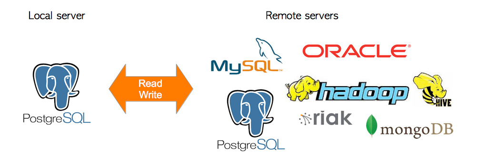
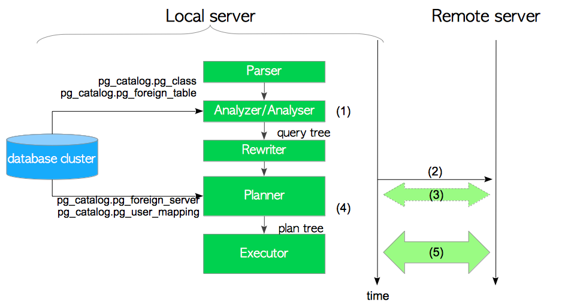
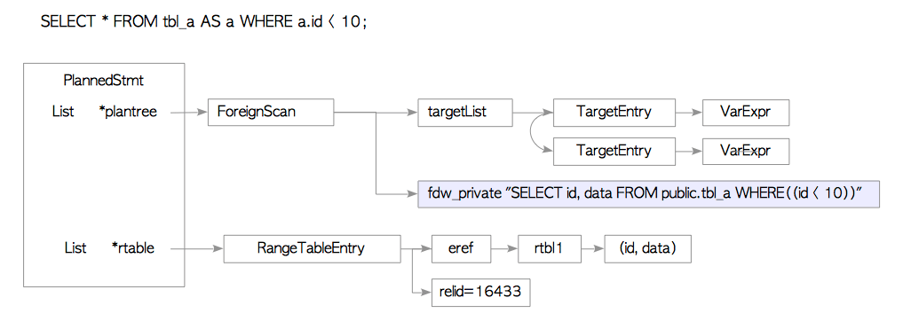
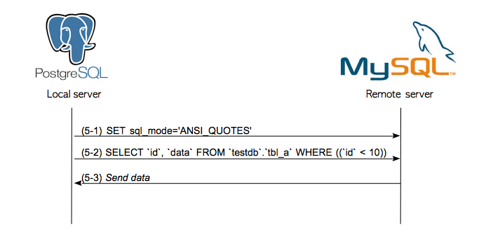
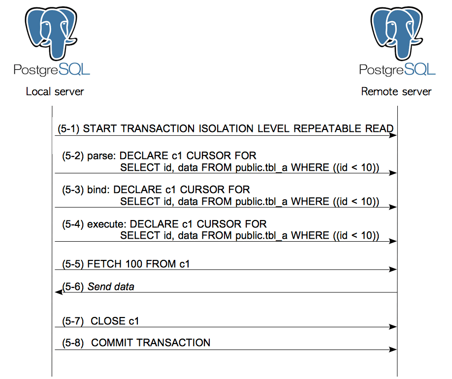
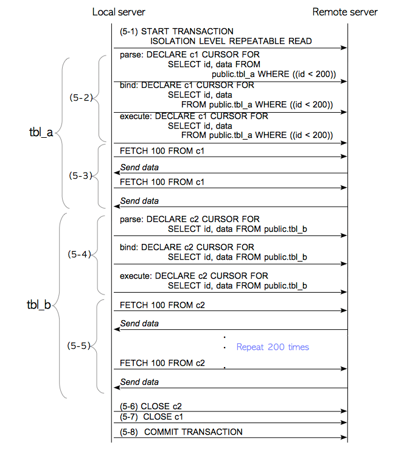
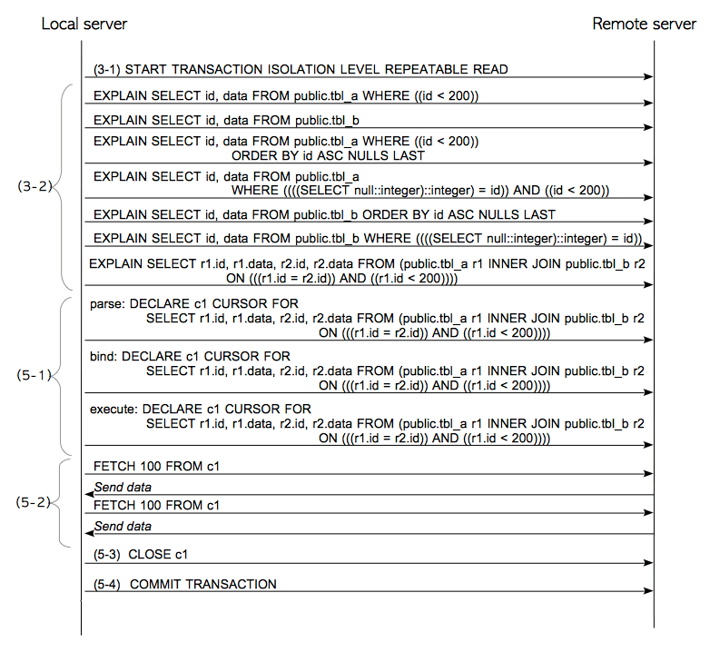

# 第4章 外部数据包装器与并行查询

[TOC]

本章将介绍两种相当实用，而且很有趣的特性：**外部数据包装器（Foreign Data Wrapper FDW）**和**并行查询（Parallel Query）**。


## 4.1. 外部数据包装器（FDW）

2003年，SQL标准中添加了一个访问远程数据的规范，称为[SQL外部数据管理](https://wiki.postgresql.org/wiki/)（SQL/MED）。PostgreSQL在9.1版本开发出了FDW，实现了一部分SQL/MED中的特性。

在SQL/MED中，远程服务器上的表被称为**外部表（Foreign Table）**。 PostgreSQL的**外部数据包装器（FDW）** 使用与本地表类似的方式，通过SQL/MED来管理外部表。

**图4.1 FDW的基本概念**



安装完必要的扩展并配置妥当后，就可以访问远程服务器上的外部表了。 例如假设有两个远程服务器分别名为 *postgresql* 和 *mysql*，它们上面分别有两张表：*foreign_pg_tbl* 和*foreign_my_tbl table*。 在这个例子中，可以在本地服务器上执行`SELECT`查询以访问外部表，如下所示。

```sql
localdb=# -- foreign_pg_tbl 在远程postgresql服务器上
localdb-# SELECT count(*) FROM foreign_pg_tbl;
 count 
-------
 20000

localdb=# -- foreign_my_tbl 在远程mysql服务器上
localdb-# SELECT count(*) FROM foreign_my_tbl;
 count 
-------
 10000
```

此外还可以在本地 JOIN 来自不同服务器中的外部表。

```sql
localdb=# SELECT count(*) FROM foreign_pg_tbl AS p, foreign_my_tbl AS m WHERE p.id = m.id;
 count 
-------
 10000
```

[Postgres wiki](https://wiki.postgresql.org/wiki/Foreign_data_wrappers)中列出了很多现有的FDW扩展。但只有[*postgres_fdw*](https://www.postgresql.org/docs/current/static/postgres-fdw.html) 与[*file_fdw*](https://www.postgresql.org/docs/current/static/file-fdw.html) 是由官方PostgreSQL全球开发组维护的。*postgres_fdw* 可用于访问远程的PostgreSQL服务器。

以下部分将详细介绍PostgreSQL的FDW。 4.1.1节为概述，4.1.2节介绍了*postgres_fdw*扩展的工作方式。

> #### Citus
>
> [Citus](https://github.com/citusdata/citus)是由[citusdata.com](https://www.citusdata.com)开发的开源PostgreSQL扩展，它能创建用于并行化查询的分布式PostgreSQL服务器集群。citus算是PostgreSQL生态中机制上最为复杂，且商业上最为成功的扩展之一，它也是一种FDW。


### 4.1.1. 概述

使用FDW特性需要先安装相应的扩展，并执行一些设置命令，例如[`CREATE FOREIGN TABLE`](https://www.postgresql.org/docs/current/static/sql-createforeigntable.html)，[`CREATE SERVER`](https://www.postgresql.org/docs/current/static/sql-createserver.html) 和[`CREATE USER MAPPING`](https://www.postgresql.org/docs/current/static/sql-createusermapping.html)（细节请参阅[官方文档](https://www.postgresql.org/docs/9.5/static/postgres-fdw.html#AEN180314)）。

在配置妥当之后，查询处理期间，执行器将会调用扩展中定义的相应函数来访问外部表。


**图4.2 FDW是如何执行的**



1. 分析器为输入的SQL创建一颗查询树。
2. 规划器（或执行器）连接到远程服务器。
3. 如果启用了[`use_remote_estimate`](https://www.postgresql.org/docs/current/static/postgres-fdw.html#id-1.11.7.43.10.4)选项（默认关闭），则计划器将执行`EXPLAIN`命令，以估计每条计划路径的代价。
4. 计划器按照计划树，创建出纯文本SQL语句，在内部称该过程为**逆解析（deparesing）**。
5. 执行器将纯文本SQL语句发送到远程服务器并接收结果。

如有必要，执行器会进一步处理接收到的结果。 例如执行多表查询时，执行器会将收到的数据与其他表做JOIN。

以下各节介绍了每一步中的具体细节。


#### 4.1.1.1. 创建一颗查询树

分析器基于外部表的定义创建输入SQL的查询树，外部表使用`CREATE FOREIGN TABLE`或`IMPORT FOREIGN SCHEMA`命令存储在`pg_catalog.pg_class`和`pg_catalog.pg_foreign_table`系统目录中。

#### 4.1.1.2. 连接至远程服务器

要连接到远程服务器，计划器（或执行器）使用特定库连接到远程数据库服务器。 例如，要连接到远程PostgreSQL服务器，`postgres_fdw`使用`libpq`。 要连接到mysql服务器，由EnterpriseDB开发的`mysql_fdw`使用`libmysqlclient`。

连接参数（例如用户名，服务器的IP地址和端口号）使用`CREATE USER MAPPING`和`CREATE SERVER`命令存储在`pg_catalog.pg_user_mapping`和`pg_catalog.pg_foreign_server`目录中。

#### 4.1.1.3. 使用EXPLAIN命令创建一颗计划树（可选）

PostgreSQL的FDW支持该功能，以获取外部表的统计信息，以估计查询的计划树，这些扩展有一些FDW扩展使用，例如`postgres_fdw`，`mysql_fdw`，`tds_fdw`和`jdbc2_fdw`。

如果使用`ALTER SERVER`命令将`use_remote_estimate`选项设置为on，则计划程序通过执行`EXPLAIN`命令查询到远程服务器的计划成本；否则，默认使用嵌入的常量值。

```sql
localdb=# ALTER SERVER remote_server_name OPTIONS (use_remote_estimate 'on');
```

虽然，某些扩展使用`EXPLAIN`命令的值，但只有`postgres_fdw`可以理解EXPLAIN命令的结果，因为PostgreSQL的`EXPLAIN`命令返回启动和总成本。

其他数据库FDW扩展无法使用`EXPLAIN`命令的结果进行规划。 例如，mysql的EXPLAIN命令仅返回估计的行数; 但是，PostgreSQL的规划器需要更多信息来估算成本，如[第3章](ch3.md)所述。

#### 4.1.1.4 逆解析

要生成计划树，计划程序将从计划树的外部表的扫描路径创建纯文本SQL语句。 例如图4.3显示了以下SELECT语句的计划树。

```sql
localdb=# SELECT * FROM tbl_a AS a WHERE a.id < 10;
```

图4.3显示了从`PlannedStmt`的计划树指向的`ForeignScan`节点，存储了一个普通的`SELECT`文本。 这里，`postgres_fdw`从查询树中重新创建一个普通的`SELECT`文本，该文本是通过解析和分析创建的，在PostgreSQL中称为**逆解析（deparsing）**。

**图4.3 扫描外部表的计划树例子**



使用`mysql_fdw`会从查询树重新创建MySQL的`SELECT`文本。 使用`redis_fdw`或`rw_redis_fdw`会创建一条Redis中的`SELECT`命令。

#### 4.1.1.5 发送SQL命令并接收结果

在执行逆解析之后，执行器将解压缩的SQL语句发送到远程服务器并接收结果。

将SQL语句发送到远程服务器的方法取决于每个扩展的开发者。 例如*mysql_fdw*在不使用事务的情况下发送SQL语句。 在mysql_fdw中执行SELECT查询的典型SQL语句序列如下所示（图4.4）。

（5-1）将SQL_MODE设置为“ANSI_QUOTES”。
（5-2）将SELECT语句发送到远程服务器。
（5-3）从远程服务器接收结果。
在这里，mysql_fdw将结果转换为PostgreSQL的可读数据。

所有FDW扩展都实现了将结果转换为PostgreSQL可读数据的功能。

**图4.4 基于mysql_fdw的SELECT语句的典型执行序列**



这里是远程服务器的实际日志; 显示远程服务器收到的语句。

```sql
mysql> SELECT command_type,argument FROM mysql.general_log;
+--------------+-----------------------------------------------------------------------+
| command_type | argument                                                              |
+--------------+-----------------------------------------------------------------------+
... snip ...

| Query        | SET sql_mode='ANSI_QUOTES'                                            |
| Prepare      | SELECT `id`, `data` FROM `localdb`.`tbl_a` WHERE ((`id` < 10))         |
| Close stmt   |                                                                       |
+--------------+-----------------------------------------------------------------------+
```

在postgres_fdw中，SQL命令的顺序很复杂。 在postgres_fdw中执行SELECT查询的典型SQL语句序列如下所示（图4.5）。

（5-1）启动远程事务。默认的远程事务隔离级别是REPEATABLE READ; 如果本地事务的隔离级别设置为SERIALIZABLE，则远程事务也设置为SERIALIZABLE。

（5-2）-（5-4）声明光标。SQL语句基本上作为游标执行。

（5-5）执行FETCH命令以获得结果。缺省情况下，FETCH命令获取100行。

（5-6）从远程服务器接收结果。

（5-7）关闭光标。

（5-8）提交远程事务。


**图4.5 基于postgres_fdw的SELECT语句的典型执行序列**



这里是远程服务器的实际日志。

```
LOG:  statement: START TRANSACTION ISOLATION LEVEL REPEATABLE READ
LOG:  parse : DECLARE c1 CURSOR FOR SELECT id, data FROM public.tbl_a WHERE ((id < 10))
LOG:  bind : DECLARE c1 CURSOR FOR SELECT id, data FROM public.tbl_a WHERE ((id < 10))
LOG:  execute : DECLARE c1 CURSOR FOR SELECT id, data FROM public.tbl_a WHERE ((id < 10))
LOG:  statement: FETCH 100 FROM c1
LOG:  statement: CLOSE c1
LOG:  statement: COMMIT TRANSACTION
```

> #### postgres_fdw中远程事务的默认隔离级别
>
> 远程事务的默认隔离级别为`REPEATABLE READ`，官方文档给出了原因和说明：
>
> > 当本地事务使用`SERIALIZABLE`隔离级别时，远程事务也使用`SERIALIZABLE`隔离级别，否则使用`REPEATABLE READ`隔离级别。 这样做可以确保在远程服务器上执行多次表扫描时，所有的扫描结果之间保持一致。因此即使其他活动在远程服务器上进行了并发更新，单个事务中的连续查询也将看到来自远程服务器上的一致性快照。


### 4.1.2 postgres_fdw的工作原理

postgres_fdw扩展是一个由PostgreSQL全球开发组正式维护的特殊模块，其源代码包含在PostgreSQL源代码树中。

postgres_fdw正处于不断改善的过程中。 表4.1列出了官方文档中与postgres_fdw相关的发行说明。

**表4.1 与postgres_fdw有关的发布说明（摘自官方文档）**

| 版本 | 描述                                                         |
| ---- | ------------------------------------------------------------ |
| 9.3  | `postgres_fdw`模块正式发布                                   |
| 9.6  | 在远程服务器上执行排序<br />在远程服务器上执行连接<br />如果可行，在远程服务器上执行UPDATE与DELETE<br />允许在服务器与表的选项中设置批量拉取结果集的大小 |
| 10   | 如果可行， 将聚合函数下推至远程服务器                        |
鉴于前一节描述了postgres_fdw如何处理单表查询。以下小节介绍postgres_fdw如何处理多表查询，排序操作和聚合函数。

本小节重点介绍SELECT语句; 但是，postgres_fdw还可以处理其他DML（INSERT，UPDATE和DELETE）语句，如下所示。

> **PostgreSQL的FDW没有死锁检测。**
>
> postgres_fdw和FDW功能不支持分布式锁管理器和分布式死锁检测功能。 因此，可以容易地生成死锁。 例如，如果Client_A更新本地表'tbl_local'并且外表'tbl_remote'和Client_B更新'tbl_remote'和'tbl_local'，则这两个事务处于死锁但PostgreSQL无法检测到。 因此，无法提交这些事务。
>
> ```sql
> localdb=# -- Client A
> localdb=# BEGIN;
> BEGIN
> localdb=# UPDATE tbl_local SET data = 0 WHERE id = 1;
> UPDATE 1
> localdb=# UPDATE tbl_remote SET data = 0 WHERE id = 1;
> UPDATE 1
> ```
>
> ```sql
> localdb=# -- Client B
> localdb=# BEGIN;
> BEGIN
> localdb=# UPDATE tbl_remote SET data = 0 WHERE id = 1;
> UPDATE 1
> localdb=# UPDATE tbl_local SET data = 0 WHERE id = 1;
> UPDATE 1
> ```

#### 4.1.2.1 多表查询

为了执行多表查询，postgres_fdw使用单表SELECT语句获取每个外表，然后在本地服务器上进行连接操作。

在9.5或更早版本中，即使外部表存储在同一个远程服务器中，postgres_fdw也会单独获取它们并连接。

在版本9.6或更高版本中，postgres_fdw已得到改进，当外部表位于同一服务器上且use_remote_estimate选项打开时，可以在远程服务器上执行远程连接操作。

执行细节描述如下。

**9.5版或更早版本：**

我们探讨PostgreSQL如何处理以下连接两个外表的查询：tbl_a和tbl_b。

```sql
localdb=# SELECT * FROM tbl_a AS a, tbl_b AS b WHERE a.id = b.id AND a.id < 200;
```

EXPLAIN执行结果如下

```sql
localdb=# EXPLAIN SELECT * FROM tbl_a AS a, tbl_b AS b WHERE a.id = b.id AND a.id < 200;
                                  QUERY PLAN                                  
------------------------------------------------------------------------------
 Merge Join  (cost=532.31..700.34 rows=10918 width=16)
   Merge Cond: (a.id = b.id)
   ->  Sort  (cost=200.59..202.72 rows=853 width=8)
         Sort Key: a.id
         ->  Foreign Scan on tbl_a a  (cost=100.00..159.06 rows=853 width=8)
   ->  Sort  (cost=331.72..338.12 rows=2560 width=8)
         Sort Key: b.id
         ->  Foreign Scan on tbl_b b  (cost=100.00..186.80 rows=2560 width=8)
(8 rows)
```

结果显示执行器选择合并连接算法并按以下步骤处理：

第8行：执行器使用外部表扫描获取表tbl_a。

第6行：执行器在本地服务器上对获取的tbl_a行进行排序。

第11行：执行器使用外表扫描获取表tbl_b。

第9行：执行器在本地服务器上对获取的tbl_b行进行排序。

第4行：执行器在本地服务器上执行合并连接操作。
下面描述了执行器如何获取行（图4.6）。

（5-1）启动远程事务。

（5-2）声明游标c1，其SELECT语句如下所示：

```sql
SELECT id，data FROM public.tbl_a WHERE（id <200）
```

（5-3）执行FETCH命令以获得光标1的结果。

（5-4）声明游标c2，其SELECT语句如下所示：

```sql
SELECT id，data FROM public.tbl_b
```

请注意，原始双表查询的WHERE子句是“tbl_a.id = tbl_b.id AND tbl_a.id <200”;因此，WHERE子句“tbl_b.id <200”可以逻辑方式添加到SELECT语句中，如前所示。但是，postgres_fdw无法执行此推断;因此，执行器必须执行不包含任何WHERE子句的SELECT语句，并且必须获取外部表tbl_b的所有行。

此过程效率低下，因为必须通过网络从远程服务器读取不必要的行。此外，必须对接收的行进行排序以执行合并连接。

（5-5）执行FETCH命令以获得光标2的结果。

（5-6）关闭光标c1。

（5-7）关闭光标c2。

（5-8）提交交易。

**图4.6 在9.5之后的版本执行多表查询的执行序列**



这里是远程服务器的实际日志。

```
LOG:  statement: START TRANSACTION ISOLATION LEVEL REPEATABLE READ
LOG:  parse : DECLARE c1 CURSOR FOR
      SELECT id, data FROM public.tbl_a WHERE ((id < 200))
LOG:  bind : DECLARE c1 CURSOR FOR
      SELECT id, data FROM public.tbl_a WHERE ((id < 200))
LOG:  execute : DECLARE c1 CURSOR FOR
      SELECT id, data FROM public.tbl_a WHERE ((id < 200))
LOG:  statement: FETCH 100 FROM c1
LOG:  statement: FETCH 100 FROM c1
LOG:  parse : DECLARE c2 CURSOR FOR
      SELECT id, data FROM public.tbl_b
LOG:  bind : DECLARE c2 CURSOR FOR
      SELECT id, data FROM public.tbl_b
LOG:  execute : DECLARE c2 CURSOR FOR
      SELECT id, data FROM public.tbl_b
LOG:  statement: FETCH 100 FROM c2
LOG:  statement: FETCH 100 FROM c2
LOG:  statement: FETCH 100 FROM c2
LOG:  statement: FETCH 100 FROM c2

... snip

LOG:  statement: FETCH 100 FROM c2
LOG:  statement: FETCH 100 FROM c2
LOG:  statement: FETCH 100 FROM c2
LOG:  statement: FETCH 100 FROM c2
LOG:  statement: CLOSE c2
LOG:  statement: CLOSE c1
LOG:  statement: COMMIT TRANSACTION
```

在接收到行之后，执行器对接收到的tbl_a和tbl_b行进行排序，然后对已排序的行执行合并连接操作。

**版本9.6或更高版本：**

如果启用了`use_remote_estimate`选项（默认为关闭），则postgres_fdw会发送几个EXPLAIN命令以获取与外部表相关的所有计划的成本。

要发送`EXPLAIN`命令，`postgres_fdw`将发送每个单表查询的`EXPLAIN`命令和`SELECT`语句的`EXPLAIN`命令，以执行远程连接操作。 在此示例中，将以下七个EXPLAIN命令发送到远程服务器以获取每个SELECT语句的估计成本; 然后计划者选择最便宜的计划。

**图4.7 9.6之后的远程连接操作的SQL执行序列**



```sql
(1) EXPLAIN SELECT id, data FROM public.tbl_a WHERE ((id < 200))
(2) EXPLAIN SELECT id, data FROM public.tbl_b
(3) EXPLAIN SELECT id, data FROM public.tbl_a WHERE ((id < 200)) ORDER BY id ASC NULLS LAST
(4) EXPLAIN SELECT id, data FROM public.tbl_a WHERE ((((SELECT null::integer)::integer) = id)) AND ((id < 200))
(5) EXPLAIN SELECT id, data FROM public.tbl_b ORDER BY id ASC NULLS LAST
(6) EXPLAIN SELECT id, data FROM public.tbl_b WHERE ((((SELECT null::integer)::integer) = id))
(7) EXPLAIN SELECT r1.id, r1.data, r2.id, r2.data FROM (public.tbl_a r1 INNER JOIN public.tbl_b r2 ON (((r1.id = r2.id)) AND ((r1.id < 200))))
```

让我们在本地服务器上执行EXPLAIN命令，以观察规划器选择的计划。

```sql
localdb=# EXPLAIN SELECT * FROM tbl_a AS a, tbl_b AS b WHERE a.id = b.id AND a.id < 200;
                        QUERY PLAN                         
-----------------------------------------------------------
 Foreign Scan  (cost=134.35..244.45 rows=80 width=16)
   Relations: (public.tbl_a a) INNER JOIN (public.tbl_b b)
(2 rows)
```

结果显示计划程序选择在远程服务器上处理的内部联接查询，这非常有效。

以下描述了如何执行postgres_fdw（图4.7）。

（3-1）启动远程事务。

（3-2）执行EXPLAIN命令以估计每个计划路径的成本。在此示例中，执行了七个EXPLAIN命令。然后，计划程序使用执行的EXPLAIN命令的结果选择最便宜的SELECT查询成本。

（5-1）声明游标c1，其SELECT语句如下所示：

（5-2）从远程服务器接收结果。

（5-3）关闭光标c1。

（5-4）提交事务。

这里是远程服务器的实际日志。

```sql
LOG:  statement: START TRANSACTION ISOLATION LEVEL REPEATABLE READ
LOG:  statement: EXPLAIN SELECT id, data FROM public.tbl_a WHERE ((id < 200))
LOG:  statement: EXPLAIN SELECT id, data FROM public.tbl_b
LOG:  statement: EXPLAIN SELECT id, data FROM public.tbl_a WHERE ((id < 200)) ORDER BY id ASC NULLS LAST
LOG:  statement: EXPLAIN SELECT id, data FROM public.tbl_a WHERE ((((SELECT null::integer)::integer) = id)) AND ((id < 200))
LOG:  statement: EXPLAIN SELECT id, data FROM public.tbl_b ORDER BY id ASC NULLS LAST
LOG:  statement: EXPLAIN SELECT id, data FROM public.tbl_b WHERE ((((SELECT null::integer)::integer) = id))
LOG:  statement: EXPLAIN SELECT r1.id, r1.data, r2.id, r2.data FROM (public.tbl_a r1 INNER JOIN public.tbl_b r2 ON (((r1.id = r2.id)) AND ((r1.id < 200))))
LOG:  parse: DECLARE c1 CURSOR FOR
	   SELECT r1.id, r1.data, r2.id, r2.data FROM (public.tbl_a r1 INNER JOIN public.tbl_b r2 ON (((r1.id = r2.id)) AND ((r1.id < 200))))
LOG:  bind: DECLARE c1 CURSOR FOR
	   SELECT r1.id, r1.data, r2.id, r2.data FROM (public.tbl_a r1 INNER JOIN public.tbl_b r2 ON (((r1.id = r2.id)) AND ((r1.id < 200))))
LOG:  execute: DECLARE c1 CURSOR FOR
	   SELECT r1.id, r1.data, r2.id, r2.data FROM (public.tbl_a r1 INNER JOIN public.tbl_b r2 ON (((r1.id = r2.id)) AND ((r1.id < 200))))
LOG:  statement: FETCH 100 FROM c1
LOG:  statement: FETCH 100 FROM c1
LOG:  statement: CLOSE c1
LOG:  statement: COMMIT TRANSACTION
```

请注意，如果禁用 `use_remote_estimate`选项（默认情况下），则很少选择远程连接查询，因为会使用非常大的嵌入值来估算成本。

#### 4.1.2.2 排序操作

在9.5或更早版本中，排序操作（如ORDER BY）在本地服务器上处理，即本地服务器在排序操作之前从远程服务器获取所有目标行。让我们探讨如何使用EXPLAIN命令处理包含ORDER BY子句的简单查询。

```sql
localdb=# EXPLAIN SELECT * FROM tbl_a AS a WHERE a.id < 200 ORDER BY a.id;
                              QUERY PLAN                               
-----------------------------------------------------------------------
 Sort  (cost=200.59..202.72 rows=853 width=8)
   Sort Key: id
   ->  Foreign Scan on tbl_a a  (cost=100.00..159.06 rows=853 width=8)
(3 rows)
```

第6行：执行器将以下查询发送到远程服务器，然后获取查询结果。

```
SELECT id, data FROM public.tbl_a WHERE ((id < 200))
```

第4行：执行器在本地服务器上对获取的tbl_a行进行排序。

这里是远程服务器的实际日志。

```
LOG:  statement: START TRANSACTION ISOLATION LEVEL REPEATABLE READ
LOG:  parse : DECLARE c1 CURSOR FOR
      SELECT id, data FROM public.tbl_a WHERE ((id < 200))
LOG:  bind : DECLARE c1 CURSOR FOR
      SELECT id, data FROM public.tbl_a WHERE ((id < 200))
LOG:  execute : DECLARE c1 CURSOR FOR
      SELECT id, data FROM public.tbl_a WHERE ((id < 200))
LOG:  statement: FETCH 100 FROM c1
LOG:  statement: FETCH 100 FROM c1
LOG:  statement: CLOSE c1
LOG:  statement: COMMIT TRANSACTION
```

在版本9.6或更高版本中，如果可能，postgres_fdw可以在远程服务器上使用ORDER BY子句执行SELECT语句。

```sql
localdb=# EXPLAIN SELECT * FROM tbl_a AS a WHERE a.id < 200 ORDER BY a.id;
                           QUERY PLAN                            
-----------------------------------------------------------------
 Foreign Scan on tbl_a a  (cost=100.00..167.46 rows=853 width=8)
(1 row)
```

第4行：执行程序将具有ORDER BY子句的以下查询发送到远程服务器，然后获取已排序的查询结果。

```sql
SELECT id, data FROM public.tbl_a WHERE ((id < 200)) ORDER BY id ASC NULLS LAST
```

这里是远程服务器的实际日志。

```sql
LOG:  statement: START TRANSACTION ISOLATION LEVEL REPEATABLE READ
LOG:  parse : DECLARE c1 CURSOR FOR
	   SELECT id, data FROM public.tbl_a WHERE ((id < 200)) ORDER BY id ASC NULLS LAST
LOG:  bind : DECLARE c1 CURSOR FOR
	   SELECT id, data FROM public.tbl_a WHERE ((id < 200)) ORDER BY id ASC NULLS LAST
LOG:  execute : DECLARE c1 CURSOR FOR
	   SELECT id, data FROM public.tbl_a WHERE ((id < 200)) ORDER BY id ASC NULLS LAST
LOG:  statement: FETCH 100 FROM c1
LOG:  statement: FETCH 100 FROM c1
LOG:  statement: CLOSE c1
LOG:  statement: COMMIT TRANSACTION
```

#### 4.1.2.3 聚合函数

在版本9.6或更早版本中，类似于前一小节中提到的排序操作，AVG()和COUNT()等聚合函数将在本地服务器上处理，如下所示。

```sql
localdb=# EXPLAIN SELECT AVG(data) FROM tbl_a AS a WHERE a.id < 200;
                              QUERY PLAN                               
-----------------------------------------------------------------------
 Aggregate  (cost=168.50..168.51 rows=1 width=4)
   ->  Foreign Scan on tbl_a a  (cost=100.00..166.06 rows=975 width=4)
(2 rows)
```

第5行：执行器将以下查询发送到远程服务器，然后获取查询结果。

```sql
SELECT id, data FROM public.tbl_a WHERE ((id < 200))
```

第4行：执行器计算本地服务器上获取的tbl_a行的平均值。
这里远程服务器的实际日志。此过程成本很高，因为发送大量行会消耗大量网络流量并且需要很长时间。

```sql
LOG:  statement: START TRANSACTION ISOLATION LEVEL REPEATABLE READ
LOG:  parse : DECLARE c1 CURSOR FOR
      SELECT data FROM public.tbl_a WHERE ((id < 200))
LOG:  bind : DECLARE c1 CURSOR FOR
      SELECT data FROM public.tbl_a WHERE ((id < 200))
LOG:  execute : DECLARE c1 CURSOR FOR
      SELECT data FROM public.tbl_a WHERE ((id < 200))
LOG:  statement: FETCH 100 FROM c1
LOG:  statement: FETCH 100 FROM c1
LOG:  statement: CLOSE c1
LOG:  statement: COMMIT TRANSACTION
```

在版本10或更高版本中，如果可能，postgres_fdw将在远程服务器上使用聚合函数执行SELECT语句。

```sql
localdb=# EXPLAIN SELECT AVG(data) FROM tbl_a AS a WHERE a.id < 200;
                     QUERY PLAN                      
-----------------------------------------------------
 Foreign Scan  (cost=102.44..149.03 rows=1 width=32)
   Relations: Aggregate on (public.tbl_a a)
(2 rows)
```

第4行：执行器将包含AVG（）函数的以下查询发送到远程服务器，然后获取查询结果。

```sql
SELECT avg(data) FROM public.tbl_a WHERE ((id < 200))
```

这里是远程服务器的实际日志。此过程显然是高效的，因为远程服务器计算平均值并仅发送一行作为结果。

```
LOG:  statement: START TRANSACTION ISOLATION LEVEL REPEATABLE READ
LOG:  parse : DECLARE c1 CURSOR FOR
	   SELECT avg(data) FROM public.tbl_a WHERE ((id < 200))
LOG:  bind : DECLARE c1 CURSOR FOR
	   SELECT avg(data) FROM public.tbl_a WHERE ((id < 200))
LOG:  execute : DECLARE c1 CURSOR FOR
	   SELECT avg(data) FROM public.tbl_a WHERE ((id < 200))
LOG:  statement: FETCH 100 FROM c1
LOG:  statement: CLOSE c1
LOG:  statement: COMMIT TRANSACTION
```

> #### 下推
>
> 与上面的例子类似，**下推（push-down）** 指的是允许一些本地服务器上的操作在远程服务器上执行，例如聚合函数。


## 4.2 并行查询

施工中