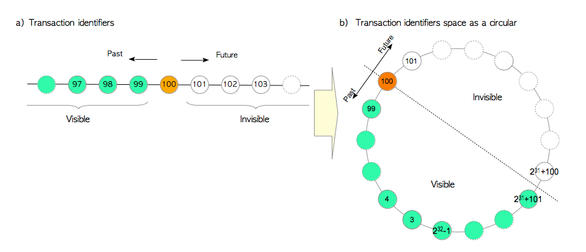
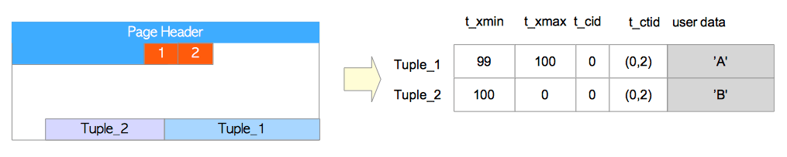
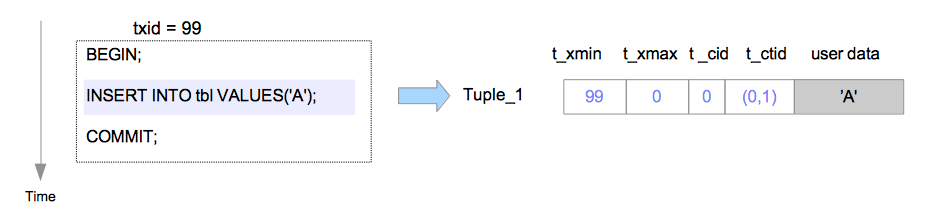
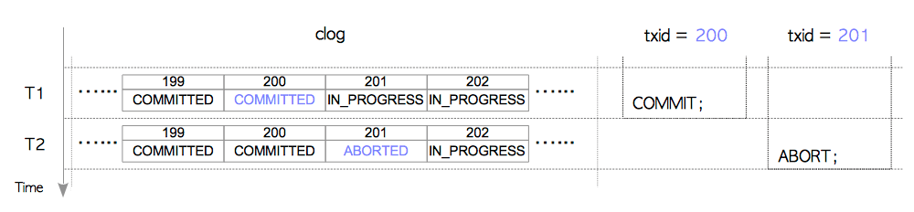
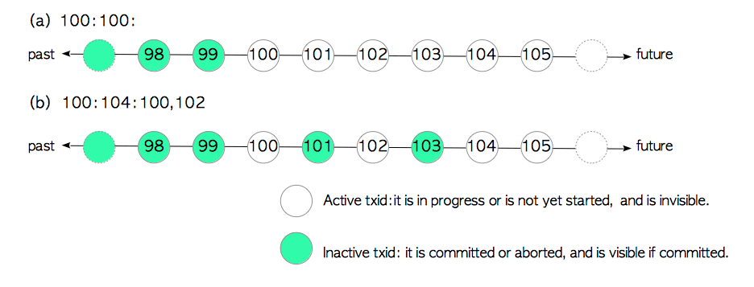
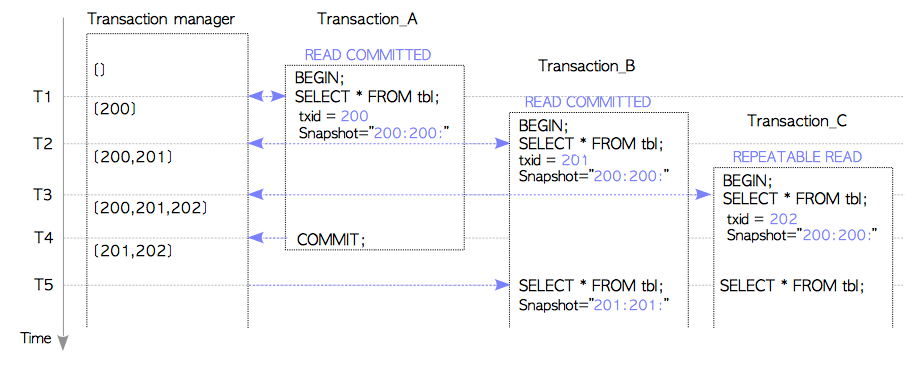
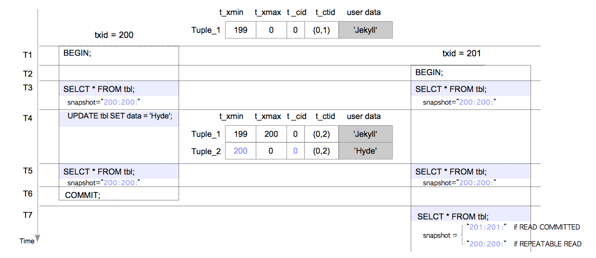
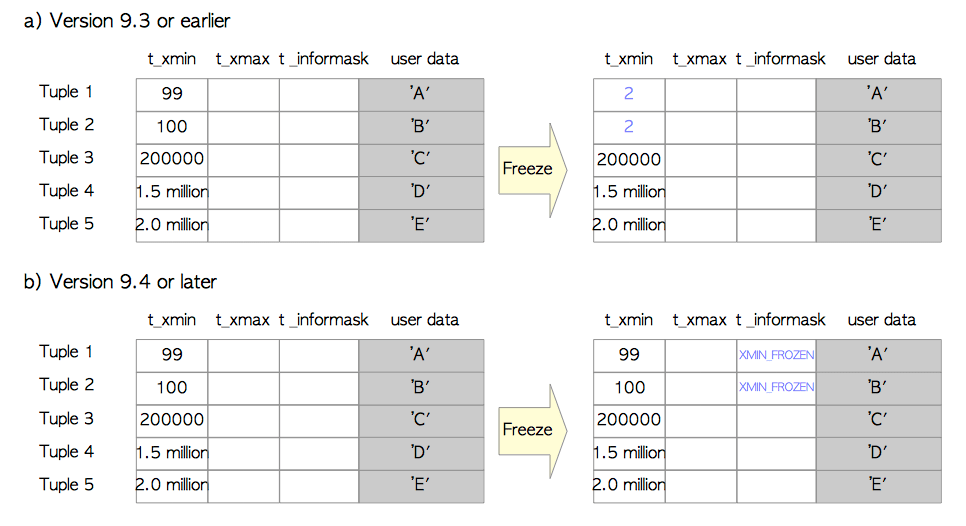

# 第五章 并发控制

[TOC]

​	当多个事务同时在数据库中运行时，**并发控制**是一种维持**一致性**与**隔离性**的技术，这是ACID的两个属性。

​	从宽泛的意义来说，有三种并发控制技术：**多版本并发控制（MVCC）**，**严格两阶段锁定（S2PL）**和**乐观并发控制（OCC）**，每种技术都有多种变体。在MVCC中，每个写操作都会创建数据项的一个新版本，同时保留旧版本。当事务读取数据对象时，系统会选择其中的一个版本，来确保各个事务间相互隔离。 MVCC的主要优势在于“读不会阻塞写，而写也不会阻塞读”，相反的例子是，基于S2PL的系统在写操作发生时必须阻塞读操作，因为因为写入者获取了对象的排他锁。 PostgreSQL和一些RDBMS使用一种MVCC的变体，称为**快照隔离（Snapshot Isolation，SI）**。

​	为了实现SI，一些RDBMS（例如Oracle）使用回滚段。当写入新的数据对象时，旧版本的对象先被写入回滚段，随后用新对象覆写至数据区域。 PostgreSQL使用更简单的方法：一个新数据对象被直接插入到相关的表页中。读取对象时，PostgreSQL通过**可见性检查规则**，为每个事物选择合适的对象版本作为响应。

​	在ANSI SQL-92标准中定义的三种异常，脏读，不可重复读和幻读不会在SI中出现。但SI无法实现真正的可串行化，因为可能会出现序列化异常：例如**写偏差（write skew）**和**只读事务偏差（Read-only Transaction Skew）**。需要注意的是：ANSI SQL-92标准中可序列化的定义与现代理论中的定义**并不相同**。为了解决这个问题，PostgreSQL从9.1版本之后添加了**可序列化快照隔离（SSI，Serializable Snapshot Isolation）**，SSI可以检测序列化异常，并解决这种异常导致的冲突。因此，9.1版本之后的PostgreSQL提供了真正的`SERIALIZABLE`隔离等级。（此外，SQL Server也使用SSI，而Oracle仍然使用SI）。

本章包括以下四个部分：

* 第1部分：第5.1节至5.3节。

  本部分提供了解后续部分所需的基本信息。

  第5.1和5.2节分别描述了事务标识和元组结构。第5.3节展示了如何插入，删除和更新元组。

* 第2部分：第5.4节 至 5.6节。

  本部分说明了实现并发控制机制所需的关键功能。

  第5.4,5.5和5.6节描述了提交日志（clog），分别讲述了事务状态，事务快照和可见性检查规则。

* 第3部分：第5.7节-5.9节。

  本部分使用特定示例描述PostgreSQL中的并发控制。

  第5.7节描述了可见性检查。本节还说明如何防止ANSI SQL标准中定义的三个异常。第5.8节描述了防止丢失更新，第5.9节简要描述了SSI。

* 第4部分：第5.10节。

  本部分描述了永久运行并发控制机制所需的几个维护过程。维护过程通过清理过程进行，如第6章所述。

尽管有许多与并发控制相关的主题，本章重点介绍PostgreSQL独有的主题。请注意，这里省略了死锁预和锁模式的描述（有关更多信息，请参阅官方文档）。

> ### PostgreSQL中的事务隔离等级
>
> PostgreSQL实现的事务隔离等级如下表所示：
>
> |  隔离等级   |  脏读  | 不可重复读 |               幻读               | 序列化异常 |
> | :---------: | :----: | :--------: | :------------------------------: | :--------: |
> |  读已提交   | 不可能 |    可能    |               可能               |    可能    |
> | 可重复读(1) | 不可能 |   不可能   | PG中不可能<br />但ANSI SQL中可能 |    可能    |
> |  可序列化   | 不可能 |   不可能   |              不可能              |   不可能   |
>
> (1)：在9.0及更早版本中，此级别被当做`SERIALIZABLE`，因为它不会出现ANSI SQL-92标准中定义的三种异常。 但随着9.1版中SSI的实现，该级别已被改称为`REPEATABLE READ`，并引入了真正的`SERIALIZABLE`级别。

> PostgreSQL对DML（增删改查）使用SSI，对DDL（CREATE，DROP等）使用2PL。


## 5.1 事务ID

​	每当事务开始时，事务管理器就会分配一个称为**事务标识（txid）**的唯一标识符。 PostgreSQL的txid是一个32位无符号整数，大约42亿。如果在事务启动后执行内置的`txid_current()`函数，该函数将返回当前的txid，如下所示。

```
testdb=# BEGIN;
BEGIN
testdb=# SELECT txid_current();
 txid_current 
--------------
          100
(1 row)
```

PostgreSQL保留以下三个特殊txid：

* 0表示无效的txid。
* 1表示Bootstrap txid，仅用于数据库集群的初始化。
* 2表示冻结txid，如第5.10.1节所述。

Txids可以相互比较。例如，对于txid=100的事务，大于100的txids是“未来的”，并且从txid=100之后的txid都是不可见的；小于100的txids是“过去”且可见的（图5.1a））。

**图5.1  PostgreSQL中的事务ID**



由于实际系统中的txid空间不足，PostgreSQL将txid空间视为一个圆。之前的21亿txids是'过去'，接下来的21亿txids是'未来'（图5.1 b）。

请注意，所谓的txid环绕问题在第5.10.1节中描述。

>
> 请注意，不会为BEGIN命令分配txid。在PostgreSQL中，当执行BEGIN命令后执行第一个命令时，事务管理器会分配tixd，然后启动其事务。


## 5.2 元组结构

表页中的堆元组被分类为普通数据元组和TOAST元组。本节仅介绍普通数据元组。

堆元组包括三个部分，即HeapTupleHeaderData结构，NULL位图和用户数据（图5.2）。

**图5.2 元组结构**


> `HeapTupleHeaderData`结构在src/include/access/htup_details.h中定义。

```c
typedef struct HeapTupleFields
{
        TransactionId t_xmin;		   /* inserting xact ID */
        TransactionId t_xmax;              /* deleting or locking xact ID */

        union
        {
                CommandId       t_cid;     /* inserting or deleting command ID, or both */
                TransactionId 	t_xvac;    /* old-style VACUUM FULL xact ID */
        } t_field3;
} HeapTupleFields;

typedef struct DatumTupleFields
{
        int32          datum_len_;          /* varlena header (do not touch directly!) */
        int32          datum_typmod;   	    /* -1, or identifier of a record type */
        Oid            datum_typeid;   	    /* composite type OID, or RECORDOID */

        /*                                                                                               
         * Note: field ordering is chosen with thought that Oid might someday                            
         * widen to 64 bits.                                                                             
         */
} DatumTupleFields;

typedef struct HeapTupleHeaderData
{
        union
        {
                HeapTupleFields t_heap;
                DatumTupleFields t_datum;
        } t_choice;

        ItemPointerData t_ctid;         /* 当前元组，或更新元组的TID */

        /* 下面的字段必需与结构MinimalTupleData相匹配! */
        uint16          t_infomask2;    /* 属性与标记位 */
        uint16          t_infomask;     /* 很多标记位 */
        uint8           t_hoff;         /* 首部+位图+填充的长度 */
        /* ^ - 23 bytes - ^ */
        bits8           t_bits[1];      /* NULL值的位图 —— 变长的 */

        /* 本结构后面还有更多数据 */
} HeapTupleHeaderData;

typedef HeapTupleHeaderData *HeapTupleHeader;
```


虽然HeapTupleHeaderData结构包含七个字段，但后续部分中需要四个字段。

* t_xmin保存插入此元组的事务的txid。
* t_xmax保存删除或更新此元组的事务的txid。如果尚未删除或更新此元组，则t_xmax设置为0，这意味着无效。
* t_cid保存命令id（cid），这意味着在从0开始的当前事务中执行此命令之前执行了多少SQL命令。例如，假设我们在单个事务中执行三个INSERT命令`BEGIN;INSERT;INSERT;INSERT;COMMIT;`。如果第一个命令插入此元组，则t_cid设置为0.如果第二个命令插入此命令，则t_cid设置为1，依此类推。
* t_ctid保存指向自身或新元组的元组标识符（tid）。第1.3节中描述的tid用于标识表中的元组。更新此元组时，此元组的t_ctid指向新元组;否则，t_ctid指向自己。


## 5.3 元组的增删改

本节介绍如何插入，删除和更新元组。然后，简要描述用于插入和更新元组的自由空间映射（FSM）。

要关注元组，页眉和行指针不会在下面表示。图5.3显示了如何表示元组的示例。

**图5.3 元组的表示**




### 5.3.1 插入

通过插入操作，新的元组将直接插入目标表的页面中（图5.4）。

**图5.4 插入元组**



假设通过txid为99的事务在页面中插入元组。在这种情况下，插入元组的头字段设置如下。

Tuple_1：

* t_xmin设置为99，因为此元组由txid 99插入。
* t_xmax设置为0，因为此元组尚未删除或更新。
* t_cid设置为0，因为此元组是txid 99插入的第一个元组。
* t_ctid设置为（0,1），指向自身，因为这是最新的元组。


> #### pageinspect
>
> PostgreSQL提供了一个扩展pageinspect，它是一个第三方贡献的模块，用于显示数据库页面的内容。
>
> ```sql
> testdb=# CREATE EXTENSION pageinspect;
> CREATE EXTENSION
> testdb=# CREATE TABLE tbl (data text);
> CREATE TABLE
> testdb=# INSERT INTO tbl VALUES('A');
> INSERT 0 1
> testdb=# SELECT lp as tuple, t_xmin, t_xmax, t_field3 as t_cid, t_ctid 
>                 FROM heap_page_items(get_raw_page('tbl', 0));
>  tuple | t_xmin | t_xmax | t_cid | t_ctid 
> -------+--------+--------+-------+--------
>      1 |     99 |      0 |     0 | (0,1)
> (1 row)
> ```

### 5.3.2 删除

在删除操作中，逻辑删除目标元组。执行DELETE命令的txid的值设置为元组的t_xmax（图5.5）。

**图5.5 删除元组**


假设txle_1被txid 111删除。在这种情况下，Tuple_1的头字段设置如下。

Tuple_1：

* t_xmax设置为111。

如果提交了txid 111，则不再需要Tuple_1。通常，不需要的元组在PostgreSQL中称为死元组。

应该最终从页面中删除死元组。清除死元组称为**清理（VACUUM）过程**，将在第6章中介绍。


### 5.3.3 更新

在更新操作中，PostgreSQL在逻辑上删除最新的元组并插入一个新的元组（图5.6）。

**图5.6 更新同一行两次**


假设由txid 99插入的行由txid 100更新两次。

当执行第一个UPDATE命令时，通过将txid 100设置为t_xmax来逻辑删除Tuple_1，然后插入Tuple_2。然后，重写Tuple_1的t_ctid以指向Tuple_2。 Tuple_1和Tuple_2的头字段如下。

Tuple_1：

* t_xmax设置为100。
* t_ctid从（0,1）重写为（0,2）。

Tuple_2：
* t_xmin设置为100。
* t_xmax设置为0。
* t_cid设置为0。
* t_ctid设置为（0,2）。
当执行第二个UPDATE命令时，如在第一个UPDATE命令中，逻辑删除Tuple_2并插入Tuple_3。 Tuple_2和Tuple_3的头字段如下。

Tuple_2：
* t_xmax设置为100。
* t_ctid从（0,2）重写为（0,3）。
  Tuple_3：
* t_xmin设置为100。
* t_xmax设置为0。
* t_cid设置为1。
* t_ctid设置为（0,3）。

与删除操作一样，如果提交了txid 100，则Tuple_1和Tuple_2将是死元组，并且如果txid 100被中止，则Tuple_2和Tuple_3将是死元组。


### 5.3.4 空闲空间映射

插入堆或索引元组时，PostgreSQL使用相应表或索引的FSM来选择可插入的页面。

如1.2.3节所述，所有表和索引都有各自的FSM。每个FSM在相应的表或索引文件中存储有关每个页面的可用空间容量的信息。

所有FSM都以后缀'fsm'存储，如有必要，它们将加载到共享内存中。

> #### pg_freespacemap
>
> 扩展`pg_freespacemap`提供指定表/索引的自由空间。以下查询显示指定表中每个页面的自由空间比率。
>
> ```bash
> testdb=# CREATE EXTENSION pg_freespacemap;
> CREATE EXTENSION
> 
> testdb=# SELECT *, round(100 * avail/8192 ,2) as "freespace ratio"
>                 FROM pg_freespace('accounts');
>  blkno | avail | freespace ratio 
> -------+-------+-----------------
>      0 |  7904 |           96.00
>      1 |  7520 |           91.00
>      2 |  7136 |           87.00
>      3 |  7136 |           87.00
>      4 |  7136 |           87.00
>      5 |  7136 |           87.00
> ....
> ```


## 5.4 提交日志（clog）

​	PostgreSQL在**提交日志（Commit Log，提交日志）**中保存事务的状态。提交日志（通常称为clog）被分配在共享内存中，并在整个事务处理过程中使用。

​	本节介绍PostgreSQL中的事务状态，clog的工作方式及维护过程。

### 5.4.1 事务状态

​	PostgreSQL定义了四种事务状态，即`IN_PROGRESS`，`COMMITTED`，`ABORTED`和`SUB_COMMITTED`。

前三种状态是显而易见的。例如，当事务正在进行时，其状态为`IN_PROGRESS`等。

`SUB_COMMITTED`用于子事务，本文档中省略了其描述。

### 5.4.2 clog如何工作

Clog包含共享内存中的一或多个8KB页面。 clog逻辑上形成一个数组。数组的索引对应于相应的事务id，并且数组中的每个项保存相应事务id的状态。图5.7显示了堵塞及其运行方式。

**图5.7 Clog如何运作**



> T1：txid 200次提交; txid 200的状态从IN_PROGRESS变为COMMITTED。
> T2：txid 201中止; txid 201的状态从IN_PROGRESS变为ABORTED。

当前的txid前进并且clog无法再存储它时，会附加一个新页面。

当需要事务的状态时，将调用内部函数。这些函数读取阻塞并返回所请求事务的状态。 （另请参见第5.7.1节中的“提示位”。）


### 5.4.3 clog的维护

​	当PostgreSQL关闭或检查点进程运行时，clog数据将写入存储在pg_clog子目录下的文件中。 （请注意，在版本10中，pg_clog将重命名为`pg_xact`。）这些文件名为0000,0001等。最大文件大小为256 KB。例如，当clog使用八个页面（第一页到第八页;总大小·为64 KB）时，其数据写入0000（64 KB），并且有37页（296 KB），数据写入到0000和0001，其大小分别为256 KB和40 KB。

​	当PostgreSQL启动时，加载存储在pg_clog文件（pg_xact文件）中的数据以初始化clog。

​	阻塞的大小不断增加，因为只要填充了阻塞，就会附加新的页面。但是，并非所有数据都是必要的。第6章中描述的真空处理定期删除这些旧数据（堵塞页面和文件）。有关删除堵塞数据的详细信息，请参见第6.4节。


## 5.5 事务快照

**事务快照**是一个数据集，用于在单个事务的特定时间点存储有关所有事务是否处于活动状态的信息。这里的活动交易意味着它正在进行中或尚未开始。

​	PostgreSQL在内部将事务快照的文本表示格式定义为`100:100:`。例如，'100：100：'表示'小于99的txids未激活，并且等于或大于100的txids处于活动状态'。在以下描述中，使用这种方便的表示形式。如果您不熟悉它，请参阅下文。

> ### 内置函数txid_current_snapshot及其表示
>
> 函数txid_current_snapshot显示当前事务的快照。
>
> ```
> testdb=# SELECT txid_current_snapshot();
>  txid_current_snapshot 
> -----------------------
>  100:104:100,102
> (1 row)
> ```
>
> txid_current_snapshot的文本表示是`xmin:xmax:xip_list`，组件描述如下。
>
> * **XMIN**
>
>   最早的txid仍然活跃。所有早期的事务都将被提交和可见，或者回滚并且死亡。
>
> * **XMAX**
>
>   第一个尚未分配的txid。所有大于或等于此的txids在快照时尚未启动，因此不可见。
>
> * **xip_list**
>
>   快照时的活动txids。该列表仅包括xmin和xmax之间的活动txid。
>   例如，在快照'100：104：100,102'中，xmin是'100'，xmax'104'和xip_list'100,102'。
>
> 以下显示了两个具体示例：
>
> **图5.8 事务快照表示的示例**
>
> 
>
> 第一个例子是'100：100：'。此快照表示以下内容（图5.8（a））：
>
> * 由于xmin为100，因此等于或小于99的txids不活动。
> * 等于或大于100的txids是活动的，因为xmax是100。
>
> 第二个例子是'100：104：100,102'。此快照表示以下内容（图5.8（b））：
>
> * 等于或小于99的txids无效。
> * 等于或大于104的txids是活动的。
> * txids 100和102是活动的，因为它们存在于xip列表中，而txids 101和103不活动。

​	事务管理器提供事务快照。在READ COMMITTED隔离级别，只要执行SQL命令，事务就会获得快照;否则（REPEATABLE READ或SERIALIZABLE），事务只在执行第一个SQL命令时获取快照。获取的事务快照用于元组的可见性检查，如第5.7节所述。

​	使用获取的快照进行可见性检查时，即使实际已提交或中止快照中的活动事务，也必须将其视为正在进行中。此规则很重要，因为它会导致READ COMMITTED和REPEATABLE READ（或SERIALIZABLE）之间的行为不同。我们在以下部分中反复参考此规则。

​	在本节的其余部分中，使用特定场景图5.9描述事务管理器和事务。

**图5.9 事务管理器与事务**



事务管理器始终保存有关当前运行的事务的信息。假设三个事务一个接一个地开始，并且Transaction_A和Transaction_B的隔离级别是READ COMMITTED，Transaction_C的隔离级别是REPEATABLE READ。

* T1：
Transaction_A启动并执行第一个SELECT命令。执行第一个命令时，Transaction_A请求此刻的txid和快照。在这种情况下，事务管理器分配txid 200，并返回事务快照'200：200：'。
* T2：
Transaction_B启动并执行第一个SELECT命令。事务管理器分配txid 201，并返回事务快照'200：200：'，因为Transaction_A（txid 200）正在进行中。因此，无法从Transaction_B中看到Transaction_A。
* T3：
Transaction_C启动并执行第一个SELECT命令。事务管理器分配txid 202，并返回事务快照'200：200：'，因此，Transaction_A和Transaction_B不能从Transaction_C中看到。
* T4：
Transaction_A已提交。事务管理器删除有关此事务的信息。
* T5：
Transaction_B和Transaction_C执行它们各自的SELECT命令。
Transaction_B需要事务快照，因为它处于READ COMMITTED级别。在这种情况下，Transaction_B获取新快照'201：201：'，因为Transaction_A（txid 200）已提交。因此，Transaction_B不再是Transaction_B中不可见的。
Transaction_C不需要事务快照，因为它处于REPEATABLE READ级别并使用获得的快照，即'200：200：'。因此，Transaction_A仍然是Transaction_C不可见的。


## 5.6 可见性检查规则

可见性检查规则是一组规则，用于使用元组的t_xmin和t_xmax，clog以及获取的事务快照来确定每个元组是可见还是不可见。这些规则太复杂，无法详细解释。因此，本文档显示了后续描述所需的最小规则。在下文中，我们省略了与子事务相关的规则，并忽略了关于t_ctid的讨论，即我们不考虑在事务中已更新两次以上的元组。

所选规则的数量为10，并且可以分为三种情况。

### 5.6.1  t_xmin的状态为ABORTED

t_xmin状态为ABORTED的元组始终不可见（规则1），因为插入此元组的事务已中止。

```sql
 /* t_xmin status = ABORTED */
Rule 1: IF t_xmin status is 'ABORTED' THEN
                  RETURN 'Invisible'
            END IF
```

该规则明确表示为以下数学表达式。

* 规则1：如果状态（t_xmin）=ABORTED⇒不可见

### 5.6.2  t_xmin的状态为IN_PROGRESS

t_xmin状态为IN_PROGRESS的元组基本上是不可见的（规则3和4），但在一个条件下除外。

```SQL
 /* t_xmin status = IN_PROGRESS */
              IF t_xmin status is 'IN_PROGRESS' THEN
            	   IF t_xmin = current_txid THEN
Rule 2:              IF t_xmax = INVALID THEN
			      RETURN 'Visible'
Rule 3:              ELSE  /* this tuple has been deleted or updated by the current transaction itself. */
			      RETURN 'Invisible'
                         END IF
Rule 4:        ELSE   /* t_xmin ≠ current_txid */
		          RETURN 'Invisible'
                   END IF
             END IF
```

如果这个元组被另一个事务插入并且t_xmin的状态是IN_PROGRESS，则该元组显然是不可见的（规则4）。

如果t_xmin等于当前txid（即，当前事务插入了该元组）并且t_xmax不是INVALID，则该元组是不可见的，因为它已被当前事务更新或删除（规则3）。

异常条件是当前事务插入此元组并且t_xmax为INVALID的情况。 在这种情况下，此元组在当前事务中可见（规则2）。

* 规则2：如果状态（t_xmin）=IN_PROGRESS∧t_xmin=current_txid∧t_xmax=INVAILD⇒可见
* 规则3：如果状态（t_xmin）=IN_PROGRESS∧t_xmin=current_txid∧t_xmax≠INVAILD⇒隐形
* 规则4：如果状态（t_xmin）=IN_PROGRESS∧t_xmin≠current_txid⇒隐形

### 5.6.3  t_xmin的状态为COMMITTED

t_xmin状态为COMMITTED的元组是可见的（规则6,8和9），但在三个条件下除外。

```sql
 /* t_xmin status = COMMITTED */
            IF t_xmin status is 'COMMITTED' THEN
Rule 5:      IF t_xmin is active in the obtained transaction snapshot THEN
                      RETURN 'Invisible'
Rule 6:      ELSE IF t_xmax = INVALID OR status of t_xmax is 'ABORTED' THEN
                      RETURN 'Visible'
            	 ELSE IF t_xmax status is 'IN_PROGRESS' THEN
Rule 7:           IF t_xmax =  current_txid THEN
                            RETURN 'Invisible'
Rule 8:           ELSE  /* t_xmax ≠ current_txid */
                            RETURN 'Visible'
                      END IF
            	 ELSE IF t_xmax status is 'COMMITTED' THEN
Rule 9:           IF t_xmax is active in the obtained transaction snapshot THEN
                            RETURN 'Visible'
Rule 10:         ELSE
                            RETURN 'Invisible'
                      END IF
            	 END IF
            END IF
```

规则6是显而易见的，因为t_xmax是INVALID或ABORTED。三个例外条件以及规则8和9都描述如下。

第一个例外情况是t_xmin在获取的事务快照中处于活动状态（规则5）。在这种情况下，这个元组是不可见的，因为t_xmin应该被视为正在进行中。

第二个例外情况是t_xmax是当前的txid（规则7）。在这种情况下，与规则3一样，此元组是不可见的，因为它已被此事务本身更新或删除。

相反，如果t_xmax的状态是IN_PROGRESS并且t_xmax不是当前的txid（规则8），则元组是可见的，因为它尚未被删除。

第三个例外情况是t_xmax的状态为COMMITTED，并且t_xmax在获取的事务快照中不活动（规则10）。在这种情况下，此元组是不可见的，因为它已被另一个事务更新或删除。

相反，如果t_xmax的状态为COMMITTED但t_xmax在获取的事务快照中处于活动状态（规则9），则元组可见，因为t_xmax应被视为正在进行中。

* 规则5：如果状态（t_xmin）= COMMIT ∧快照（t_xmin）=有效⇒隐形
* 规则6：如果状态（t_xmin）=COMMIT∧（t_xmax =无效∨状态（t_xmax）= ABORTED）⇒可见
* 规则7：如果状态（t_xmin）=COMMIT∧状态（t_xmax）=IN_PROGRESS∧t_xmax=current_txid⇒隐形
* 规则8：如果状态（t_xmin）=COMMIT∧状态（t_xmax）=IN_PROGRESS∧t_xmax≠current_txid⇒可见
* 规则9：如果状态（t_xmin）=COMMIT∧状态（t_xmax）=COMMIT∧快照（t_xmax）=有效⇒可见
* 规则10：如果状态（t_xmin）=已确认∧状态（t_xmax）=已提交∧快照（t_xmax）≠有效⇒不可见


## 5.7 可见性检查

本节描述PostgreSQL如何执行可见性检查，即如何选择给定事务中适当版本的堆元组。本节还介绍了PostgreSQL如何防止ANSI SQL-92标准中定义的异常：脏读，可重读和幻读。

### 5.7.1 可见性检查

图5.10显示了描述可见性检查的方案

**图5.10 描述可见性检查的场景**



在图5.10所示的场景中，SQL命令按以下时间顺序执行。

* T1：开始交易（txid 200）
* T2：开始交易（txid 201）
* T3：执行txid 200和201的SELECT命令
* T4：执行txid 200的UPDATE命令
* T5：执行txid 200和201的SELECT命令
* T6：提交txid 200
* T7：执行txid 201的SELECT命令
为了简化描述，假设只有两个事务，即txid 200和201. txid 200的隔离级别是READ COMMITTED，并且txid 201的隔离级别是READ COMMITTED或REPEATABLE READ。

我们将探索SELECT命令如何为每个元组执行可见性检查。

**T3的SELECT命令：**

在T3，表tbl中只有一个Tuple_1，它在规则6中可见;因此，两个事务中的SELECT命令都返回'Jekyll'。

- Rule6(Tuple_1) ⇒ Status(t_xmin:199) = COMMITTED ∧ t_xmax = INVALID ⇒ Visible

|      |      |
| ---- | ---- |
|      |      |
|      |      |

### 5.7.2 PostgreSQL可重复读等级中的幻读


## 5.8 防止丢失更新

### 5.8.1 并发更新命令的行为

### 5.8.2 例子


## 5.9 可序列化快照隔离

### 5.9.1 SSI实现的基本策略

### 5.9.2 PostgreSQL中的SSI实现

### 5.9.3 SSI的原理

### 5.9.4 假阳性的串行化异常


## 5.10 所需的维护进程

PostgreSQL的并发控制机制需要以下维护过程。

1. 删除死元组，以及指向死元组的索引元组
2. 去除不必要的**提交日志（clog）**部分
3. 冻结旧的**事务ID（txid）**
4. 更新FSM，VM和统计信息

第5.3.2和5.4.3节分别解释了为什么需要第一个和第二个过程。第三个过程与事务ID回卷问题有关，在下一小节中将对此进行简要描述。

在PostgreSQL中，**VACUUM**处理负责这些过程。**清理过程（VACUUM）**在第6章中描述。

### 5.10.1  FREEZE过程

在这里我们将描述事务ID回卷问题。

假设插入元组`Tuple_1`时txid为100，即`Tuple_1`的`t_xmin`为`100`。服务器已运行很长时间，且`Tuple_1`尚未被修改。当前的`txid`为21亿+100，执行SELECT命令。此时，Tuple_1可见，因为txid 100已经过去了。然后，执行相同的SELECT命令；因此，当前的txid是21亿+ 101.但是，Tuple_1不再可见，因为txid 100将来会出现（图5.20）。这就是PostgreSQL中所谓的事务回绕问题。

**图5.20 环绕问题**


​	为了解决这个问题，PostgreSQL引入了一个名为**冻结事务ID（Frozen txid）**的概念，并实现了一个名为FREEZE的过程。

​	在PostgreSQL中，定义了一个冻结的txid，它是一个特殊的保留txid 2，它总是比所有其他txid都旧。换句话说，冻结的txid始终处于非活动状态且可见。

清理过程调用冻结过程。如果t_xmin值早于当前txid减去vacuum_freeze_min_age（默认值为5000万），则冻结过程将扫描所有表文件并将元组的t_xmin重写为冻结事务ID。在第6章中会有更详细的解释。

例如，如图5.21(a)所示，当前txid为5000万，并且VACUUM命令调用冻结过程。在这种情况下，Tuple_1和Tuple_2的t_xmin都被重写为2。

在版本9.4或更高版本中，XMIN_FROZEN位设置为元组的t_infomask字段，而不是将元组的t_xmin重写为冻结的txid（图5.21 b）。

**图5.21 冻结过程**



## 参考文献

- [1] Abraham Silberschatz, Henry F. Korth, and S. Sudarshan, "[Database System Concepts](https://www.amazon.com//dp/0073523321)", McGraw-Hill Education, ISBN-13: 978-0073523323
- [2] Dan R. K. Ports, and Kevin Grittner, "[Serializable Snapshot Isolation in PostgreSQL](https://drkp.net/papers/ssi-vldb12.pdf)", VDBL 2012 
- [3] Thomas M. Connolly, and Carolyn E. Begg, "[Database Systems](https://www.amazon.com/dp/0321523067)", Pearson, ISBN-13: 978-0321523068