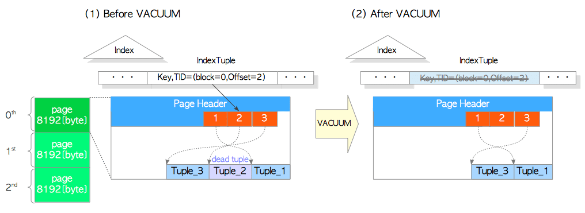
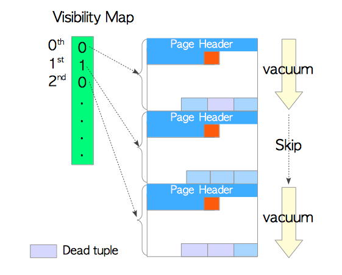
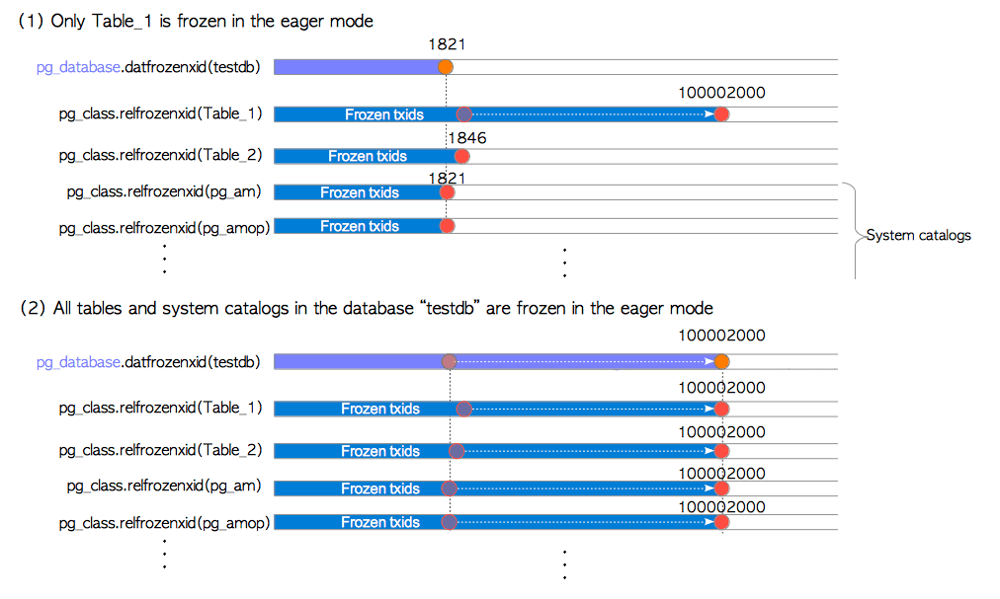
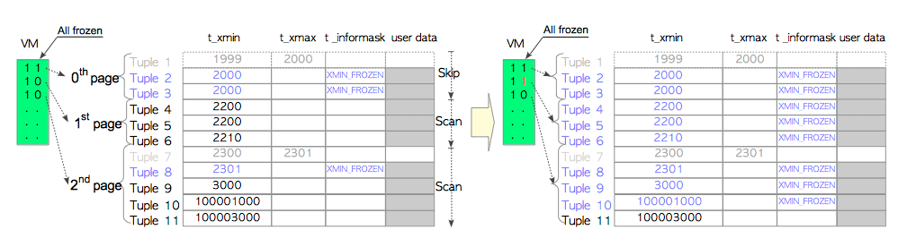
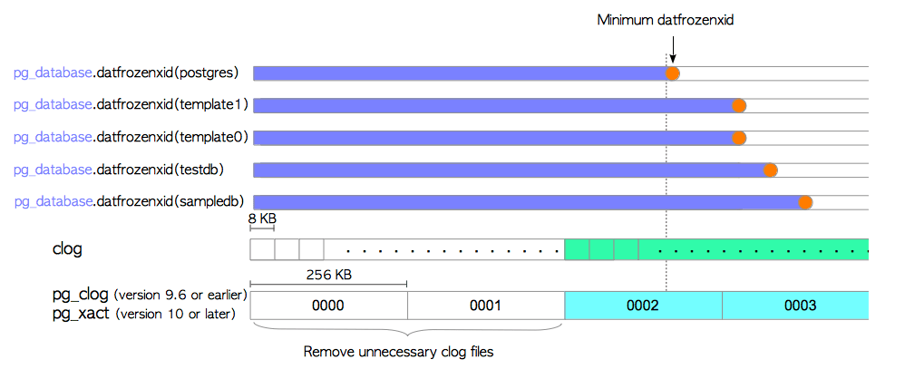
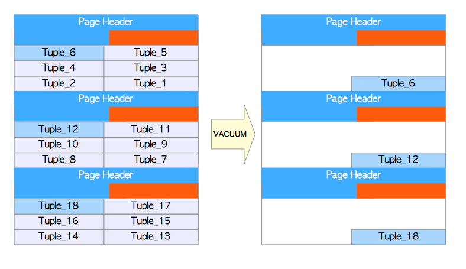
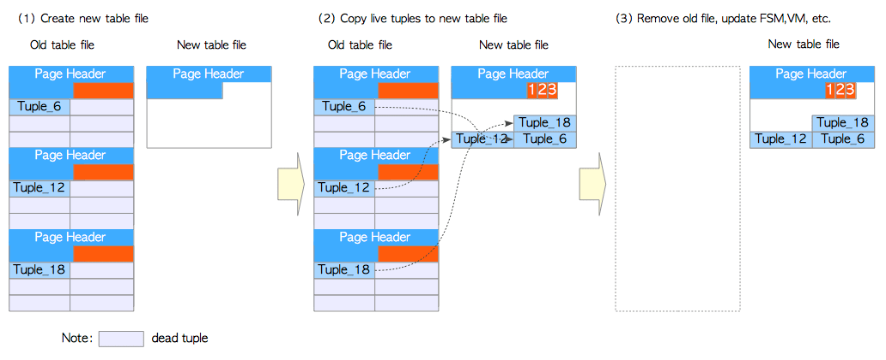

# 第六章 清理过程（VACUUM）

[TOC]

**清理（VACUUM）**是一种维护过程，有助于PostgreSQL的持久运行。它的两个主要任务是，删除死元组和冻结事务ID，两者都在5.10节中简要提到过。

​	为了移除死元组，清理过程有两种模式，即**并发清理（Concurrent Vacuum）** 和**完整清理（Full Vacuum）** 。并发清理（通常简称为清理）会删除表文件每个页面的死元组，而其他事务可以在此进程运行时读取该表。相反，完整清理会移除整个文件中的死元组，并对整个文件中的活元组进行碎片整理。而其他事务在完整清理运行时无法访问表。

​	尽管清理过程对PostgreSQL至关重要，但与其他功能相比，它的改进相对其他功能而言要慢一些。例如在8.0版本之前，必须手动执行清理过程（使用`psql`实用程序或使用`cron`守护进程）。直到2005年实现了autovacuum守护进程时，这一过程才实现了自动化。

​	由于清理过程涉及到整个表的扫描，因此该过程开销显著。在版本8.4（2009）中，引入了**可见性映射（Visibility Map, VM）**来提高移除死元组的效率。在版本9.6（2016）中通过增强了VM，从而改善了冻结过程。

6.1节概述了并发清理的过程，而后续部分的内容如下所示。

* 可见性映射
* **冻结（Freeze）**过程
* 移除不必要的clog文件
* **自动清理（AutoVacuum）**守护进程
* 完整清理


## 6.1 并发清理概述

清理过程为指定的表或数据库中的所有表执行以下任务。

1. 移除死元组
   * 移除每一页中的死元组，并对活元组进行碎片整理。
   * 移除指向死元组的索引元组。
2. 冻结旧的事务标识
   * 如有必要，冻结元组的旧事务标识（txids）。
   * 更新与冻结事务标识相关的系统视图（`pg_database`和`pg_class`）。
   * 如果可能，移除不必要的clog。
3. 其他
   * 更新已处理表的FSM和VM。
   * 更新一些统计信息（`pg_stat_all_tables`等）。

假设读者已经熟悉以下术语：死元组，冻结事务标识，FSM，clog；如果读者不熟悉这些术语的含义，请参阅[第5章](ch5.md)。VM将在第6.2节中介绍。

以下伪代码描述了清理的过程。


> ### 伪码：并发清理
>
> ```sql
> (1)  FOR each table
> (2)       在目标表上获取 ShareUpdateExclusiveLock 锁
> 
>           /* 第一部分 */
> (3)       扫描所有页面，定位死元组；如有必要，冻结过老的元组。
> (4)       如果存在，移除指向死元组的索引元组。
> 
>           /* 第二部分 */
> (5)       FOR each page of the table
> (6)            移除死元组，重排本页内的活元组。
> (7)            更新 FSM 与 VM
>            END FOR
> 
>           /* 第三部分 */
> (8)       如果可能，截断最后的页面。
> (9)       更新系统数据字典与统计信息
>           释放ShareUpdateExclusiveLock锁
>      END FOR
> 
>           /* 后续处理 */
> (10)  更新统计信息与系统数据字典
> (11)  如果可能，移除没有必要的文件，以及clog中的文件。
> ```
>
> 1. 从指定的表中依次处理每一个表。
> 2. 获取表上的ShareUpdateExclusiveLock锁， 此锁允许其他事务对该表进行读取。
> 3. 扫描所有的页面以获取所有死元组，并在必要时冻结旧元组。
> 4. 删除指向相应死元组的索引元组（如果存在）。
> 5. 对表的每个页面执行步骤(6)和(7)中的操作
> 6. 移除死元组，并重新分配页面中的活元组。
> 7. 更新目标表相应的FSM与VM。
> 8. 如果最后一个页面没有任何元组，则截断最后一页。
> 9. 更新与**目标表**清理过程相关的统计数据和系统视图。
> 10. 更新与清理过程相关的统计数据和系统视图。
> 11. 如果可能，删除不必要的文件，以及clog中不必要的页面。

​	该伪码有两个部分：一个依次处理表的循环部分，以及后处理部分。而内部的循环又能分为三个部分，每一个部分都有各自的任务。接下来会描述这三个部分，以及后续的处理。


### 6.1.1 第一部分

​	这一部分执行冻结处理，并删除指向死元组的索引元组。

​	首先，PostgreSQL扫描目标表以构建死元组列表，并在可能的情况下冻结旧元组。该列表存储在本地内存的[`maintenance_work_mem`](https://www.postgresql.org/docs/current/static/runtime-config-resource.html#GUC-MAINTENANCE-WORK-MEM)(维护用工作内存)中。冻结处理在6.3节中描述。

​	扫描完成后，PostgreSQL通过引用死元组列表来删除索引元组。此过程在内部被称为“清理阶段”。不用说，这个过程很昂贵。在版本10或更早版本中，始终执行清理阶段。在版本11或更高版本中，如果目标索引是B树，则是否执行清理阶段由配置参数[`vacuum_cleanup_index_scale_factor`](https://www.postgresql.org/docs/devel/static/runtime-config-resource.html#RUNTIME-CONFIG-INDEX-VACUUM)决定。详细信息请参见[此参数的说明](https://www.postgresql.org/docs/devel/static/runtime-config-resource.html#RUNTIME-CONFIG-INDEX-VACUUM)。

​	当`maintenance_work_mem`已满并且未完成全部扫描时，PostgreSQL继续进行下一个任务，即步骤(4)到(7)；然后它返回步骤(3)并继续扫描。

### 6.1.2 第二部分

这一部分会移除死元组，并逐页更新FSM和VM。图6.1展示了一个例子：

**图6.1 删除死元组**


​	假设该表包含三个页面。我们关注0号页（即第一个页面）。这个页面有三条元组。 `Tuple_2`是一个死元组，如图6.1(1)。在这种情况下，PostgreSQL移除`Tuple_2`，并重新排序剩余的元组来修复碎片，然后更新此页面的FSM和VM，如图6.1(2)。 PostgreSQL不断重复该过程直至最后一页。

​	请注意，不必要的行指针是不会移除的，它们会在将来被重用。因为如果移除了行指针，也必须更新所有相关索引中的索引元组。

### 6.1.3 第三部分

第三部分更新与每个目标表的清理过程相关的统计信息和系统视图。

此外，如果最后一页没有元组，则会从表文件中清理掉。

### 6.1.4 后续处理

​	当处理完成后，PostgreSQL会更新与清理过程相关的几个统计数据和系统视图，如果可能的话，它还会移除部分不必要的clog（第6.4节）。

> 清理过程使用8.5节中描述的**环形缓冲区（ring buffer）**。因此处理过的页面不会缓存在共享缓冲区中。
>


## 6.2 可见性映射

​	VACUUM处理的开销巨大，因此在8.4版中引入了VM，用于降低清理的开销。

​	VM的基本概念很简单。 每个表都有各自的可见性映射，用于保存表文件中每个页面的可见性。 页面的可见性确定了每个页面是否包含死元组。 清理过程可以跳过没有死元组的页面。

​	图6.2展示了VM的使用方式。 假设该表包含三个页面，第0页和第2页包含死元组，而第1页不包含死元组。 表的VM中保存着哪些页面包含死元组的信息。 在这种情况下，清理过程通过参考VM的信息而跳过第一个页面。

**图6.2 VM的使用方式**



​	每个VM由一个或多个8 KB页面组成，此文件以`vm`后缀存储。 作为示例，一个表文件的`relfilenode`是18751，其中FSM（`18751_fsm`）和VM（`18751_vm`）文件如下所示。

```bash
$ cd $PGDATA
$ ls -la base/16384/18751*
-rw------- 1 postgres postgres  8192 Apr 21 10:21 base/16384/18751
-rw------- 1 postgres postgres 24576 Apr 21 10:18 base/16384/18751_fsm
-rw------- 1 postgres postgres  8192 Apr 21 10:18 base/16384/18751_vm
```

### 6.2.1 VM增强

​	VM在9.6版中得到了增强，以提高冻结处理的效率。新的VM除了显示页面可见性之外，还包含了页面中元组是否全部冻结的信息。（第6.3.3节）。


## 6.3 冻结过程

​	冻结过程有两种模式，依特定条件而择其一执行。为方便起见，将这些模式称为**惰性模式（lazy mode）**和**迫切模式（eager mode）**。

>
> **并发清理（Concurrent VACUUM）**通常在内部被称为“惰性清理”。但是，本文中定义的惰性模式是**冻结过程**执行的模式。
>


​	冻结过程通常以惰性模式运行；但当满足特定条件时，也会以迫切模式运行。在惰性模式下，冻结处理仅使用目标表对应的VM扫描包含死元组的页面。迫切模式相则反，它会扫描所有页面，无论其是否包含死元组，它还会更新与冻结处理相关的系统视图，并在可能的情况下删除不必要的clog。

​	6.3.1和6.3.2节分别描述了这些模式，第6.3.3节描述了在迫切模式下对冻结过程的改进。

### 6.3.1 惰性模式

当开始冻结处理时，PostgreSQL计算`freezeLimit txid`并冻结其`t_xmin`小于`freezeLimit` txid的元组。

`freezeLimit txid`定义如下：
$$
\begin{align}
	\verb|freezeLimit_txid| = (\verb|OldestXmin| - \verb|vacuum_freeze_min_age|)
\end{align}
$$


​	而`OldestXmin`是当前正在运行的事务中最早的**事务标识（txid）**。 例如，如果在执行`VACUUM`命令时正在运行三个事务（txid分别为100，101和102），这里`OldestXmin`就是100。如果不存在其他事务，`OldestXmin` 就是执行此`VACUUM`命令的事务标识。 这里，`vacuum_freeze_min_age`是一个配置参数（默认为50,000,000）。

​	图6.3显示了一个具体的例子。 这里，Table_1由三个页面组成，每个页面有三个元组。 执行VACUUM命令时，当前txid为50,002,500，并且没有其他事务。 在这种情况下，OldestXmin OldestXmin  是50,002,500; 因此，freezeLimit txid为2500.冻结处理如下执行。

**图6.3 惰性模式下的元组冻结**


* 第0页：

		三个元组被冻结，因为所有元组的`t_xmin`值都小于`freezeLimit_txid`。此外，因为元组1是个死元组，因此在本清理过程中被移除。

* 第1页：

  通过引用可见性映射，跳过了此页面的清理。

* 第2页：

  元组7和元组8被冻结，且元组7被移除。

在完成清理过程之前，与清理相关的统计数据会被更新，例如`pg_stat_all_tables`视图中的`n_live_tup`，`n_dead_tup`，`last_vacuum`，`vacuum_count`等。

如上例所示，惰性模式可能无法完全冻结所有需要冻结的元组，因为它可能会跳过页面。

### 6.3.2 迫切模式

​	迫切模式弥补了惰性模式的缺陷。它会扫描所有页面以检查表中的所有元组，更新相关的系统视图，并在可能的情况下删除不必要的文件和clog页面。

​	当满足以下条件时，会执行迫切模式。
$$
\begin{align}
	\verb|pg_database.datfrozenxid| < (\verb|OldestXmin| - \verb|vacuum_freeze_table_age|)
\end{align}
$$
​	在上面的条件中，`pg_database.datfrozenxid`表示`pg_database`系统视图中的列，并保存每个数据库的最老的已冻结的事务标识。细节将在后面描述；因此，我们假设所有`pg_database.datfrozenxid`的值都是1821（这是在9.5版本中安装新数据库集群之后的初始值）。 `vacuum_freeze_table_age`是配置参数（默认为150,000,000）。

​	图6.4显示了一个具体的例子。在表1中，元组1和元组7都已被删除。 元组10和元组11已插入第2页。执行`VACUUM`命令时，当前事务标识为150,002,000，并且没有其他事务。因此，`OldestXmin=150,002,000`，`freezeLimit_txid为100,002,000`。在这种情况下，满足上述条件，因为$1821 < (150002000 - 150000000)$

​	因此，冻结过程会执行如下所示的迫切模式。

（请注意，这是版本9.5或更早版本的行为；最新版本的行为会在第6.3.3节中描述。）

**图6.4 在迫切模式下冻结旧元组（9.5或更早版本）**


* 第0页：

  即使所有元组都被冻结，也会检查元组2和元组3。

* 第1页：

  此页面中的三个元组已被冻结，因为所有元组的`t_xmin`值都小于`freezeLimit_txid`。请注意在惰性模式下会跳过此页面。

* 第2页：

  元组10被冻结，而元组11没有。

冻结一个表后，目标表的`pg_class.relfrozenxid`将被更新。 `pg_class`是一个系统视图，每个`pg_class.relfrozenxid`列保存相应表的最近冻结的事务标识。本例中表1的`pg_class.relfrozenxid`更新为当前的`freezeLimit_txid`（即100,002,000），这意味着表1中`t_xmin`小于100,002,000的所有元组都已被冻结。

​	在完成清理过程之前，必要时会更新`pg_database.datfrozenxid`。每个`pg_database.datfrozenxid`列都包含相应数据库中的最小`pg_class.relfrozenxid`。例如，如果在迫切模式下仅仅对表1做冻结处理，则不会更新该数据库的`pg_database.datfrozenxid`，因为其他关系的`pg_class.relfrozenxid`（当前数据库可见的其他表和系统视图）尚未变更（图6.5(1)）。如果当前数据库中的所有关系都以迫切模式冻结，则会更新数据库的`pg_database.datfrozenxid`，因为此数据库的所有关系的`pg_class.relfrozenxid`都被更新为当前的`freezeLimit_txid`（图6.5(2)）。

**图6.5  pg_database.datfrozenxid与pg_class.relfrozenxid之间的关系**




> ####  如何显示`pg_class.relfrozenxid`与`pg_database.datfrozenxid`
>
> ​	如下所示，第一个查询显示`testdb`数据库中所有可见关系的`relfrozenxids`，第二个查询显示`testdb`数据库的`pg_database.datfrozenxld`。
>
> ```sql
> testdb=# VACUUM table_1;
> VACUUM
> 
> testdb=# SELECT n.nspname as "Schema", c.relname as "Name", c.relfrozenxid
>              FROM pg_catalog.pg_class c
>              LEFT JOIN pg_catalog.pg_namespace n ON n.oid = c.relnamespace
>              WHERE c.relkind IN ('r','')
>                    AND n.nspname <> 'information_schema' AND n.nspname !~ '^pg_toast'
>                    AND pg_catalog.pg_table_is_visible(c.oid)
>                    ORDER BY c.relfrozenxid::text::bigint DESC;
>    Schema   |            Name         | relfrozenxid 
> ------------+-------------------------+--------------
>  public     | table_1                 |    100002000
>  public     | table_2                 |         1846
>  pg_catalog | pg_database             |         1827
>  pg_catalog | pg_user_mapping         |         1821
>  pg_catalog | pg_largeobject          |         1821
> 
> ...
> 
>  pg_catalog | pg_transform            |         1821
> (57 rows)
> 
> testdb=# SELECT datname, datfrozenxid FROM pg_database WHERE datname = 'testdb';
>  datname | datfrozenxid 
> ---------+--------------
>  testdb  |         1821
> (1 row)
> ```


> #### FREEZE选项
>
> ​	带有`FREEZE`选项的`VACUUM`命令会强制冻结指定表中的所有事务标识。虽然这是在急切模式下执行的，但这里`freezeLimit`会被设置为`OldestXmin`（而不是`OldestXmin - vacuum_freeze_min_age`）。 例如，当`txid=5000`执行`VACUUM FULL`命令且没有其他正在运行的事务时，`OldesXmin`会被设置为5000，而事务标识小于5000的元组将会被冻结。


### 6.3.3 改进迫切模式中的冻结过程

​	9.5版本或更早版本中的迫切模式效率不高，因为它始终会扫描所有页面。 例如在第6.3.2节的例子中，尽管第0页中所有元组都被冻结，也会被扫描。

​	为了解决这一问题，9.6版本改进了VM与冻结过程。如第6.2.1节所述，新VM包含着每个页面中所有元组是否都已被冻结的信息。 在迫切模式下进行冻结处理时，可以跳过仅包含冻结元组的页面。

​	图6.6展示了一个例子。 根据VM中的信息，冻结此表时会跳过第0页。在更新完1号页面后，相关的VM信息会被更新，因为该页中所有的元组都已经被冻结了。

**图6.6  在迫切模式下冻结旧元组（9.6或更高版本）**




## 6.4 移除不必要的clog文件

​	如5.4节中所述，**提交日志（clog）**存储着事务的状态。 当更新`pg_database.datfrozenxid`时，PostgreSQL会尝试删除不必要的clog文件。 注意相应的clog页面也会被删除。

​	图6.7展示了一个例子。 如果clog文件`0002`中包含最小的`pg_database.datfrozenxid`，则可以删除旧文件（`0000`和`0001`），因为存储在这些文件中的所有事务都可以在整个数据库集簇中被视为冻结。

**图6.7  删除不必要的阻塞文件和页面**



> ###  pg_database.datfrozenxid与clog文件
>
> 下面展示了`pg_database.datfrozenxid`与clog文件的实际输出
>
> ```bash
> $ psql testdb -c "SELECT datname, datfrozenxid FROM pg_database"
>   datname  | datfrozenxid 
> -----------+--------------
>  template1 |      7308883
>  template0 |      7556347
>  postgres  |      7339732
>  testdb    |      7506298
> (4 rows)
> 
> $ ls -la -h data/pg_clog/	# 10或更新的版本, "ls -la -h data/pg_xact/"
> total 316K
> drwx------  2 postgres postgres   28 Dec 29 17:15 .
> drwx------ 20 postgres postgres 4.0K Dec 29 17:13 ..
> -rw-------  1 postgres postgres 256K Dec 29 17:15 0006
> -rw-------  1 postgres postgres  56K Dec 29 17:15 0007
> ```


## 6.5 自动清理守护进程

**自动清理（AutoVacuum）**守护进程已经将清理过程自动化，因此PostgreSQL运维起来非常简单。

​	自动清理守护进程周期性地调用几个`autovacuum_worker`进程，自动清理守护程序周期性地唤起几个`autovacuum_worker`进程。默认每分钟唤醒一次（由参数`autovacuum_naptime`定义），并唤起三个worker（由`autovacuum_max_works`定义）。

​	自动清理守护进程唤起的`autovacuum worker`逐步对各个表执行VACUUM，从而将对数据库活动的影响降到最小。


## 6.6 完整清理（FULL VACUUM）

​	虽然并发清理对于运维至关重要，但光有它还不够。例如考虑这种情况：即使删除了许多死元组，也无法减小表的大小。

​	图6.8展示了一个极端的例子。假设一个表由三个页面组成，每个页面包含六个元组。执行以下`DELETE`命令以删除元组，并执行`VACUUM`命令以移除死元组：

**图6.8 显示（并发）VACUUM的缺点的示例**



```sql
testdb=# DELETE FROM tbl WHERE id % 6 != 0;
testdb=# VACUUM tbl;
```

​	死元组被移除了， 但表的大小没有减少。 这中情况既浪费了磁盘空间，又会对数据库性能产生负面影响。 例如在上面的例子中，当读取表中的三个元组时，必须从磁盘加载三个页面。

​	为了解决这种情况，PostgreSQL提供了**完整清理**模式。 图6.9显示了该模式的概要。

**图6.9 完整VACUUM模式概述**



1. 创建新的表文件：见图6.9(1)

   当对表执行`VACUUM FULL`命令时，PostgreSQL首先获取表上的`AccessExclusiveLock`锁，并创建一个大小为8 KB的新的表文件。 `AccessExclusiveLock`锁不允许任何其他访问。

2. 将活元组复制到新表：见图6.9(2)

   PostgreSQL只将旧表文件中的活元组复制到新表中。

3. 删除旧文件，重建索引，并更新统计信息，FSM和VM：见图6.9(3)

   复制完所有活元组后，PostgreSQL将删除旧文件，重建所有相关的表索引，更新表的FSM和VM，并更新相关的统计信息和系统视图。

完整清理的伪代码如下所示：

> #### 伪代码：完整清理
>
> ```sql
> (1)  FOR each table
> (2)       获取表上的AccessExclusiveLock锁
> (3)       创建一个新的表文件
> (4)       FOR each live tuple in the old table
> (5)            将活元组拷贝到新表中
> (6)            如果有必要，冻结该元组。
>           END FOR
> (7)       移除旧的表文件
> (8)       重建所有索引
> (9)       更新FSM与VM
> (10)      更新统计信息
>           释放AccessExclusiveLock锁
>        END FOR
> (11)  移除不必要的clog文件
> ```

使用`VACUUM FULL`命令时应考虑两点。

1. 当执行完整清理时，没有人可以访问（读/写）表。
2. 最多会临时使用两倍于表的磁盘空间；因此在处理大表时，有必要检查剩余磁盘容量。

> ### 什么时候该使用VACUUM FULL？
>
> 不幸的是，并没有关于什么时候该执行`VACUUM FULL`的最佳实践。但是扩展[`pg_freespacemap`](https://www.postgresql.org/docs/current/static/pgfreespacemap.html)可能会给你很好的建议。
>
> 以下查询显示了表的平均空闲空间率。
>
> ```
> testdb=# CREATE EXTENSION pg_freespacemap;
> CREATE EXTENSION
> 
> testdb=# SELECT count(*) as "number of pages",
>        pg_size_pretty(cast(avg(avail) as bigint)) as "Av. freespace size",
>        round(100 * avg(avail)/8192 ,2) as "Av. freespace ratio"
>        FROM pg_freespace('accounts');
>  number of pages | Av. freespace size | Av. freespace ratio 
> -----------------+--------------------+---------------------
>             1640 | 99 bytes           |                1.21
> (1 row)
> ```
>
> 从上面的结果可以看出，没有多少空闲空间。
>
> 如果你删除几乎所有的元组，并执行VACUUM命令，则可以发现每个页面几乎都是空的。
>
> ```sql
> testdb=# DELETE FROM accounts WHERE aid %10 != 0 OR aid < 100;
> DELETE 90009
> 
> testdb=# VACUUM accounts;
> VACUUM
> 
> testdb=# SELECT count(*) as "number of pages",
>        pg_size_pretty(cast(avg(avail) as bigint)) as "Av. freespace size",
>        round(100 * avg(avail)/8192 ,2) as "Av. freespace ratio"
>        FROM pg_freespace('accounts');
>  number of pages | Av. freespace size | Av. freespace ratio 
> -----------------+--------------------+---------------------
>             1640 | 7124 bytes         |               86.97
> (1 row)
> ```
>
> 以下查询检查特定表每个页面的自由空间占比。
>
> ```sql
> testdb=# SELECT *, round(100 * avail/8192 ,2) as "freespace ratio"
>                 FROM pg_freespace('accounts');
>  blkno | avail | freespace ratio 
> -------+-------+-----------------
>      0 |  7904 |           96.00
>      1 |  7520 |           91.00
>      2 |  7136 |           87.00
>      3 |  7136 |           87.00
>      4 |  7136 |           87.00
>      5 |  7136 |           87.00
> ....
> ```
>
> 执行`VACUUM FULL`后会发现表被压实了。
>
> ```sql
> testdb=# VACUUM FULL accounts;
> VACUUM
> testdb=# SELECT count(*) as "number of blocks",
>        pg_size_pretty(cast(avg(avail) as bigint)) as "Av. freespace size",
>        round(100 * avg(avail)/8192 ,2) as "Av. freespace ratio"
>        FROM pg_freespace('accounts');
>  number of pages | Av. freespace size | Av. freespace ratio 
> -----------------+--------------------+---------------------
>              164 | 0 bytes            |                0.00
> (1 row)
> ```

