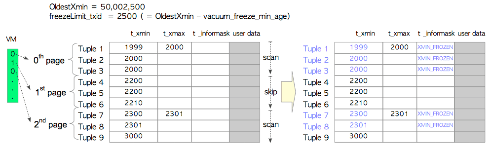
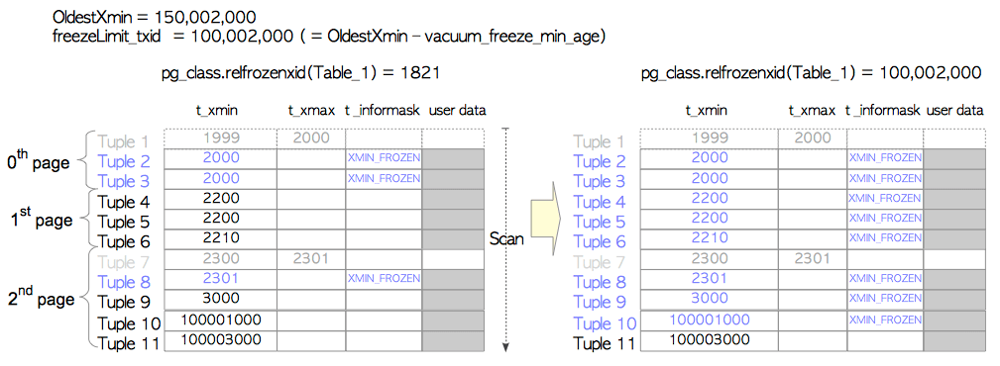

# 第六章 清理过程

[TOC]

​**清理（VACUUM）**是一种维护过程，有助于PostgreSQL的持久运行。它的两个主要任务是删除死元组和冻结事务ID，这些都在第5.10节中简要提到。

​	为了去除死元组，真空处理提供两种模式，即**并发清理（Concurrent Vacuum）** 和**完整清理（Full Vacuum）** 。并发VACUUM（通常简称为VACUUM）会删除表文件每个页面的死元组，而其他事务可以在此进程运行时读取该表。相反，完整VACUUM会删除整个文件中的死元组和碎片整理元组，而其他事务在Full VACUUM运行时无法访问表。

​	尽管清理过程对PostgreSQL至关重要，但与其他功能相比，改进其功能的速度较慢。例如，在8.0版之前，必须手动执行此过程（使用psql实用程序或使用cron守护程序）。它在2005年实现autovacuum守护进程时实现了自动化。

​	由于真空处理涉及扫描整个表，因此这是一个昂贵的过程。在版本8.4（2009）中，引入了可见性映射（VM）以提高去除死元组的效率。在版本9.6（2016）中，通过增强VM来改进冻结过程。

第6.1节概述了并发的VACUUM过程。然后，后续部分描述以下内容。

* 可见性映射
* 冻结处理
* 删除不必要的CLOG文件
* **自动清理（AutoVacuum）**守护进程
* 完整VACUUM


## 6.1 并发清理概述

真空处理为指定的表或数据库中的所有表执行以下任务。

1. 删除死元组
   * 删除死元组并为每个页面对实时元组进行碎片整理。
   * 删除指向死元组的索引元组。
2. 冻结旧的txids
   * 如有必要，冻结元组的旧txids。
   * 更新冻结的txid相关系统目录（pg_database和pg_class）。
   * 如果可能的话，去除不必要的Clog部分。
3. 其他
   * 更新已处理表的FSM和VM。
   * 更新几个统计信息（pg_stat_all_tables等）。

假设读者熟悉以下术语：死元组，冻结txid，FSM和堵塞;如果不是，请参阅第5章.VM在6.2节中介绍。

以下伪代码描述了真空处理。


> ### 伪代码：并发清理
>
> ```sql
> (1)  FOR each table
> (2)       在目标表上获取 ShareUpdateExclusiveLock 锁
> 
>           /* 第一部分 */
> (3)       扫描所有页面，定位死元组；如有必要，冻结过老的元组。
> (4)       如果存在，移除指向死元组的索引元组。
> 
>           /* 第二部分 */
> (5)       FOR each page of the table
> (6)            移除死元组，重排本页内的活元组。
> (7)            更新 FSM 与 VM
>            END FOR
> 
>           /* 第三部分 */
> (8)       如果可能，截断最后的页面。
> (9)       更新系统数据字典与统计信息
>           释放ShareUpdateExclusiveLock锁
>      END FOR
> 
>           /* 后续处理 */
> (10)  更新统计信息与系统数据字典
> (11)  如果可能，移除没有必要的文件，以及clog中的文件。
> ```
>
> 1. 从指定的数据库中获取每个表。
> 2. 获取表的ShareUpdateExclusiveLock锁。 此锁允许从其他事务中读取。
> 3. 扫描所有页面以获取所有死元组，并在必要时冻结旧元组。
> 4. 删除指向相应死元组的索引元组（如果存在）。
> 5. 对表格的每一页执行以下任务，步骤（6）和（7）。
> 6. 删除死元组并重新分配页面中的实时元组。
> 7. 更新目标表的相应FSM和VM。
> 8. 如果最后一页没有任何元组，则截断最后一页。
> 9. 更新与目标表的真空处理相关的统计数据和系统目录。
> 10. 更新与真空处理相关的统计数据和系统目录。
> 11. 如果可能，删除不必要的文件和阻塞页面。


### 6.1.1 第一部分

​	这一部分执行冻结处理并删除指向死元组的索引元组。

​	首先，PostgreSQL扫描目标表以构建死元组列表，并在可能的情况下冻结旧元组。该列表存储在本地内存的`maintenance_work_mem`（维护用工作内存）中。冻结处理在6.3节中描述。

​	扫描完成后，PostgreSQL通过引用死元组列表来删除索引元组。此过程在内部称为“清理阶段”。不用说，这个过程很昂贵。在版本10或更早版本中，始终执行清理阶段。在版本11或更高版本中，如果目标索引是B树，则是否执行清理阶段由配置参数`vacuum_cleanup_index_scale_factor`决定。详细信息请参见此参数的说明。

​	当`maintenance_work_mem`已满并且扫描不完整时，PostgreSQL继续进行下一个任务，即步骤（4）到（7）;然后它返回步骤（3）并继续扫描。

### 6.1.2 第二部分

此块删除死元组并逐页更新FSM和VM。图6.1显示了一个示例：

**图6.1 删除死元组**


	假设该表包含三个页面。我们专注于第0页（即第一页）。这个页面有三个元组。 Tuple_2是一个死元组（图6.1（1））。在这种情况下，PostgreSQL删除Tuple_2并重新排序剩余的元组以修复碎片，然后更新此页面的FSM和VM（图6.1（2））。 PostgreSQL继续这个过程，直到最后一页。

​	请注意，不会删除不必要的行指针，将来会重用它们。因为，如果删除了行指针，则必须更新关联索引的所有索引元组。

### 6.1.3 第三部分

第三个块更新与每个目标表的真空处理相关的统计信息和系统目录。

此外，如果最后一页没有元组，则会从表文件中截断它。

### 6.1.4 后处理

​	当真空处理完成后，PostgreSQL会更新与真空处理相关的几个统计数据和系统目录，如果可能的话，它会删除不必要的部分（第6.4节）。

​	真空处理使用环形缓冲，如第8.5节所述;因此，处理过的页面不会缓存在共享缓冲区中。


## 6.2 可见性映射

真空处理成本高昂; 因此，VM已在版本8.4中引入以降低此成本。

VM的基本概念很简单。 每个表都有一个单独的可见性映射，用于保存表文件中每个页面的可见性。 页面的可见性决定了每个页面是否都有死元组。 真空处理可以跳过没有死元组的页面。

图6.2显示了如何使用VM。 假设该表包含三个页面，第0页和第2页包含死元组，第1页不包含死元组。 此表的VM包含有关哪些页面包含死元组的信息。 在这种情况下，真空处理通过参考VM的信息跳过第一页。

**图6.2 如何使用VM**


​	每个VM由一个或多个8 KB页面组成，此文件以`vm`后缀存储。 作为示例，一个表文件的`relfilenode`是18751，其中FSM（18751_fsm）和VM（18751_vm）文件如下所示。

```bash
$ cd $PGDATA
$ ls -la base/16384/18751*
-rw------- 1 postgres postgres  8192 Apr 21 10:21 base/16384/18751
-rw------- 1 postgres postgres 24576 Apr 21 10:18 base/16384/18751_fsm
-rw------- 1 postgres postgres  8192 Apr 21 10:18 base/16384/18751_vm
```


### 6.2.1 增强VM

​	VM在9.6版中得到了增强，以提高冻结处理的效率。新VM显示页面可见性以及每个页面中是否冻结元组的信息（第6.3.3节）。


## 6.3 冻结处理

​	冻结处理有两种模式，根据特定条件在任一模式下执行。为方便起见，这些模式称为惰性模式和急切模式。


​	并发VACUUM通常在内部称为“惰性清理”。但是，本文档中定义的延迟模式是冻结处理执行的模式。


​	冻结处理通常以惰性模式运行；但是，当满足特定条件时，运行迫切模式。

​	在惰性模式下，冻结处理仅使用目标表的相应VM扫描包含死元组的页面。

​	相反，迫切模式扫描所有页面，无论每个页面是否包含死元组，它还会更新与冻结处理相关的系统目录，并在可能的情况下删除不必要的clog部分。

​	6.3.1和6.3.2节分别描述了这些模式。第6.3.3节描述了在急切模式下改进冻结过程。

### 6.3.1 惰性模式

当开始冻结处理时，PostgreSQL计算`freezeLimit txid`并冻结其`t_xmin`小于`freezeLimit` txid的元组。

`freezeLimit txid`定义如下：
$$
\begin{align}
	\verb|freezeLimit_txid| = (\verb|OldestXmin| - \verb|vacuum_freeze_min_age|)
\end{align}
$$


​	而OldestXmin，OldestXmin  是当前正在运行的事务中最早的txid。 例如，如果在执行VACUUM命令时正在运行三个事务（txids 100,101和102），OldestXmin，OldestXmin  是100。如果不存在其他事务，OldestXmin，OldestXmin 是执行此VACUUM命令的txid。 这里，vacuum_freeze_min_age是一个配置参数（默认为50,000,000）。

​	图6.3显示了一个具体的例子。 这里，Table_1由三个页面组成，每个页面有三个元组。 执行VACUUM命令时，当前txid为50,002,500，并且没有其他事务。 在这种情况下，OldestXmin OldestXmin  是50,002,500; 因此，freezeLimit txid为2500.冻结处理如下执行。

**图6.3 惰性模式下的元组冻结**



* 第0页：

		三个元组被冻结，因为所有t_xmin值都小于freezeLimit txid。此外，由于死元组，在此真空过程中删除了Tuple_1。

* 第1页：

  通过引用VM跳过此页面。

* 第2页：

  Tuple_7和Tuple_8被冻结; Tuple_7被删除。

在完成真空过程之前，更新与清理有关的统计数据，例如， pg_stat_all_tables'n_live_tup，n_dead_tup，last_vacuum，vacuum_count等。

如上例所示，惰性模式可能无法完全冻结元组，因为它可以跳过页面。

### 6.3.2 迫切模式

​	急切模式补偿了懒惰模式的缺陷。它会扫描所有页面以检查表中的所有元组，更新相关的系统目录，并在可能的情况下删除不必要的文件和阻塞页面。

当满足以下条件时执行急切模式。
$$
\begin{align}
	\verb|pg_database.datfrozenxid| < (\verb|OldestXmin| - \verb|vacuum_freeze_table_age|)
\end{align}
$$
​	在上面的条件中，`pg_database.datfrozenxid`表示`pg_database`系统数据字典中的列，并保存每个数据库的最老的已冻结的txid。细节将在后面描述；因此，我们假设所有`pg_database.datfrozenxid`的值都是1821（这是在版本9.5中安装新数据库集群之后的初始值）。 `vacuum_freeze_table_age`是配置参数（默认为150,000,000）。

​	图6.4显示了一个具体的例子。在表1中，Tuple_1和Tuple_7都已被删除。 Tuple_10和Tuple_11已插入第2页。执行VACUUM命令时，当前txid为150,002,000，并且没有其他事务。因此，OldestXmin为150,002,000，freezeLimit txid为100,002,000。在这种情况下，满足上述条件，因为$1821 < (150002000 - 150000000)$

​	因此，冻结过程会执行如下所示的迫切模式。

（请注意，这是版本9.5或更早版本的行为;最新行为在第6.3.3节中描述。）

**图6.4 在急切模式下（9.5或更早版本）冻结旧元组**



* 第0页：

  即使所有元组都被冻结，也检查了Tuple_2和Tuple_3。

* 第1页：

  此页面中的三个元组已被冻结，因为所有t_xmin值都小于freezeLimit txid。请注意，在惰性模式下会跳过此页面。

* 第2页：

  Tuple_10已被冻结。 Tuple_11没有。

冻结每个表后，目标表的pg_class.relfrozenxid将更新。 pg_class是一个系统目录，每个pg_class.relfrozenxid列保存相应表的最新冻结xid。在此示例中，Table_1的pg_class.relfrozenxid更新为当前的freezeLimit txid（即100,002,000），这意味着冻结了表1中t_xmin小于100,002,000的所有元组。

​	在完成真空过程之前，必要时会更新pg_database.datfrozenxid。每个pg_database.datfrozenxid列都包含相应数据库中的最小pg_class.relfrozenxid。例如，如果仅在急切模式下冻结Table_1，则不会更新此数据库的pg_database.datfrozenxid，因为其他关系的pg_class.relfrozenxid（可从当前数据库中看到的其他表和系统目录）尚未更改（图6.5（1））。如果当前数据库中的所有关系都以急切模式冻结，则更新数据库的pg_database.datfrozenxid，因为此数据库的所有关系'pg_class.relfrozenxid都更新为当前freezeLimit txid（图6.5（2））。

**图6.5  pg_database.datfrozenxid与pg_class.relfrozenxid之间的关系**


## 6.4 删除不必要的Clog文件

​	第5.4节中描述的阻塞存储了事务状态。 当更新pg_database.datfrozenxid时，PostgreSQL会尝试删除不必要的阻塞文件。 请注意，也会删除相应的阻塞页面。

​	图6.7显示了一个示例。 如果clog文件'0002'中包含最小的pg_database.datfrozenxid，则可以删除旧文件（'0000'和'0001'），因为存储在这些文件中的所有事务都可以在整个数据库集群中视为冻结的txids。

**图6.7  删除不必要的阻塞文件和页面**


> ###  pg_database.datfrozenxid与clog文件
>
> 下面展示了`pg_database.datfrozenxid`与clog文件的实际输出
>
> ```bash
> $ psql testdb -c "SELECT datname, datfrozenxid FROM pg_database"
>   datname  | datfrozenxid 
> -----------+--------------
>  template1 |    	  7308883
>  template0 |      7556347
>  postgres  |      7339732
>  testdb    |      7506298
> (4 rows)
> 
> $ ls -la -h data/pg_clog/	# In version 10 or later, "ls -la -h data/pg_xact/"
> total 316K
> drwx------  2 postgres postgres   28 Dec 29 17:15 .
> drwx------ 20 postgres postgres 4.0K Dec 29 17:13 ..
> -rw-------  1 postgres postgres 256K Dec 29 17:15 0006
> -rw-------  1 postgres postgres  56K Dec 29 17:15 0007
> ```


## 6.5 自动清理守护进程

​	清理过程已通过**自动清理（AutoVacuum）**守护进程自动化；因此，PostgreSQL的运维变得容易了一些。

​	autovacuum守护程序定期调用几个autovacuum_worker进程。默认情况下，它每1分钟唤醒一次（由`autovacuum_naptime`定义），并调用三个worker（由`autovacuum_max_works`定义）。

autovacuum调用的autovacuum worker逐步对各个表执行真空处理，对数据库活动的影响最小。


## 6.6 完整清理（FULL VACUUM）

​	虽然并发VACUUM对于运维至关重要，但还不够。例如，即使删除了许多死元组，也无法减小表大小。

​	图6.8显示了一个极端的例子。假设一个表由三个页面组成，每个页面包含六个元组。执行以下DELETE命令以删除元组，并执行VACUUM命令以删除死元组：

**图6.8 显示（并发）VACUUM的缺点的示例**


```
testdb=# DELETE FROM tbl WHERE id % 6 != 0;
testdb=# VACUUM tbl;
```

​	死元组被移除; 但是，表格大小没有减少。 这既浪费磁盘空间又对数据库性能产生负面影响。 例如，在上面的示例中，当读取表中的三个元组时，必须从磁盘加载三个页面。

​	为了解决这种情况，PostgreSQL提供了**完整清理**模式。 图6.9显示了该模式的概要。

**图6.9 完整VACUUM模式概述**


1. 创建新表文件：图6.9（1）

   当对表执行`VACUUM FULL`命令时，PostgreSQL首先获取表的`AccessExclusiveLock`锁，并创建一个大小为8 KB的新表文件。 `AccessExclusiveLock`锁不允许任何其他访问。

2. 将实时元组复制到新表：图6.9（2）

   PostgreSQL只将旧表文件中的实时元组复制到新表中。

3. 删除旧文件，重建索引，并更新统计信息，FSM和VM：图6.9（3）

   复制所有实时元组后，PostgreSQL将删除旧文件，重建所有关联的表索引，更新此表的FSM和VM，并更新关联的统计信息和系统目录。

Full VACUUM的伪代码如下所示：

> #### 伪代码
>
> ```sql
> (1)  FOR each table
> (2)       获取表上的AccessExclusiveLock锁
> (3)       创建一个新的表文件
> (4)       FOR each live tuple in the old table
> (5)            将活元组拷贝到新表中
> (6)            如果有必要，冻结该元组。
>           END FOR
> (7)       移除旧的表文件
> (8)       重建所有索引
> (9)       更新FSM与VM
> (10)      更新统计信息
>           释放AccessExclusiveLock锁
>        END FOR
> (11)  移除不必要的clog文件
> ```

使用`VACUUM FULL`命令时应考虑两点。

当完整清理正在进行时，没有人可以访问（读/写）表。最多两倍于表的磁盘空间会被临时使用；因此在处理大表时，有必要检查剩余磁盘容量。

> ### 什么时候该使用VACUUM FULL？
>
> 遗憾的是当执行'VACUUM FULL'时，没有最佳实践。但是，扩展名pg_freespacemap可能会给你很好的建议。
>
> 以下查询显示了您想知道的表的平均可用空间比率。
>
> ```
> testdb=# CREATE EXTENSION pg_freespacemap;
> CREATE EXTENSION
> 
> testdb=# SELECT count(*) as "number of pages",
>        pg_size_pretty(cast(avg(avail) as bigint)) as "Av. freespace size",
>        round(100 * avg(avail)/8192 ,2) as "Av. freespace ratio"
>        FROM pg_freespace('accounts');
>  number of pages | Av. freespace size | Av. freespace ratio 
> -----------------+--------------------+---------------------
>             1640 | 99 bytes           |                1.21
> (1 row)
> ```
>
> 如上所示，您可以发现可用空间很少。
>
> 如果删除几乎元组并执行VACUUM命令，则可以发现几乎每个页面都是空格。
>
> ```sql
> testdb=# DELETE FROM accounts WHERE aid %10 != 0 OR aid < 100;
> DELETE 90009
> 
> testdb=# VACUUM accounts;
> VACUUM
> 
> testdb=# SELECT count(*) as "number of pages",
>        pg_size_pretty(cast(avg(avail) as bigint)) as "Av. freespace size",
>        round(100 * avg(avail)/8192 ,2) as "Av. freespace ratio"
>        FROM pg_freespace('accounts');
>  number of pages | Av. freespace size | Av. freespace ratio 
> -----------------+--------------------+---------------------
>             1640 | 7124 bytes         |               86.97
> (1 row)
> ```
>
> 以下查询检查指定表的每个页面的自由空间比率。
>
> ```sql
> testdb=# SELECT *, round(100 * avail/8192 ,2) as "freespace ratio"
>                 FROM pg_freespace('accounts');
>  blkno | avail | freespace ratio 
> -------+-------+-----------------
>      0 |  7904 |           96.00
>      1 |  7520 |           91.00
>      2 |  7136 |           87.00
>      3 |  7136 |           87.00
>      4 |  7136 |           87.00
>      5 |  7136 |           87.00
> ....
> ```
>
> 执行`VACUUM FULL`后，您可以发现表文件已经压缩。
>
> ```sql
> testdb=# VACUUM FULL accounts;
> VACUUM
> testdb=# SELECT count(*) as "number of blocks",
>        pg_size_pretty(cast(avg(avail) as bigint)) as "Av. freespace size",
>        round(100 * avg(avail)/8192 ,2) as "Av. freespace ratio"
>        FROM pg_freespace('accounts');
>  number of pages | Av. freespace size | Av. freespace ratio 
> -----------------+--------------------+---------------------
>              164 | 0 bytes            |                0.00
> (1 row)
> ```

