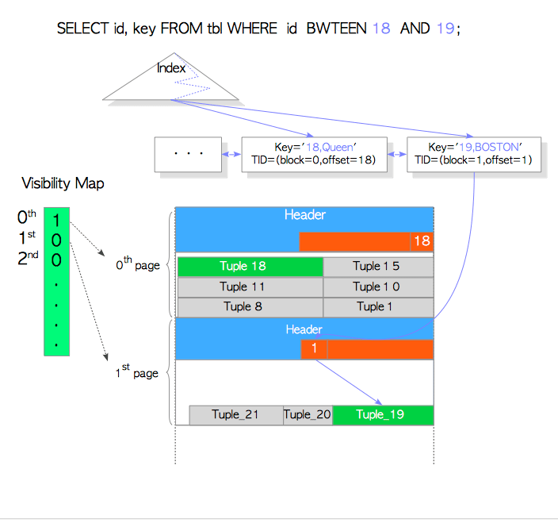

# 第七章 堆内元组与仅索引扫描

[TOC]

​	本章中介绍两个和索引扫描有关的特性—— **堆内元组（heap only tuple, HOT）**和**仅索引扫描（index-only scan）** 。

## 7.1 堆内元组（HOT）

​	在8.3版本中实现的HOT特性，使得更新行的时候可以将新行放在和老行同一个数据页中，从而高效地利用索引和表的数据页；HOT特性减少了没有必要的清理过程。

​	在源码的[README.HOT](https://github.com/postgres/postgres/blob/master/src/backend/access/heap/README.HOT)中有关于HOT的详细介绍，本章只是简短的介绍HOT。首先7.1.1节描述了在没有HOT特性的时候，更新一行会是怎么样的，以此阐明要解决的问题。接下来在7.1.2中介绍了HOT做了什么。

### 7.1.1 没有HOT时的行更新

假设表`tbl`有两个列：`id`和`data`；`id`是`tbl`的主键。

```sql
testdb=# \d tbl
                Table "public.tbl"
 Column |  Type   | Collation | Nullable | Default
--------+---------+-----------+----------+---------
 id     | integer |           | not null |
 data   | text    |           |          |
Indexes:
    "tbl_pkey" PRIMARY KEY, btree (id)
```
​	表`tbl`有1000个元组；最后一个元组的`id`是1000，存储在第五个数据页中。最后一个元组被相应的索引元组引用，索引元组的`key`是1000，并且tid是`(5,1)`，参考图7.1(a)

​	需要在索引页中插入一行记录，这会增加`INSERT`和`VACUUM`的开销；

**图 7.1 没有HOT的行更新**


我们考虑一下，没有HOT时，最后一个元组是如何更新的。

```sql
testdb=# UPDATE tbl SET data = 'B' WHERE id = 1000;
```

​	在这个场景中，PostgreSQL不仅插入了一个新的表元组，也在索引页中插入了新的索引元组，参考图7.1(b)。索引元组的插入消耗了索引页的空间，并且索引元组的插入和清理都是高开销的操作。HOT的目的是降低这种影响。

### 7.1.2 HOT如何工作
​	当使用HOT特性更新行时，如果被更新的元组将被存储在老元组所在的页面中，PostgreSQL就不会再插入相应的索引元组，而是分别设置新元组的`HEAP_ONLY_TUPLE`标记位与老元组的`HEAP_HOT_UPDATED`标记位，两个标记位都保存在元组的`t_informask2`字段中。如图7.2和7.3所示；

**图7.2 HOT的行更新**

 


​	比如在这个例子中，`Tuple_1`和`Tuple_2`分别被设置成`HEAP_HOT_UPDATED`和`HEAP_ONLY_TUPLE`。

​	另外，不管是否进行了**修剪（pruning）**和**碎片整理（defragmentation）**，都会使用`HEAP_HOT_UPDATED`和`HEAP_ONLY_TUPLE`标记位。

​	接下来会介绍，当基于HOT更新一个元组后，PostgreSQL是如何在索引扫描中访问这些被HOT更新的元组的如图7.4(a)所示。

当执行完一个HOT UPDATE后，如果还没进行pruning，读取一个tuple如下

**图 7.4 行指针剪枝**


1. 找到目标数据元组的索引元组
2. 按所获索引元组指向的位置访问行指针数组，找到行指针`1`
3. 读取`Tuple_1`
4. 读取`Tuple_2`，经由`Tuple_1`的`t_ctid`字段

在这种情况下，PostgreSQL会读取两个元组，`Tuple_1`和`Tuple_2`，并通过第五章所述的并发控制机制来判断哪个元组是可见的；但如果数据页中的**死元组（dead tuple）**已经被清理了，那就有问题了。比如在图7.4(a)中，如果`Tuple_1`由于过时被清理了，就无法通过索引访问`Tuple_2`了。

​	为了解决这个问题，PostgreSQL会在合适的时候进行行指针重定向：将指向老元组的行指针指向新元组的行指针。在PostgreSQL中，这个过程称为**指针修剪（pruning）**。图7.4(b)说明了PostgreSQL在修剪之后如何访问更新的元组。

1. 找到索引元组
2. 通过索引元组，找到行指针`[1]`
3. 通过重定向的行指针`[1]`，找到行指针`[2]`；
4. 通过行指针`[2]`，读取`Tuple_2`

只要可能，剪枝都有可能会发生，比如 `SELECT` ，`UPDATE`， `INSERT` ，`DELETE`这类SQL命令执行的时候，确切的执行时机不会在本章中描述，因为它太复杂了。细节可以在[README.HOT](https://github.com/postgres/postgres/blob/master/src/backend/access/heap/README.HOT)文件中找到。

​	在PostgreSQL执行剪枝时，如果可能，会在恰当的时间清理老元组。在PostgreSQL中这种操作称为**碎片整理（defragmentation）**，在图7.5中描述了HOT中的碎片整理过程。

**图 7.5 死元组的碎片整理**


需要注意的是，因为碎片整理的工作并不涉及到索引元组的移除，因此碎片整理比起常规的清理开销要小得多。因此，HOT特性降低了索引和表的空间消耗，最终减少了需要插入的索引元组数量，并减小了清理的必要性。


> #### HOT不可用的场景
>
> 为了清晰地理解HOT的工作，这里会介绍HOT不可用的场景。
>
> 1. 当更新的元组在其他的页面时，即和老元组在不在同一个数据页中时，指向该元组的索引元组也会被添加至索引页中，如图7.6(a)所示。
> 2. 当索引的键更新时，会在索引页中插入一条新的索引元组，如图7.6(b)所示。
>
> **图7.6 HOT不适用的情况**


> [`pg_stat_all_tables`](https://www.postgresql.org/docs/current/static/monitoring-stats.html#PG-STAT-ALL-TABLES-VIEW)视图提供了每个表的统计信息视图，也可以参考这个[扩展](https://github.com/s-hironobu/pg_stats)。


## 7.2 仅索引扫描

​	当`SELECT`语句的所有的目标列都在索引键中时，为了减少I/O代价，**仅索引扫描（Index-Only Scan）**（又叫仅索引访问）会直接使用索引中键的值，而不会。所有的商业关系型数据库中都提供这个技术，比如DB2和Oracle。PostgreSQL在9.2版本中引入这个特性。

接下来我们会基于一个特殊的例子，介绍了PostgreSQL中仅索引扫描的工作过程。

首先是关于这个例子的假设：

+ 表定义

  我们有一个tbl表，如下所示：

  ```sql
  testdb=# \d tbl
        Table "public.tbl"
   Column |  Type   | Modifiers 
  --------+---------+-----------
   id     | integer | 
   name   | text    | 
   data   | text    | 
  Indexes:
      "tbl_idx" btree (id, name)
  ```

+ 索引

  表`tbl`有一个索引`tbl_idx`，包含两个列：`id`和`name`。

+ 元组

  `tbl`已经插入了一些元组。

  `id=18, name = 'Queen'`的`Tuple_18`存储在0号数据页中。

  `id=19, name='BOSTON'`的`Tuple_19`存储在1号数据页中。

+ 可见性

  所有在0号页面中的元组永远可见；1号页面中的元组并不总是可见的。注意每个页的可见性信息都存储在相应的**可见性映射（visibility map）**中，关于vm的描述可以参考第六章第二节。

我们来研究一下，当下面的`SELECT`语句执行时，PostgreSQL是如何读取元组的。

```sql
testdb=# SELECT id, name FROM tbl WHERE id BETWEEN 18 and 19;
 id |  name   
----+--------
 18 | Queen
 19 | Boston
(2 rows)
```

​		查询需要从表中读取两列：`id`和`name`，然而索引`tbl_idx`包含了这些列。因此在使用索引扫描时，第一眼看上去好像访问表的页面是没有必要的，因为索引中已经包含了必要的数据。然而在现实中，原则上PostgreSQL需要检查这些元组的可见性，然而索引元组中并没有任何关于堆元组事务的相关信息，比如`t_xmin`和`t_xmax`，详细参考第五章。因此PostgreSQL需要访问表数据来检查索引元组中数据的可见性，这就有点本末倒置了。

​	面对这种困境，PostgreSQL使用目标表对应的可见性映射来解决此问题。如果某一页中存储所有的元组都是可见的，PostgreSQL就会使用索引元组，而不去访问索引元组指向的数据页去检查可见性；否则，PostgreSQL读取索引元组指向的数据元组并检查元组可见性，而这个过程就跟原来一样。

​	在这个例子中，因为的0号页面被标记为可见，因此0号页面中存储的包括`Tuple_18`在内的所有元组都是可见的，所以就无需再去访问`Tuple_18`了。相应的，因为1号页面并没有被标记为可见，因此需要访问`Tuple_19`，来应对并发控制。

**图 7.7 仅索引扫描的工作过程**




## 7.3 README.HOT

这是PostgreSQL官方文档中关于HOT的介绍。

### 堆内元组（HOT）

**堆内元组（HOT）**功能消除了冗余索引条目，并允许在不进行表级清理的前提下，重用被删除或被更新的元组空间。这是通过*单页清理* 实现的，也称为**碎片整理（defragmentation）**。

注意：本文档末尾有一个词汇表，对于新读者可能会有所帮助。


### 技术挑战

​	一次一页的清理通常是不切实际的，因为找到并移除链接到待回收元组的索引项开销很大。标准清理会完整扫描索引，并确保所有这些索引项都被移除。但是将索引扫描的开销分摊到许多死元组上是可能的；这种方法向下扩展的并不好，比如只是回收几个元组。原则上，这样的问题只需要重新计算索引键，并进行标准的索引搜索找出这些索引项。但因为函数索引的存在，可能会有各种充满Bug的用户定义函数被用于函数索引，这样做会有风险。声称`IMMUTABLE`但实际上可变的函数会妨碍我们重新找到索引项（而且我们没法仅仅因为没找到索引项就报错，特别是当死掉的索引项有时候会提前回收）。这些问题可能会导致很严重的索引损坏问题，例如以这样一种形式：索引项指向了一些包含无关内容的元组槽。在任何情况下，我们都更倾向于在不调用任何用户编写的代码的情况下来进行清理。

​	HOT针对一种受限但很实用的场景解决了这一问题：当一条元组以不改变其索引键的方式被重复更新（这里，**“索引列（index column）”** 意味着在索引定义中引用的任何列，包括部分索引中用于条件测试但并未实际存储的列）。

​	HOT的另一个特性是它减小了索引的尺寸，通过避免创建键相等的索引项。这能提高搜索速度。


### 单个索引项的更新链

​	在没有HOT的情况下，在更新链条上行的每一个版本都有它们各自的索引项，尽管这些索引项中的索引列值都是相同的。在有HOT的情况下，如果一个元组被放置在与其旧元组相同的页面中，且与旧元组在索引列上值相同，那么新的元组不会产生新的索引项。这意味着在这个堆页面上的一整条更新链，只会有且仅有一条索引项。没有相应索引项的元组会被标记为`HEAP_ONLY_TUPLE`，而先前的行版本则会被标记为`HEAP_HOT_UPDATED`，而在一条更新链中，它们的`t_ctid`字段都会继续指向更新的版本。

​	举个例子：

```
索引指向1
lp [1]  [2]

[111111111]->[2222222222]
```

​	在上面这幅图中，索引指向了行指针1，而元组1被标记为`HEAP_HOT_UPDATED`。元组2是一个HOT元组，带有`HEAP_ONLY_TUPLE`，意味着没有索引项指向它。尽管元组2没有被索引直接引用，它仍然能够通过索引搜索被找到。当从索引遍历至元组1时，索引搜索会继续跟进其子元组，只要它看到`HEAP_HOT_UPDATED`就会尽可能远地持续前进。因为我们将HOT链限制在单个页面内，这样的操作不会导致额外的页面访问，因此也不会引入很多性能损失。

​	最后元组1不再对任何事务可见，在那个时候，它就应该被清理掉了。但是它的行指针无法被清理掉，因为索引项仍然指向该行指针，而元组2仍然需要通过索引被搜索到。HOT通过将行指针1变为一个“重定向行指针”来解决这个问题，该指针没有实际的元组与之关联，而会链接至元组2。这时候看上去应该是这样的：

```
索引指向1
lp [1]->[2]

[2222222222]
```

如果现在这一行又被更新了，到了版本3，页面看上去就会是这样的。

```
索引指向1
lp [1]->[2]  [3]

[2222222222]->[3333333333]
```

当没有事务能在其快照中看见元组2时，元组2和它的行指针可以被整个剪枝掉：

```
索引指向1
lp [1]------>[3]

[3333333333]
```

​	这是安全的，因为没有指向行指针2的索引项。在该页面中，后续的插入可以回收利用行指针2和原来元组2占用的空间。

​	如果更新修改了被索引的列，或者同一页中没有空间能放下这个新元组，那么这条更新链就会结束：最后一个成员会有一个通常的`t_ctid`，指向下一个版本的位置，而且不会被标记为`HEAP_HOT_UPDATED`。（原则上讲我们是能够跨越页面继续这条HOT链的，但是这会打破我们所期望的性质：能够使用页面本地的操作回收空间。无论如何，我们都不想追着越过好几个堆页面，只是为了拿到一个索引项对应的元组，在那种情况下为新的元组创建一个新的索引项看上去会是一个更好的选择）如果后续的更新继续出现，下一个版本会成为一条新更新链的根。

​	只要当前页面中更新链还有任何活着的元组，行指针1就始终需要保留。当没有的时候，就可以将其标记为“死掉”，这就允许我们立即回收最后一个子节点的行指针与元组空间。下一次常规的VACUUM扫描会回收该索引项，以及索引项指向的这些行指针本身。因为比起元组而言行指针很小，这并不会出现过度的空间浪费。

​	注意：我们我们可以用“死掉”的行指针指向任何被删除的元组，无论它是不是HOT链中的元组。这允许我们像HOT更新一样在VACUUM之前，对普通的DELETE也可以进行空间回收。

​	进行HOT更新的必要条件是被索引的列上没有发生变化，这是在运行时检查旧值与新值的二进制表示来实现的。我们坚持位级别的相等，而不是特定于数据类型的等值比较方法。这样做的原因是后者可能会产生等价的多种表现形式。而我们并不知道索引用的是哪一种。我们假设位级别的相等保证对于所有目的的相等性都是适用的。


### 中止的情形

### 索引扫描与顺序扫描

### 剪枝

### 碎片整理

### 什么时候使用剪枝或碎片整理

### 清理

### 统计

### 创建索引

### 并行创建索引

### 并行移除索引

### 局限性

### 词汇表