# 第八章 缓冲区管理器

[TOC]

**缓冲区管理器（Buffer Manager）管**理着共享内存和持久存储之间的数据传输，对于DBMS的性能有着重要的影响。PostgreSQL的缓冲区管理器十分高效。

本章介绍了PostgreSQL的缓冲区管理器。第一节概览了缓冲区管理器，后续的章节分别介绍以下内容：

+ 缓冲区管理器的架构

+ 缓冲区管理器的锁

+ 缓冲区管理器是如何工作的

+ 环形缓冲区

+ 脏页的刷写

  

  **图8.1 缓冲区管理器，存储，后端进程之间的关系**

  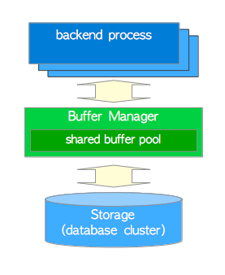

## 8.1 概览

本节介绍了一些关键概念，有助于理解后续章节。

### 8.1.1 缓冲区管理器的结构

​	PostgreSQL缓冲区管理器由缓冲表，缓冲区描述符和缓冲池组成，这些将在下一节中介绍。 **缓冲池（buffer pool）**层存储数据文件页面，例如表和索引，以及[自由空间映射](ch5.md)和[可见性映射](ch6.md)。 缓冲池是一个数组，每个槽存储一页数据文件。 缓冲池数组的索引称为`buffer_ids`。

​	第8.2和8.3节描述了缓冲区管理器内部的细节。

### 8.1.2 缓冲区标签

​	在PostgreSQL中，可以为所有数据文件的每个页面分配唯一标记，即**缓冲区标签（buffer tag）**。 当缓冲区管理器收到请求时，PostgreSQL使用所需页面的*buffer tag*。

**缓冲区标签（buffer_tag）** 包含三个值：**关系文件节点（relfilenode）**，**关系分支编号（fork number）**，**页面块号（block number）**。例如，`buffer_tag(17721,0,7)`标识表中的第七个页面，而关系的oid和分支编号分别为`17721`和`0`。 （表本身的分支编号为0）类似地，`buffer_tag(17721,1,3)`标识自由空间映射的第三个页面，其OID和分叉号分别为`17721`和`1`。（自由空间映射的分支编号为1）。

```c
/*
 * Buffer tag 标识了缓冲区中包含了哪一个磁盘块。
 * 注意：BufferTag中的数据必需足以直接确定这个块要写到哪里，而不能参考pg_class或
 * pg_tablespace中的数据项。有可能出现这种情况：刷写的Buffer后端进程甚至都不认为
 * 自己能在那时看见相应的关系（比如它的事务开始早于创建该关系的事务）。无论如何，
 * 存储管理器都必须能应对这种情况。
 *
 * 注意：如果结构中存在任何填充字节，INIT_BUFFERTAG需要将所有字段抹为零，因为整个
 * 结构体被当成一个散列键来用。
 */
typedef struct buftag
{
	RelFileNode rnode;			/* 关系的物理标识符 */
	ForkNumber	forkNum;        /* 关系的分支编号   */
	BlockNumber blockNum;		/* 相对于关系开始位置的块号 */
} BufferTag;
```


### 8.1.3 后台进程如何读取数据页

本小节描述了后端进程如何从缓冲区管理器中读取页面（图8.2）。

**图8.2 后台进程如何读取数据页** 

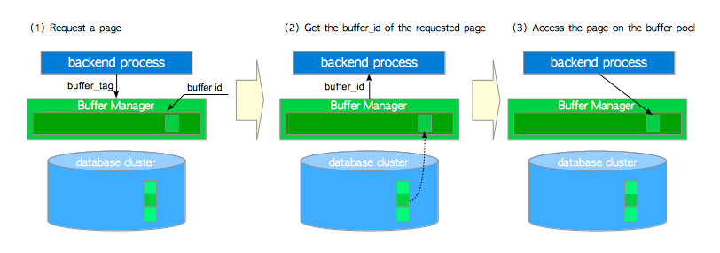

1. 当读取表或索引页时，后端进程向缓冲区管理器发送请求，并带有请求页的*buffer_tag*。
2. 缓冲区管理器返回存储着所请求页面的槽的*buffer_id*。 如果请求的页面没有存储在缓冲池中，则缓冲区管理器会将页面从持久存储中加载到其中一个缓冲池槽中，然后返回这个槽的*buffer_id*。
3. 后端进程访问*buffer_id* 对应的槽（以读取所需的页面）。

当后端进程修改缓冲池中的页面时（例如向页面插入元组），尚未刷新到存储的已修改页面被称为**脏页（dirty page）**。

8.4节描述了缓冲区管理器的工作原理。

### 8.1.4 页面置换算法

​	当所有缓冲池槽都被占用，但未存储所请求的页面时，缓冲区管理器必须在缓冲池中选择一个页面，该页面将被请求的页面所替换。 通常在计算机科学领域中，选择页面的算法被称为**页面置换算法（page replacement algorithms）**，而所选择的页面被称为**受害者页面（victim page）**。

​	对页面置换算法的研究自计算机科学出现以来就一直在进行，因此先前已经提出过很多置换算法了。 从8.1版本开始，PostgreSQL使用**时钟扫描（clock-sweep）**算法，因为比起以前版本中使用的LRU算法，它更为简单高效。

​	第8.4.4节描述了时钟扫描的细节。

### 8.1.5 刷写脏页

​	脏页最终应该被刷入存储，但缓冲区管理器执行这个任务需要一些帮助。 在PostgreSQL中，两个后台进程：**存档器（checkpointer）**和**后台写入器（background writer）**负责此任务。

8.6节描述了存档器和后台写入器。

> #### 直接I/O（Direct I/O）
>
> PostgreSQL**不**支持直接I/O，但有时会讨论它。 如果你想了解更多详细信息，可以参考[这篇文章](https://lwn.net/Articles/580542/)，以及pgsql-ML中的这个[讨论](https://www.postgresql.org/message-id/529E267F.4050700@agliodbs.com)。


## 8.2 缓冲区管理器的结构

PostgreSQL缓冲区管理器由三层组成，即**缓冲区表**，**缓冲区描述符**和**缓冲池**（图8.3）：

**图8.3 缓冲区管理器的三层结构**

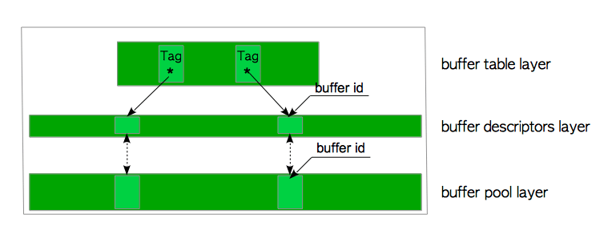

+ **缓冲池（buffer pool）**是一个数组。 每个槽都存储一个数据文件页，数组槽的索引称为*buffer_id*。
+ **缓冲区描述符（buffer descriptors）**层是一个由缓冲区描述符组成的数组。 每个描述符与缓冲池槽一一对应，并保存着相应槽的元数据。请注意，术语“**缓冲区描述符层**”只是在本文中为方便起见使用的术语。

+ **缓冲表（buffer table）**是一个哈希表，它存储着页面的*buffer_tag*与描述符的*buffer_id*之间的映射关系。

这些层将在以下的节中详细描述。

### 8.2.1 缓冲表

​	缓冲表可以在逻辑上分为三个部分：散列函数，散列桶槽，以及数据项（图8.4）。

​	内置散列函数将*buffer_tags*映射到哈希桶槽。 不过即使散列桶槽的数量大于缓冲池槽的数量，也可能会发生冲突。 因此缓冲表使用链表方法来解决冲突。 当数据项映射到同一个桶槽时，此方法会将这些数据项保存在同一个链表中，如图8.4所示。

**图8.4 缓冲表**

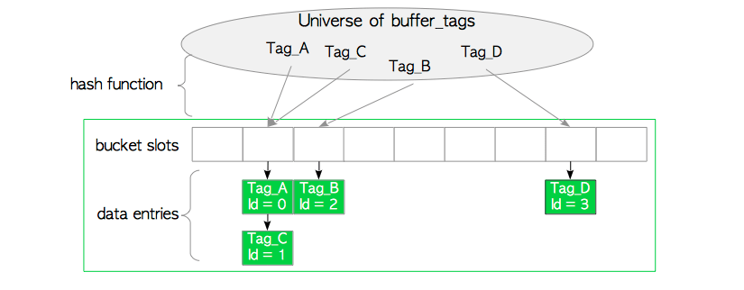

​	数据项包括两个值：页面的 *buffer_tag*，以及保存页面元数据的描述符的*buffer_id*。例如数据项`Tag_A,id=1` 表示，*buffer_id=1*对应的缓冲区描述符中存储着页面`Tag_A`的元数据。

> #### 哈希函数
>
> 散列函数是[calc_bucket()](https://doxygen.postgresql.org/dynahash_8c.html#ae802f2654df749ae0e0aadf4b5c5bcbd)和 [hash()](https://doxygen.postgresql.org/rege__dfa_8c.html#a6aa3a27e7a0fc6793f3329670ac3b0cb)的复合函数。 下面是使用伪函数的表示。
>
> ```c
> uint32 bucket_slot = calc_bucket(unsigned hash(BufferTag buffer_tag), uint32 bucket_size)
> ```

注意这里没地方解释基本操作（查找，插入和删除数据项），这些都是很常见的操作。


### 8.2.2 缓冲区描述符 

​	缓冲区描述符的结构在本小节中描述，缓冲区描述符层在下一小节中描述。

​	缓冲区描述符将存储页面的元数据保存在相应的缓冲池槽中。缓冲区描述符结构由[BufferDesc](https://github.com/postgres/postgres/blob/REL9_5_STABLE/src/include/storage/buf_internals.h)结构定义。虽然这个结构有很多字段，但主要有以下几种：

```c
/* src/include/storage/buf_internals.h  (before 9.6) */

/* 缓冲区描述符的标记位定义(since 9.6)
 * 注意：TAG_VALID实际上意味着缓冲区哈希表中有一条与本tag关联的项目。
 */
#define BM_DIRTY                (1 << 0)    /* 数据需要写入 */
#define BM_VALID                (1 << 1)    /* 数据有效 */
#define BM_TAG_VALID            (1 << 2)    /* 已经分配标签 */
#define BM_IO_IN_PROGRESS       (1 << 3)    /* 读写进行中 */
#define BM_IO_ERROR             (1 << 4)    /* 先前的I/O失败 */
#define BM_JUST_DIRTIED         (1 << 5)    /* 写之前已经脏了 */
#define BM_PIN_COUNT_WAITER     (1 << 6)    /* 有人等着钉页面 */
#define BM_CHECKPOINT_NEEDED    (1 << 7)    /* 必需在存档时写入 */
#define BM_PERMANENT            (1 << 8)    /* 永久缓冲(不是unlogged) */

/* BufferDesc -- 单个共享缓冲区的共享描述符/共享状态
 * 
 * 注意: 读写tag, flags, usage_count, refcount, wait_backend_pid等字段时必须持有
 * buf_hdr_lock锁。buf_id字段在初始化之后再也不会改变，所以不需要锁。freeNext是通过
 * buffer_strategy_lock来保护的，而不是buf_hdr_lock。LWLocks字段可以自己管好自己。
 * 注意buf_hdr_lock *不是* 用来控制对缓冲区内数据的访问的！
 *
 * 一个例外是，如果我们固定了(pinned)缓冲区，它的标签除了我们自己之外不会被偷偷修改。
 * 所以我们无需锁定自旋锁就可以检视该标签。此外，一次性的标记读取也无需锁定自旋锁，
 * 当我们期待测试标记位不会改变时，这种做法很常见。
 *
 * 如果另一个后端固定了该缓冲区，我们就无法从磁盘页面上物理移除项目了。因此后端需要等待
 * 所有其他的钉被移除。移除时它会得到通知，这是通过将它的PID存到wait_backend_pid，并设置
 * BM_PIN_COUNT_WAITER标记为而实现的。目前而言，每个缓冲区只能有一个等待者。
 *
 * 对于本地缓冲区，我们也使用同样的首部，不过锁字段就没用了，一些标记位也没用了。
 */
typedef struct sbufdesc
{
   BufferTag    tag;                 /* 存储在缓冲区中页面的标识 */
   BufFlags     flags;               /* 标记位 */
   uint16       usage_count;         /* 时钟扫描要用到的引用计数 */
   unsigned     refcount;            /* 在本缓冲区上持有pin的后端进程数 */
   int          wait_backend_pid;    /* 等着Pin本缓冲区的后端进程PID */
   slock_t      buf_hdr_lock;        /* 用于保护上述字段的锁 */
   int          buf_id;              /* 缓冲的索引编号 (从0开始) */
   int          freeNext;            /* 空闲链表中的链接 */

   LWLockId     io_in_progress_lock; /* 等待I/O完成的锁 */
   LWLockId     content_lock;        /* 访问缓冲区内容的锁 */
} BufferDesc;
```

- **tag** 将存储页面的*buffer_tag*保存在相应的缓冲池槽中（缓冲区标签在[8.1.2节中](http://www.interdb.jp/pg/pgsql08.html#_8.1.2.)定义 ）。

- **buffer_id** 标识了描述符（相当于对应缓冲池槽的 *buffer_id*）。

- **refcount** 保存当前访问相关存储页面的PostgreSQL进程数。它也被称为**pin count**。当PostgreSQL进程访问存储的页面时，其引用计数必须自增1（`refcount ++`）。访问该页面后，其引用计数必须减1（`refcount--`）。 当*refcount*为零，即当前页面未被访问时，页面将被**取消固定（unpinned）** ，否则它会被**固定（pinned）**。

- **usage_count** 保存着关联页加载至相应缓冲池槽后的访问次数。注意*usage_count* 用于页面置换算法（[第8.4.4节](http://www.interdb.jp/pg/pgsql08.html#_8.4.4.)）。

- **context_lock** 和 **io_in_progress_lock**是轻量级锁，用于控制对相关存储页面的访问。这些字段将在[第8.3.2节](http://www.interdb.jp/pg/pgsql08.html#_8.3.2.)中描述。

- **标记位（flags）** 可用于保存相关页面的状态，主要的状态如下：

  - **脏位（dirty bit）** 指明存储的页面是否为脏页（被写入）。
  - **有效位（valid bit）** 指明存储的页面是否可以被读写（有效）。例如，如果该位被设置为“有效”，那就意味着对应的缓冲池槽中存储着一个页面，而该描述符中保存着该页面的元数据，因此可以对页面进行读写。反之如果被设置为“无效”，那就意味着对应的存储页面无法读写，缓冲区管理器可能已经将其换出。
  - **IO位（io_in_progress）** 指明缓冲区管理器是否正在从存储中读/写有关页面。换句话说，该位指示是否有一个进程正持有此描述符上的`io_in_pregress_lock`。

- **freeNext** 是一个指针，指向下一个用于生成*freelist*的描述符，细节在下一小节中描述。

> 结构*BufferDesc*定义于[src/include/storage/buf_internals.h](https://github.com/postgres/postgres/blob/master/src/include/storage/buf_internals.h)中。

为了了简化以下描述，这里定义三种描述符状态：

- **空（Empty）**：当相应的缓冲池槽不存储页面（即*refcount*与*usage_count*都是0），该描述符的状态为**空**。
- **固定（Pinned）**：当相应缓冲池槽中存储着页面，且任一PostgreSQL进程正在访问的页面（即*refcount*和*usage_count* 大于等于1），该缓冲区描述符的状态为**固定**。
- **未固定（Unpinned）**：当相应的缓冲池槽存储页面，但没有PostgreSQL进程正在访问页面时（即 *usage_count*大于或等于1，但*refcount*为0），则此缓冲区描述符的状态为**未固定**。

每个描述符都处于上述状态之一。描述符的状态会在相对于特定条件而改变，这将在下一小节中描述。

在下图中，缓冲区描述符的状态由彩色框表示。

* （白色）空

- （深蓝色）固定
- （天青色）未固定

此外，脏页面会带有“X”的标记。例如一个未固定的脏描述符用 ==[X]== 表示。

### 8.2.3 缓冲区描述符层

​	缓冲区描述符的集合形成一个数组。在本文档中，该数组称为*缓冲区描述符层*。

​	当PostgreSQL服务器启动时，所有缓冲区描述符的状态为*空*。在PostgreSQL中，这些描述符包含一个名为**freelist**的链表（图8.5）。

**图8.5 缓冲区管理器初始状态**

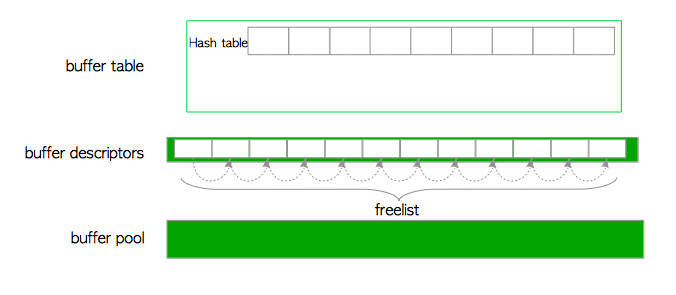

> 请注意，**freelist**在PostgreSQL是从完全不同的概念*freelist*中的Oracle。PostgreSQL的freelist只是空缓冲区描述符的链表。在PostgreSQL中，*自由空间映射*（在[第5.3.4节](http://www.interdb.jp/pg/pgsql05.html#_5.3.4.)中描述）充当Oracle中自由列表的相同角色。

图8.6显示了第一页的加载方式。

1. 从空闲列表的顶部检索空描述符，并将其固定（即将其refcount和usage_count增加1）。
2. 在缓冲表中插入新条目，该条目保存第一页的标记和检索到的描述符的buffer_id之间的关系。
3. 将新页面从存储器加载到相应的缓冲池槽位。
4. 将新页面的元数据保存到检索到的描述符中。

第二页和后续页面以类似方式加载。其他细节在[第8.4.2节](http://www.interdb.jp/pg/pgsql08.html#_8.4.2.)中提供。

**图8.6 加载第一页**


​	从空闲列表中检索的描述符始终保存页面的元数据。换句话说，继续使用非空描述符不返回空闲列表。但是，相关描述符将再次添加到空闲列表中，并且当发生以下任一情况时，描述符状态将变为“空”：

1. 表或索引已被删除。
2. 数据库已被删除。
3. 已使用VACUUM FULL命令清除表或索引。

> #### 为什么用freelist来维护空描述符？
>
> 制作freelist的原因是为了立即获得第一个描述符。这是动态内存资源分配的通常做法。请参阅[此说明](https://en.wikipedia.org/wiki/Free_list)。

缓冲区描述符层包含无符号的32位整数变量，即**nextVictimBuffer**。此变量用于[第8.4.4节中](http://www.interdb.jp/pg/pgsql08.html#_8.4.4.)描述的页面替换算法。

### 8.2.4 缓冲池

缓冲池是一个存储数据文件页面的简单数组，例如表和索引。缓冲池阵列的索引称为*buffer_id*。

缓冲池插槽大小为8 KB，等于页面大小。因此，每个槽可以存储整个页面。


## 8.3 缓冲区管理器锁

缓冲区管理器使用许多锁来实现许多不同的目的。本节介绍后续章节中解释所需的锁定。

> 请注意，本节中描述的锁是缓冲区管理器的同步机制的一部分; 他们根本**不**涉及到任何SQL语句和SQL选项

### 8.3.1 缓冲表锁

**BufMappingLock**保护整个缓冲表的数据完整性。它是一种轻量级锁，可用于共享和独占模式。在缓冲表中搜索条目时，后端进程拥有共享的BufMappingLock。插入或删除条目时，后端进程持有独占锁。

BufMappingLock被拆分为分区以减少缓冲表中的争用（默认为128个分区）。每个BufMappingLock分区都保护相应哈希桶槽的部分。

图8.7显示了拆分BufMappingLock的典型示例。两个后端进程可以在独占模式下同时保存各自的BufMappingLock分区，以便插入新的数据条目。如果BufMappingLock是单个系统范围的锁，则两个进程都应该等待另一个进程的处理，具体取决于哪个进程处理。

**图8.7 两个进程同时以独占模式获取BufMappingLock的相应分区以插入新数据条目**

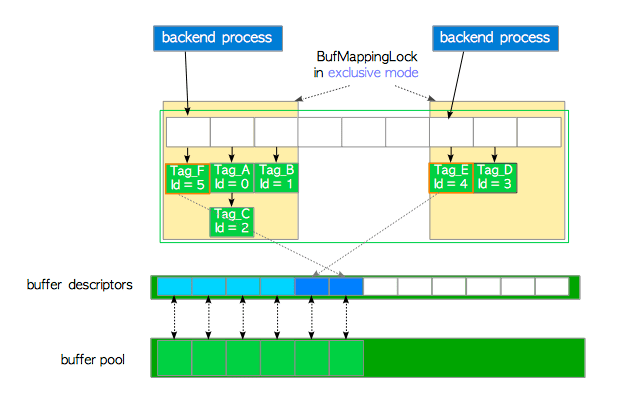

缓冲表需要许多其他锁。例如，缓冲表内部使用自旋锁来删除条目。但是，省略了对这些其他锁的描述，因为在本文档中不需要它们。

> 默认情况下，BufMappingLock已分为16个单独的锁，直到版本9.4。

### 8.3.2 每个缓冲区描述符的锁

​	每个缓冲区描述符使用两个轻量级锁，**content_lock**和**io_in_progress_lock**来控制对相应缓冲池槽中存储页面的访问。检查或更改自己字段的值时，使用自旋锁。

#### 8.3.2.1 内容锁（content_lock）

content_lock是一个强制访问限制的典型锁。它可以在*共享*和*独占*模式下使用。

当读取页面时，后端进程获取存储页面的缓冲区描述符的共享content_lock。

但是，执行以下操作之一时会获取独占的content_lock：

- 将行（即元组）插入存储的页面或更改存储页面中元组的`t_xmin/t_xmax`字段（`t_xmin`和`t_xmax`在[第5.2节](http://www.interdb.jp/pg/pgsql05.html#_5.2.)中描述；简单地说，当删除或更新行时，相关元组的这些字段将被更改） 。
- 物理地移除元组或压缩存储页面上的自由空间（由清理过程和HOT执行，分别在[第6章](http://www.interdb.jp/pg/pgsql06.html)和[第7章](http://www.interdb.jp/pg/pgsql06.html)中描述）。
- 冻结存储页面中的元组（冻结在[第5.10.1 ](http://www.interdb.jp/pg/pgsql05.html#_5.10.1.)[节](http://www.interdb.jp/pg/pgsql06.html#_6.3.)和[第6.3 ](http://www.interdb.jp/pg/pgsql06.html#_6.3.)[节中](http://www.interdb.jp/pg/pgsql05.html#_5.10.1.)描述）。

官方[README](https://github.com/postgres/postgres/blob/master/src/backend/storage/buffer/README) 文件包含更多的细节。

#### 8.3.2.2 IO进行锁（io_in_progress_lock）

*io_in_progress*锁用于等待缓冲区上的I/O完成。当PostgreSQL进程I/O存储加载/写入页面数据时，该进程在访问存储时保持对应描述符的独占io_in_progress锁定。

#### 8.3.2.3 自旋锁（spinlock）

当检查或更改标志或其他字段（例如refcount和usage_count）时，使用自旋锁。螺旋锁使用的两个具体示例如下：

1. 以下显示如何**固定**缓冲区描述符：

   1. 获取缓冲区描述符的自旋锁。
   2. 将其引用计数和usage_count的值增加1。
   3. 松开自旋锁。

- ```c
  LockBufHdr(bufferdesc);    /* Acquire a spinlock */
  bufferdesc->refcont++;
  bufferdesc->usage_count++;
  UnlockBufHdr(bufferdesc); /* Release the spinlock */
  ```

  当一些标志位，比如refcount和usage_count被检查或者更改的时候，使用这个锁，在PostgreSQL9.6中用原子操作替代了这个锁；

2. 以下显示如何将脏位设置为“1”：

   1. 获取缓冲区描述符的自旋锁。
   2. 使用按位操作将脏位设置为“1”。
   3. 松开自旋锁。

- ```c
  #define BM_DIRTY             (1 << 0)    /* data needs writing */
  #define BM_VALID             (1 << 1)    /* data is valid */
  #define BM_TAG_VALID         (1 << 2)    /* tag is assigned */
  #define BM_IO_IN_PROGRESS    (1 << 3)    /* read or write in progress */
  #define BM_JUST_DIRTIED      (1 << 5)    /* dirtied since write started */
  
  LockBufHdr(bufferdesc);
  bufferdesc->flags |= BM_DIRTY;
  UnlockBufHdr(bufferdesc);
  ```
  以相同的方式执行改变其他位。


> #### 用原子操作替换缓冲区管理器的自旋锁
>
> ​	在9.6版本中，缓冲区管理器的自旋锁将被替换为原子操作，可以参考这个[提交清单](https://commitfest.postgresql.org/9/408/)的结果。如果想进一步了解详情，可以参阅这里的[讨论](http://www.postgresql.org/message-id/flat/2400449.GjM57CE0Yg@dinodell#2400449.GjM57CE0Yg@dinodell)。
>
> ```c
> /* src/include/storage/buf_internals.h  (since 9.6, 移除了一些字段) */
> 
> /* 缓冲区描述符的标记位定义(since 9.6)
>  * 注意：TAG_VALID实际上意味着缓冲区哈希表中有一条与本tag关联的项目。
>  */
> #define BM_LOCKED				(1U << 22)	/* 缓冲区首部被锁定 */
> #define BM_DIRTY				(1U << 23)	/* 数据需要写入 */
> #define BM_VALID				(1U << 24)	/* 数据有效 */
> #define BM_TAG_VALID			(1U << 25)	/* 标签有效，已经分配 */
> #define BM_IO_IN_PROGRESS		(1U << 26)	/* 读写进行中 */
> #define BM_IO_ERROR				(1U << 27)	/* 先前的I/O失败 */
> #define BM_JUST_DIRTIED			(1U << 28)	/* 写之前已经脏了 */
> #define BM_PIN_COUNT_WAITER		(1U << 29)	/* 有人等着钉页面 */
> #define BM_CHECKPOINT_NEEDED	(1U << 30)	/* 必需在存档时写入 */
> #define BM_PERMANENT			(1U << 31)	/* 永久缓冲 */
> 
> 
> /* BufferDesc -- 单个共享缓冲区的共享描述符/共享状态
>  * 
>  * 注意: 读写tag, state, wait_backend_pid 等字段时必须持有缓冲区首部锁(BM_LOCKED标记位)
>  * 简单地说，refcount, usagecount,标记位组合起来被放入一个原子变量state中，而缓冲区首部锁
>  * 实际上是嵌入标记位中的一个bit。 这种设计允许我们使用单个原子操作，而不是获取/释放自旋锁
>  * 来实现一些操作。举个例子，refcount的增减。buf_id字段在初始化之后再也不会改变，所以不需要锁。
>  * freeNext是通过buffer_strategy_lock而非buf_hdr_lock来保护的。LWLocks字段可以自己管好自
>  * 己。注意buf_hdr_lock *不是* 用来控制对缓冲区内数据的访问的！
>  *
>  * 我们假设当持有首部锁时，没人会修改state字段。因此持有缓冲区首部锁的人可以在一次写入中
>  * 中对state变量进行很复杂的更新，包括更新完的同时释放锁（清理BM_LOCKED标记位）。此外，不持有
>  * 缓冲区首部锁而对state进行更新仅限于CAS操作，它能确保操作时BM_LOCKED标记位没有被置位。
>  * 不允许使用原子自增/自减，OR/AND等操作。
>  *
>  * 一个例外是，如果我们固定了(pinned)该缓冲区，它的标签除了我们自己之外不会被偷偷修改。
>  * 所以我们无需锁定自旋锁就可以检视该标签。此外，一次性的标记读取也无需锁定自旋锁，
>  * 当我们期待测试标记位不会改变时，这种做法很常见。
>  *
>  * 如果另一个后端固定了该缓冲区，我们就无法从磁盘页面上物理移除项目了。因此后端需要等待
>  * 所有其他的钉被移除。移除时它会得到通知，这是通过将它的PID存到wait_backend_pid，并设置
>  * BM_PIN_COUNT_WAITER标记为而实现的。目前而言，每个缓冲区只能有一个等待者。
>  *
>  * 对于本地缓冲区，我们也使用同样的首部，不过锁字段就没用了，一些标记位也没用了。为了避免不必要
>  * 的额外开销，对state字段的操作不需要用实际的原子操作（即pg_atomic_read_u32，
>  * pg_atomic_unlocked_write_u32）
>  *
>  * 增加该结构的尺寸，增减，重排该结构的成员时需要特别小心。保证该结构体小于64字节对于性能
>  * 至关重要(最常见的CPU缓存线尺寸)。
>  */
> typedef struct BufferDesc
> {
> 	BufferTag	tag;			/* 存储在缓冲区中页面的标识 */
> 	int			buf_id;			/* 缓冲区的索引编号 (从0开始) */
> 
> 	/* 标记的状态，包含标记位，引用计数，使用计数 */
>     /* 9.6使用原子操作替换了很多字段的功能 */
> 	pg_atomic_uint32 state;
> 
> 	int			wait_backend_pid;	/* 等待钉页计数的后端进程PID */
> 	int			freeNext;		    /* 空闲链表中的链接 */
> 
> 	LWLock		content_lock;	    /* 访问缓冲内容的锁 */
> } BufferDesc;
> ```


## 8.4 缓冲区管理器的工作原理

​	本节介绍缓冲区管理器的工作原理。当后端进程想要访问所需页面时，它会调用*ReadBufferExtended*函数。

​	函数*ReadBufferExtended* 的行为取决于三种逻辑情况。每种情况都会用一小节来描述。此外最后一小节中描述了PostgreSQL的**时钟扫描（clock-sweep）**页面替换算法。

### 8.4.1 访问存储在缓冲池中的页面

首先，描述最简单的情况，即所需页面已经存储在缓冲池中。在这种情况下，缓冲区管理器执行以下步骤：

1. 创建所需页面的*buffer_tag*（在该示例中，buffer_tag是'Tag_C'）并使用散列函数计算包含所创建的*buffer_tag*的关联条目的*散列桶槽*。
2. 以共享模式获取覆盖获得的哈希桶槽的BufMappingLock分区（该锁将在步骤（5）中释放）。
3. 查找标签为“Tag_C”的条目，并从条目中获取*buffer_id*。在此示例中，buffer_id为2。
4. 将缓冲区描述符固定为buffer_id 2，即描述符的refcount和usage_count增加1（[第8.3.2节](http://www.interdb.jp/pg/pgsql08.html#_8.3.2.)描述了固定）。
5. 释放BufMappingLock。
6. 使用buffer_id 2访问缓冲池槽。

**图8.8 访问存储在缓冲池中的页面。**

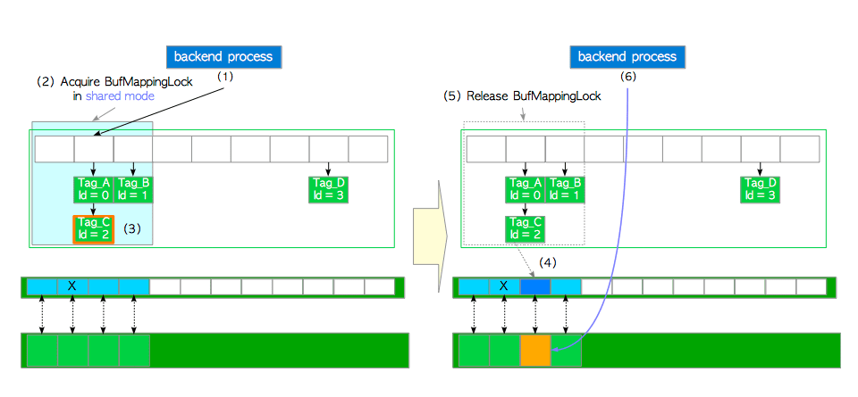

​	然后，当从缓冲池槽中的页面读取行时，PostgreSQL进程获取相应缓冲区描述符的*共享content_lock*。因此，缓冲池槽可以由多个进程同时读取。

​	当向页面插入（和更新或删除）行时，Postgres进程获取相应缓冲区描述符的*独占content_lock*（请注意，页面的脏位必须设置为“1”）。

​	访问页面后，相应缓冲区描述符的引用计数值减1。

### 8.4.2 将页面从存储加载到空槽

​	在第二种情况下，假设所需页面不在缓冲池中，并且空闲列表具有空闲元素（空描述符）。在这种情况下，缓冲区管理器执行以下步骤：

1. 查找缓冲区表（我们假设找不到它）。

   1. 创建所需页面的buffer_tag（在此示例中，buffer_tag为'Tag_E'）并计算哈希桶槽。

   2. 以共享模式获取BufMappingLock分区。
   3. 查找缓冲区表（根据假设未找到）。
   4. 释放BufMappingLock。

2. 从*空闲列表中*获取*空缓冲区描述符*，并将其固定。在该示例中，获得的描述符的buffer_id是4。

3. 以*独占*模式获取BufMappingLock分区（此锁定将在步骤（6）中释放）。

4. 创建一个包含buffer_tag'Tag_E'和buffer_id 4的新数据条目; 将创建的条目插入缓冲区表。

5. 使用buffer_id 4将所需的页面数据从存储器加载到缓冲池槽，如下所示：

   1. 获取相应描述符的独占io_in_progress_lock。

   2. 将相应描述符的*io_in_progress*位设置为1以防止其他进程访问。

   3. 将所需的页面数据从存储装载到缓冲池插槽。

   4. 更改相应描述符的状态; 所述*io_in_progress*位被设置为“0”，并且*有效*位被设置为“1”。

   5. 释放io_in_progress_lock。

6. 释放BufMappingLock。

7. 使用buffer_id 4访问缓冲池槽。

   

**图8.9 将页面从存储装载到空插槽**

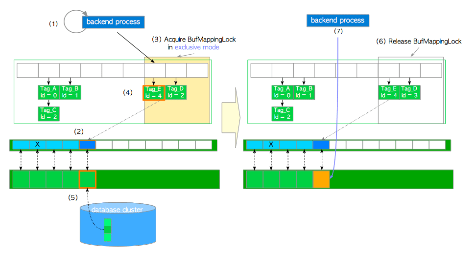

### 8.4.3 将页面从存储加载到受害者缓冲池插槽

在这种情况下，假设所有缓冲池槽都被页面占用，但不存储所需的页面。缓冲区管理器执行以下步骤：

1. 创建所需页面的buffer_tag并查找缓冲表。在这个例子中，我们假设buffer_tag是'Tag_M'（找不到所需的页面）。

2. 使用时钟扫描算法选择受害者缓冲池槽，从缓冲区表中获取包含受害者池槽的buffer_id的旧条目，并将受害者池槽固定在缓冲区描述符层中。在此示例中，受害者槽的buffer_id为5，旧条目为“Tag_F，id = 5”。时钟扫描将在[下一小节中介绍](http://www.interdb.jp/pg/pgsql08.html#_8.4.4.)。

3. 如果受害者页面数据是脏的，则刷新（写入和fsync）; 否则进入步骤（4）。 

  在使用新数据覆盖之前，必须将脏页写入存储。刷新脏页面的步骤如下：

    1. 使用buffer_id 5（在步骤6中释放）获取描述符的共享content_lock和独占io_in_progress锁。
    2. 更改相应描述符的状态; 所述*io_in_progress*位被设置为“1”和*just_dirtied*位被设置为“0”。
    3. 根据具体情况，调用`XLogFlush()`函数将WAL缓冲区上的WAL数据写入当前WAL段文件（详细信息省略; WAL和`XLogFlush`函数在[第9章](ch9.md)中描述）。
    4. 将受害者页面数据刷新到存储。
    5. 更改相应描述符的状态; 所述*io_in_progress*位被设置为“0”和*有效*位被设置为“1”。
    6. 释放io_in_progress和content_lock锁。

  7. 以独占模式获取覆盖包含旧条目的插槽的旧BufMappingLock分区。

  8. 获取新的BufMappingLock分区并将新条目插入缓冲区表：

        9. 创建由新buffer_tag'Tag_M'和受害者的buffer_id组成的新条目。
            10. 获取新的BufMappingLock分区，该分区覆盖包含独占模式中新条目的插槽。
                11. 将新条目插入缓冲区表。

  **图8.10 将页面从存储加载到受害者缓冲池槽**

  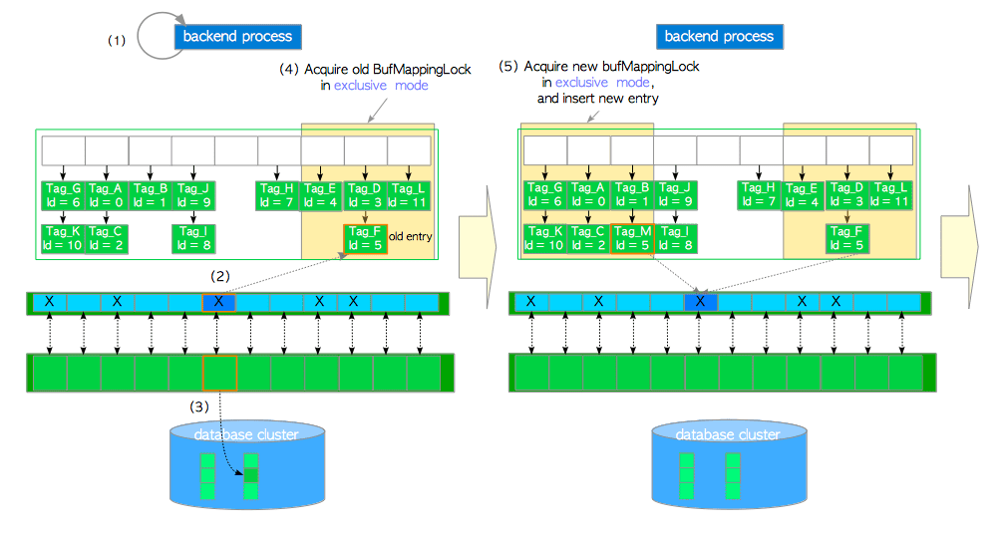

6. 从缓冲表中删除旧条目，并释放旧的BufMappingLock分区。

7. 将所需的页面数据从存储器加载到受害者缓冲槽。然后，用buffer_id 5更新描述符的标志; 脏位设置为'0并初始化其他位。

8. 释放新的BufMappingLock分区。

9. 使用*buffer_id = 5*访问缓冲池槽。


**图8.11 将页面从存储器加载到受害者缓冲池槽（从图8.10继续）**

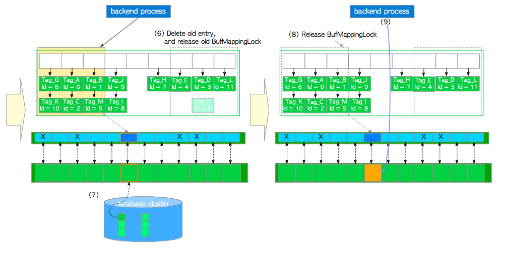

### 8.4.4 页面替换算法：时钟扫描

​	本节的其余部分介绍了**时钟扫描（clock-sweep）**算法。该算法是**NFU（Not Frequently Used）**算法的变种，开销较小。它能高效地选出较少使用的页面。

​	让我们将缓冲区描述符设想为一个循环列表（图8.12）。`nextVictimBuffer`是一个无符号的32位整型，它总是指向一个缓冲区描述符，并按顺时针顺序旋转。其伪代码与算法描述如下：

> #### 伪代码：时钟扫描
>
> ```c
>      WHILE true
> (1)      获取nextVictimBuffer指向的缓冲区描述符
> (2)      IF 缓冲区描述符没有被固定(unpinned) THEN
> (3)	         IF 候选缓冲区描述符的 usage_count == 0 THEN
> 	             BREAK WHILE LOOP  /* 该描述符对应的槽就是受害者槽 */
> 	         ELSE
> 		         将候选描述符的 usage_count 减 1
>              END IF
>          END IF
> (4)      步进nextVictimBuffer，指向下一个缓冲区描述符
>       END WHILE 
> (5)   RETURN 受害者页面的 buffer_id
> ```
>
> 1. 获取*nextVictimBuffer*指向的**候选缓冲区描述符（candidate buffer descriptor）**。
> 2. 如果候选描述符**未被固定（unpinned）**，则进入步骤(3)， 否则进入步骤(4)。
> 3. 如果候选描述符的 *usage_count* 为*0*，则选择该描述符对应的槽作为受害者，并进入步骤(5)；否则将此描述符的 *usage_count* 减1，并继续执行步骤(4)。
> 4. 将*nextVictimBuffer*步进至下一个描述符（如果到末尾则回绕至头部）并返回步骤(1)。重复至找到受害者。
> 5. 返回受害者的 *buffer_id*。

具体的例子如图8.12所示。缓冲区描述符为蓝色或青色的方框，框中的数字显示每个描述符的 *usage_count*。

**图8.12 时钟扫描**

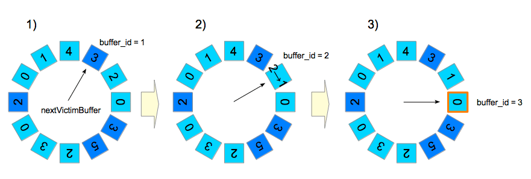

1. *nextVictimBuffer* 指向第一个描述符（`buffer_id = 1`）; 但因为该描述符被固定了，所以跳过了它。
2. *nextVictimBuffer*指向第二个描述符（`buffer_id = 2`）。此描述符未被固定，但其*usage_count*为2；因此会将*usage_count*减1，而*nextVictimBuffer*步进至第三个候选描述符。
3. *nextVictimBuffer*指向第三个描述符（`buffer_id = 3`）。此描述符未被固定，但其*usage_count*为0；因此成为本轮的受害者。

当*nextVictimBuffer*扫过未固定的描述符时，其 *usage_count* 会减1。因此只要缓冲池中存在未固定的描述符，该算法总能在若干次旋转*nextVictimBuffer*后找到一个*usage_count*为0的受害者。


## 8.5 环形缓冲区

​	在读写大表时，PostgreSQL使用**环形缓冲区（ring buffer）**而不是缓冲池。**环形缓冲器**是一个很小的临时缓冲区域。当满足下列任意条件时，PostgreSQL将在共享内存中分配一个环形缓冲区：

1. **批量读取**

   扫描关系，且读取数据的大小超过缓冲池四分之一大小（`shared_buffers/4`），这种情况下环形缓冲区大小为*256 KB*。

2. **批量写入**

   当执行下列SQL命令时，这种情况下环形缓冲区大小为*16 MB*。

   * [`COPY FROM`](https://www.postgresql.org/docs/current/static/sql-copy.html)命令。

   - [`CREATE TABLE AS`](https://www.postgresql.org/docs/current/static/sql-createtableas.html)命令。
   - [`CREATE MATERIALIZED VIEW`](http://www.postgresql.org/docs/current/static/sql-creatematerializedview.html)或 [`REFRESH MATERIALIZED VIEW`](http://www.postgresql.org/docs/current/static/sql-refreshmaterializedview.html)命令。
   - [`ALTER TABLE`](http://www.postgresql.org/docs/current/static/sql-altertable.html)命令。

3. **清理过程**

   当自动清理守护进程执行清理过程时，这种情况环形缓冲区大小为256 KB。

分配的环形缓冲区将在使用后立即被释放。

环形缓冲区的好处显而易见，如果后端进程在不使用环形缓冲区的情况下读取大表，则所有存储在缓冲池中的页面都会被移除（踢出），因而会导致缓存命中率降低。环形缓冲区可以避免此问题。

> #### 为什么批量读取和清理过程的默认环形缓冲区大小为256 KB？
>
> 为什么是256 KB？源代码中缓冲区管理器目录下的[README](https://github.com/postgres/postgres/blob/master/src/backend/storage/buffer/README)中解释了这个问题。
>
> > 顺序扫描使用256KB的环缓冲。它足够小，能够放入L2缓存中，从而使得操作系统缓存到共享缓冲区的页面传输变得高效。通常更小的也足够了，但换缓冲区必需足够大，能够容纳扫描中同时被固定的所有页面。


## 8.6 刷新脏页

​	除了替换受害者页面之外，存档器和后台写入器进程还会将脏页刷写至存储中。尽管两个进程都具有相同的功能（刷写脏页），但它们有着不同的角色和行为。

​	存档器进程将存档记录写入WAL段文件，并在存档开始时进行脏页刷写。[9.7节](http://www.interdb.jp/pg/pgsql09.html#_9.7.)描述了存档，以及何时开始。

​	后台写入器的作用是减少存档带来的密集写入的影响。后台写入器逐渐地刷写脏页，将对数据库活动的影响造成影响降至最小。默认情况下，后台写入器每200毫秒唤醒一次（由参数[`bgwriter_delay`](http://www.postgresql.org/docs/current/static/runtime-config-resource.html#GUC-BGWRITER-DELAY)定义），并最多刷写[`bgwriter_lru_maxpages`](http://www.postgresql.org/docs/current/static/runtime-config-resource.html#GUC-BGWRITER-LRU-MAXPAGES)个页面（默认为100个页面）。