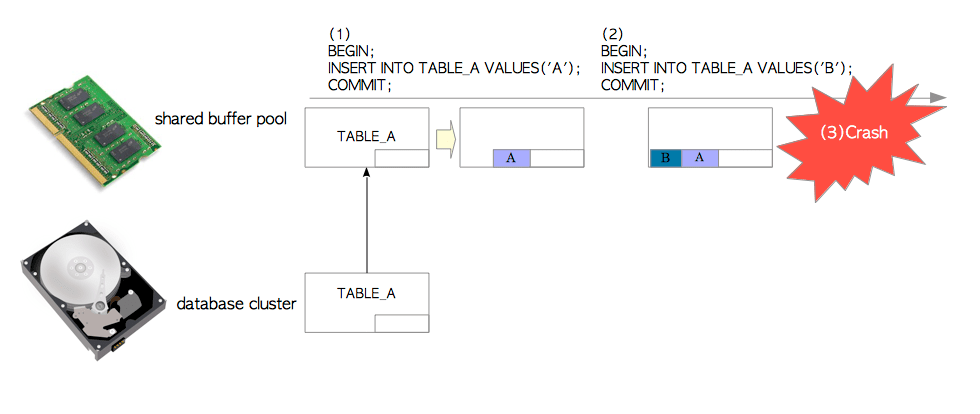
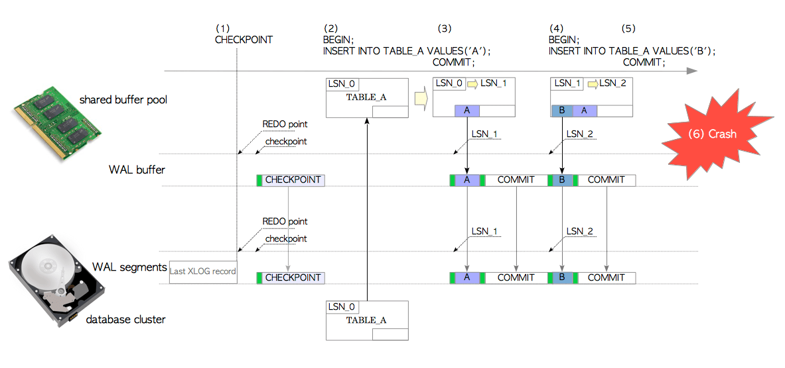
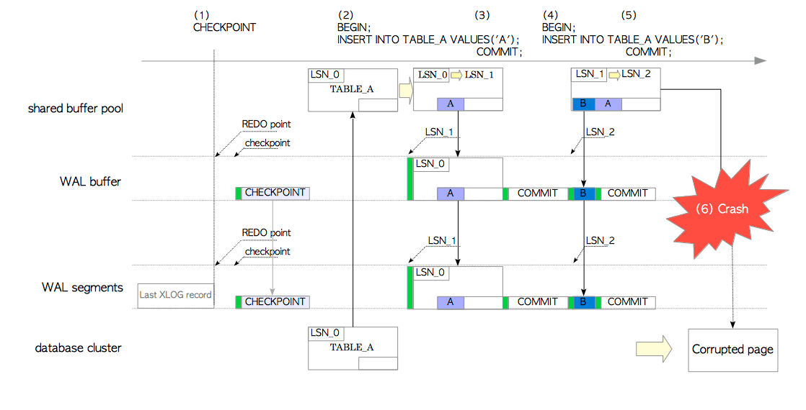
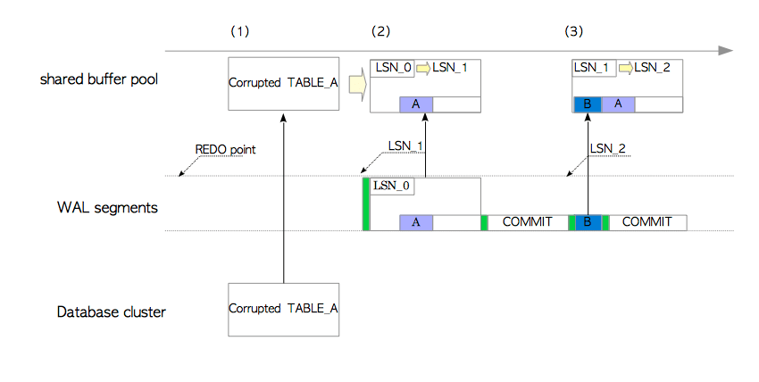

# 第九章 预写式日志——WAL

[TOC]

​	事务日志（**transaction log**）是数据库的关键组件，因为当出现系统故障时，任何数据库管理系统都不允许丢失数据。事务日志是数据库系统中所有**变更（change）**与**行为（action）**的历史记录，当诸如电源故障，或其他服务器错误导致服务器崩溃时，它能用来确保数据不会丢失。由于日志包含每个已执行事务相关的充足信息，因此当服务器崩溃时，数据库服务器应能通过重放事务日志中的更改与行为，来恢复数据库集群。

​	在计算机科学领域，WAL是**Write Ahead Logging**的缩写，它指的是将**变更与行为写入事务日志的协议或规则**；而在PostgreSQL中，WAL是**Write Ahead Log**的缩写。在这里它被当成事务日志的同义词，而且也用来指代一种将**行为**写入事务日志（WAL）的实现机制。虽然有些令人困惑， 但本文将使用PostgreSQL中的定义。

​	WAL机制在7.1版本中首次实现，用以减轻服务器崩溃的影响。它还是**时间点恢复（Point-in-Time Recovery PIRT）**与**流复制（Streaming Replication, SR）**实现的基础，这两者将分别在[第10章](ch10.md)和[第11章](ch11.md)中介绍。

​	尽管理解WAL机制对于管理、集成PostgreSQL非常重要，但由于它的复杂性，不可能做到简要介绍。因此本章将会对WAL做一个完整的解释。第一节描绘了WAL的全貌，介绍了一些重要的概念与关键词。接下来的小节中会依次讲述其他主题：

* 事务日志（WAL）的逻辑结构与物理结构
* WAL数据的内部布局
* WAL数据的写入
* WAL写入者进程
* 存档流程
* 数据库恢复流程
* 管理WAL段文件
* 持续归档

## 9.1 概述

​	让我们先来概述一下WAL机制。为了阐明WAL要解决的问题，第一部分展示了如果PostgreSQL在没有实现WAL时崩溃会发生什么。第二部分介绍了一些关键概念，并概览了本章中的一些关键主题。最后一部分完成了WAL的概述，并引入了一个更为重要的概念。

### 9.1.1 没有WAL的插入操作

正如在第八章中讨论的那样，为了能高效访问关系表的页面，几乎所有的DBMS都实现了缓冲池。

假设我们有一个没有实现WAL的PostgreSQL，现在向表A中插入一些数据元组，如图9.1所示。

**图9.1 没有WAL的插入操作**




1. 发起第一条`INSERT`语句时，PostgreSQL从数据库集簇文件中加载表A的页面到内存中的共享缓冲池。然后向页面中插入一条元组。页面并没有立刻写回到数据库集簇文件中。正如[第8章](ch8.md)中提到的，修改过的页面通常称为**脏页（dirty page）**
2. 发起第二条`INSERT`语句时，PostgreSQL直接向缓冲池中的页面添加了一条新元组。这一页仍然没有被写回到持久存储中。
3. 如果操作系统或PostgreSQL服务器因为各种原因失效（例如电源故障），所有插入的数据都会丢失。

因此，没有WAL的数据库，在系统崩溃时，是很脆弱的。

### 9.1.2 插入操作与数据库恢复

​	为了应对上述的系统失效问题，同时又不招致性能损失，PostgreSQL支持了WAL。这一部分描述了一些关键词和概念，以及WAL数据的写入和数据库系统的恢复。

​	为了应对系统失效，PostgreSQL将所有修改作为历史数据写入持久化存储中。这份历史数据称为**XLOG记录（xlog record）**或**WAL数据（wal data）**。

​	当插入、删除、提交等变更动作发生时，PostgreSQL会将XLOG记录写入内存中的**WAL缓冲区（WAL Buffer）**。当事务提交或中止时，它们会被立即写入持久存储上的**WAL段文件（WAL segment file）**中（更精确来讲，其他场景也可能会有XLOG记录写入，细节将在9.5节中描述）。XLOG记录的**日志序列号（Log Sequence Number, LSN）**标识了该记录在事务日志中的位置，记录的LSN被用作XLOG记录的唯一标识符。

​	顺便一提，当我们考虑数据库系统如何恢复时，可能会想到一个问题：PostgreSQL是从哪一点开始恢复的？答案是**重做点（REDO Point）**，即最新一个**存档点（Checkpoint）**开始时**XLOG记录**写入的位置。（PostgreSQL中的存档点将在9.7节中描述）。实际上，数据库恢复过程与存档过程紧密相连，两者是不可分割的。

> WAL与存档过程在7.1版本中同时实现

介绍完了主要的关键词与概念，现在来说一下带有WAL时的元组插入操作。如图9.2所示：

**图9.2 带有WAL的插入操作**



> 表A的LSN展示的是表A页面中页首部里`pd_lsn`类型的`PageXLogRecPtr`字段，与页面的LSN是一回事。

1. 存档者是一个后台进程，周期性地执行存档过程。当存档者开始存档时，它会向当前WAL段文件写入一条XLOG记录，称为**存档记录（Checkpoint Record）**。这条记录包含了最新的**重做点**位置。
2. 发起第一条`INSERT`语句时，PostgreSQL从数据库集簇文件中加载表A的页面到内存中的共享缓冲池，向页面中插入一条元组，然后在`LSN_1`位置创建并写入一条相应的XLOG记录，然后将表A的LSN从`LSN_0`更新为`LSN_1`。在本例中，XLOG记录是由首部数据与**完整元组**组成的一对值。
3. 当该事务提交时，PostgreSQL向WAL缓冲区创建并写入一条关于该提交行为的XLOG记录，然后将WAL缓冲区中的所有XLOG记录刷写入WAL段文件中。
4. 发起第二条`INSERT`语句时，PostgreSQL向页面中插入一条新元组，然后在`LSN_2`位置创建并写入一条相应的XLOG记录，然后将表A的LSN从`LSN_1`更新为`LSN_2`。
5. 当这条语句的事务提交时，PostgreSQL执行同步骤3类似的操作。
6. 设想当操作系统失效发生时，尽管共享缓冲区中的所有数据都丢失了，但所有页面修改已经作为历史记录被写入WAL段文件中。

接下来的步骤展示了如何将数据库集簇恢复到崩溃时刻前的状态。不需要任何特殊的操作，重启PostgreSQL时会自动进入恢复模式，如图9.3所示。PostgreSQL会从**重做点**开始，依序读取正确的WAL段文件并重放XLOG记录。

**图9.3 使用WAL进行数据库恢复**


1. PostgreSQL从相关的WAL段文件中读取第一条`INSERT`语句的XLOG记录，并从硬盘上的数据库集簇目录加载表A的页面到内存中的共享缓冲区中。
2. 在重放XLOG记录前，PostgreSQL会比较XLOG记录的LSN与相应页面的LSN。这么做的原因在第9.8节中描述。重放XLOG记录的规则如下所示：
   * 如果XLOG记录的LSN要比页面LSN大，XLOG记录中的数据部分就会被插入到页面中，并将页面的LSN更新为XLOG记录的LSN。
   * 如果XLOG记录的LSN要比页面的LSN小，那么不用做任何事情，直接读取后续的WAL数据即可。
3. PostgreSQL按照同样的方式重放其余的XLOG记录。

PostgreSQL可以通过按时间顺序重放写在WAL段文件中的XLOG记录来自我恢复，因此，PostgreSQL的XLOG记录显然是一种**重做日志（REDO log）**。

> PostgreSQL不支持**撤销日志（UNDO log）**

尽管写XLOG记录肯定有一定的代价，这些代价和写全页相比微不足道。我们可以确保这一方式付出的代价是值得的，比如获得了系统崩溃时的恢复能力。

### 9.1.3 整页写入

​	假设后台写入进程在写入脏页的过程中出现了操作系统故障，导致磁盘上表A的页面数据损坏。XLOG是无法在损坏的页面上重放的，我们需要其他特性来确保这一点。

> 译注：PostgreSQL默认使用8K的页面，操作系统通常使用4k的页面，可能出现只写入一个4k页面的情况。

​	PostgreSQL支持诸如**整页写入（full-page write）**的功能来处理这种失效。如果启用，PostgreSQL会在每次存档点之后，在每个页面第一次发生变更时，会将**整个页面**及相应首部作为一条XLOG记录写入。这个功能默认是开启的。在PostgreSQL中，这种包含完整页面的XLOG记录称为**备份区块（backup block）**，或者**整页镜像（full-page image）**。

**图9.4 整页写入**



1. 存档进程开始进行存档过程。
2. 在第一条`INSERT`语句进行插入操作时，PostgreSQL执行的操作几乎同上所述。区别在于这里的XLOG记录是当前页的**备份区块**（即，包含了完整的页面），因为这是自最近一次存档以来，该页面的第一次写入。
3. 当事务提交时，PostgreSQL的操作同上节所述。
4. 第二条`INSERT`语句进行插入操作时，PostgreSQL的操作同上所述，这里的XLOG记录就不是备份块了。
5. 当这条语句的事务提交时，PostgreSQL的操作同上节所述。
6. 为了说明整页写入的效果，我们假设后台写入进程在向磁盘写入脏页的过程中出现了操作系统故障，导致磁盘上表A的页面数据损坏。

重启PostgreSQL即可修复损坏的集簇，如图9.5所示

**图9.5 使用备份区块进行数据库恢复**



1. PostgreSQL读取第一条`INSERT`语句的XLOG记录，并从数据库集簇目录加载表A的页面至共享缓冲池中。在本例中，按照整页写入的规则，这条XLOG记录是一个备份区块。

2. 当一条XLOG记录是备份区块时，会使用另一条重放规则：XLOG记录的数据部分会直接覆盖当前页面，无视页面或XLOG记录中的LSN，然后将页面的LSN更新为XLOG记录的LSN。

   在本例中，PostgreSQL使用记录的数据部分覆写了损坏的页面，并将表A的LSN更新为`LSN_1`，通过这种方式，损坏的页面通过它自己的备份区块恢复回来了。

3. 因为第二条XLOG记录不是备份区块， 因此PostgreSQL的操作同上所述。

即使发生一些数据写入错误，PostgreSQL也能从中恢复。（当然如果发生文件系统或物理介质失效，就不行了）


## 9.2 事务日志与WAL段文件

从逻辑上将，PostgreSQL将XLOG记录写入事务日志，这是一个长度用8字节表示的虚拟文件（16EB）。

虽说事务日志的容量实际上应该是无限的，但8字节长度的地址空间已经足够宽广了。目前是不可能处理这个量级的单个文件的。因此PostgreSQL中的事务日志实际上默认被划分为16M大小的一系列文件，这些文件被称作**WAL段（WAL Segment）**。如图9.6所示。

> ### WAL段文件尺寸
>
> 在版本11以后，WAL段文件的大小可以通过[--wal-segsize](https://www.postgresql.org/docs/11/static/app-initdb.html)选项在使用`initdb`创建数据库时配置。

**图9.6 事务日志与WAL段文件**


WAL段文件的文件名是由24个十六进制数字组成的，其命名规则如下：
$$
\begin{align}
	\verb|WAL segment file name| = \verb|timelineId| + (\verb|uint32|) \frac{\verb|LSN|-1}{16\verb|M|*256}  
		  	  + (\verb|uint32|)\left(\frac{\verb|LSN|-1}{16\verb|M|}\right) \% 256
\end{align}
$$

> ### 时间线标识
>
> PostgreSQL的WAL有**时间线标识（TimelineID，四字节无符号整数）**的概念，用于[第十章](ch10.md)中所述的**时间点恢复（PITR）**。不过在本章中时间线标识将固定为`0x00000001`，因为接下来的几节里还不需要这个概念。	

​	第一个WAL段文件名是`000000010000000000000001`，如果第一个段被XLOG记录写满了，就会创建第二个段`000000010000000000000002`，后续的文件名将使用升序。在`0000000100000000000000FF`被填满之后，就会使用下一个文件`000000010000000100000000`。通过这种方式，每当最后两位数字要进位时，中间8位数字就会加一。与之类似，在`0000000100000001000000FF`被填满后，就会开始使用`000000010000000200000000`，依此类推。


> ### WAL文件名
>
> 使用内建的函数`pg_xlogfile_name`（9.6及以前的版本），或`pg_walfile_name`（10及以后的版本），我们可以找出包含特定LSN的WAL段文件。例如：
>
> ```sql
> testdb=# SELECT pg_xlogfile_name('1/00002D3E');   -- 9.6-
> testdb=# -- SELECT pg_walfile_name('1/00002D3E'); -- 10+
> 
>      pg_xlogfile_name     
> --------------------------
>  000000010000000100000000
> (1 row)
> ```


## 9.3 WAL段文件的内部布局

一个WAL段文件大小默认为16MB，并在内部划分为大小为8192字节（8KB）的页面。第一个页包含了由`XLogLongPageHeaderData`定义的首部数据，其他的页包含了由`XLogPageHeaderData`定义的首部数据。每页在首部数据之后，紧接着就是以**降序**写入的XLOG记录，如图9.7所示。

**图9.7 WAL段文件内部布局**


`XLogLongPageHeaderData`与`XLogPageHeaderData`结构定义在 [src/include/access/xlog_internal.h](https://github.com/postgres/postgres/blob/master/src/include/access/xlog_internal.h)中。这两个结构的具体说明就不在此展开了，因为对于后续小节并非必需的。

```c
typedef struct XLogPageHeaderData
{
	uint16		xlp_magic;		/* 用于正确性检查的魔数 */
	uint16		xlp_info;		/* 标记位，详情见下 */
	TimeLineID	xlp_tli;		/* 页面中第一条记录的时间线ID */
	XLogRecPtr	xlp_pageaddr;	/* 当前页的XLOG地址 */
    
	/* 当本页放不下一条完整记录时，我们会在下一页继续，xlp_rem_len存储了来自先前页面
	 * 记录剩余的字节数。注意xl_rem_len包含了备份区块的数据，也就是说它会在第一个首部跟踪
	 * xl_tot_len而不是xl_len。还要注意延续的数据不一定是对齐的。
	 */
	uint32		xlp_rem_len;	/* 记录所有剩余数据的长度 */
} XLogPageHeaderData;

typedef XLogPageHeaderData *XLogPageHeader;

/* 当设置了XLP_LONG_HEADER标记位时，我们将在页首部中存储额外的字段。
 * (通常是在XLOG文件中的第一个页面中) 额外的字段用于确保文件的正确性。
 */
typedef struct XLogLongPageHeaderData
{
  XLogPageHeaderData std;            /* 标准首部 */
  uint64             xlp_sysid;      /* 来自pg_control中的系统标识符 */
  uint32             xlp_seg_size;   /* 交叉校验 */
  uint32             xlp_xlog_blcksz;/* 交叉校验 */
} XLogLongPageHeaderData;
```


## 9.4 WAL记录的内部布局

​	一条XLOG记录由通用的首部部分与特定的数据部分构成。本章第一节描述了首部的结构，剩下两个节分别解释了9.5版本前后数据部分的结构。（9.5版本改变了数据格式）

### 9.4.1 WAL记录首部部分

​	所有的XLOG记录都有一个通用的首部，由结构`XLogRecord`定义。9.5更改了首部的定义，9.4及更早版本的结构定义如下所示：

```c
typedef struct XLogRecord
{
   uint32          xl_tot_len;   /* 整条记录的全长 */
   TransactionId   xl_xid;       /* 事务ID */
   uint32          xl_len;       /* 资源管理器的数据长度 */
   uint8           xl_info;      /* 标记位，如下所示 */
   RmgrId          xl_rmid;      /* 本记录的资源管理器 */
   /* 这里有2字节的填充，初始化为0 */
   XLogRecPtr      xl_prev;      /* 在日志中指向先前记录的指针 */
   pg_crc32        xl_crc;       /* 本记录的CRC */
} XLogRecord;
```

​	除了两个变量，大多数变量的意思非常明显，无需多言。`xl_rmid`与`xl_info`都是与**资源管理器（resource manager）**相关的变量，它是一些与WAL功能（写入，重放XLOG记录）相关的操作集合。资源管理器的数目随着PostgreSQL不断增加，第10版包括这些：

|                | 资源管理器                                                 |
| :------------- | :--------------------------------------------------------- |
| 堆元组操作     | RM_HEAP, RM_HEAP2                                          |
| 索引操作       | RM_BTREE, RM_HASH, RM_GIN, RM_GIST, RM_SPGIST, RM_BRIN     |
| 序列号操作     | RM_SEQ                                                     |
| 事务操作       | RM_XACT, RM_MULTIXACT, RM_CLOG, RM_XLOG, RM_COMMIT_TS      |
| 表空间操作     | RM_SMGR, RM_DBASE, RM_TBLSPC, RM_RELMAP                    |
| 复制与热备操作 | RM_STANDBY, RM_REPLORIGIN, RM_GENERIC_ID, RM_LOGICALMSG_ID |

下面是一些有代表性的例子，展示了资源管理器工作方式。

* 如果发起的是`INSERT`语句，则其相应XLOG记录首部中的变量`xl_rmid`与`xl_info`会相应地被设置为`RM_HEAP`与`XLOG_HEAP_INSERT`。当恢复数据库集簇时，就会按照`xl_info`选用资源管理器`RM_HEAP`的函数`heap_xlog_insert()`来重放当前XLOG记录。
* `UPDATE`语句与之类似，首部变量中的`xl_info`会被设置为`XLOG_HEAP_UPDATE`，而在数据库恢复时就会选用资源管理器`RM_HEAP`的函数`heap_xlog_update()`进行重放。
* 当事务提交时，相应XLOG记录首部的变量`xl_rmid`与`xl_info`会被相应地设置为`RM_XACT`与`XLOG_XACT_COMMIT`。当数据库恢复时，`RM_XACT`的`xact_redo_commit()`就会执行本记录的重放。

在9.5及之后的版本，首部结构[XLogRecord](https://github.com/postgres/postgres/blob/9d4649ca49416111aee2c84b7e4441a0b7aa2fac/src/include/access/xlogrecord.h)移除了一个字段`xl_len`，精简了XLOG记录的格式，省了几个字节。

```c
typedef struct XLogRecord
{
	uint32		xl_tot_len;		/* total len of entire record */
	TransactionId xl_xid;		/* xact id */
	XLogRecPtr	xl_prev;		/* ptr to previous record in log */
	uint8		xl_info;		/* flag bits, see below */
	RmgrId		xl_rmid;		/* resource manager for this record */
	/* 2 bytes of padding here, initialize to zero */
	pg_crc32c	xl_crc;			/* CRC for this record */

	/* XLogRecordBlockHeaders and XLogRecordDataHeader follow, no padding */

} XLogRecord;
```

> 9.4版本中的XLogRecord结构定义在[src/include/access/xlog.h](https://github.com/postgres/postgres/blob/REL9_4_STABLE/src/include/access/xlog.h)中，9.5及以后的定义在[src/include/access/xlogrecord.h](https://github.com/postgres/postgres/blob/master/src/include/access/xlogrecord.h)。`heap_xlog_insert`与`heap_xlog_update`定义在[src/backend/access/heap/heapam.c](https://github.com/postgres/postgres/blob/master/src/backend/access/heap/heapam.c) ；而函数`xact_redo_commit`定义在[src/backend/access/transam/xact.c](https://github.com/postgres/postgres/blob/master/src/backend/access/transam/xact.c)中


### 9.4.2 XLOG记录数据部分（9.4及以前）

XLOG记录的数据部分可以分为两类：备份区块（完整的页面），或非备份区块（不同的操作相应的数据不同）。

**图9.8 XLOG记录的样例（9.4版本或更早）**


XLOG记录的内部布局如下所述，让我们来看几个特定的例子。

#### 9.4.2.1 备份区块

备份区块如图9.8(a)所示，它由两个数据结构和一个数据对象组成，如下所述：

1. 首部部分，`XLogRecord`结构体
2. 结构体`BkpBlock`
3. 除去FreeSpace的完整页面。

BkpBlock包括了用于在数据库集簇目录中定位该页面的变量（比如，包含该页面的关系表的`RelFileNode`与`ForkNumber`，以及文件内的区块号`BlockNumber`），以及当前页面FreeSpace的开始位置与长度。

```c
# @include/access/xlog_internal.h
typedef struct BkpBlock 
{
  RelFileNode node;        /* 包含该块的关系 */
  ForkNumber  fork;        /* 关系的分支(main,vm,fsm,...) */
  BlockNumber block;       /* 区块号 */
  uint16      hole_offset; /* "空洞"前的字节数 */
  uint16      hole_length; /* "空洞"的长度 */

  /* 实际的区块数据紧随该结构体后 */
} BkpBlock;
```

#### 9.4.2.2 非备份区块

在非备份区块中，数据部分的布局依不同操作而异。这里举一个具有代表性的例子：一条`INSERT`语句的XLOG记录。如图9.8(b)所示，`INSERT`语句的XLOG记录是由两个数据结构与一个数据对象组成的：

1. 首部部分，`XLogRecord`结构体
2. 结构体 `xl_heap_insert`
3. 被插入的元组 —— 更精确地说，元组中被移除了一些字节。

结构体`xl_heap_insert`包含的变量用于在数据库集簇中定位被插入的元组。（即，包含该元组的表的`RelFileNode`，以及该元组的`tid`），以及该元组的可见性标记位。

```c
typedef struct BlockIdData
{
   uint16          bi_hi;
   uint16          bi_lo;
} BlockIdData;

typedef uint16 OffsetNumber;

typedef struct ItemPointerData
{
   BlockIdData     ip_blkid;
   OffsetNumber    ip_posid;
}

typedef struct RelFileNode
{
   Oid             spcNode;             /* 表空间 */
   Oid             dbNode;              /* 数据库 */
   Oid             relNode;             /* 关系 */
} RelFileNode;

typedef struct xl_heaptid
{
   RelFileNode     node;				/* 关系定位符 */
   ItemPointerData tid;                 /* 元组在关系中的位置 */
} xl_heaptid;

typedef struct xl_heap_insert
{
   xl_heaptid      target;              /* 被插入的元组ID */
   bool            all_visible_cleared; /* PD_ALL_VISIBLE 是否被清除 */
} xl_heap_insert;
```

> 在结构体`xl_heap_header`的代码中解释了移除插入元组中若干字节的原因：
>
> 我们并没有在WAL中存储被插入或被更新元组的固定部分（即HeapTupleHeaderData，堆元组首部），我们可以在需要时从WAL中的其它部分重建这几个字段，以此节省一些字节。或者根本就无需重建。

这里还有一个例子值得一提，如图9.8(c)所示，存档记录的XLOG记录相当简单，它由如下所示的两个数据结构组成：

1. `XLogRecord`结构（首部部分）
2. 包含存档点信息的`CheckPoint`结构体（参见[9.7节](#9.7)）

> `xl_heap_header`结构定义在[src/include/access/htup.h](https://github.com/postgres/postgres/blob/master/src/include/access/htup.h)中，而`CheckPoint`结构体定义在[src/include/catalog/pg_control.h](https://github.com/postgres/postgres/blob/master/src/include/catalog/pg_control.h)中。


### 9.4.3 XLOG记录数据部分（9.5及以后）

​	在9.4及之前的版本，XLOG记录并没有通用的格式，因此每一种资源管理器都需要定义各自的格式。在这种情况下，维护源代码，以及实现与WAL相关的新功能变得越来越困难。为了解决这个问题，9.5版引入了一种通用的结构化格式，不依赖于特定的资源管理器。

​	XLOG记录的数据部分可以被划分为两个部分：首部与数据，如图9.9所示：

**图9.9 通用XLOG记录格式**


首部部分包含零个或多个`XLogRecordBlockHeaders`，以及零个或一个`XLogRecordDataHeaderShort`（或`XLogRecordDataHeaderLong`）；它必须至少包含这些中的至少一个。当记录存储着整页镜像时（即备份区块），`XLogRecordBlockHeader`会包含`XLogRecordBlockImageHeader`，如果启用压缩还会包含`XLogRecordBlockCompressHeader`。

```c
/* 追加写入XLOG记录的区块数据首部。
 * 'data_length'是与本区块关联的，特定于资源管理器的数据荷载长度。它不包括可能会出现
 * 的整页镜像的长度，也不会包括XLogRecordBlockHeader结构本身。注意我们并不会对
 * XLogRecordBlockHeader结构做边界对齐！因此在使用前该结构体必须拷贝到对齐的本地存储中。
 */
typedef struct XLogRecordBlockHeader
{
	uint8		id;				/* 块引用 ID */
	uint8		fork_flags;		/* 关系中的分支，以及标志位 */
	uint16		data_length;	/* 荷载字节数（不包括页面镜像） */

	/* 如果设置 BKPBLOCK_HAS_IMAGE, 紧接一个XLogRecordBlockImageHeader结构 */
	/* 如果未设置 BKPBLOCK_SAME_REL, 紧接着一个RelFileNode结构 */
	/* 紧接着区块号码 */
} XLogRecordBlockHeader;

/* 分支标号放在fork_flags的低4位中，高位用于标记位 */
#define BKPBLOCK_FORK_MASK	0x0F
#define BKPBLOCK_FLAG_MASK	0xF0
#define BKPBLOCK_HAS_IMAGE	0x10	/* 区块数据是一个XLogRecordBlockImage */
#define BKPBLOCK_HAS_DATA	0x20
#define BKPBLOCK_WILL_INIT	0x40	/* 重做会重新初始化当前页 */
#define BKPBLOCK_SAME_REL	0x80	/* 忽略RelFileNode，与前一个相同 */
```

```c
/*
 * XLogRecordDataHeaderShort/Long are used for the "main data" portion of
 * the record. If the length of the data is less than 256 bytes, the short
 * form is used, with a single byte to hold the length. Otherwise the long
 * form is used.
 *
 * (These structs are currently not used in the code, they are here just for
 * documentation purposes).
 */
typedef struct XLogRecordDataHeaderShort
{
	uint8		id;				/* XLR_BLOCK_ID_DATA_SHORT */
	uint8		data_length;	/* number of payload bytes */
}			XLogRecordDataHeaderShort;

#define SizeOfXLogRecordDataHeaderShort (sizeof(uint8) * 2)

typedef struct XLogRecordDataHeaderLong
{
	uint8		id;				/* XLR_BLOCK_ID_DATA_LONG */
	/* followed by uint32 data_length, unaligned */
}			XLogRecordDataHeaderLong;

```

```c
/* 当包含整页镜像时额外的首部信息(即当BKPBLOCK_HAS_IMAGE标记位被设置时)。
 * 
 * As a trivial form of data compression, the XLOG code is aware that
 * PG data pages usually contain an unused "hole" in the middle, which
 * contains only zero bytes.  If the length of "hole" > 0 then we have removed
 * such a "hole" from the stored data (and it's not counted in the
 * XLOG record's CRC, either).  Hence, the amount of block data actually
 * present is BLCKSZ - the length of "hole" bytes.
 *
 * When wal_compression is enabled, a full page image which "hole" was
 * removed is additionally compressed using PGLZ compression algorithm.
 * This can reduce the WAL volume, but at some extra cost of CPU spent
 * on the compression during WAL logging. In this case, since the "hole"
 * length cannot be calculated by subtracting the number of page image bytes
 * from BLCKSZ, basically it needs to be stored as an extra information.
 * But when no "hole" exists, we can assume that the "hole" length is zero
 * and no such an extra information needs to be stored. Note that
 * the original version of page image is stored in WAL instead of the
 * compressed one if the number of bytes saved by compression is less than
 * the length of extra information. Hence, when a page image is successfully
 * compressed, the amount of block data actually present is less than
 * BLCKSZ - the length of "hole" bytes - the length of extra information.
 */
typedef struct XLogRecordBlockImageHeader
{
	uint16		length;			/* number of page image bytes */
	uint16		hole_offset;	/* number of bytes before "hole" */
	uint8		bimg_info;		/* flag bits, see below */

	/*
	 * If BKPIMAGE_HAS_HOLE and BKPIMAGE_IS_COMPRESSED, an
	 * XLogRecordBlockCompressHeader struct follows.
	 */
} XLogRecordBlockImageHeader;

/*
 * Extra header information used when page image has "hole" and
 * is compressed.
 */
typedef struct XLogRecordBlockCompressHeader
{
	uint16		hole_length;	/* number of bytes in "hole" */
} XLogRecordBlockCompressHeader;
```

​	数据部分则由零或多个区块数据与零或多个主数据组成，区块数据与`XLogRecordBlockHeader(s)`对应，而**主数据（main data）**则与`XLogRecordDataHeader`对应。

> #### WAL压缩
>
> ​	在9.5及其后的版本，可以通过设置`wal_compression = enable`启用WAL压缩：使用LZ压缩方法对带有整页镜像的XLOG记录进行压缩。在这种情况下，会添加`XLogRecordBlockCompressHeader`结构。
>
> ​	该功能有两个优点与一个缺点，优点是降低写入记录的I/O开销，并减小WAL段文件的消耗量；缺点是会消耗更多的CPU资源来执行压缩。

**图9.10 XLOG记录样例（9.5及其后的版本）**


和前一小节一样，这里展示了一些特殊的例子。

#### 9.4.3.1 备份区块

由`INSERT`语句创建的备份区块如图9.10(a)所示，它由如下所示的四个数据结构与一个数据对象组成：

1. `XLogRecord`结构 （首部部分）
2. `XLogRecordBlockHeader`结构，且包含一个`XLogRecordBlockImageHeader`
3. `XLogRecordDataHeaderShort`结构
4. 一个备份区块（区块数据）
5. `xl_heap_insert`结构 (主数据)

`XLogRecordBlockHeader`包含了用于在数据库集簇中定位区块的变量 (关系节点，分支编号，以及区块号)； `XLogRecordImageHeader` 包含了当前区块的长度与偏移量（这两个首部结构合起来效果与9.4及先前版本中的`BkpBlock`结构相同）。

`XLogRecordDataHeaderShort`存储了`xl_heap_insert`结构的长度，该结构是当前记录的主数据部分（见下）。

> ​	除了某些特例外（例如逻辑解码与推测插入（speculative insertion）），XLOG记录的**主数据**不会包含整页镜像。它们会在记录重放时被忽略，属于冗余数据，未来可能会对其改进。
>
> ​	此外，备份区块记录的主数据与创建它们的语句相关。例如`UPDATE`语句就会追加写入`xl_heap_lock`或`xl_heap_updated`。

#### 9.4.3.2 非备份区块

​	接下来会描述由`INSERT`语句创建的非备份区块（如图9.10(b)所示），它由四个数据结构与一个数据对象组成：

1. `XLogRecord`结构 （首部部分）
2. `XLogRecordBlockHeader`结构
3. `XLogRecordDataHeaderShort`结构
4. 一条被插入的元组（更精确地说，一个`xl_heap_header`结构与完整的插入数据）
5. `xl_heap_insert`结构 (主数据)

`XLogRecordBlockHeader`包含三个值 (关系节点，分支编号，以及区块号)，用以指明该元组被插入到哪个区块中，以及要插入数据部分的长度。`XLogRecordDataHeaderShort`存储了`xl_heap_insert`结构的长度，该结构是当前记录的主数据部分。

​	新版本的`xl_heap_insert`仅包含两个值：当前元组在区块内的偏移量，以及一个可见性标志。该结构变得十分简单，因为`XLogRecordBlockHeader`存储了旧版本中该结构体的绝大多数数据。

```c
/* 关于插入，这些是我们需要知道的 */
typedef struct xl_heap_insert
{
	OffsetNumber offnum;		/* 被插入元组的偏移量 */
	uint8		flags;

	/* xl_heap_header & 与元组数据在0号备份区块中 */
} xl_heap_insert;
```

最后一个例子，存档的记录如图9.10(c)所示，它由三个数据结构组成：

1. `XLogRecord`结构体（首部部分）
2. `XLogRecordDataHeaderShort`结构，包含了主数据的长度。
3. 结构体`CheckPoint`（主数据）

> `xl_heap_header`定义于[src/include/access/htup.h](https://github.com/postgres/postgres/blob/master/src/include/access/htup.h)中，而`CheckPoint`结构定义于[src/include/catalog/pg_control.h](https://github.com/postgres/postgres/blob/master/src/include/catalog/pg_control.h).

尽管对我们来说新格式稍显复杂，但它对于资源管理器的解析而言，设计更为合理，而且许多类型的XLOG记录的大小都比先前要小。主要的结构如图9.8和图9.10所示，你可以计算并相互比较这些记录的大小。（新版CheckPoint记录的尺寸要比旧版本大一些，但它也包含了更多的变量）。

## 9.5 WAL记录的写入

​	完成了热身练习后，现在我们已经做好理解XLOG记录写入过程的准备了。因此在本节中，我将尽可能仔细地描述。首先，以下列语句的执行为例，让我们来看一看PostgreSQL的内幕。

```sql
testdb=# INSERT INTO tbl VALUES ('A');
```

通过发出上述语句，内部函数`exec_simple_query()`会被调用，其伪代码如下所示：

```c
exec_simple_query() @postgres.c

(1) ExtendCLOG()	@clog.c     /* 将当前事务的状态"IN_PROGRESS"写入CLOG */
(2) heap_insert()	@heapam.c	/* 插入元组，创建一条XLOG记录并调用函XLogInsert. */
(3)   XLogInsert()	@xlog.c 	/* (9.5 以及后续的版本为 xloginsert.c) */
								/* 将插入元组的XLOG记录写入WAL缓冲区，更新页面的 pd_lsn */

(4) finish_xact_command() @postgres.c	/* 执行提交 */   
      XLogInsert() @xlog.c  			/* (9.5 以及后续的版本为 xloginsert.c) */
										/* 将该提交行为的XLOG记录写入WAL缓冲区 */
(5)   XLogWrite() @xlog.c				/* 将WAL缓冲区中所有的XLOG刷写入WAL段中 */

(6) TransactionIdCommitTree() @transam.c	
							/* 在CLOG中将当前事务的状态由"IN_PROGRESS"修改为"COMMITTED" /*
```

在接下来的段落中将会解释每一行伪代码，从而理解XLOG记录写入的过程。如图9.11和图9.12所示。

1. 函数`ExtendCLOG()`将当前事务的状态`IN_PROGRESS`写入内存中的CLOG。
2. 函数`heap_insert()`向共享缓冲池的目标页面中插入堆元组，创建当前页面的XLOG记录，并执行函数`XLogInsert()`。
3. 函数`XLogInsert()`会将`heap_insert()`创建的XLOG记录写入WAL缓冲区`LSN_1`处，并将被修改页面的`pd_lsn`从`LSN_0`更新为`LSN_1`。
4. 函数`finish_xact_command()`会在该事务被提交时被调用，用于创建该提交动作的XLOG记录，而这里的`XLogInsert()`函数会将该记录写入WAL缓冲区`LSN_2`处。

**图9.11 XLOG记录的写入顺序**


> 上图的XLOG格式是9.4版本的

5. 函数`XLogWrite()`会冲刷WAL缓冲区，并将所有内容写入WAL段文件中。如果`wal_sync_method`参数被配置为`open_sync`或`open_datasync`，记录会被同步写入，因为函数会使用带有`O_SYNC`或`O_DSYNC`标记的`open()`系统调用。如果该参数被配置为`fsync`，`fsync_writethrough`，`fdatasync`，相应的系统调用就是`fsync()`，带有`F_FULLSYNC`选项的`fcntl()`，以及`fdatasync()`。无论哪一种情况，所有的XLOG记录都会被确保写入存储之中。
6. 函数`TransactionIdCommitTree()`将CLOG中当前事务的状态从`IN_PROGRESS`更改为`COMMITTED`。

**图9.12 XLOG记录的写入顺序（续图9.11）**


在上面这个例子中，`COMMIT`操作致使XLOG记录写入WAL段文件。但发生在下列任一情况时，都会执行这种写入操作：

1. 一个运行中的事务提交或中止。
2. WAL缓冲区被写入的元组填满（WAL缓冲区的大小由参数`wal_buffers`控制）
3. WAL写入者进程周期性执行写入（参见下一节）

如果出现上述情况之一，无论其事务是否已提交，WAL缓冲区上的所有WAL记录都将写入WAL段文件中。

​	DML（数据操作语言，Data Manipulation Language）操作写XLOG记录是理所当然的，但非DML操作也会产生XLOG。如上所述，`COMMIT`操作会写入包含着提交的事务ID的XLOG记录。另一个例子是`Checkpoint`操作会写入关于该存档概述信息的XLOG记录。此外，尽管不是很常见，`SELECT`语句在一些特殊情况下也会创建XLOG记录。例如在SELECT语句处理的过程中如果遇到了由HOT（Heap Only Tuple），需要删除不必要元组并拼接必要的元组时，修改对应页面的XLOG记录就会写入WAL缓冲区。


## 9.6 WAL写入进程

​	WAL写入者是一个后台进程，用于定期检查WAL缓冲区，并将所有未写入的XLOG记录写入WAL段文件。 这个进程的目的是避免XLOG记录的突发写入。 如果没有启用该进程，则在一次提交大量数据时，XLOG记录的写入可能会成为瓶颈。

​	WAL写入者默认是启用的，无法禁用。但检查间隔可以通过参数`wal_writer_delay`进行配置，默认值为200毫秒。

## 9.7 PostgreSQL中的存档过程

在PostgreSQL中，存档者进程（后台）会执行存档；当下列情形之一发生时，它会启动处理：

1. 距离上次存档已经过去了由参数`checkpoint_timeout`配置的时间间隔（默认间隔为300秒（5分钟））。
2. 在9.4及以前的版本中，自上一次存档以来消耗的WAL段文件超出了参数`checkpoint_segments`的数量（默认值为3）。
3. 在9.5及以后的版本，`pg_xlog`（10之后是`pg_wal`）中的WAL段文件总大小超过参数`max_wal_size`配置的值（默认值为1GB，64个段文件）。
4. PostgreSQL服务器以`smart`或`fast`模式关闭。

当超级用户手动执行`CHECKPOINT`命令时，该进程也会启动。

> 在9.1或更早的版本中，后台写入进程（见8.6节）同时负责脏页写入与存档。

在接下来的几个小节中会简要描述存档过程与`pg_control`文件，`pg_control`文件保存了当前存档点的元数据。

### 9.7.1 存档过程概述

​	存档进程负责两个方面：为数据库恢复做准备工作，以及共享缓冲池上脏页的清除工作。在本小节介绍其内部过程时，将重点关注前一个方面。参见图9.13和以下描述。

**图9.13 PostgreSQL存盘的内部流程**


1. 当存档进程启动时，会将**重做点（REDO Point）**存储在内存中；**重做点**是上次存盘开始时刻XLOG记录的写入位置，也是数据库回复的开始位置。
2. 该存档相应的XLOG记录（即存档记录）会被写入WAL缓冲区，该记录的数据部分是由CheckPoint结构体定义的，包含了一些变量，比如第一步中重做点的位置。另外，写入存档记录的位置，就按照字面意义叫做**checkpoint**。
3. 共享内存中的所有数据（例如，CLOG的内容）都会被刷入持久存储中。
4. 共享缓冲池中的所有脏页都会被逐渐刷写回存储中。
5. 更新`pg_control`文件，该文件包含了一些基础信息，例如上一次存档记录的位置，后面会介绍该文件的细节

```c
typedef struct CheckPoint
{
  XLogRecPtr      redo;           /* 当创建存盘时，下一个可用的RecPtr(即重做点) */
  TimeLineID      ThisTimeLineID; /* 当前时间线ID TLI */
  TimeLineID      PrevTimeLineID; /* 前一个时间线ID TLI, 如果当前记录开启了一条新的时间线
                                   * (其他情况下等于ThisTimeLineID) */
  bool            fullPageWrites; /* 当前全页写入的状态 */
  uint32          nextXidEpoch;   /* 下一个时事务ID（nextXid）的高位bit */
  TransactionId   nextXid;        /* 下一个空闲事务ID */
  Oid             nextOid;        /* 下一个空闲OID */
  MultiXactId     nextMulti;      /* 下一个空闲MultiXactId */
  MultiXactOffset nextMultiOffset;/* 下一个空闲MultiXact 偏移量 */
  TransactionId   oldestXid;      /* 集蔟范围最小的datfronzenxid */
  Oid             oldestXidDB;    /* 带有最小datfrozenxid的数据库 */
  MultiXactId     oldestMulti;    /* 集蔟范围内最小的datminmxid */
  Oid             oldestMultiDB;  /* 带有最小datminmxid的数据库 */
  pg_time_t       time;           /* 存盘的时间戳 */

 /* 最老的仍然在运行的事务ID，只有当从在线存档中初始化一个热备时才会需要该字段。因此只有
  * 当在线存档且wal_level配置为热备时我们才会费劲计算这个字段。其他情况下会被设置为
  * InvalidTransactionId  */
  TransactionId oldestActiveXid;
} CheckPoint;
```

​	让我们从数据库恢复的角度来总结上面的内容，存档过程会创建包含重做点的存档记录，并将存档位置与其他信息存储到`pg_control`文件中。因此，PostgreSQL能够通过从重做点回放WAL数据来进行恢复（重做点是从存档记录中获取的）。

### 9.7.2 pg_crontrol文件

​	由于pg_control文件包含了存档的基本信息，因此它对于数据库恢复肯定是必不可少的。如果它被破坏或不可读，则恢复过程就无法启动，因为系统不知道从哪里开始恢复。

尽管pg_control文件存储了40多条数据项，如下三个是接下来和我们讨论内容相关的：

1. **状态（State）** —— 最近存档过程开始时数据库的状态，总共有七种状态：`start up`表示系统正在启动，`shut down`表示系统被关机命令正常关闭，`in production`表示数据库正在运行，诸如此类。
2. **最新存档位置（Latest Checkpoint Location）** —— 最新存档记录的LSN位置
3. **上次存档位置（Prior Checkpoint Location）**—— 前一个检查点的LSN位置，在版本11中已经弃用，细节如引文所示。

`pg_control`文件存储在数据目录中`global`子目录内；可以使用`pg_controldata`程序显示其内容。


> ### 在PostgreSQL11中移除前任存档的行为
>
> PostgreSQL 11或更高版本只会存储包含最新存档或更新版本的WAL段; 将不会存储包含先前存档的旧段文件，以减少用于在pg_xlog（pg_wal）子目录下保存WAL段文件的磁盘空间。 详细信息请参见此[主题](http://www.postgresql-archive.org/Remove-secondary-checkpoint-tt5989050.html)。


## 9.8 PostgreSQL中的数据库恢复

​	PostgreSQL的恢复功能基于**重做日志（REDO log）**实现。如果数据库服务器崩溃，PostgreSQL通过从REDO点依序重放WAL段文件中的XLOG记录来恢复数据库集群。

​	在本节之前，我们已经多次讨论过数据库恢复，所以这里将会描述两个与恢复有关，但尚未解释过的事情。

​	第一件事是PostgreSQL如何启动恢复过程。当PostgreSQL启动时，它首先读取pg_control文件。以下是从那时起恢复处理的细节。参见图9.14和以下描述。

**图9.14 恢复过程的细节**


1. PostgreSQL在启动时读取pg_control文件的所有项。如果`state`项是`in production`，PostgreSQL将进入恢复模式，因为这意味着数据库没有正常停止；如果是'shut down'，它就会进入正常的启动模式。
2. PostgreSQL从合适的WAL段文件中读取最近的存档记录，该记录的位置写在`pg_control`文件中，并从该存档记录中获得重做点。如果最新的存档记录是无效的，PostgreSQL会读取前一个存档点。如果两个记录都不可读，它就会放弃自我恢复（注意在PostgreSQL11中不会存储前一个存档点）。
3. 使用合适的资源管理器按顺序读取并重放XLOG记录，从重做点开始，直到最新WAL段文件的最后位置。当遇到一条属于备份区块的XLOG记录时，无论其LSN如何，它都会覆写相应表的页面。其他情况下，只有当此记录的LSN大于相应页面的`pd_lsn`时，才会重放该（非备份区块的）XLOG记录。


​	第二件事是关于LSN的比较：为什么应该比较非备份区块的LSN和相应页面的`pd_lsn`。与前面的示例不同，将使用需要在两个LSN之间进行比较的特定示例来解释。见图 9.15和图9.16。 （注意，省略了WAL缓冲区以简化描述）。

**图9.15 当后台写入者工作时的插入操作**


1. PostgreSQL将一个元组插入表A，并将一个XLOG记录写入LSN_1。
2. 后台写入者进程将表A的页面写入存储。此时，此页面的`pd_lsn`为LSN_1。

3. PostgreSQL在表A中插入一个新元组，并在`LSN_2`处写入一条XLOG记录。修改后的页面尚未写入存储。

与本章概述中的例子不同，在本场景中，表A的页面已经被一次性写入存储中。

使用`immediate`模式关闭数据库，然后启动数据库。

**图9.16 数据库恢复**


1. PostgreSQL加载第一条XLOG记录和表A的页面，但不重放它，因为该记录的LSN不大于表A的LSN（两个值都是`LSN_1`）。实际上一目了然，没有重放该记录的必要性。
2. 接下来，PostgreSQL会重放第二条XLOG记录，因为该记录的LSN（LSN_2）大于当前表A的LSN（LSN_1）。

从这个例子中可以看出，如果非备份区块的重放顺序不正确，或者多次重放非备份区块，数据库集群将不再一致。简而言之，非备份区块的重做（重放）操作不是**幂等（idempotent）**的。因此，为了确保正确的重放顺序，非备份区块中的记录只有当且仅当其LSN大于相应页面的`pd_lsn`时，才执行重放。

​	另一方面，由于备份区块的重放操作是幂等的，因此备份块可以重放任意次，而不管其LSN为何。


## 9.9 WAL段文件管理

​	PostgreSQL将XLOG记录写入`pg_xlog`子目录中的WAL段文件中（版本10之后是`pg_wal`子目录），当旧的段文件写满时就会切换至新的段文件。WAL文件的数量会根据几个配置参数而变化，一些服务器的行为也会相应变化。此外，在9.5版中，段文件的管理机制有了一些改善。

### 9.9.1 WAL段切换

当出现下列任一情况时，WAL段会发生切换：

1. WAL段已经被填满。
2. 函数`pg_switch_xlog()`（10以后为`pg_switch_wal()`）被调用。
3. 启用了`archive_mode`，且已经超过`archive_timeout`配置的时间。

被切换的文件通常会被回收（重命名或重用），以供未来之用。但如果不是必需的话，也可能会被移除。

### 9.9.2 WAL段管理（9.5版及以后）

​	每当存档启动时，PostgreSQL都会估计并准备下一个存档周期所需的WAL段文件数。这种估计基于前一个存档周期中消耗的文件数量。从包含上一个重做点的段文件开始计数，而这个值应当在`min_wal_size`（默认80MB，5个文件）与`max_wal_size`之间（默认1GB，64个文件）。如果检查点启动，必需的段文件会被保留或回收，而不必要的文件会被移除。

一个具体的例子如图9.17所示，假设在存档开始前有六个文件，`WAL_3`包含了上一个重做点（版本10及以前，版本11后就是当前重做点），PostgreSQL估计会需要五个文件，在这种情况下，`WAL_1`被重命名为`WAL_7`回收利用，而`WAL_2`会被移除。

> ​	任何比包含上一个重做点的段文件更老的段文件都可以被移除，因为按照9.8节中描述的恢复机制，这些文件永远不会被用到了。

**图9.17 在存档时发生的WAL段文件循环与回收**


​	如果出现了WAL活动尖峰，导致需要更多的文件，新的文件会被创建，而WAL文件的总大小是小于`max_wal_size`的。例如在图9.18中，如果`WAL_7`被填满，`WAL_8`就会被新创建出来。

**9.18 创建WAL段文件**


​	WAL文件的数量会根据服务器活动而自动适配。 如果WAL数据写入量持续增加，则WAL段文件的估计数量以及WAL文件的总大小也会逐渐增加。 在相反的情况下（即WAL数据写入量减少），这些值也会减少。

​	如果WAL文件的总大小超过`max_wal_size`，则将启动存档。 图9.19说明了这种情况。 存档将会创建一个新的重做点，最近的重做点将会变为上一个重做点。不是必需的文件将被回收。通过这种方式，PostgreSQL将始终只保留数据库恢复所必需的WAL段文件。

**图9.19 存档与回收WAL段文件**


配置参数`wal_keep_segments`以及**复制槽（Replication Slot）**功能都会影响WAL段文件的数量。

### 9.9.3 WAL段管理（9.4版及以前）

WAL段文件的数量主要由下列三个参数控制：

* `checkpoint_segments`
*  `checkpoint_completion_target`
* `wal_keep_segments`。

WAL段文件的数量通常会：

比 $((2 + \verb|checkpoint_completion_target|) × \verb|checkpoint_segments| + 1 )$ 要大

比$( \verb|checkpoint_segments| + \verb|wal_keep_segments| + 1)$要大

且不超过$(3×\verb|checkpoint_segments|+1)$个文件

WAL段文件具体数目的取决于不同的服务器活动，复制槽的存在也会影响WAL文件的数量。


​	如第9.7节中所提到的，当消耗了超过`checkpoint_segments`个数量的文件时，就会出现存档过程。因此可以保证WAL段文件中总是包含至少两个重做点，因为文件的数量始终大于$2×\verb|checkpoint_segments|$，对于由超时导致的存档同样适用。PostgreSQL总是会保留足够用于恢复的WAL段文件（有时候会超出必需）。

> ​	在版本9.4或更早版本中，调整参数`checkpoint_segments`是一个痛苦的问题。 如果设置为较小的值，则存档会频繁发生，这会导致性能下降；而如果设置为较大的数值，则WAL文件总是需要巨大的磁盘空间，其中一些并不是必需的。
>
> ​	在9.5版本中，WAL文件的管理策略得到了改善，而`checkpoint_segments`参数被弃用，因此上述的权衡问题已经得到解决。


## 9.10 归档日志与持续归档

**持续归档（continuous archiving）**是当WAL段文件发生切换时会自动将其拷贝至归档区域的一项功能。持续归档是由归档后台进程执行的，拷贝的文件称为**归档日志（archive log）**。该功能通常用于物理备份与时间点恢复（参见[第十章](ch10.md)）。

​	归档区域的配置取决于配置参数`archieve_command`，例如使用下列配置时，每当发生段文件切换时，WAL段文件会被拷贝到目录`/home/postgres/archives`目录下：

```bash
archive_command = 'cp %p /home/postgres/archives/%f'
```

这里`%p`是将被拷贝的WAL段文件路径的占位符，而`%f`是归档日志文件名的占位符。

**图9.20 持续归档**


当WAL段文件`WAL_7`发生切换时，该文件被拷贝至归档区域，作为归档日志7。

`archive_command`参数可以配置为任意的Unix命令或程序，因此你也能用scp将归档日志发送到其他主机上，或使用任意的文件备份工具来替代普通的拷贝命令。

> PostgreSQL**并不会**清理归档日志，所以在使用该功能时需要管理好这些日志。如果什么都不做，归档日志的数量会不断增长。
>
> [pg_archivecleanup](https://www.postgresql.org/docs/current/static/pgarchivecleanup.html)工具是一个管理归档日志的实用工具。
